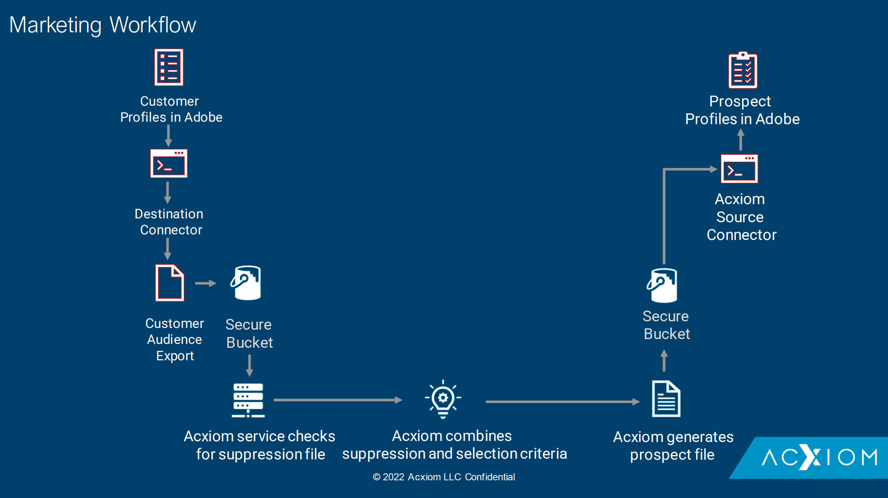

# [!DNL Acxiom Prospecting Data Import]

>[!NOTE]
>
>The [!DNL Acxiom Prospecting Data Import] source is in beta. Please read the [sources overview](../../home.md#terms-and-conditions) for more information on using beta-labeled sources.

Adobe Experience Platform provides support for ingesting data from a data partner application. Support for data and identity partners includes [!DNL Acxiom Prospecting Data Import].

[!DNL Acxiom]'s Prospecting Data Import for Adobe Real-Time Customer Data Platform is a process for delivering the most productive prospect audiences possible. [!DNL Acxiom] takes Real-Time CDP first-party data via a secure export and runs that data through an award-winning hygiene and identity resolution system. A data file that can be utilized as a suppression list is produced. This data file is then matched against the [!DNL Acxiom Global] database, which enables the prospect lists to be customized for import.

You can use the [!DNL Acxiom] source to retrieve and map responses from the [!DNL Acxiom] prospect service using [!DNL Amazon S3] as a drop point.

Read the document below for information on how you can set up your [!DNL Acxiom Prospecting Data Import] source account.

## Prerequisites

In order to access your bucket on Experience Platform, you need to provide valid values for the following credentials:

| Credential | Description |
| --- | --- |
| [!DNL Acxiom] authentication key | The authentication key. You can retrieve this value from the [!DNL Acxiom] team. |
| [!DNL Amazon S3] access key | The access key ID for your bucket. You can retrieve this value from the [!DNL Acxiom] team. |
| [!DNL Amazon S3] secret key | The secret key ID for your bucket. You can retrieve this value from the [!DNL Acxiom] team. |
| Bucket name | This is your bucket where files will be shared. You can retrieve this value from the [!DNL Acxiom] team. |

## IP address allow list

A list of IP addresses must be added to an allow list prior to working with source connectors. Failing to add your region-specific IP addresses to your allow list may lead to errors or non-performance when using sources. See the [IP address allow list](../../ip-address-allow-list.md) page for more information.

### Configure permissions on Experience Platform

You must have both **[!UICONTROL View Sources]** and **[!UICONTROL Manage Sources]** permissions enabled for your account in order to connect your [!DNL Acxiom Prospecting Data Import] account to Experience Platform. Contact your product administrator to obtain the necessary permissions. For more information, read the [access control UI guide](../../../access-control/abac/ui/permissions.md).

## Naming constraints for files and directories

The restrictions listed below must be taken into consideration when naming your cloud storage file or directory:

- Directory and file component names cannot exceed 255 characters.
- Directory and file names cannot end with a forward slash (`/`). If provided, it will be automatically removed.
- The following reserved URL characters must be properly escaped: `! ' ( ) ; @ & = + $ , % # [ ]`
- The following characters are not allowed: `" \ / : | < > * ?`.
- Illegal URL path characters are not allowed. Code points like `\uE000`, while valid in NTFS filenames, are not valid Unicode characters. In addition, some ASCII or Unicode characters, like control characters (0x00 to 0x1F, \u0081, etc.), are also not allowed. For rules governing Unicode strings in HTTP/1.1 see [RFC 2616, Section 2.2: Basic Rules](https://www.ietf.org/rfc/rfc2616.txt) and [RFC 3987](https://www.ietf.org/rfc/rfc3987.txt).
- The following file names are not allowed: LPT1, LPT2, LPT3, LPT4, LPT5, LPT6, LPT7, LPT8, LPT9, COM1, COM2, COM3, COM4, COM5, COM6, COM7, COM8, COM9, PRN, AUX, NUL, CON, CLOCK$, dot character (.), and two dot characters (..).

## Next steps

By reading this document, you have completed the prerequisite setup needed in order to bring data from your [!DNL Acxiom] account to Experience Platform. You can now proceed to the guide on [connecting [!DNL Acxiom Prospecting Data Import] to Experience Platform using the user interface](../../tutorials/ui/create/data-partners/acxiom-prospecting-data-import.md).
