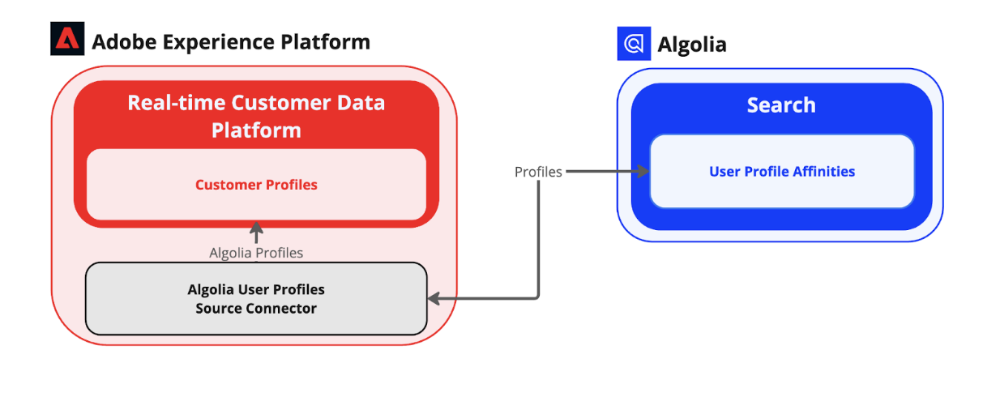

# [!DNL Algolia User Profiles]

[[!DNL Algolia]](https://www.algolia.com/) is a powerful search and discovery API platform that enables businesses to deliver fast, relevant, and customizable search experiences. It provides real-time search capabilities with features like typo tolerance, filtering, faceting, and AI-powered relevance tuning. [!DNL Algolia] helps companies improve user engagement, conversion rates, and overall customer experience by providing high-performance search solutions for websites, e-commerce platforms, and applications.

Some of the ke benefits of [!DNL Algolia] include:

* Lightning-fast search with instant results.
* Highly relevant recommendations powered by AI.
* Customizable ranking to prioritize business needs.
* Scalability to handle high traffic loads effortlessly.

For more information, visit the [[!DNL Algolia] product documentation](https://resources.algolia.com/).

## Architecture

Self-Serve Sources (Batch SDK) provides all of the necessary features such as authentication, pagination, or both full and partial data pull. The [!DNL Algolia User Profiles] source uses these features to complete the integration.

## Prerequisites {#prerequisites}

You must complete the following prerequisite steps before you can connect your [!DNL Algolia] account to Experience Platform.

1. Use the [[!DNL Algolia] dashboard](https://dashboard.algolia.com/users/sign_up) to log in to your [!DNL Algolia] account or create a new account.
2. [Prepare your Index](https://www.algolia.com/doc/guides/sending-and-managing-data/prepare-your-data/in-depth/prepare-data-in-depth/).
3. [Set up your facets](https://www.algolia.com/doc/guides/managing-results/refine-results/faceting/).
4. [Send user events](https://www.algolia.com/doc/guides/sending-events/getting-started/).
5. [Personalize your Index](https://www.algolia.com/doc/guides/personalization/advanced-personalization/configure/setup/indices/).

### Configure permissions on Experience Platform

You must have both **[!UICONTROL View Sources]** and **[!UICONTROL Manage Sources]** permissions enabled for your account in order to connect your [!DNL Algolia] account to Experience Platform. Contact your product administrator to obtain the necessary permissions. For more information, read the [access control UI guide](../../../access-control/abac/ui/permissions.md).

### IP address allowlist

A list of IP addresses must be added to an allowlist prior to working with source connectors. Failing to add your region-specific IP addresses to your allowlist may lead to errors or non-performance when using sources. See the [IP address allowlist](../../ip-address-allow-list.md) page for more information.

## Connect your [!DNL Algolia] account to Experience Platform

Once you have completed the prerequisites, you can proceed to the next step and [connect your [!DNL Algolia] account to Experience Platform](../../tutorials/ui/create/data-partners/algolia-user-profiles.md).

<!-- Built on Adobe Experience Platform, [Real-Time CDP](../../../rtcdp/overview.md) integrates multiple user management platforms to collect disparate user profiles to build holistic profiles for personalization and experience testing. 

Experience Platform provides integrations to pull user profiles from a variety of sources systems. 

It also provides a SDK to build custom integrations. Use the [!DNL Algolia] source to integrate with [!DNL Algolia's] Advanced Personalization APIs and retrieve user profiles for ingestion into Experience Platform. This document will guide you through the set-up of the [!DNL Algolia User Profiles] Source connector.

## Overview -->