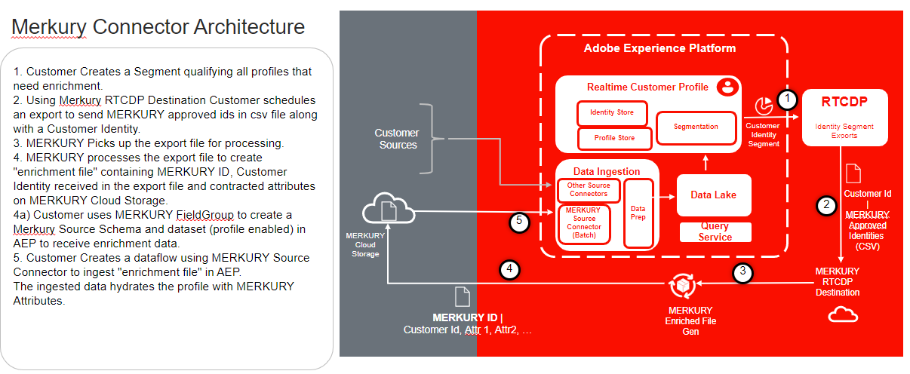

# [!DNL Merkury Enterprise Identity Resolution]

>[!NOTE]
>
>The [!DNL Merkury Enterprise Identity Resolution] source is in beta. Please read the [sources overview](../../home.md#terms-and-conditions) for more information on using beta-labeled sources.

Adobe Experience Platform provides support for ingesting data from a data partner application. Support for data partners include [!DNL Merkury Enterprise Identity Resolution].

You can use [!DNL Merkury] by [!DNL Merkle] to recognize more digital visitors - even without the use of cookies - and deliver the relevant and personalized experiences that your customer's need. 

You can utilize the **person ID** as part of the [!DNL Merkury] source to combine everything that your organization knows about an individual into a single comprehensive profile. These details can include: 

- digital behaviors
- buying preferences
- identifying information such as a name, email address, physical address, or device ID.

You can format ingested data as Experience Data Model (XDM) JSON, XDM Parquet, or delimited. Every step of the process is integrated into the sources work

## IP address allow list

A list of IP addresses must be added to an allow list prior to working with source connectors. Failing to add your region-specific IP addresses to your allow list may lead to errors or non-performance when using sources. See the [IP address allow list](../../ip-address-allow-list.md) page for more information.

## Naming constraints for files and directories

The following is a list of constraints you must account for when naming your cloud storage file or directory.

- Directory and file component names cannot exceed 255 characters.
- Directory and file names cannot end with a forward slash (`/`). If provided, it will be automatically removed.
- The following reserved URL characters must be properly escaped: `! ' ( ) ; @ & = + $ , % # [ ]`
- The following characters are not allowed: `" \ / : | < > * ?`.
- Illegal URL path characters not allowed. Code points like `\uE000`, while valid in NTFS filenames, are not valid Unicode characters. In addition, some ASCII or Unicode characters, like control characters (0x00 to 0x1F, \u0081, etc.), are also not allowed. For rules governing Unicode strings in HTTP/1.1 see [RFC 2616, Section 2.2: Basic Rules](https://www.ietf.org/rfc/rfc2616.txt) and [RFC 3987](https://www.ietf.org/rfc/rfc3987.txt).
- The following file names are not allowed: LPT1, LPT2, LPT3, LPT4, LPT5, LPT6, LPT7, LPT8, LPT9, COM1, COM2, COM3, COM4, COM5, COM6, COM7, COM8, COM9, PRN, AUX, NUL, CON, CLOCK$, dot character (.), and two dot characters (..).

## Prerequisites

You must meet the following prerequisites before you can start using the [!DNL Merkury] source:

- You must complete your [!DNL Merkury] setup with your [!DNL Merkury] team.
- You must retrieve your credentials (access key, secret key, and bucket name) from your [!DNL Merkury] team. 

>[!NOTE]
>
>A file path like `myBucket/folder/subfolder/subsubfolder/abc.csv` may lead you to only access `subsubfolder/abc.csv`. If you want to access the subfolder, you can specify the bucket parameter as myBucket and the folderPath as folder/subfolder to ensure that file exploration starts at subfolder as opposed to `subsubfolder/abc.csv`.

## Next steps

By reading this document, you have completed prerequisite setup needed in order to bring data from your [!DNL Merkury] account to Experience Platform. You can now proceed to the guide on [connecting [!DNL Merkury] to Experience Platform using the user interface](../../tutorials/ui/create/data-partners/merkury.md).
