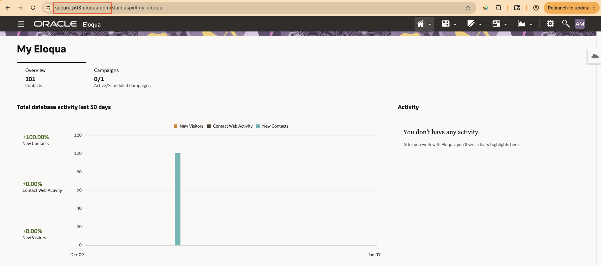
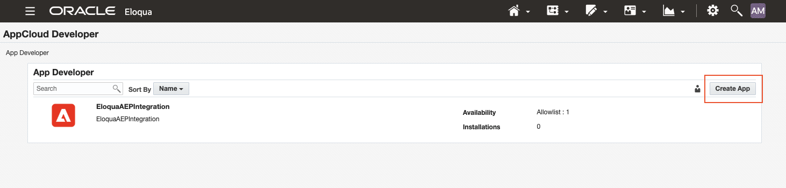
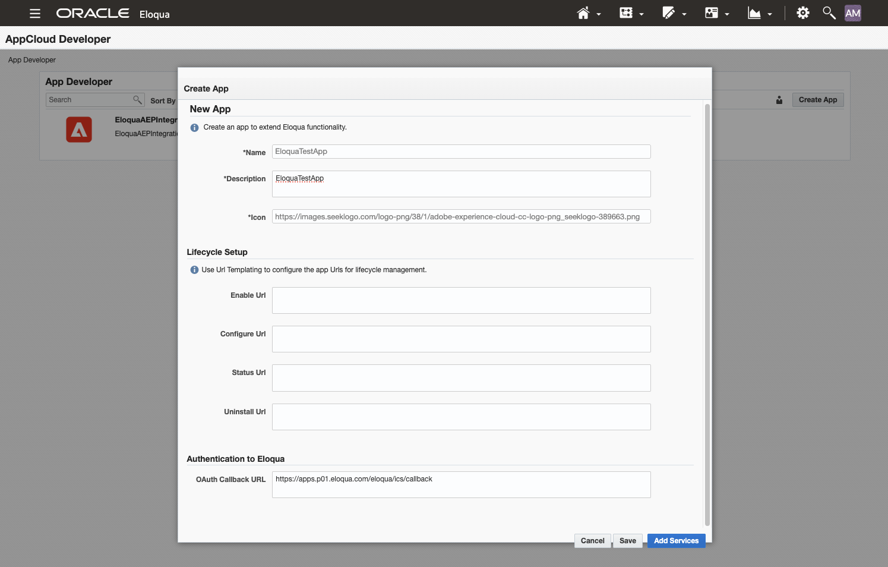
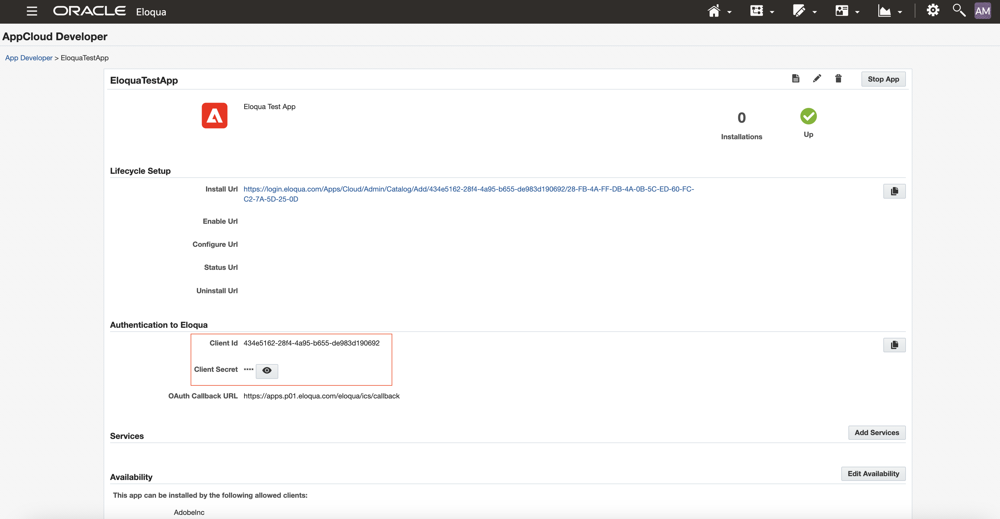
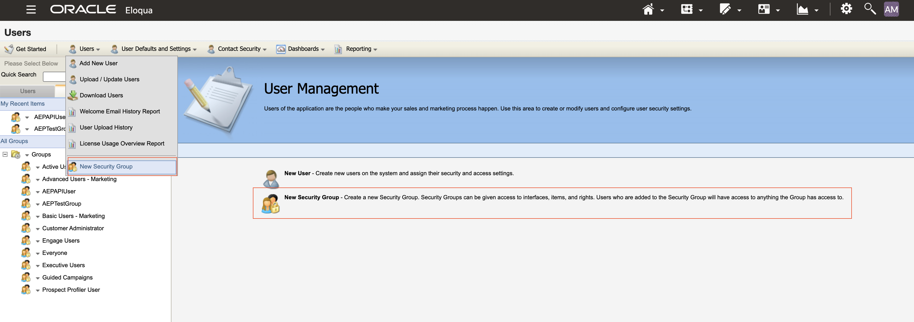
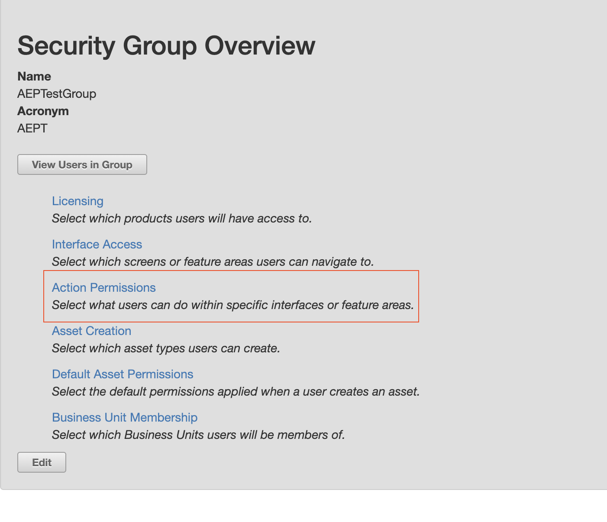
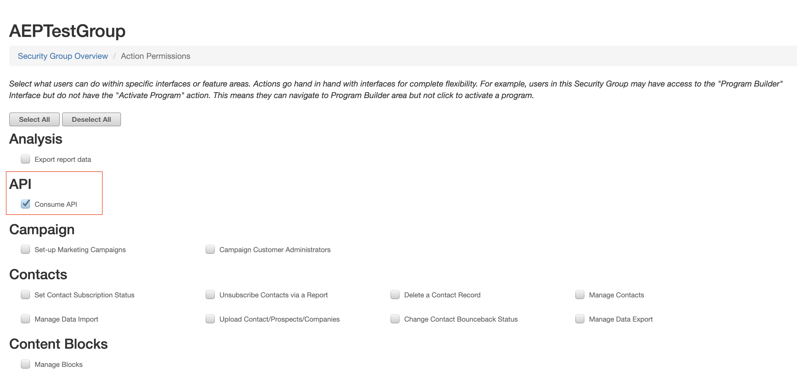
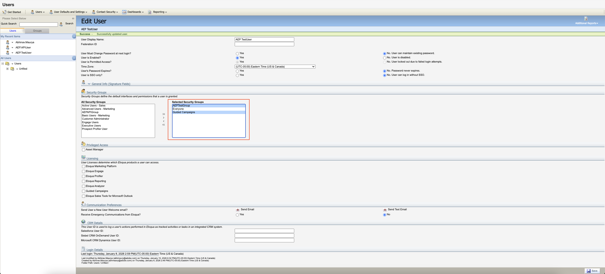

# [!DNL Oracle Eloqua] (V2) source overview

>[!IMPORTANT]
>
>The original [[!DNL Oracle Eloqua] (V1)](oracle-eloqua.md) source has been deprecated as of January 2026. There are no migrations available for this deprecated source and you must re-implement your data using the new [!DNL Oracle Eloqua] (V2) source.

[!DNL Oracle Eloqua] is a powerful, enterprise-grade marketing automation platform designed to help organizations, primarily in the B2B space, automate and personalize the complex process of managing leads and orchestrating buyer journeys. It serves as a central hub where marketing teams can define, deploy, and measure sophisticated campaigns across multiple digital channels, ensuring prospects receive the right content at the precise moment they are most engaged. The supported objects for ingestion through [!DNL Eloqua] are **Contacts**, **Accounts**, **Campaigns**, and **Activities**. Once the initial ingestion is completed, any changed data is imported using a scheduled incremental process.

You can use the [!DNL Eloqua] source to connect your [!DNL Eloqua] account to Adobe Experience Platform. Read the documentation below to learn how to get started.

## Use case examples {#use-case-examples}

Below is a table outlining the marketing objects supported by the [!DNL Eloqua] (V2) integration with Adobe Experience Platform. For each object, you'll find a description along with sample use cases to illustrate how integrating [!DNL Eloqua] data with Real-Time CDP can boost marketing effectiveness and campaign outcomes.

| Object | Description | Use case examples |
| --- | --- | --- |
| Contacts | Ingest contact data (such as name, email, phone number, job title) into Real-Time CDP to create detailed, unified customer profiles that consolidate all the interactions and engagements with each individual contact. | **Campaign Optimization:** By integrating contact data from [!DNL Eloqua], your marketing team can identify high-priority prospects based on recent activities like email opens, form submissions, and event registrations. Real-Time CDP provides a 360° view of each contact's behavior across email, website, and other marketing touchpoints, allowing marketing teams to tailor campaigns and optimize messaging for better engagement and conversion. |
| Accounts | Ingest account-level data (such as company name, industry, company size, revenue, location) to build account-based marketing (ABM) strategies in Real-Time CDP, and enable your team to target and engage the right organizations with relevant messaging. | **ABM Campaigns:** Integrating account data from [!DNL Eloqua] helps build targeted ABM campaigns. For example, a software company could use the account data to segment and send customized email campaigns to decision-makers at companies in the finance sector, promoting new solutions tailored to their industry. |
| Campaigns | Ingest campaign data (such as campaign names, types, goals, performance metrics like open rates, CTRs) into the Real-Time CDP to track and optimize campaign performance across multiple channels. Use this data to measure ROI and refine your strategies. | **Cross‑Channel Attribution:** If [!DNL Eloqua] sends campaign data to Real-Time CDP, marketing teams can view the performance of campaigns across various channels (email, social media, ads, etc.), attributing conversions to the right touch points and refining future strategies based on that insight. |
| Activities | Ingest activity data (such as email opens, clicks, website visits, form submissions, webinar attendance) to track the real-time behavior and contacts across different channels, creating opportunities for real‑time personalized engagement. | **Real-Time Nurturing:** By integrating activity data from [!DNL Eloqua], Real-Time CDP can trigger personalized emails or notifications to sales teams when a contact engages with content (such as downloading a whitepaper or clicking on an email link), allowing for timely follow-up and better conversion opportunities. |

{style="table-layout:auto"}

## Prerequisites {#prerequisites}

Read the sections below for prerequisite set up that you must complete before you can connect your source to Experience Platform.

### Set up application for authentication

Follow the steps below to learn how to set up your [!DNL Eloqua] account and connect to Experience Platform using basic authentication.

To get started, log in to your [!DNL Eloqua] instance as an admin (or as a user who has access to create users, security groups, and apps).

Navigate to **Settings** > **Platform Extensions** > **App Cloud Developer** > **Create App**. Provide details for your app, including its name, description, icon, and the OAuth Callback URL. Select **Save** when finished. 

| Property | Description |
| --- | --- |
| Name | The name of your app. |
| Description | A brief description for your app. |
| Icon | The URL for the icon. |
| OAuth Callback URL | The URL that users should be redirected to after installing the app and authenticating with [!DNL Eloqua]. |

With your app created, navigate to [!DNL Authentication to Eloqua] and retrieve the  **Client ID** and **Client secret** from the newly created app. These values will be used later when connecting to Experience Platform.

Security groups allow administrators to control what levels of access users have to assets, features, interfaces, and so on. To create a security group, navigate to **Settings** > **Users**. Then, select the **Group** tab on the left panel and then select **Create new Security Group**.

Use the **[!DNL Security Group Overview]** window to provide a name and an acronym for your security group. Once created, navigate to [!DNL Action Permissions] and add the [!DNL Consume] API permission from the list and select **Save**.

>[!NOTE]
>
>[!DNL Consume] API is a required permission, but you can add more permissions depending on your usage of the app.

To ingest campaign data, navigate to the **Edit User** interface and add [!DNL Guided Campaigns] to your selected security group.

You can optionally create additional an additional user and add that user to a security group. For detailed steps, read the [!DNL Eloqua] documentation on [creating a user](https://docs.oracle.com/en/cloud/saas/marketing/eloqua-user/Help/UserManagement/Tasks/CreatingIndividualUsers.htm) and [assigning a user to a security group](https://docs.oracle.com/en/cloud/saas/marketing/eloqua-user/Help/SecurityGroups/Tasks/AddingUsersToSecurityGroups.htm).

### Gather required credentials

You must provide values for the following credentials to connect [!DNL Eloqua] to Experience Platform.

| Credential | Description |
| --- | --- |
| Client ID | The publicly exposed identifier used by [!DNL Eloqua] to identify your account when authorizing to Experience Platform. |
| Client secret | The confidential key known only to the client application and authorization server. This key is required alongside the client ID in order to authenticate your account. |
| Username | The username associated with your [!DNL Eloqua] account. This is used to verify and authorize your access. The username follows the format of `CompanyName\Username`. |
| Password | The password associated with your [!DNL Eloqua] account. Along with your username, it grants access to your Eloqua environment. |
| Base endpoint | The prefix of your authentication base URI for [!DNL Eloqua]. The base endpoint should not include `http://` or `https://` when authenticating. |

## [!DNL Eloqua] mapping guide

>[!NOTE]
>
>The following are the delta fields used internally for incremental data loading:
>
>- **Contacts:** `C_DateModified`
>- **Accounts:** `M_DateModified`
>- **Activity:** `CreatedAt`
>- **Custom Objects:** `UpdatedAt`
>- **Campaign:** `updatedAt`

The following tables provide detailed mappings between [!DNL Eloqua] source fields and their corresponding Experience Data Model (XDM) destination fields in Experience Platform. Each row outlines the transformation logic, whether the field is immutable, and provides additional notes to help you understand how your [!DNL Eloqua] data will be ingested and structured in Experience Platform.

### Accounts

| Eloqua Source Column | XDM Destination Path | Notes |
| --- | --- | --- |
| `"Eloqua"` | accountKey.sourceType | This field is always set to the fixed value "Eloqua." |
| `"${SOURCE_INSTANCE_ID}"` | accountKey.sourceInstanceID | The `SOURCE_INSTANCE_ID` will be automatically replaced by the connector. |
| `Id` | accountKey.sourceID | |
| `concat(Id, "\\@${SOURCE_INSTANCE_ID}.Eloqua")` | accountKey.sourceKey | The `SOURCE_INSTANCE_ID` will be automatically replaced by the connector. |
| `M_CompanyName` | accountName | |
| `M_Country` | accountPhysicalAddress.country | |
| `M_Address1` | accountPhysicalAddress.street1 | |
| `M_City` | accountPhysicalAddress.city | |
| `M_State_Prov` | accountPhysicalAddress.stateProvince | |
| `M_Zip_Postal` | accountPhysicalAddress.postalCode | |
| `M_BusPhone` | accountPhone.number | |
| `M_Fax1` | accountFax.number | |
| `M_Account_Engagement_Score` | accountScore | |
| `M_Account_Type1` | accountType | |
| `M_Wesbsite1` | accountOrganization.website | |
| `M_Employees1` | accountOrganization.numberOfEmployees | |
| `to_decimal(M_Annual_Revenue1)` | accountOrganization.annualRevenue.amount | |
| `M_DateModified` | extSourceSystemAudit.lastUpdatedDate | |
| `M_DateCreated` | extSourceSystemAudit.createdDate | |
| `M_Industry1` | accountOrganization.industry | |
| `iif(M_SFDCAccountID != null && M_SFDCAccountID != "", to_object("sourceType", "Salesforce", "sourceInstanceID", "${CRM_INSTANCE_ID}", "sourceID", M_SFDCAccountID, "sourceKey", concat(M_SFDCAccountID, "\\@${CRM_INSTANCE_ID}.Salesforce")), iif(M_MSCRMAccountID != null && M_MSCRMAccountID != "", to_object("sourceType", "Dynamics", "sourceInstanceID", "${CRM_INSTANCE_ID}", "sourceID", M_MSCRMAccountID, "sourceKey", concat(M_MSCRMAccountID, "\\@${CRM_INSTANCE_ID}.Dynamics")), null))` | extSourceSystemAudit.externalKey | The connector cannot detect your CRM instance ID automatically. You must manually replace `${CRM_INSTANCE_ID}` with your actual CRM instance ID, either your Salesforce or Dynamics instance ID. During ingestion, if `M_SFDCAccountID` is present, the connector will generate the external key using that value and append `\@CRM_INSTANCE_ID.Salesforce`. If that field is empty, the connector will use `M_MSCRMAccountID` and append `\@CRM_INSTANCE_ID.Dynamics` instead. If both fields are empty, this field will be set to null. |

{style="table-layout:auto"}

### Activities

| Eloqua Source Column | XDM Destination Path | Notes |
| --- | --- | --- |
| `"Eloqua"` | personKey.sourceType | This field is always set to the fixed value "Eloqua." |
| `"${SOURCE_INSTANCE_ID}"` | personKey.sourceInstanceID | The `SOURCE_INSTANCE_ID` will be automatically replaced by the connector. |
| `ContactId` | personKey.sourceID |  |
| `concat(ContactId, "\\@${SOURCE_INSTANCE_ID}.Eloqua")` | personKey.sourceKey | The `SOURCE_INSTANCE_ID` will be automatically replaced by the connector. |
| `ExternalId` | _id |  |
| `iif(ActivityType!=null && ActivityType!="", iif(ActivityType=="EmailSend", "directMarketing.emailSent", iif(ActivityType=="EmailOpen", "directMarketing.emailOpened", iif(ActivityType=="EmailClickthrough", "directMarketing.emailClicked", iif(ActivityType=="Unsubscribe", "directMarketing.emailUnsubscribed", iif(ActivityType=="Bounceback", "directMarketing.emailBounced", iif(ActivityType=="FormSubmit", "web.formFilledOut", iif(ActivityType=="PageView", "web.webpagedetails.pageViews", ActivityType))))))), null)` | eventType | Based on the ActivityType, the corresponding Experience Platform eventType value will be populated. For ExternalActivities, there is no eventType in Experience Platform. You can modify this mapping to handle more types. |
| `ActivityDate` | timestamp | |
| `iif(AssetType == "Email", AssetName, null)` | directMarketing.mailingName | |
| `iif(AssetType == "Email", to_object("sourceType", "Eloqua", "sourceInstanceID", "${SOURCE_INSTANCE_ID}","sourceID",${AssetId}, "sourceKey", concat(${AssetId},"\\@${SOURCE_INSTANCE_ID}.Eloqua")), null)` | directMarketing.mailingKey | The `SOURCE_INSTANCE_ID` will be automatically replaced by the connector. |
| `iif(AssetType == "Email", EmailAddress, null)` | directMarketing.email | |
| `iif(ActivityType == "Bounceback", SmtpStatusCode, null)` | directMarketing.emailBouncedCode | |
| `iif(AssetType == "Email", SmtpMessage, null)` | directMarketing.emailBouncedDetails | |
| `iif(AssetType == "Email", EmailWebLink, null)` | directMarketing.linkURL | |
| `iif(ActivityType == "FormSubmit", AssetName, null)` | web.fillOutForm.webFormName | |
| `iif(ActivityType == "FormSubmit", to_object("sourceType", "Eloqua", "sourceInstanceID", "${SOURCE_INSTANCE_ID}","sourceID",${AssetId}, "sourceKey", concat(${AssetId},"\\@${SOURCE_INSTANCE_ID}.Eloqua")), null)` | web.fillOutForm.webFormKey | The `SOURCE_INSTANCE_ID` will be automatically replaced by the connector. |
| `iif(ActivityType == "PageView", AssetName, null)` | web.webPageDetails.name | |
| `iif(ActivityType == "PageView", to_object("sourceType", "Eloqua", "sourceInstanceID", "${SOURCE_INSTANCE_ID}","sourceID",${AssetId}, "sourceKey", concat(${AssetId},"\\@${SOURCE_INSTANCE_ID}.Eloqua")), null)` | web.webPageDetails.webPageKey | The `SOURCE_INSTANCE_ID` will be automatically replaced by the connector. |
| `iif(ActivityType == "PageView", Url, null)` | web.webPageDetails.URL | |

{style="table-layout:auto"}

### Campaigns

| Eloqua Source Column | XDM Destination Path | Notes |
| --- | --- | --- |
| `"Eloqua"` | campaignKey.sourceType | This field is always set to the fixed value "Eloqua." |
| `"${SOURCE_INSTANCE_ID}"` | campaignKey.sourceInstanceID | The `SOURCE_INSTANCE_ID` will be automatically replaced by the connector. |
| `id` | campaignKey.sourceID | |
| `concat(id, "\\@${SOURCE_INSTANCE_ID}.Eloqua")` | campaignKey.sourceKey | The `SOURCE_INSTANCE_ID` will be automatically replaced by the connector. |
| `name` | campaignName | |
| `endAt` | campaignEndDate | |
| `startAt` | campaignStartDate | |
| `actualCost` | actualCost.amount | |
| `budgetedCost` | budgetedCost.amount | |
| `description` | campaignDescription | |
| `currentStatus` | campaignStatus | |
| `campaignType` | campaignType | |
| `createdAt` | extSourceSystemAudit.createdDate | |
| `updatedAt` | extSourceSystemAudit.lastUpdatedDate | |

{style="table-layout:auto"}

### Contacts

| Eloqua Source Column | XDM Destination Path | Notes |
| --- | --- | --- |
| `"Eloqua"` | b2b.personKey.sourceType | This field is always set to the fixed value "Eloqua." |
| `"${SOURCE_INSTANCE_ID}"` | b2b.personKey.sourceInstanceID | The `SOURCE_INSTANCE_ID` will be automatically replaced by the connector. |
| `Id` | b2b.personKey.sourceID |  |
| `concat(Id, "\\@${SOURCE_INSTANCE_ID}.Eloqua"` | b2b.personKey.sourceKey | The `SOURCE_INSTANCE_ID` will be automatically replaced by the connector. |
| `C_Company` | b2b.companyName |  |
| `C_Website1` | b2b.companyWebsite |  |
| `C_Job_Title1` | extendedWorkDetails.jobTitle |  |
| `C_Fax` | faxPhone.number |  |
| `C_MobilePhone` | mobilePhone.number |  |
| `iif(C_SFDCLeadID != null && C_SFDCLeadID != "\\", to_object("sourceType", "Salesforce", "sourceInstanceID", "${CRM_INSTANCE_ID}", "sourceID", C_SFDCLeadID, "sourceKey", concat(C_SFDCLeadID, "\\@${CRM_INSTANCE_ID}.Salesforce")), iif(C_SFDCContactID != null && C_SFDCContactID != "\\", to_object("sourceType", "Salesforce", "sourceInstanceID", "${CRM_INSTANCE_ID}", "sourceID", C_SFDCContactID, "sourceKey", concat(C_SFDCContactID, "\\@${CRM_INSTANCE_ID}.Salesforce")), null))` | personComponents.sourceExternalKey | If the [!DNL Eloqua] instance is synced with Salesforce, then keep this mapping. Otherwise, remove it. The connector does not have a way to determine the CRM_INSTANCE_ID, so you must replace ${CRM_INSTANCE_ID} with your synced Salesforce instance ID. This same mapping applies to personComponents and extSourceSystemAudit, so keep both. |
| `iif(C_MSCRMLeadID != null && C_MSCRMLeadID != "\\", to_object("sourceType", "Dynamics", "sourceInstanceID", "${CRM_INSTANCE_ID}", "sourceID", C_MSCRMLeadID, "sourceKey", concat(C_MSCRMLeadID, "\\@${CRM_INSTANCE_ID}.Dynamics")), iif(C_MSCRMContactID != null && C_MSCRMContactID != "\\", to_object("sourceType", "Dynamics", "sourceInstanceID", "${CRM_INSTANCE_ID}", "sourceID", C_MSCRMContactID, "sourceKey", concat(C_MSCRMContactID, "\\@${CRM_INSTANCE_ID}.Dynamics")), null))"` | personComponents.sourceExternalKey | If the [!DNL Eloqua] instance is synced with Dynamics, then keep this mapping. Otherwise, remove it. The connector does not have a way to determine the CRM_INSTANCE_ID, so you must replace ${CRM_INSTANCE_ID} with your synced Dynamics instance ID. This same mapping applies to personComponents and extSourceSystemAudit, so keep both. |
| `iif(C_SFDCLeadID != null && C_SFDCLeadID != "\\", to_object("sourceType", "Salesforce", "sourceInstanceID", "${CRM_INSTANCE_ID}", "sourceID", C_SFDCLeadID, "sourceKey", concat(C_SFDCLeadID, "\\@${CRM_INSTANCE_ID}.Salesforce")), iif(C_SFDCContactID != null && C_SFDCContactID != "\\", to_object("sourceType", "Salesforce", "sourceInstanceID", "${CRM_INSTANCE_ID}", "sourceID", C_SFDCContactID, "sourceKey", concat(C_SFDCContactID, "\\@${CRM_INSTANCE_ID}.Salesforce")), null))"` | extSourceSystemAudit.externalKey | If the [!DNL Eloqua] instance is synced with Salesforce, then keep this mapping. Otherwise, remove it. The connector does not have a way to determine the CRM_INSTANCE_ID, so you must replace ${CRM_INSTANCE_ID} with your synced Salesforce instance ID. This same mapping applies to personComponents and extSourceSystemAudit, so keep both. |
| `iif(C_MSCRMLeadID != null && C_MSCRMLeadID != "\\", to_object("sourceType", "Dynamics", "sourceInstanceID", "${CRM_INSTANCE_ID}", "sourceID", C_MSCRMLeadID, "sourceKey", concat(C_MSCRMLeadID, "\\@${CRM_INSTANCE_ID}.Dynamics")), iif(C_MSCRMContactID != null && C_MSCRMContactID != "\\", to_object("sourceType", "Dynamics", "sourceInstanceID", "${CRM_INSTANCE_ID}", "sourceID", C_MSCRMContactID, "sourceKey", concat(C_MSCRMContactID, "\\@${CRM_INSTANCE_ID}.Dynamics")), null))` | extSourceSystemAudit.externalKey | If the [!DNL Eloqua] instance is synced with Dynamics, then keep this mapping. Otherwise, remove it. The connector does not have a way to determine the CRM_INSTANCE_ID, so you must replace ${CRM_INSTANCE_ID} with your synced Dynamics instance ID. This same mapping applies to personComponents and extSourceSystemAudit, so keep both. |
| `C_DateCreated` | extSourceSystemAudit.createdDate |  |
| `C_DateModified` | extSourceSystemAudit.lastUpdatedDate |  |
| `iif(C_SFDCAccountID != null && C_SFDCAccountID != "\\", to_object("sourceType", "Salesforce", "sourceInstanceID", "${CRM_INSTANCE_ID}", "sourceID", C_SFDCAccountID, "sourceKey", concat(C_SFDCAccountID, "\\@${CRM_INSTANCE_ID}.Salesforce")), iif(C_MSCRMAccountID != null && C_MSCRMAccountID != "\\", to_object("sourceType", "Dynamics", "sourceInstanceID", "${CRM_INSTANCE_ID}", "sourceID", C_MSCRMAccountID, "sourceKey", concat(C_MSCRMAccountID, "\\@${CRM_INSTANCE_ID}.Dynamics")), null))` | b2b.accountKey | The connector does not have a way to determine the CRM_INSTANCE_ID, so you must replace ${CRM_INSTANCE_ID} with your synced CRM instance ID, either the Salesforce instance ID or the Dynamics instance ID. This same mapping applies to both b2b.accountKey and personComponents.sourceAccountKey, so keep both. |
| `iif(C_SFDCAccountID != null && C_SFDCAccountID != "\\", to_object("sourceType", "Salesforce", "sourceInstanceID", "${CRM_INSTANCE_ID}", "sourceID", C_SFDCAccountID, "sourceKey", concat(C_SFDCAccountID, "\\@${CRM_INSTANCE_ID}.Salesforce")), iif(C_MSCRMAccountID != null && C_MSCRMAccountID != "\\", to_object("sourceType", "Dynamics", "sourceInstanceID", "${CRM_INSTANCE_ID}", "sourceID", C_MSCRMAccountID, "sourceKey", concat(C_MSCRMAccountID, "\\@${CRM_INSTANCE_ID}.Dynamics")), null))` | personComponents.sourceAccountKey | The connector does not have a way to determine the CRM_INSTANCE_ID, so you must replace ${CRM_INSTANCE_ID} with your synced CRM instance ID, either the Salesforce instance ID or the Dynamics instance ID. This same mapping applies to both b2b.accountKey and personComponents.sourceAccountKey, so keep both. |
| `C_Lead_Source___Original1` | b2b.personSource | |
| `C_Lead_Source___Original1` | personComponents.personSource | |
| `C_Lead_Status1` | b2b.personStatus | |
| `C_Lead_Status1` | personComponents.personStatus | |
| `C_FirstName` | person.name.firstName | |
| `C_LastName` | person.name.lastName | |
| `C_Middle_Name1` | person.name.middleName | |
| `C_Salutation` | person.name.courtesyTitle | |
| `C_City` | workAddress.city | |
| `C_Country` | workAddress.country | |
| `C_Zip_Postal` | workAddress.postalCode | |
| `C_State_Prov` | workAddress.state | |

{style="table-layout:auto"}

### Activity type mapping reference

| Eloqua ActivityType | XDM eventType |
| -------------------- | --------------- |
| `EmailSend` | directMarketing.emailSent |
| `EmailOpen` | directMarketing.emailOpened |
| `EmailClickthrough` | directMarketing.emailClicked |
| `Unsubscribe` | directMarketing.emailUnsubscribed |
| `Bounceback` | directMarketing.emailBounced |
| `FormSubmit` | web.formFilledOut |
| `PageView` | web.webpagedetails.pageViews |
| `Other` | pass through as-is |

{style="table-layout:auto"}

### Variable placeholders

The mapping templates use the following variable placeholders that are replaced once a dataflow runs:

| Placeholder | Description | Usage |
| ----------- | ----------- | ----- |
| `${SOURCE_INSTANCE_ID}`| Unique ID for Eloqua source instance    | Used in source keys  |
| `${CRM_INSTANCE_ID}`   | Unique ID for CRM system (Salesforce/Dynamics) | Used in external keys|

## Connect [!DNL Eloqua] to Experience Platform

Proceed to configure your [!DNL Eloqua] source connection within Experience Platform. For a step-by-step guide on setting up the connection through the UI, refer to the [tutorial here](../../tutorials/ui/create/marketing-automation/eloqua.md). Read this tutorial to learn about connecting your [!DNL Eloqua] account, selecting data, mapping fields, scheduling ingestions, and monitoring your dataflows.

