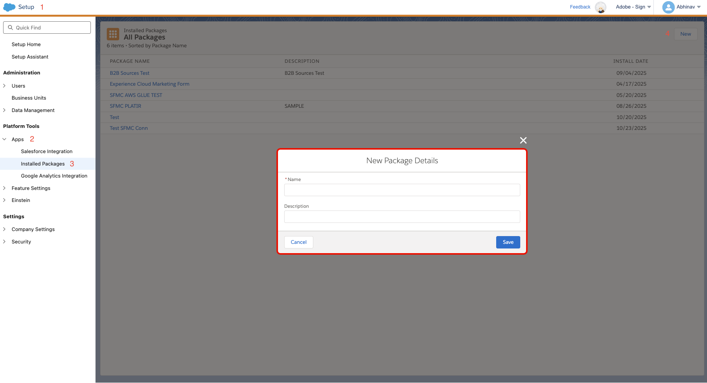
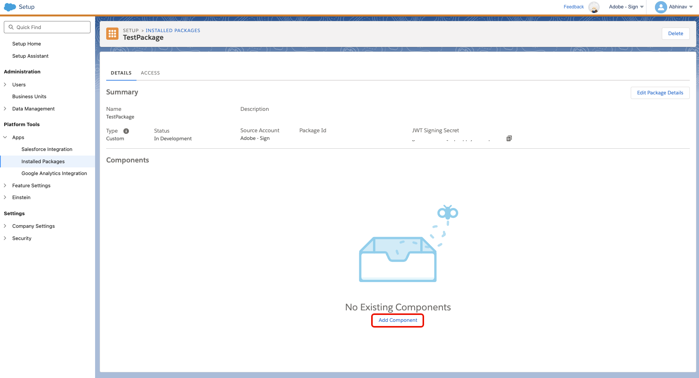
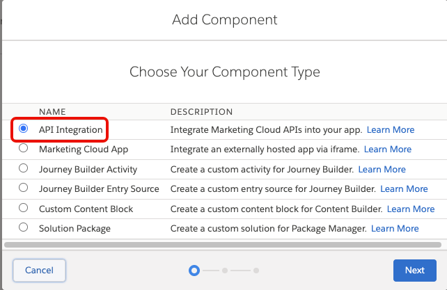
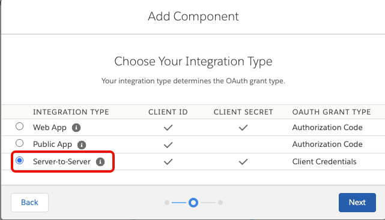
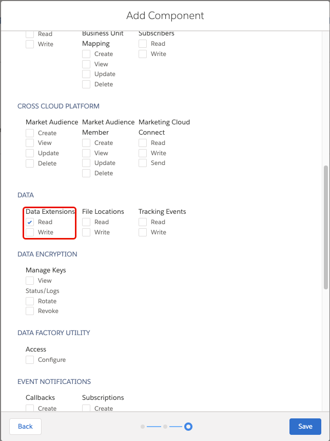
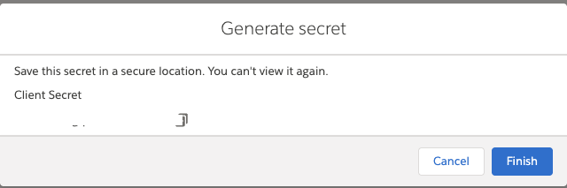
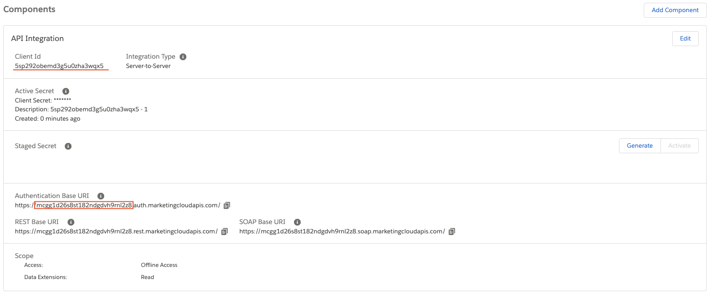

# [!DNL Salesforce Marketing Cloud] (V2) source overview

>[!IMPORTANT]
>
>The original [[!DNL Salesforce Marketing Cloud] (V1)](salesforce-marketing-cloud.md) source has been deprecated as of January 2026. There are no migrations available for this deprecated source and you must re-implement your data using the new [!DNL Salesforce Marketing Cloud] (V2) source.

The integration between Adobe [Real-Time CDP](../../../rtcdp/overview.md) and [!DNL Salesforce Marketing Cloud] is designed to leverage Data Extensions because of the flexibility and control they provide. Unlike Standard System Tables (Data Views and Built-in Objects), which are limited to predefined fields and primarily serve system-level tracking, you can use Data Extensions to define custom fields, organize a wide variety of business-specific data, and tailor your data structures to meet unique requirements.

Because of this level of customization and scalability, the integration between Real-Time CDP and [!DNL Salesforce Marketing Cloud] relies on Data Extensions rather than Standard System Tables. This approach offers a more flexible, scalable, and integrated foundation for managing data, ensuring that it aligns with your business goals

You can use the [!DNL Salesforce Marketing Cloud] source to connect your [!DNL Salesforce Marketing Cloud] account to Real-Time CDP and Adobe Experience Platform. Read the documentation below to learn how to get started.

## Use case examples {#use-case-examples}

### Personalizing Email Campaigns with Contact Data

A retail brand wants to personalize email campaigns based on customer lifecycle stages (e.g., new customer, repeat buyer, loyal customer). To do this, they create a Contact Data Extension to store key customer information, including name, email, lifecycle stage, and purchase behavior. This data is then ingested into Experience Platform for deeper segmentation and targeting.

By ingesting the data from the Contact Data Extension into Experience Platform, the brand can segment customers based on their lifecycle stage and purchase behavior. For example, they can send a welcome offer to new customers, a loyalty reward to repeat buyers, or even re-engage inactive customers with targeted offers. This approach ensures personalized communication and enables more relevant and effective customer engagement.

### Ingesting Campaign Data for Personalized Segmentation

A marketing team wants to optimize their email campaigns by targeting customers based on their engagement with previous campaigns. To do this, they create a Campaign Data Extension in [!DNL Salesforce Marketing Cloud] to store customer engagement data, such as email opens, clicks, and campaign responses. This data is then ingested into Experience Platform for further segmentation and personalization.

By ingesting this data from the Campaign Data Extension into Experience Platform, the marketing team can segment customers based on past engagement, such as those who clicked on product offers or responded positively. Customers who engaged can receive targeted promotions in future emails, while those who responded negatively can be sent customer service follow-ups. This integration with Experience Platform ensures that the marketing team can deliver more personalized and relevant content based on customer behavior.

### Targeting Customers Based on Activities Data

A marketing team wants to target customers based on their activities, such as website visits, form submissions, or interactions with previous email campaigns. To achieve this, they create an Activities Data Extension to store information about each customer's engagement activities. This data is then ingested into Experience Platform for further segmentation and personalized campaign targeting.

By ingesting the data from the Activities Data Extension into Experience Platform, the marketing team can segment customers based on their engagement history. For example, customers who recently visited the website but didn't complete a purchase can be sent reminder emails with special offers. Similarly, customers who filled out a form can receive personalized follow-up communications. This approach ensures that each customer receives relevant content based on their most recent activities, improving engagement and conversion rates.

## Prerequisites {#prerequisites}

Read the sections below for prerequisite set up that you must complete before you can connect your source to Experience Platform.

### Set up application for authentication {#set-up-application-for-authentication}

When building an integration with [!DNL Salesforce Marketing Cloud], one of the first steps is to create an **Installed Package** within [!DNL Salesforce Marketing Cloud]. The installed package generates the client credentials required to authenticate API calls, defines the integration type and associated permission scopes. Additionally, the installed package provides the correct API endpoints for your tenant. It also serves as a managed container for administering, monitoring, and revoking access, ensuring that all integrations are secure, auditable, and aligned with Salesforce's recommended authentication model.

To create an installed package, use the [!DNL Salesforce Marketing Cloud] UI and navigate to **[!DNL Setup]** > **[!DNL Apps]** > **[!DNL Installed Packages]** and then select **[!DNL New]**. Use the [!DNL New Package Details] interface to provide a name and information for your package. When finished, select **[!DNL Save]**.

Once the new package is created, select **[!DNL Add Component]**.

Select **[!DNL API Integration]** as your component type.

Select **[!DNL Server-to-Server]** as your integration type.

Finally, navigate to **[!DNL Scope]** > **[!DNL Data]**. Under **[!DNL Data Extensions]**, select **[!DNL Read]**.

Select **[!DNL Save]** and then copy and save your **client secret**. When complete, select **[!DNL Finish]**.

Before leaving the [!DNL Salesforce Marketing Cloud] UI, copy the **client ID** and **unique base URI prefix** as you will use both values to create a connection to Experience Platform. For the Authentication Base URI, please ensure you remove everything after `.auth.marketingcloudapis.com/`

For detailed steps on creating an installed package, read the [[!DNL Salesforce] documentation](https://trailhead.salesforce.com/content/learn/modules/marketing-cloud-developer-basics/set-up-your-developer-environment).

### Gather required credentials {#gather-required-credentials}

You must provide values for the following credentials to connect [!DNL Salesforce Marketing Cloud] to Experience Platform.

| Credential | Description |
| --- | --- |
| Client ID | The publicly exposed identifier used by [!DNL Salesforce Marketing Cloud] to identify your account when authorizing to Experience Platform. The client ID can be retrieved from the components panel of the [!DNL Salesforce Marketing Cloud] UI. |
| Client secret | The confidential key known only to the client application and authorization server. You can generate your client secret by following the [application set up steps outlined above](#set-up-application-for-authentication). |
| Base endpoint | The prefix of your authentication base URI for [!DNL Salesforce Marketing Cloud]. |

{style="table-layout:auto"}

## Connect [!DNL Salesforce Marketing Cloud] to Experience Platform

Proceed to configure your [!DNL Salesforce Marketing Cloud] source connection within Experience Platform. For a step-by-step guide on setting up the connection through the UI, refer to the [tutorial here](../../tutorials/ui/create/marketing-automation/sfmc.md). Read this tutorial to learn about connecting your [!DNL Salesforce Marketing Cloud] account, selecting data, mapping fields, scheduling ingestions, and monitoring your dataflows.
