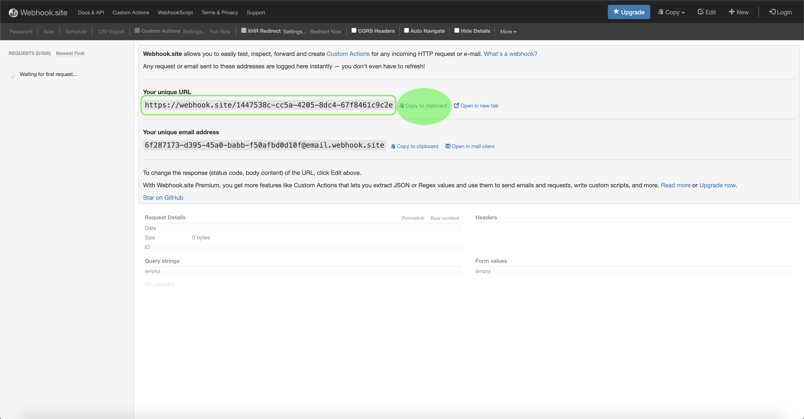
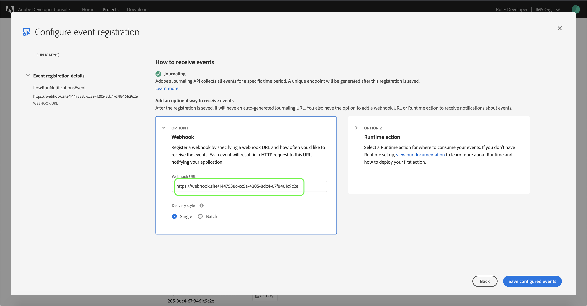
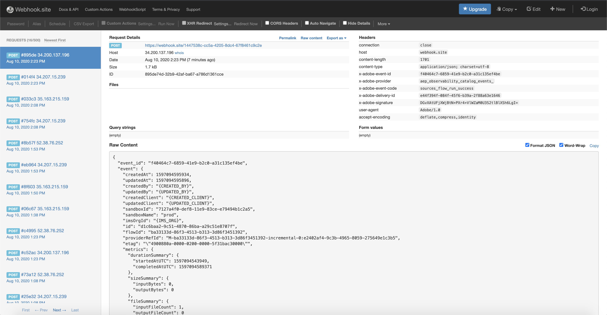

# Flow run notifications

Adobe Experience Platform allows data to be ingested from external sources while providing you with the ability to structure, label, and enhance incoming data using [!DNL Platform] services. You can ingest data from a variety of sources such as Adobe applications, cloud-based storage, databases, and many others.

[!DNL Flow Service](https://www.adobe.io/apis/experienceplatform/home/api-reference.html#!acpdr/swagger-specs/flow-service.yaml) is used to collect and centralize customer data from various disparate sources within Adobe Experience Platform. The service provides a user interface and RESTful API from which all supported sources are connectable.

With the [!DNL Experience Platform] user interface, you can subscribe to events and use webhooks to receive notifications regarding the status of your flow runs. These notifications contain information about the success of your flow run or errors that contributed to a run's failure. This tutorial provides steps on how to subscribe to events, register webhooks, and receive flow run notifications containing information on the status of your dataflow.

## Getting started

This tutorial requires a working understanding of the following components of Adobe Experience Platform:

*   [Experience Data Model (XDM) System](../xdm/home.md): The standardized framework by which [!DNL Experience Platform] organizes customer experience data.
*   [Real-time Customer Profile](../profile/home.md): Provides a unified, real-time consumer profile based on aggregated data from multiple sources.
*   [Data Ingestion](../ingestion/home.md): Data Ingestion represents the multiple methods by which [!DNL Platform] ingests data from these sources, as well as how that data is persisted within the Data Lake for use by downstream [!DNL Platform] services.

## Subscribe to events

The first step in receiving flow run notifications is to subscribe to events using [Adobe I/O Events](https://www.adobe.io/apis/experienceplatform/events.html).

Follow the steps outlined in the [Data ingestion notifications](../ingestion/quality/subscribe-events.md) document to start subscribing to events.

> [!IMPORTANT] To receiving flow run notifications, make sure that you select `aep_observability_catalog_events` when subscribing through the I/O console.

## Register your webhook

A webhook is a channel that allows for the real-time delivery of information from one application to another.

To connect a webhook to your I/O Events subscription, visit [webhook.site](https://webhook.site/) and copy the unique URL provided in the homepage.



Once you have copied the webhook link, paste the link in the *[!UICONTROL Webhook URL]* textbox in the *[!UICONTROL Configure event registration]* step of the event subscription process. Select **[!UICONTROL Save configured events]** to continue.



## Receive flow run notifications

With your webhook connected and your event subscription complete, you can start receiving flow run notifications through the webhook dashboard.

A notification returns information such as the number of ingestions made, file size, and a request's unique identifier. A notification also returns a payload associated with your flow run in JSON-format. The return payload can either be classified as `sources_flow_run_success` or `sources_flow_run_failure`.



### Success

The following JSON payload includes information that pertain to a successful flow run.

```json
{
  "event_id": "fe9739ab-14ba-4575-bdc7-5aef839f2c64",
  "event": {
    "createdAt": 1597095487394,
    "updatedAt": 1597095487358,
    "createdBy": "{CREATED_BY}",
    "updatedBy": "{UPDATED_BY}",
    "createdClient": "{CREATED_CLIENT}",
    "updatedClient": "{UPDATED_CLIENT}",
    "sandboxId": "7127a4f0-def8-11e9-83ce-e79494b1c2a5",
    "sandboxName": "prod",
    "imsOrgId": "{IMS_ORG}",
    "id": "1699fdb1-0f20-4323-99fd-b10f2033236b",
    "flowId": "ba33133d-86f3-4513-b313-3d86f3451392",
    "providerRefId": "M-ba33133d-86f3-4513-b313-3d86f3451392-incremental-0:b4bae140-d41c-4b6c-abe9-0149be0b5899",
    "etag": "\"49000119-0000-0200-0000-5f31be3f0000\"",
    "metrics": {
      "durationSummary": {
        "startedAtUTC": 1597095444636,
        "completedAtUTC": 1597095471861
      },
      "sizeSummary": {
        "inputBytes": 0,
        "outputBytes": 0
      },
      "fileSummary": {
        "inputFileCount": 1,
        "outputFileCount": 0
      },
      "statusSummary": {
        "status": "success"
      }
    },
    "activities": [
      {
        "id": "copyActivity",
        "updatedAtUTC": 1597095487336,
        "durationSummary": {
          "startedAtUTC": 1597095444636,
          "completedAtUTC": 1597095471861,
          "extensions": {
            "windowStart": 1597094520000,
            "windowEnd": 1597095420000
          }
        },
        "sizeSummary": {
          "inputBytes": 0,
          "outputBytes": 0
        },
        "recordSummary": {},
        "fileSummary": {
          "inputFileCount": 1,
          "outputFileCount": 0
        },
        "statusSummary": {
          "status": "success",
          "extensions": {
            "type": "incremental"
          }
        },
        "sourceInfo": [
          {
            "id": "478b4613-5f21-4895-8b46-135f21389513",
            "type": "SourceConnection",
            "reference": {
              "type": "AdfRunId",
              "ids": [
                "b4bae140-d41c-4b6c-abe9-0149be0b5899"
              ]
            }
          }
        ]
      }
    ],
    "processStartTime": 1597095487521,
    "header": {
      "_adobeio": {
        "imsOrgId": "{IMS_ORG}",
        "providerMetadata": "aep_observability_catalog_events",
        "eventCode": "sources_flow_run_success"
      }
    },
    "transformedTime": 1597095487522
  }
}
```

| Metrics | Description |
| ------- | ----------- |
| Duration | Captures the start and end time of the flow run. |
| Size | Captures the volume of the data in bytes. |
| File | Captures the file count of the data. |
| Record | Captures the record count of the data. |

### Failure

The following JSON payload includes information that pertain to a failed flow run. A notification regarding a failed flow run includes information about the errors that contributed to the run's failure, including its error code and description.

```json
[
  {
    "msgType": "eventNotification",
    "version": "1.0",
    "timestamp": "1591632364092",
    "imsOrgId": "{IMS_ORG}",
    "schema": {
      "name": "run-notification",  
      "version": "1.0"
    },
    "provider": "FlowService",
    "_eventNotificationMeta": {
       "category": "flowRun",
       "type": "sources_flow_run_failure"
    },
    "value": {
      "xdm:flowId": "3a4a152c-ba1a-4f71-8a15-2cba1abf719e",
      "xdm:flowRunId": "1149044a-2536-4dca-8904-4a25364dca98",
      "xdm:imsOrg": "555B08345D76A68D0A495E79@AdobeOrg",
      "xdm:sandboxName": "e2e-at-10-7-19-02",
      "xdm:metrics": {
        "durationSummary": {
          "startedAtUTC": 1592689437,
          "completedAtUTC": 1592782069117
        },
        "sizeSummary": {
          "inputBytes": 223,
          "outputBytes": 2235
        },
        "recordSummary": {
          "inputRecordCount": 14,
          "outputRecordCount": 8,
          "skippedRecordCount": 0,
          "failedRecordCount": 0
        },
        "fileSummary": {
          "inputFileCount": 1,
          "outputFileCount": 1,
          "skippedFileCount": 0,
          "failedFileCount": 0
        },
        "statusSummary": {
          "status": "failed",
          "errors": [
            {
              "code": "CTOR-2001-500",
              "message": "Internal error in Promotion activity step"
            }
          ],
          "extensions": {
            "errors": [
              {
                "code": "INGEST-1205-400",
                "description": "The field: _id does not exist in the target schema. Remove the field and try again."
              },
              {
                "code": "INGEST-1205-400",
                "description": "The field: person does not exist in the target schema. Remove the field and try again."
              }
            ]
          }
        }
      }
    }
  }
]
```

> [!NOTE] If partial ingestion is enabled during the flow creation process, a flow that contains both successful and failed ingestions will be marked as `sources_flow_run_success`. Errors will still be included as part of the return payload.

