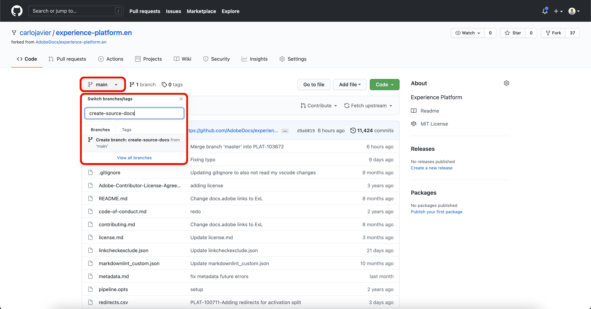
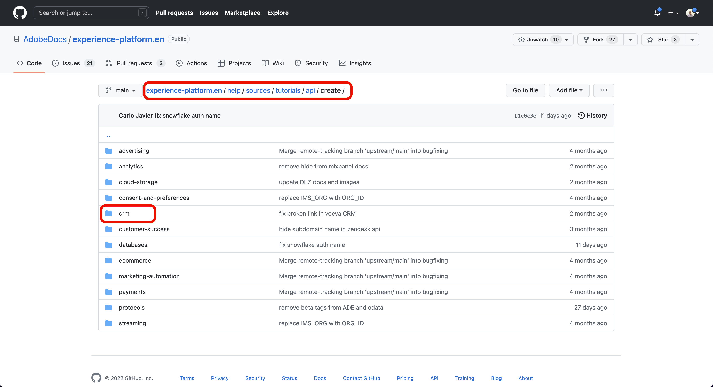
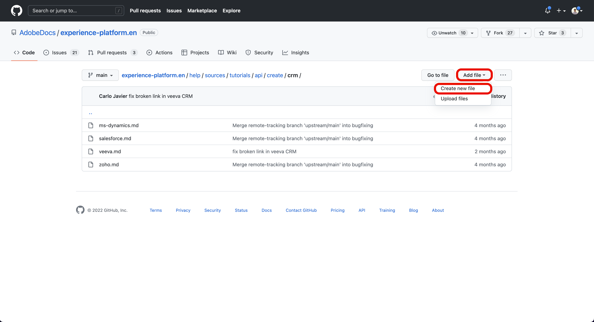
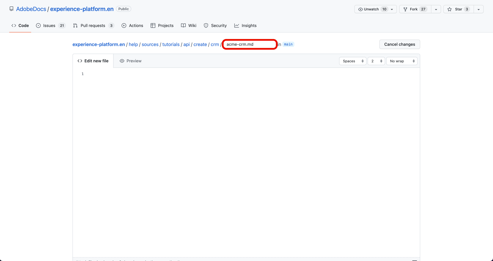
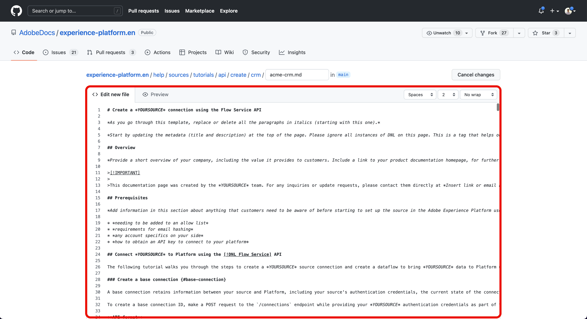
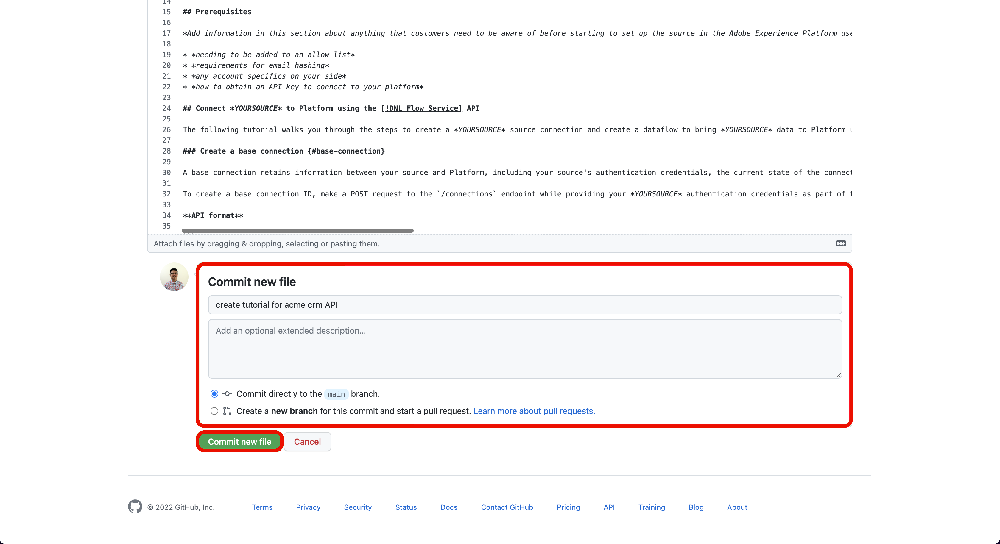
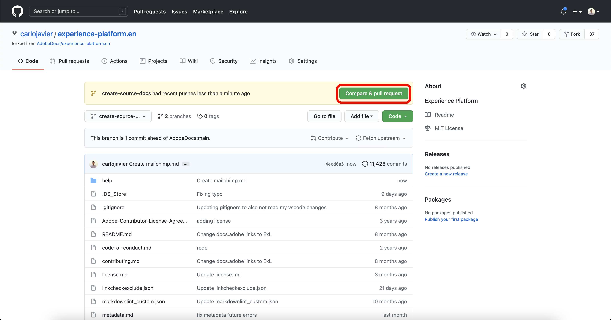

# Use the GitHub web interface to create a source documentation page

This document provides steps on how to use the GitHub web interface to author documentation and submit a pull request (PR).

>[!TIP]
>
>The following documents from Adobe's contributing guide can be used to further support your documentation process: <ul><li>[Install Git and Markdown Authoring tools](https://experienceleague.adobe.com/docs/contributor/contributor-guide/setup/install-tools.html)</li><li>[Set up Git repository locally for documentation](https://experienceleague.adobe.com/docs/contributor/contributor-guide/setup/local-repo.html)</li><li>[GitHub contribution workflow for major changes](https://experienceleague.adobe.com/docs/contributor/contributor-guide/setup/full-workflow.html)</li></ul>

## Set up your GitHub environment

The first step in setting up your GitHub environment is to navigate to the [Adobe Experience Platform GitHub repository](https://github.com/AdobeDocs/experience-platform.en).

Next, select **Fork**.

Once the fork is complete, select **master** and enter a name for your new branch in the dropdown menu that appears. Ensure that you provide a descriptive name for your branch as this will be used to contain your work, and then select **create branch**.

In the GitHub folder structure of your forked repository, navigate to [`experience-platform.en/help/sources/tutorials/api/create/`](https://github.com/AdobeDocs/experience-platform.en/tree/main/help/sources/tutorials/api/create) and then select the appropriate category for your source from the list. For example, if you are creating documentation for a new CRM source, select **crm**.

>[!TIP]
>
>If you are creating documentation for the UI, then navigate to [`experience-platform.en/help/sources/tutorials/ui/create/`](https://github.com/AdobeDocs/experience-platform.en/tree/main/help/sources/tutorials/ui/create) and select the appropriate category for your source. To add your images, navigate to [`experience-platform.en/help/sources/images/tutorials/create/sdk`](https://github.com/AdobeDocs/experience-platform.en/tree/main/help/sources/images/tutorials/create) then add your screenshots to the `sdk` folder.

A folder of existing CRM sources appears. To add documentation for a new source, select **Add file** and then select **Create new file** from the dropdown menu that appears.

Name your source file `YOURSOURCE.md` where YOURSOURCE is the name of your source in Platform. For example, if your company is ACME CRM, then your file name should be `acme-crm.md`.

## Author the documentation page for your source

To start documenting your new source, paste the content of the [sources documentation template](./template.md) into the GitHub web editor. You can also download the template [here](../assets/api-template.zip).

With the template copied over to the GitHub web editor interface, follow the instructions outlined on the template and edit the values containing relevant information for your source.

When complete, commit the file in your branch.

## Submit your documentation for review

Once your file is committed, you can open a pull request (PR) to merge your working branch into the master branch of the Adobe documentation repository. Ensure that the branch you have been working on is selected, and then select **Compare & pull request**.

Ensure that the base and compare branches are correct. Add a note to the PR, describing your update, and then select **Create pull request**. This opens a PR to merge the working branch of your work into the master branch of the Adobe repository.

>[!TIP]
>
>Leave the **Allow edits by maintainers** checkbox selected to ensure that the Adobe documentation team can make edits to the PR.

At this point, a notification appears that prompts you to sign the Adobe Contributor License Agreement (CLA). This is a mandatory step. After you sign the CLA, refresh the PR page and submit the pull request.

You can confirm that the pull request has been submitted by inspecting the pull requests tab in https://github.com/AdobeDocs/experience-platform.en.

