# Use a text editor in your local environment to create a sources documentation page

This document provides steps on how to use your local environment to author documentation for your source and submit a pull request (PR).

>[!TIP]
>
>The following documents from Adobe's contributing guide can be used to further support your documentation process: <ul><li>[Install Git and Markdown Authoring tools](https://experienceleague.adobe.com/docs/contributor/contributor-guide/setup/install-tools.html?lang=en)</li><li>[Set up Git repository locally for documentation](https://experienceleague.adobe.com/docs/contributor/contributor-guide/setup/local-repo.html?lang=en)</li><li>[GitHub contribution workflow for major changes](https://experienceleague.adobe.com/docs/contributor/contributor-guide/setup/full-workflow.html?lang=en)</li></ul>

## Prerequisites

The following tutorial requires that you have GitHub Desktop installed on your local machine. If you do not have GitHub Desktop, you can download the application [here](https://desktop.github.com/).

## Connect to GitHub and set up your local authoring environment

The first step in setting up your local authoring environment is to navigate to the [Adobe Experience Platform GitHub repository](https://github.com/AdobeDocs/experience-platform.en).

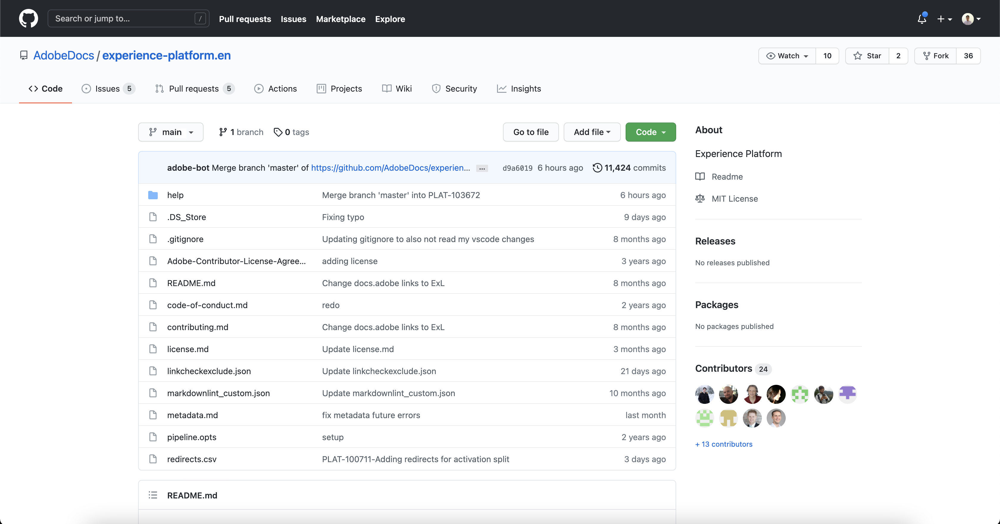

On the main page of the Platform GitHub repository, select **Fork**.

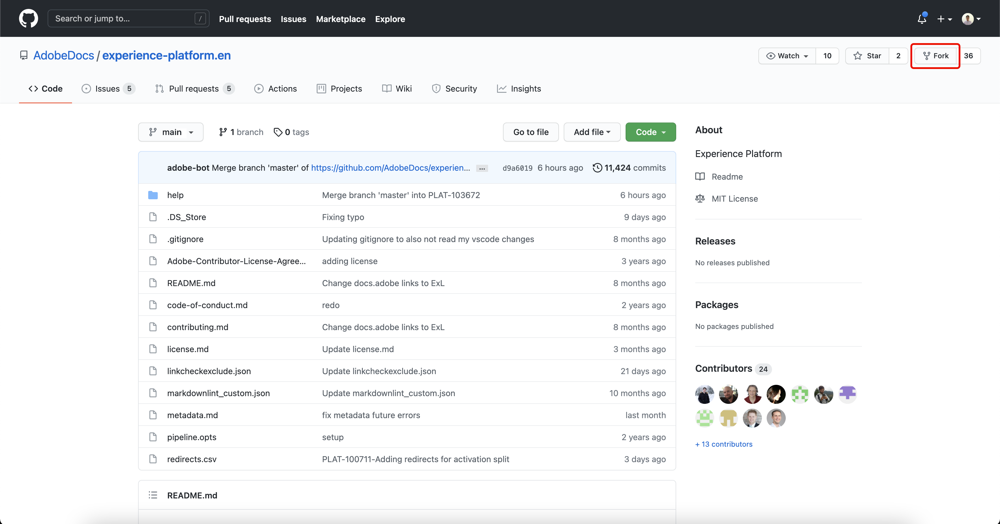

To clone the repository to your local machine, select **Code**. From the dropdown menu that appears, select **HTTPS** and then, select **Open with GitHub Desktop**. 

>[!TIP]
>
>For more information, see the tutorial on [setting up Git repository locally for documentation](https://experienceleague.adobe.com/docs/contributor/contributor-guide/setup/local-repo.html?lang=en#create-a-local-clone-of-the-repository).

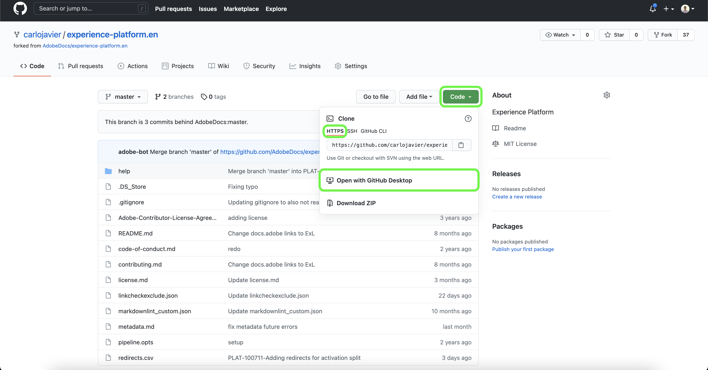

Next, allow a few moments for GitHub Desktop to clone the `experience-platform.en` repository.

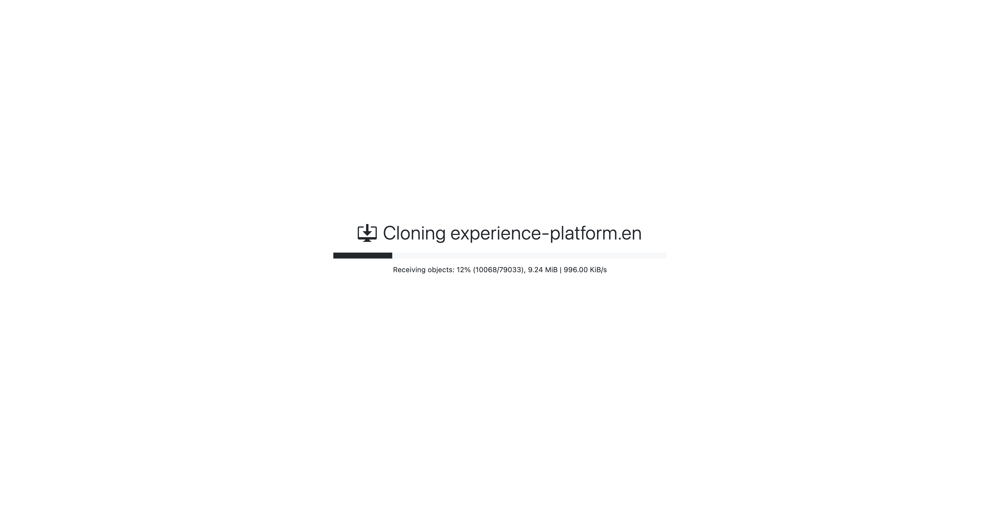

Once the cloning process is complete, head to GitHub Desktop to create a new branch. Select **Master** from the top navigation and then select **New branch**

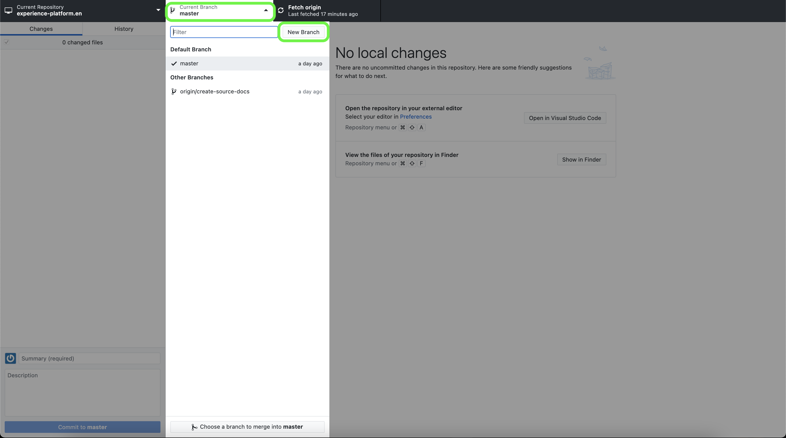

In the popover panel that appears, enter a descriptive name for your branch, and then select **Create branch**.

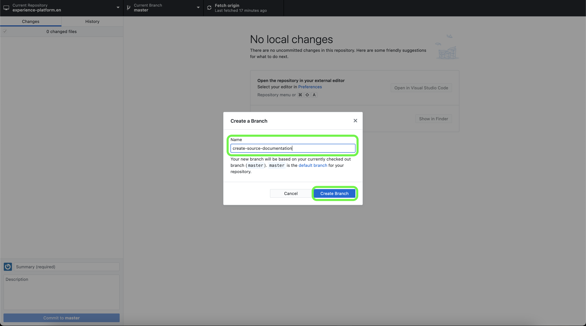

Next, select **Publish branch**.

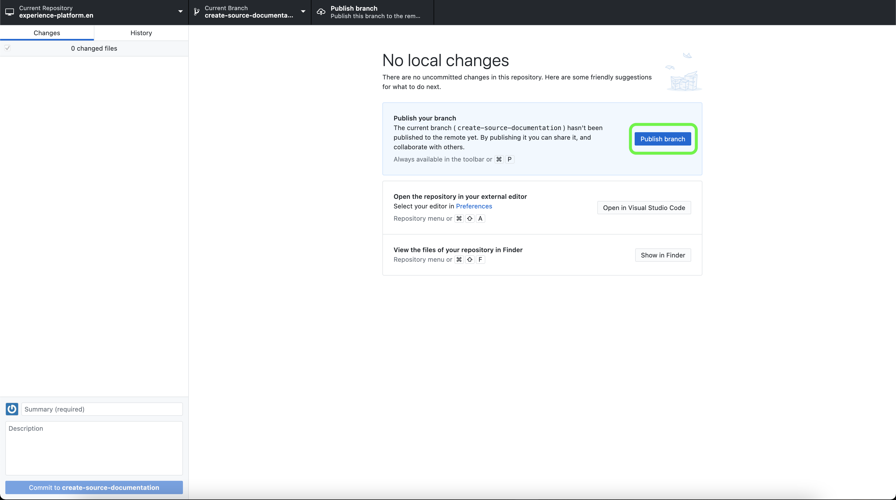

## Author the documentation page for your source

With the repository cloned to your local machine and a new branch created, you can now start authoring the documentation page for your new source through the [text editor of your choice](https://experienceleague.adobe.com/docs/contributor/contributor-guide/setup/install-tools.html?lang=en#understand-markdown-editors).

Adobe recommends that you use [Visual Studio Code](https://code.visualstudio.com/) and that you install the Adobe Markdown Authoring extension. To install the extension, launch Visual Studio Code, and then select the **Extensions** tab from the left-navigation.

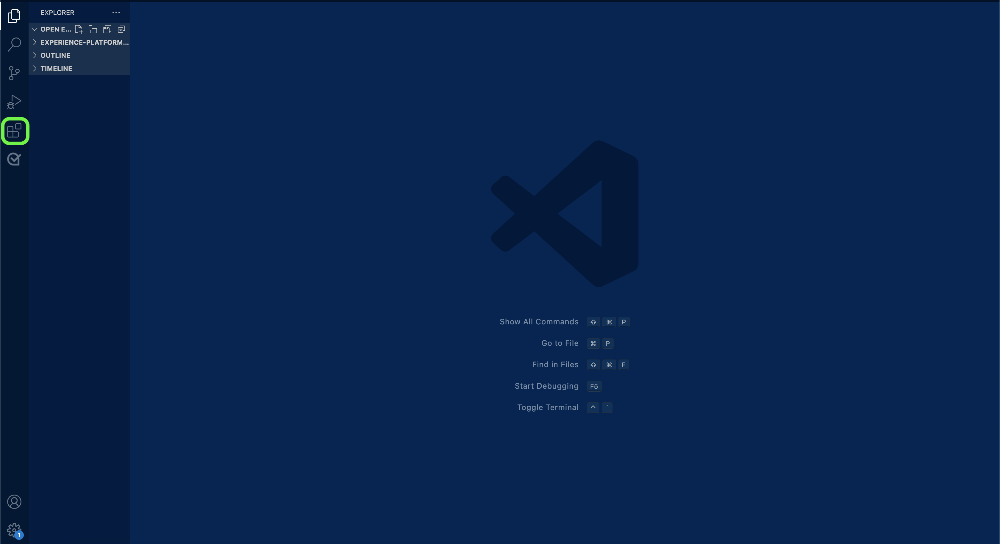

Next, enter `Adobe Markdown Authoring` into the search bar and then select **Install** from the page that appears.

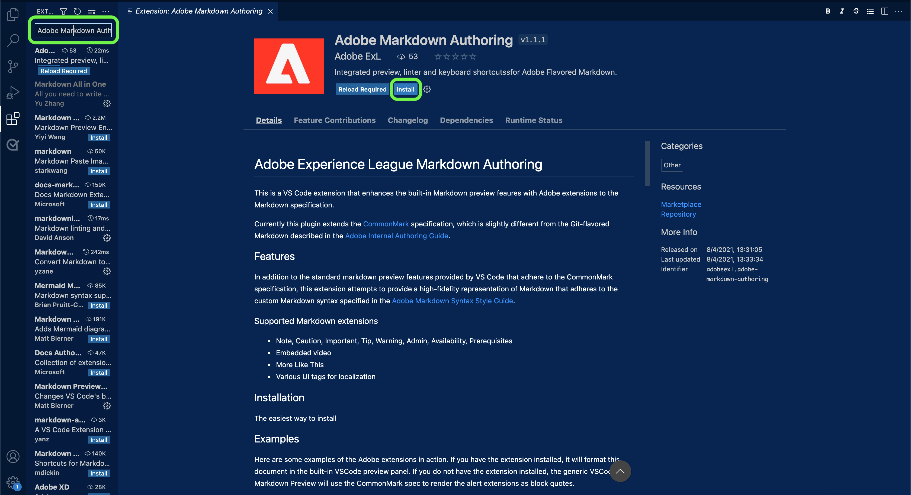

With your local machine ready, download the [sources documentation template](../assets/api-template.zip) and extract the file to `experience-platform.en/help/sources/tutorials/api/create/...` with [`...`] representing the category of your choice. For example, if you are creating a database source, select the database folder.

Finally, follow the instructions outlined on the template and edit the template with the relevant information pertaining to your source.

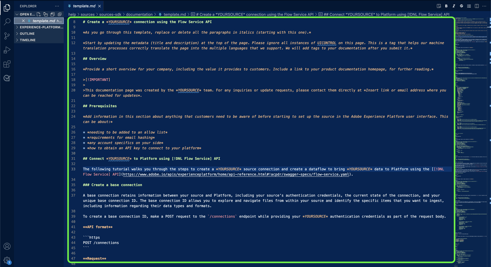

## Submit your documentation for review

To create a pull request (PR) and submit your documentation for review, first save your work in [!DNL Visual Studio Code] (or your chosen text editor). Next, using GitHub Desktop, enter a commit message and select **Commit to create-source-documentation**.

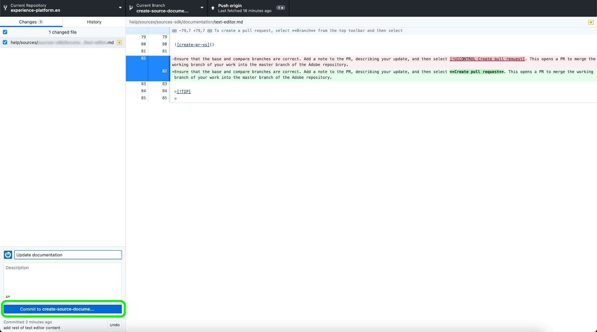

Next, select **Push origin** to upload your work to the remote branch.

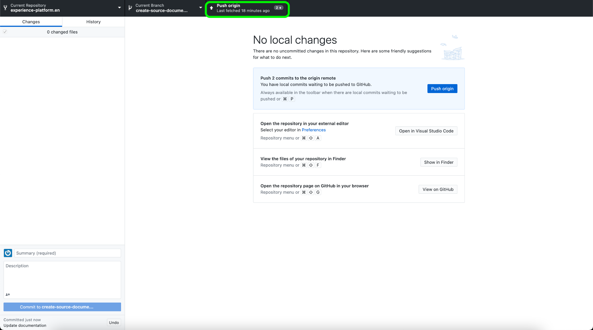

To create a pull request, select **Create Pull Request**.

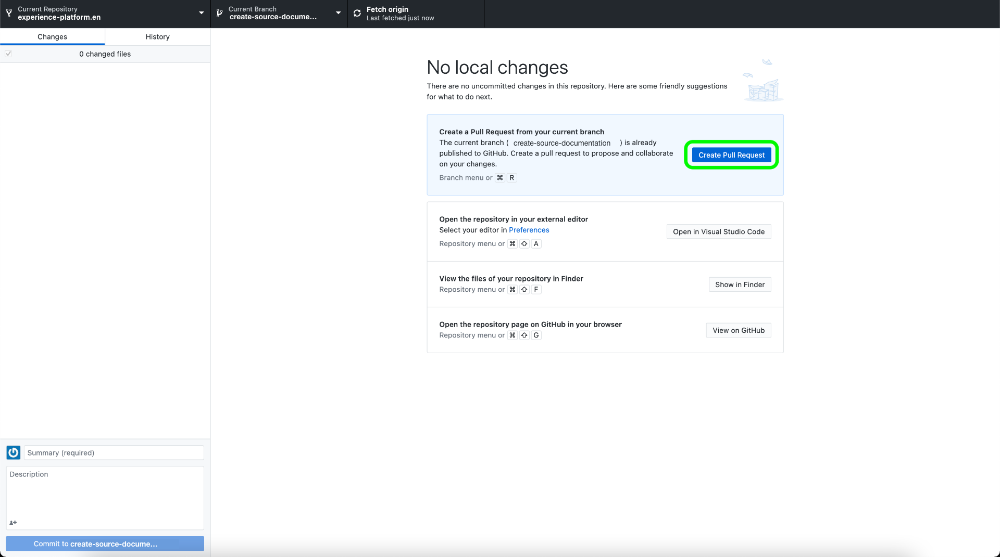

Ensure that the base and compare branches are correct. Add a note to the PR, describing your update, and then select **Create pull request**. This opens a PR to merge the working branch of your work into the master branch of the Adobe repository.

>[!TIP]
>
>Leave the **Allow edits by maintainers** checkbox selected to ensure that the Adobe documentation team can make edits to the PR.

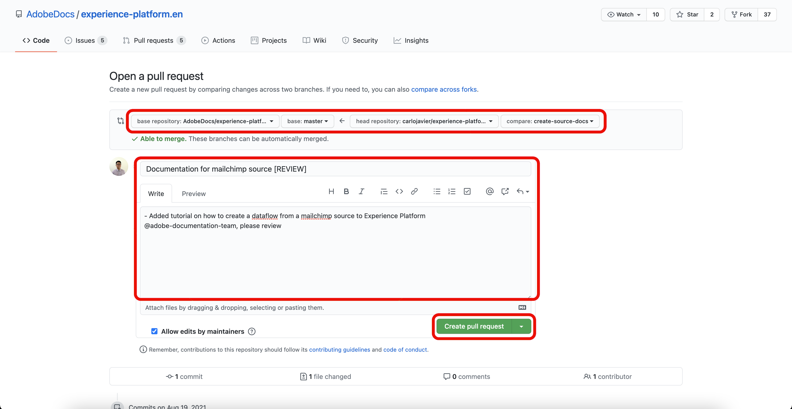

You can confirm that the pull request has been submitted by inspecting the pull requests tab in https://github.com/AdobeDocs/experience-platform.en.

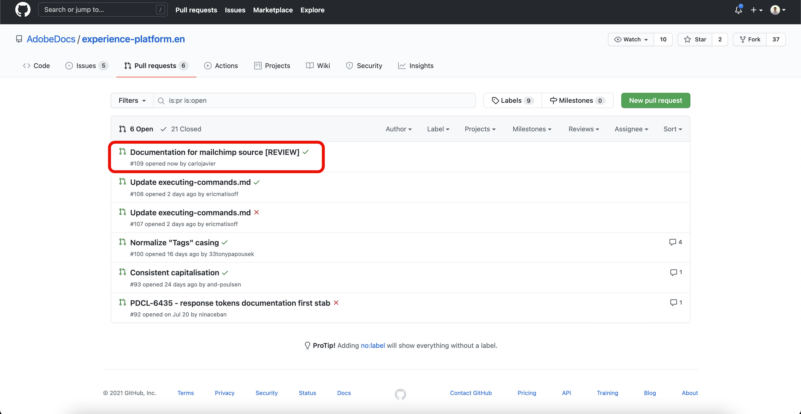
