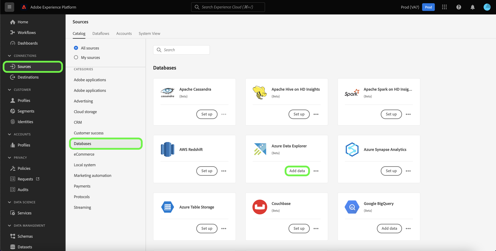
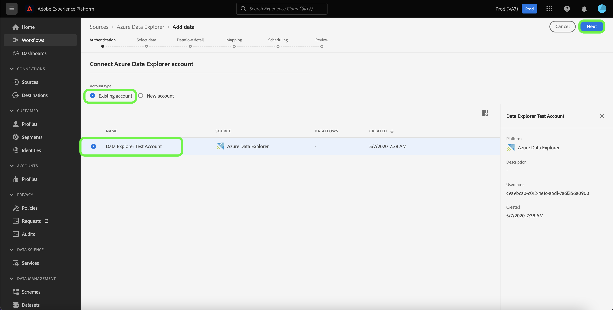
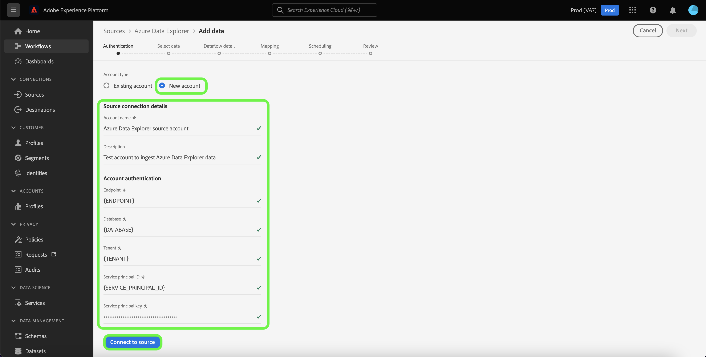

# Create a *YOURSOURCE* source connection in the UI

*As you go through this template, replace or delete all the paragraphs in italics (starting with this one).*

*Start by updating the metadata (title and description) at the top of the page. Please ignore all instances of UICONTROL on this page. This is a tag that helps our machine translation processes correctly translate the page into the multiple languages that we support. We will add tags to your documentation after you submit it.*

This tutorial provides steps for creating a *YOURSOURCE* source connector using the Platform user interface.

## Overview

*Provide a short overview of your company, including the value it provides to customers. Include a link to your product documentation homepage, for further reading.*

>[!IMPORTANT]
>
>This source connector and documentation page are created and maintained by the *YourSource* team. For any inquiries or update requests, please contact them directly at *Insert link or email address where you can be reached for updates*.

## Prerequisites

*Add information in this section about anything that customers need to be aware of before starting to set up the source in the Adobe Experience Platform user interface. This can be about:*

* *needing to be added to an allow list*
* *requirements for email hashing*
* *any account specifics on your side*
* *how to obtain the authentication credentials to connect to your platform*

### Gather required credentials

In order to connect *YOURSOURCE* to Platform, you must provide values for the following connection properties:

| Credential | Description | Example |
| --- | --- | --- |
| *credential one* | *Please add a brief description to your source's authentication credential here* | *Please add an example of your source's authentication credential here* |
| *credential two* | *Please add a brief description to your source's authentication credential here* | *Please add an example of your source's authentication credential here* |
| *credential three* | *Please add a brief description to your source's authentication credential here* | *Please add an example of your source's authentication credential here* |

For more information on these credentials, see the *YOURSOURCE* authentication documentation. *Please add link to your platform's authentication documentation here*.

## Connect your *YOURSOURCE* account

In the Platform UI, select **[!UICONTROL Sources]** from the left navigation bar to access the [!UICONTROL Sources] workspace. The [!UICONTROL Catalog] screen displays a variety of sources with which you can create an account.

You can select the appropriate category from the catalog on the left-hand side of your screen. Alternatively, you can find the specific source you wish to work with using the search option.

Under the *YOURSOURCE'S CATEGORY* category, select *YOURSOURCE*, and then select **[!UICONTROL Add data]**.

>[!TIP]
>
>The screenshots used below are examples. When creating your documentation, please replace the images with screenshots of your actual source. You can use the same mark up pattern and color, as well as the same file names. Please ensure that your screenshot captures the entire Platform UI screen. For information on how to upload your screenshots, see the guide on [submitting your documentation for review](./github.md).

The **[!UICONTROL Connect YOURSOURCE account]** page appears. On this page, you can either use new credentials or existing credentials.

### Existing account

To use an existing account, select the *YOURSOURCE* account you want to create a new dataflow with, then select **[!UICONTROL Next]** to proceed.

### New account

If you are creating a new account, select **[!UICONTROL New account]**, and then provide a name, an optional description, and your credentials. When finished, select **[!UICONTROL Connect to source]** and then allow some time for the new connection to establish.

## Next steps

*Workflows for the remaining steps of creating a dataflow are modularized. If there are any specific call-outs you want to make regarding your source, please see the additional resources section below.*

By following this tutorial, you have established a connection to your *YOURSOURCE* account. You can now continue on to the next tutorial and [configure a dataflow to bring data into Platform](https://experienceleague.adobe.com/docs/experience-platform/sources/ui-tutorials/dataflow/crm.html).

## Additional resources

*This is an optional section where you can provide further links to your product documentation or any other steps, screenshots, nuances you consider important for the customer to be successful. You can use this section to add information on or tips on the entire workflow of your source, especially if there are particular "gotchas" that an end-user might encounter.*
