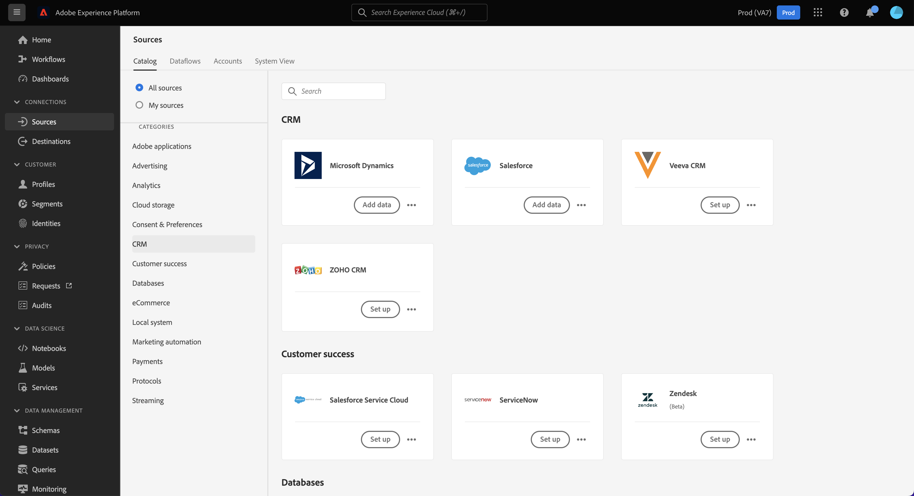

# Self-Serve Sources (Batch SDK) overview

Adobe Experience Platform Self-Serve Sources (Batch SDK) is a set of configuration APIs that allow you to integrate a REST API-based source using the [[!DNL Flow Service] API](https://www.adobe.io/experience-platform-apis/references/flow-service/) to bring your data to Experience Platform.

With Sources SDK, you can:

* Configure and integrate a new source to the Experience Platform catalog using the [!DNL Flow Service] API.
* Define specifications for your source, including information pertaining to supported authentication types and how resource data is fetched.
* Create user-facing documentation for your new source.

The Sources SDK documentation provides instructions for you to use the Adobe Experience Platform Sources SDK to configure, test and release a REST API-based source integration with Platform, and have your source become part of the ever-growing sources catalog.

## Understanding sources

Platform can ingest data from external sources while allowing you to structure, label, and enhance that data using Platform services. You can ingest data from a variety of sources such as Adobe applications, cloud-based storage, third-party software, and your CRM system.

For more information on sources, and to see a list of different sources currently supported on Platform, see the [sources overview](../home.md).

## Create a source

Through Sources SDK, you can integrate your own REST API-based source and bring your data to Platform with [!DNL Flow Service]. Sources SDK allows you to integrate a new source with Platform, by creating and submitting new connection specification through the [!DNL Flow Service] API.

See the guide on [creating a new connection specification](./api/api-overview.md) for information on how to integrate a new source to Platform.

## Document your source

Once your source is created, see the [documentation guide](./documentation/doc-overview.md) for instructions on how to document your source through the [!DNL GitHub] web interface or through your own text editor.

## High-level process

The step-by-step process to configure your source in Experience Platform is outlined below:

* Read the [Sources SDK API guide](./api/api-overview.md);
  * Read the [getting started guide](./api/getting-started.md);
  * Follow the tutorial on [creating a new connection specification](./api/create.md);
  * Follow the tutorial on [updating your connection specification](./api/update-connection-specs.md);
  * Follow the tutorial on [adding your new connection specification ID to a flow specification](./api/update-flow-specs.md)
  * [Submit your new source](./api/submit.md).
* To gain a better understanding of the structure and properties of a connection specification, see the guide on [configuration options for Sources SDK](./config/config.md);
  * See the guide on [configuring your authentication specifications](./config/authspec.md);
  * See the guide on [configuring your source specifications](./config/sourcespec.md);
  * See the guide on [configuring your explore specifications](./config/explorespec.md);
* To start documenting your source, see the [overview on creating documentation for Sources SDK](./documentation/doc-overview.md)
  * You can use this [sources API documentation template](./documentation/template.md) to structure your API documentation;
  * You can use this [sources UI documentation template](./documentation/ui-template.md) to structure your UI documentation;
  * See the guide on [using the GitHub web interface](./documentation/github.md) for steps on how to create documentation using GitHub;
  * See the guide on [using a text editor](./documentation/text-editor.md) for steps on how to create documentation using your local machine.
