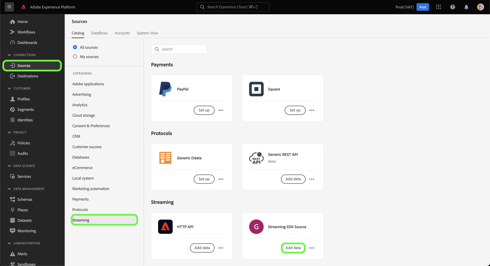
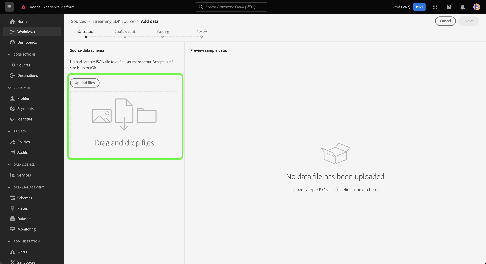
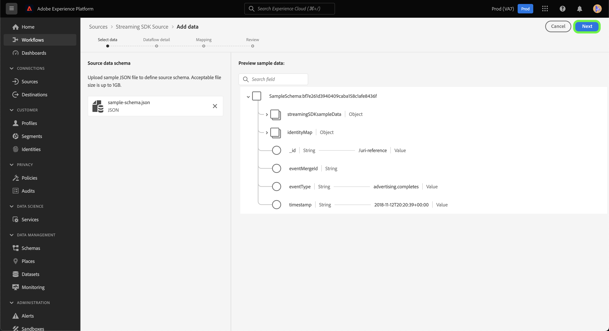
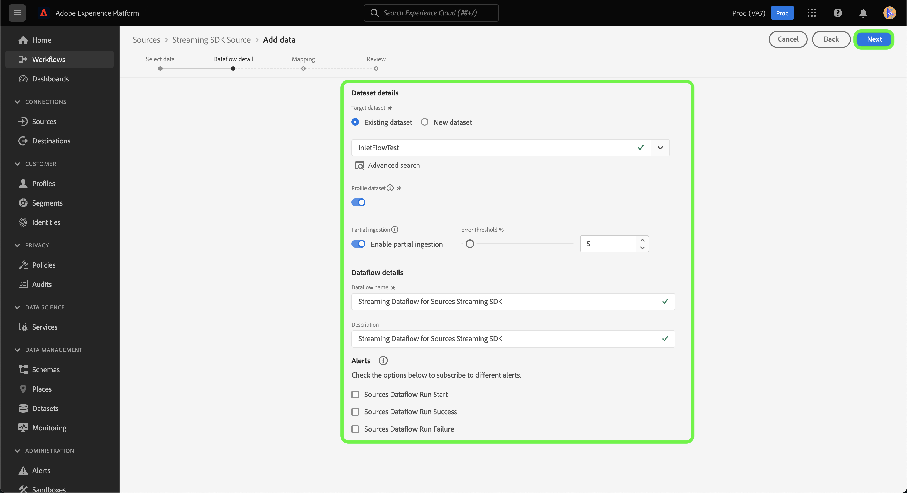
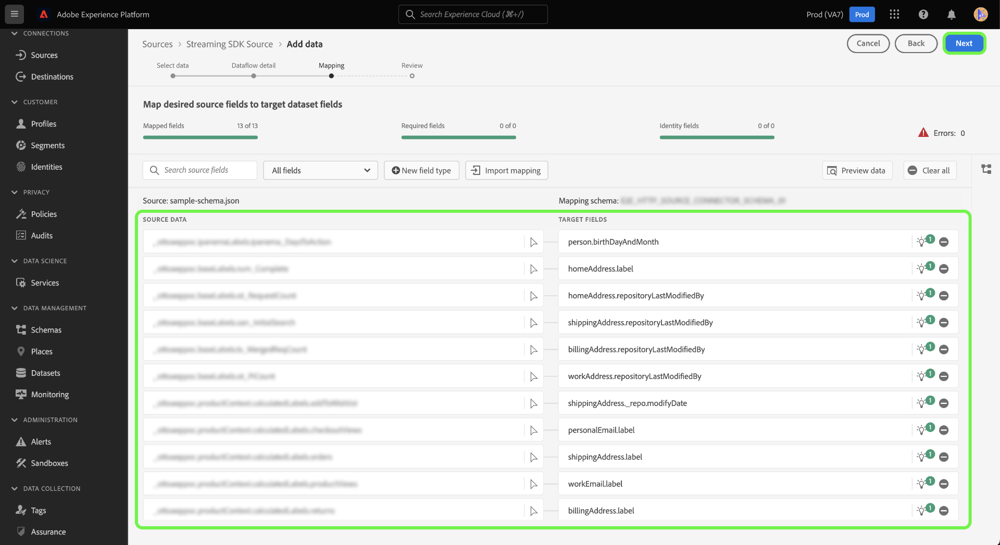
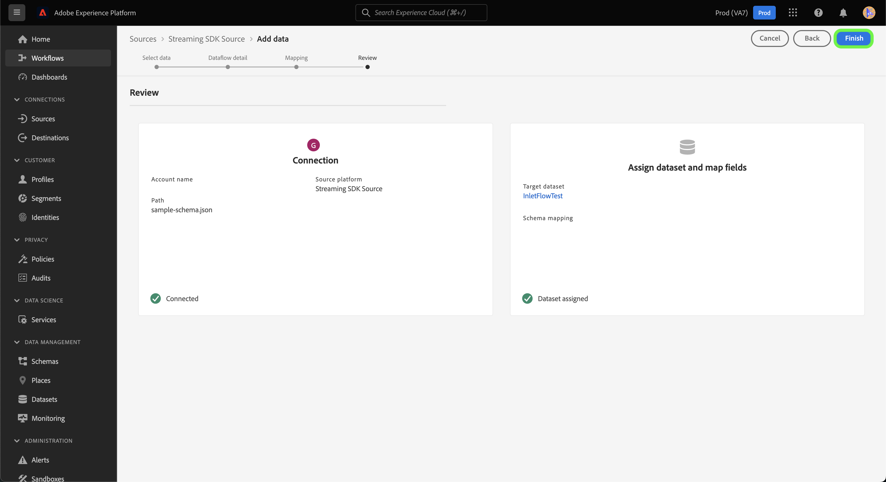

# Create a source connection and dataflow to stream *YOURSOURCE* data using the UI

*As you go through this template, replace or delete all the paragraphs in italics (starting with this one).*

*Start by updating the metadata (title and description) at the top of the page. Please ignore all instances of UICONTROL on this page. This is a tag that helps our machine translation processes correctly translate the page into the multiple languages that we support. We will add tags to your documentation after you submit it.*

This tutorial provides steps for creating a *YOURSOURCE* source connector using the Platform user interface.

## Overview

*Provide a short overview of your company, including the value it provides to customers. Include a link to your product documentation homepage, for further reading.*

>[!IMPORTANT]
>
>This source connector and documentation page are created and maintained by the *YOURSOURCE* team. For any inquiries or update requests, please contact them directly at *Insert link or email address where you can be reached for updates*.

## Prerequisites

*Add information in this section about anything that customers need to be aware of before starting to set up the source in the Adobe Experience Platform user interface. This can be about:*

* *needing to be added to an allow list*
* *requirements for email hashing*
* *any account specifics on your side*
* *how to obtain the authentication credentials to connect to your platform*

### Gather required credentials

In order to connect *YOURSOURCE* to Platform, you must provide values for the following connection properties:

| Credential | Description | Example |
| --- | --- | --- |
| *credential one* | *Please add a brief description to your source's authentication credential here* | *Please add an example of your source's authentication credential here* |
| *credential two* | *Please add a brief description to your source's authentication credential here* | *Please add an example of your source's authentication credential here* |
| *credential three* | *Please add a brief description to your source's authentication credential here* | *Please add an example of your source's authentication credential here* |

For more information on these credentials, see the *YOURSOURCE* authentication documentation. *Please add link to your platform's authentication documentation here*.

### Integrate *YOURSOURCE* with your webhook

*Streaming SDK requires your source to be able to support webhooks in order to communicate with Experience Platform. In this section, you must provide the steps that your users will have to follow in order to integrate YOURSOURCE with a webhook.*

## Connect your *YOURSOURCE* account

In the Platform UI, select **[!UICONTROL Sources]** from the left navigation bar to access the [!UICONTROL Sources] workspace. The [!UICONTROL Catalog] screen displays a variety of sources with which you can create an account.

You can select the appropriate category from the catalog on the left-hand side of your screen. Alternatively, you can find the specific source you wish to work with using the search option.

Under the **Streaming** category, select *YOURSOURCE*, and then select **[!UICONTROL Add data]**.

>[!TIP]
>
>The screenshots used below are examples. When creating your documentation, please replace the images with screenshots of your actual source. You can use the same mark up pattern and color, as well as the same file names. Please ensure that your screenshot captures the entire Platform UI screen. For information on how to upload your screenshots, see the guide on [submitting your documentation for review](../documentation/github.md).

## Select data

The **[!UICONTROL Select data]** step appears, providing an interface for you to select the data that you bring to Platform.

* The left part of the interface is a browser that allows you to view the available data streams within your account;
* The right part of the interface lets you preview up to 100 rows of data from a JSON file.

Select **[!UICONTROL Upload files]** to upload a JSON file from your local system. Alternatively, you can drag and drop the JSON file you want to upload into the [!UICONTROL Drag and drop files] panel.

Once your file uploads, the preview interface updates to display a preview of the schema you uploaded. The preview interface allows you to inspect the contents and structure of a file. You can also use the [!UICONTROL Search field] utility to access specific items from within your schema.

When finished, select **[!UICONTROL Next]**.

## Dataflow detail

The **Dataflow detail** step appears, providing you with options to use an existing dataset or establish a new dataset for your dataflow, as well as an opportunity to provide a name and description for your dataflow. During this step, you can also configure settings for Profile ingestion, error diagnostics, partial ingestion, and alerts.

When finished, select **[!UICONTROL Next]**.

## Mapping

The [!UICONTROL Mapping] step appears, providing you with an interface to map the source fields from your source schema to their appropriate target XDM fields in the target schema.

Platform provides intelligent recommendations for auto-mapped fields based on the target schema or dataset that you selected. You can manually adjust mapping rules to suit your use cases. Based on your needs, you can choose to map fields directly, or use data prep functions to transform source data to derive computed or calculated values. For comprehensive steps on using the mapper interface and calculated fields, see the [Data Prep UI guide](https://experienceleague.adobe.com/docs/experience-platform/data-prep/ui/mapping.html).

Once your source data is successfully mapped, select **[!UICONTROL Next]**.

## Review

The **[!UICONTROL Review]** step appears, allowing you to review your new dataflow before it is created. Details are grouped within the following categories:

* **[!UICONTROL Connection]**: Shows the source type, the relevant path of the chosen source file, and the amount of columns within that source file.
* **[!UICONTROL Assign dataset & map fields]**: Shows which dataset the source data is being ingested into, including the schema that the dataset adheres to.

Once you have reviewed your dataflow, click **[!UICONTROL Finish]** and allow some time for the dataflow to be created.

## Get your streaming endpoint URL

With your streaming dataflow created, you can now retrieve your streaming endpoint URL. This endpoint will be used to subscribe to your webhook, allowing your streaming source to communicate with Experience Platform. 

To retrieve your streaming endpoint, go to the [!UICONTROL Dataflow activity] page of the dataflow that you just created and copy the endpoint from the bottom of the [!UICONTROL Properties] panel.

## Next steps

*Workflows for the remaining steps of creating a dataflow are modularized. If there are any specific call-outs you want to make regarding your source, please see the additional resources section below.*

By following this tutorial, you hcave established a connection to your *YOURSOURCE* account. You can now continue on to the next tutorial and [configure a dataflow to bring data into Platform](https://experienceleague.adobe.com/docs/experience-platform/sources/ui-tutorials/dataflow/crm.html).

## Additional resources

*This is an optional section where you can provide further links to your product documentation or any other steps, screenshots, nuances you consider important for the customer to be successful. You can use this section to add information on or tips on the entire workflow of your source, especially if there are particular "gotchas" that an end-user might encounter.*
