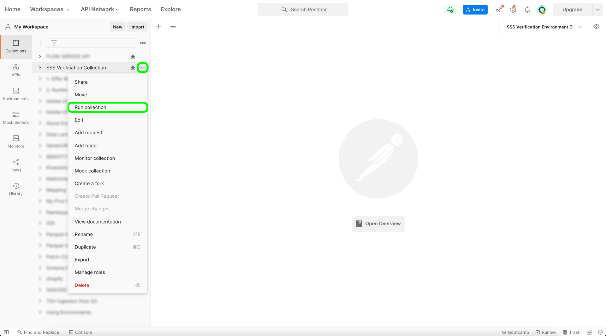
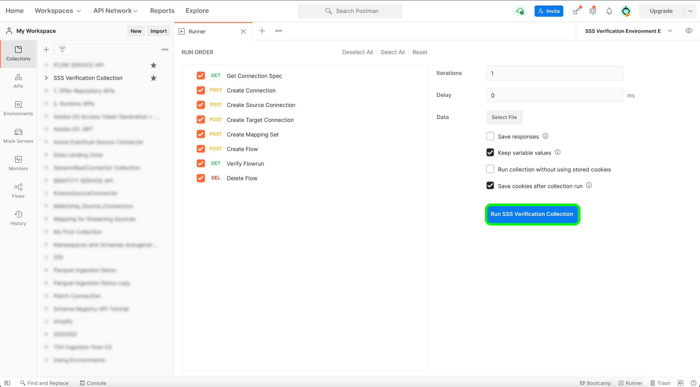
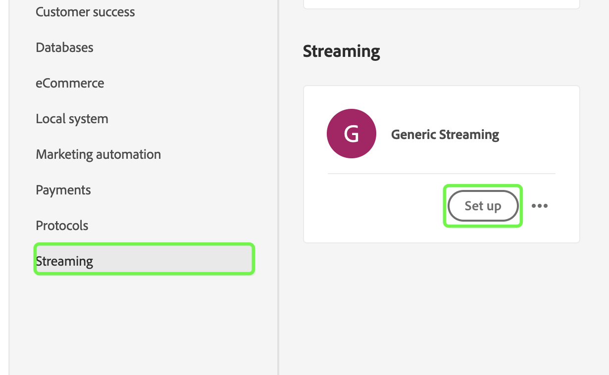
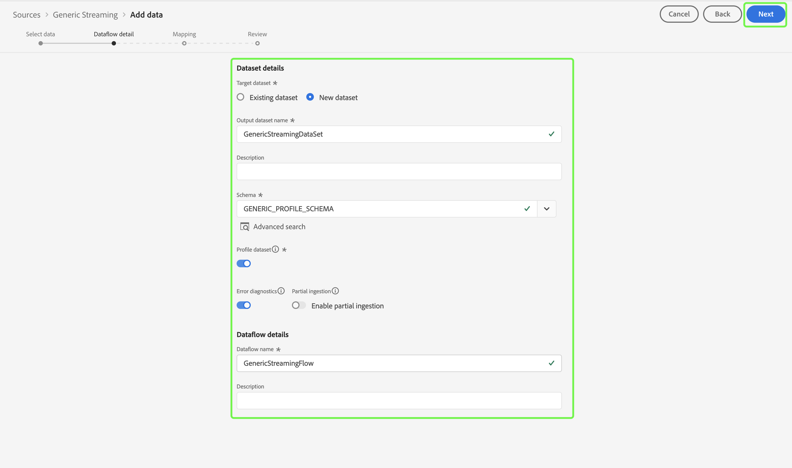
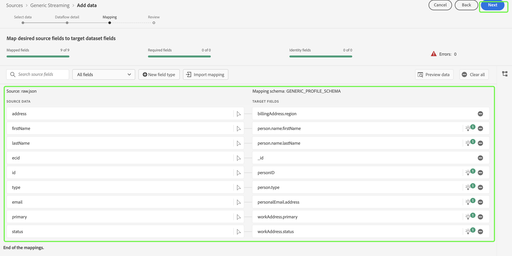
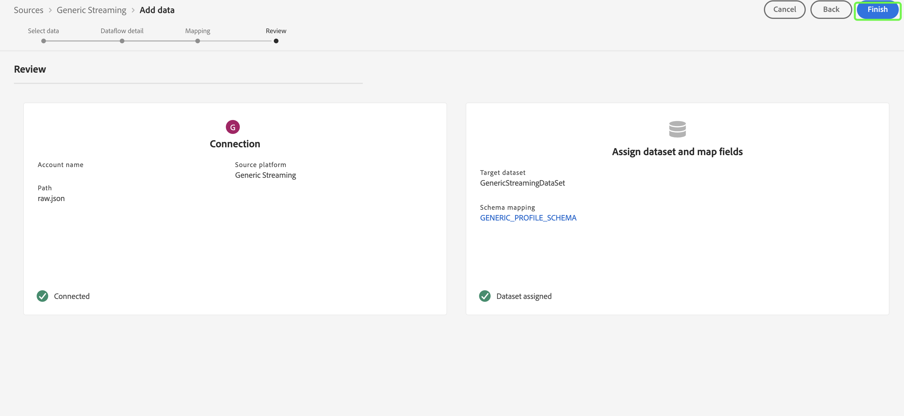
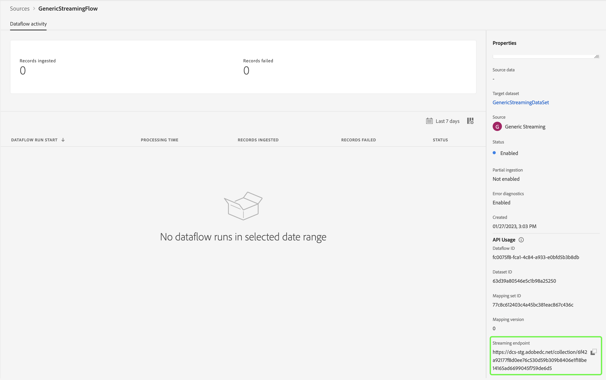

# Test and Submit your source

>[!NOTE]
>
>Self-Serve Sources Streaming SDK is in beta. Please read the [sources overview](../../home.md#terms-and-conditions) for more information on using beta-labeled sources.

The final steps to integrating your new source to Adobe Experience Platform using Self-Serve Sources (Streaming SDK) are to test and submit your new source. Once you have completed your connection specification and updated the streaming flow specification, you can start testing your source's functionality through either the API or the UI. When successful, you can then submit your new source by contacting your Adobe representative.

The following document provides steps on how to test and debug your source using the [[!DNL Flow Service] API](https://www.adobe.io/experience-platform-apis/references/flow-service/).

## Getting started

* For information on how to successfully make calls to Platform APIs, see the guide on [getting started with Platform APIs](../../../landing/api-guide.md).
* For information on how to generate your credentials for Platform APIs, see the tutorial on [authenticating and accessing Experience Platform APIs](../../../landing/api-authentication.md).
* For information on how to set up [!DNL Postman] for Platform APIs, see the tutorial on [setting up developer console and [!DNL Postman]](../../../landing/postman.md).
* To help your testing and debugging process, download the [Self-Serve Sources verification collection and environment here](../assets/sdk-verification.zip) and follow the steps outlined below.

## Test your source using the API

To test your source using the API, you must run the [Self-Serve Sources verification collection and environment](../assets/sdk-verification.zip) on [!DNL Postman] while providing the appropriate environment variables that pertain to your source.

To start testing, you must first set up the collection and environment on [!DNL Postman]. Next, specify the connection specification ID that you want to test.

>[!NOTE]
>
>All of the example variables below are placeholder values that you must update, except for `flowSpecificationId` and `targetConnectionSpecId`, which are fixed values.

| Parameter | Description | Example |
| --- | --- | --- |
| `x-api-key` | A unique identifier used to authenticate calls to Experience Platform APIs. See the tutorial on [authenticating and accessing Experience Platform APIs](../../../landing/api-authentication.md) for information on how to retrieve your `x-api-key`. | `c8d9a2f5c1e03789bd22e8efdd1bdc1b` |
| `x-gw-ims-org-id` | A corporate entity that can own or license products and services and allow access to its members. See the tutorial on [setting up developer console and [!DNL Postman]](../../../landing/postman.md) for instructions on how to retrieve your `x-gw-ims-org-id` information. | `ABCEH0D9KX6A7WA7ATQE0TE@adobeOrg` |
| `authorizationToken` | The authorization token required to complete calls to Experience Platform APIs. See the tutorial on [authenticating and accessing Experience Platform APIs](../../../landing/api-authentication.md) for information on how to retrieve your `authorizationToken`. | `Bearer authorizationToken` |
| `schemaId` | In order for the source data to be used in Platform, a target schema must be created to structure the source data according to your needs. For detailed steps on how to create a target XDM schema, see the tutorial on [creating a schema using the API](../../../xdm/api/schemas.md). | `https://ns.adobe.com/{TENANT_ID}.schemas.0ef4ce0d390f0809fad490802f53d30b` |
| `schemaVersion` | The unique version that corresponds with your schema. | `application/vnd.adobe.xed-full-notext+json; version=1` |
| `schemaAltId` | The `meta:altId` that is returned alongside the  `schemaId` when creating a new schema. | `_{TENANT_ID}.schemas.0ef4ce0d390f0809fad490802f53d30b` |
| `dataSetId` | For detailed steps on how to create a target dataset, see the tutorial on [creating a dataset using the API](../../../catalog/api/create-dataset.md). | `5f3c3cedb2805c194ff0b69a` |
| `mappings` | Mapping sets can be used to define how data in a source schema maps to that of a destination schema. For detailed steps on how to create a mapping, see the tutorial on [creating a mapping set using the API](../../../data-prep/api/mapping-set.md).  | `[{"destinationXdmPath":"person.name.firstName","sourceAttribute":"email.email_id","identity":false,"version":0},{"destinationXdmPath":"person.name.lastName","sourceAttribute":"email.activity.action","identity":false,"version":0}]` |
| `mappingId` | The unique ID that corresponds with your mapping set. | `bf5286a9c1ad4266baca76ba3adc9366` |
| `connectionSpecId` | The connection specification ID that corresponds with your source. This is the ID that you generated after [creating a new connection specification](./create.md). | `2e8580db-6489-4726-96de-e33f5f60295f` |
| `flowSpecificationId` | The flow specification ID of `GenericStreamingAEP`. **This is a fixed value**. | `e77fde5a-22a8-11ed-861d-0242ac120002` |
| `targetConnectionSpecId` | The target connection ID of the data lake where ingested data lands in. **This is a fixed value**. | `c604ff05-7f1a-43c0-8e18-33bf874cb11c` |
| `verifyWatTimeInSecond` | The designated time interval to follow when checking for the completion of a flow run. | `40` |
| `startTime` | The designated start time for your dataflow. The start time must be formatted in unix time. |  `1597784298` |

Once you have provided all of your environment variables, you can start running the collection using the [!DNL Postman] interface. In the [!DNL Postman] interface, select the ellipses (**...**) beside [!DNL Sources SSSs Verification Collection] and then select **Run collection**.

The [!DNL Runner] interface appears, allowing you to configure the run order of your dataflow. Select **Run SSS Verification Collection** to run the collection.

>[!NOTE]
>
>You can disable **Delete Flow** from the run order checklist if you prefer to use the sources monitoring dashboard in Platform UI. However, once you are finished with testing, you must ensure that your test flows are deleted.

## Test your source using the UI

To test your source in the UI, go to the sources catalog of your organization's sandbox in the Platform UI. From here, you should see your new source appear under the *Streaming* category.

With your new source now available in your sandbox, you must follow the sources workflow to test the functionalities. To begin, select **[!UICONTROL Set up]**.

The [!UICONTROL Add data] step appears. To test that your source can stream data, use the left side of the interface to upload [a sample JSON data](../assets/testing/raw.json.zip). Once your data is uploaded, the right side of the interface updates into a preview of the file hierarchy of your data. Select **[!UICONTROL Next]** to proceed.

The [!UICONTROL Dataflow detail] page allows you to select whether you want to use an existing dataset or a new dataset. During this process, you can also configure your data to be ingested to Profile, and enable settings like [!UICONTROL Error diagnostics] and [!UICONTROL Partial ingestion].

For testing, select **[!UICONTROL New dataset]** and provide an output dataset name. During this step, you can also provide an optional description to add further information to your dataset. Next, select a schema to map to using the [!UICONTROL Advanced search] option or by scrolling through the list of existing schemas in the dropdown menu. Once you have selected a schema, provide a name and a description for your dataflow. 

When finished, select **[!UICONTROL Next]**.

The [!UICONTROL Mapping] step appears, providing you with an interface to map the source fields from your source schema to their appropriate target XDM fields in the target schema.

Platform provides intelligent recommendations for auto-mapped fields based on the target schema or dataset that you selected. You can manually adjust mapping rules to suit your use cases. Based on your needs, you can choose to map fields directly, or use data prep functions to transform source data to derive computed or calculated values. For comprehensive steps on using the mapper interface and calculated fields, see the [Data Prep UI guide](../../../data-prep/ui/mapping.md)

Once your source data is successfully mapped, select **[!UICONTROL Next]**.

The **[!UICONTROL Review]** step appears, allowing you to review your new dataflow before it is created. Details are grouped within the following categories:

* **[!UICONTROL Connection]**: Displays your account name, type of source, and other miscellaneous information specific to the streaming cloud storage source you are using.
* **[!UICONTROL Assign dataset and map fields]**: Displays the target dataset and schema you are using for your dataflow.

Once you have reviewed your dataflow, select **[!UICONTROL Finish]** and allow some time for the dataflow to be created.

Finally, you must retrieve your dataflow's streaming endpoint. This endpoint will be used to subscribe to your webhook, allowing your streaming source to communicate with Experience Platform. To retrieve your streaming endpoint, go to the [!UICONTROL Dataflow activity] page of the dataflow that you just created and copy the endpoint from the bottom of the [!UICONTROL Properties] panel.

## Submit your source

Once your source is able to complete the entire workflow you can proceed to contact your Adobe representative and submit your source for integration across other Experience Platform organizations.
