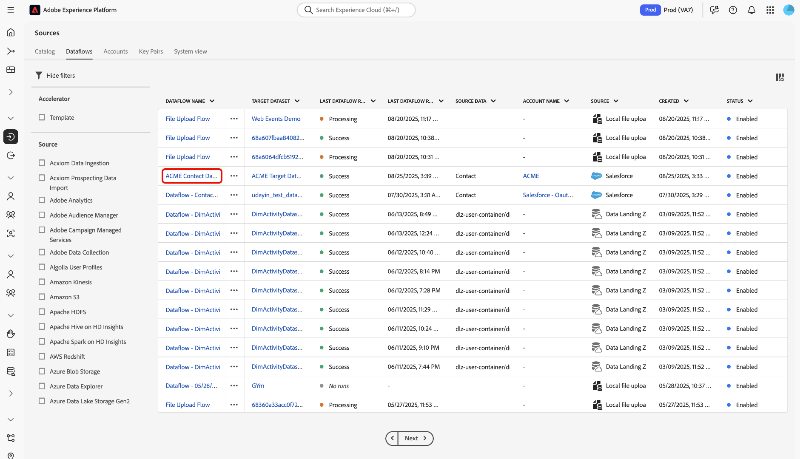
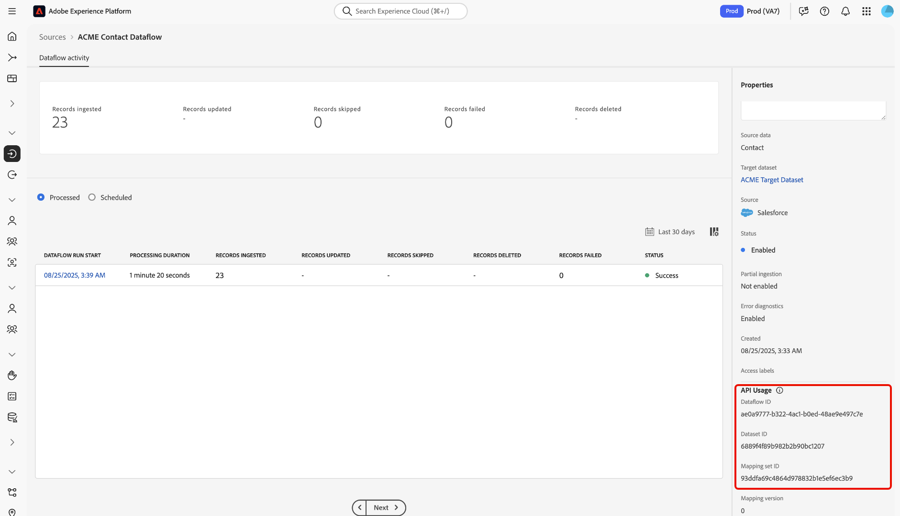

# Create a dataflow to ingest data from a CRM into Experience Platform

Read this guide to learn how to create a dataflow and ingest data to Adobe Experience Platform using the [[!DNL Flow Service] API](https://developer.adobe.com/experience-platform-apis/references/flow-service/).

## Get started

This guide requires a working understanding of the following components of Experience Platform:

* [Batch ingestion](../../../../ingestion/batch-ingestion/overview.md): Discover how you can upload large volumes of data efficiently in batches.
* [Catalog Service](../../../../catalog/datasets/overview.md): Organize and keep track of your datasets within Experience Platform.
* [Data Prep](../../../../data-prep/home.md): Transform and map your incoming data to match your schema requirements.
* [Dataflows](../../../../dataflows/home.md): Set up and manage the pipelines that move your data from sources to destinations.
* [Experience Data Model (XDM) Schemas](../../../../xdm/home.md): Structure your data using XDM schemas so it's ready for use in Experience Platform.
* [Sandboxes](../../../../sandboxes/home.md): Safely test and develop in isolated environments without affecting production data.
* [Sources](../../../home.md): Learn how to connect your external data sources to Experience Platform.

### Use Experience Platform APIs

For information on how to successfully make calls to Experience Platform APIs, read the guide on [getting started with Experience Platform APIs](../../../../landing/api-guide.md).

### Create base connection {#base}

You must have a fully authenticated source account and it's corresponding base connection ID in order to successfully create a dataflow for your source. If you do not have this ID, visit the [sources catalog](../../../home.md) for a list of sources that you can create a base connection with.

### Create a target XDM schema {#target-schema}

An Experience Data Model (XDM) schema provides a standardized way to organize and describe customer experience data within Experience Platform. To ingest your source data into Experience Platform, you must first create a target XDM schema that defines the structure and types of data you want to ingest. This schema serves as the blueprint for the Experience Platform dataset where your ingested data will reside.

A target XDM schema can be created by performing a POST request to the [Schema Registry API](https://developer.adobe.com/experience-platform-apis/references/schema-registry/). Read the following guides for detailed on steps on how to create a target XDM schema:

* [Create a schema using the API](../../../../xdm/api/schemas.md).
* [Create a schema using the UI](../../../../xdm/tutorials/create-schema-ui.md). 

Once created, the target XDM schema `$id` will be required later for your target dataset and mapping.

### Create a target dataset {#target-dataset}

A dataset is a storage and management construct for a collection of data, typically a table, that contains a schema (columns) and fields (rows). Data that is successfully ingested into Experience Platform is stored within the data lake as datasets. During this step, you can create a new dataset or use an existing dataset.

You can create a target dataset by making a POST request to the [Catalog Service API](https://developer.adobe.com/experience-platform-apis/references/catalog/), while providing the ID of the target schema within the payload. For detailed steps on how to create a target dataset, read the guide on [creating a dataset using the API](../../../../catalog/api/create-dataset.md).

>[!TIP]
>
>If you want to ingest your data to Real-Time Customer Profile, then you must ensure that both of your target XDM schemas and target dataset are enabled for Profile.

+++Select to view example

**API format**

```HTTP
POST /dataSets
```

**Request**

The following example shows how to create a target dataset that is enabled for Real-Time Customer Profile ingestion. In this request, the `unifiedProfile` property is set to `true` (under the `tags` object), which tells Experience Platform to include this dataset in Real-Time Customer Profile.

```shell
curl -X POST \
  'https://platform.adobe.io/data/foundation/catalog/dataSets' \
  -H 'Authorization: Bearer {ACCESS_TOKEN}' \
  -H 'x-api-key: {API_KEY}' \
  -H 'x-gw-ims-org-id: {ORG_ID}' \
  -H 'x-sandbox-name: {SANDBOX_NAME}' \
  -H 'Content-Type: application/json' \
  -d '{
    "name": "ACME Target Dataset",
    "schemaRef": {
      "id": "https://ns.adobe.com/{TENANT_ID}/schemas/719c4e19184402c27595e65b931a142b",
      "contentType": "application/vnd.adobe.xed+json;version=1"
    },
    "tags": {
      "unifiedProfile": [
        "enabled: true"
      ]
    }
  }'
```

| Property | Description |
| --- | --- |
| `name` | A descriptive name for your target dataset. Use a clear and unique name mto make it easier to identify and manage your dataset in future operations. |
| `schemaRef.id` | The ID of your target XDM schema. |
| `tags.unifiedProfile` | A boolean value that informs Experience Platform if the data should be ingested to Real-Time Customer Profile. |

**Response**

A successful response returns your target dataset ID. This ID is required later in order to create a target connection.

```json
[
    "@/dataSets/6889f4f89b982b2b90bc1207"
]
```

+++

## Create a source connection {#source}

A source connection defines how data is brought into Experience Platform from an external source. It specifies both the source system and the format of the incoming data, and it references a base connection that contains authentication details. Each source connection is unique to your organization.

* For file-based sources (such as cloud storages), a source connection can include settings like column delimiter, encoding type, compression type, regular expressions for file selection, and whether to ingest files recursively. 
* For table-based sources (such as databases, CRMs, and marketing automation providers), a source connection can specify details like the table name and column mappings. 

To create a source connection, make a POST request to the `/sourceConnections` endpoint of the [!DNL Flow Service] API and provide your base connection ID, connection specification ID, and path to the source data file.

**API format**

```http
POST /sourceConnections
```

**Request**

```shell
curl -X POST \
  'https://platform.adobe.io/data/foundation/flowservice/sourceConnections' \
  -H 'Authorization: Bearer {ACCESS_TOKEN}' \
  -H 'x-api-key: {API_KEY}' \
  -H 'x-gw-ims-org-id: {ORG_ID}' \
  -H 'x-sandbox-name: {SANDBOX_NAME}' \
  -H 'Content-Type: application/json' \
  -d '{
    "name": "ACME source connection",
    "baseConnectionId": "6990abad-977d-41b9-a85d-17ea8cf1c0e4",
    "description": "A source connection for ACME contact data",
    "data": {
      "format": "tabular"
    },
    "params": {
      "tableName": "Contact",
      "columns": [
        {
          "name": "TestID",
          "type": "string",
          "xdm": {
            "type": "string"
          }
        },
        {
          "name": "Name",
          "type": "string",
          "xdm": {
            "type": "string"
          }
        },
        {
          "name": "Datefield",
          "type": "string",
          "meta:xdmType": "date-time",
          "xdm": {
            "type": "string",
            "format": "date-time"
          }
        }
      ]
    },
    "connectionSpec": {
      "id": "cfc0fee1-7dc0-40ef-b73e-d8b134c436f5",
      "version": "1.0"
    }
  }'

```

| Property | Description |
| --- | --- |
| `name` | A descriptive name for your source connection. Use a clear and unique name mto make it easier to identify and manage your connection in future operations. |
| `description` | An optional description that you can add to provide additional information your source connection. |
| `baseConnectionId` | The `id` of your base connection. You can retrieve this ID by authenticating your source to Experience Platform using the [!DNL Flow Service] API. |
| `data.format` | The format of your data. Set this value to `tabular` for table-based sources (such as databases, CRMs, and marketing automation providers).|
| `params.tableName` | The name of the table in your source account that you want to ingest to Experience Platform. |
| `params.columns` | The specific table columns of data that you want to ingest to Experience Platform. |
| `connectionSpec.id` | The connection specification ID of the source you are using. |

**Response**

A successful response returns the ID of your source connection. This ID is required in order to create a dataflow and ingest your data.

```json
{
    "id": "b7581b59-c603-4df1-a689-d23d7ac440f3",
    "etag": "\"ef05d265-0000-0200-0000-6019e0080000\""
}
```

## Create a target connection {#target}

A target connection represents the connection to the destination where the ingested data lands in. To create a target connection, you must provide the fixed connection spec ID associated to the Data Lake. This connection spec ID is: `c604ff05-7f1a-43c0-8e18-33bf874cb11c`.

**API format**

```http
POST /targetConnections
```

**Request**

```shell
curl -X POST \
  'https://platform.adobe.io/data/foundation/flowservice/targetConnections' \
  -H 'Authorization: Bearer {ACCESS_TOKEN}' \
  -H 'x-api-key: {API_KEY}' \
  -H 'x-gw-ims-org-id: {ORG_ID}' \
  -H 'x-sandbox-name: {SANDBOX_NAME}' \
  -H 'Content-Type: application/json' \
  -d '{
      "name": "ACME target connection",
      "description": "ACME target connection",
      "data": {
          "schema": {
              "id": "https://ns.adobe.com/{TENANT_ID}/schemas/52b59140414aa6a370ef5e21155fd7a686744b8739ecc168",
              "version": "application/vnd.adobe.xed-full+json;version=1"
          }
      },
      "params": {
          "dataSetId": "6889f4f89b982b2b90bc1207"
      },
      "connectionSpec": {
          "id": "c604ff05-7f1a-43c0-8e18-33bf874cb11c",
          "version": "1.0"
      }
    }'
```

| Property | Description |
| --- | --- |
| `name` | A descriptive name for your target connection. Use a clear and unique name mto make it easier to identify and manage your connection in future operations. |
| `description` |  An optional description that you can add to provide additional information your target connection. |
| `data.schema.id` | The ID of your target XDM schema. |
| `params.dataSetId` | The ID of your target dataset. |
| `connectionSpec.id` | The connection specification ID of data lake. This ID is fixed: `c604ff05-7f1a-43c0-8e18-33bf874cb11c`. |

## Mapping {#mapping}

Next, you must map your source data to the target schema that your target dataset adheres to. To create a mapping, make a POST request to the `mappingSets` endpoint of the [[!DNL Data Prep] API](https://developer.adobe.com/experience-platform-apis/references/data-prep/), provide your target XDM schema ID and the details of the mapping sets you want to create.

**API format**

```http
POST /mappingSets
```

**Request**

```shell
curl -X POST \
  'https://platform.adobe.io/data/foundation/conversion/mappingSets' \
  -H 'Authorization: Bearer {ACCESS_TOKEN}' \
  -H 'x-api-key: {API_KEY}' \
  -H 'x-gw-ims-org-id: {ORG_ID}' \
  -H 'x-sandbox-name: {SANDBOX_NAME}' \
  -H 'Content-Type: application/json' \
  -d '{
      "version": 0,
      "xdmSchema": "https://ns.adobe.com/{TENANT_ID}/schemas/52b59140414aa6a370ef5e21155fd7a686744b8739ecc168",
      "xdmVersion": "1.0",
      "id": null,
      "mappings": [
          {
              "destinationXdmPath": "_id",
              "sourceAttribute": "TestID",
              "identity": false,
              "identityGroup": null,
              "namespaceCode": null,
              "version": 0
          },
          {
              "destinationXdmPath": "person.name.fullName",
              "sourceAttribute": "Name",
              "identity": false,
              "identityGroup": null,
              "namespaceCode": null,
              "version": 0
          },
          {
              "destinationXdmPath": "person.birthDate",
              "sourceAttribute": "Datefield",
              "identity": false,
              "identityGroup": null,
              "namespaceCode": null,
              "version": 0
          }
      ]
  }'
```

| Property | Description |
| -------- | ----------- |
| `xdmSchema` | The `$id` of the target XDM schema. |

**Response**

A successful response returns details of the newly created mapping including its unique identifier (`id`). This ID is required in a later step to create a dataflow.

```json
{
    "id": "93ddfa69c4864d978832b1e5ef6ec3b9",
    "version": 0,
    "createdDate": 1612309018666,
    "modifiedDate": 1612309018666,
    "createdBy": "{CREATED_BY}",
    "modifiedBy": "{MODIFIED_BY}"
}
```

## Retrieve dataflow specifications {#flow-specs}

Before you can create a dataflow, you must first retrieve the dataflow specifications that correspond with your source. To retrieve this information, make a GET request to the `/flowSpecs` endpoint of the [!DNL Flow Service] API.

**API format**

```http
GET /flowSpecs?property=name=="{NAME}"
```

| Query Parameter | Description |
| --- | --- |
| `property=name=="{NAME}"` | The name of your dataflow specification. <ul><li>For file-based sources (such as cloud storage), set this value to `CloudStorageToAEP`.</li><li>For table-based sources (such as databases, CRMs, and marketing automation providers), set this value to `CRMToAEP`.</li></ul> |

**Request**

```shell
curl -X GET \
  'https://platform.adobe.io/data/foundation/flowservice/flowSpecs?property=name=="CRMToAEP"' \
  -H 'x-api-key: {API_KEY}' \
  -H 'x-gw-ims-org-id: {ORG_ID}' \
  -H 'x-sandbox-name: {SANDBOX_NAME}'
```

**Response**

A successful response returns the details of the dataflow specification responsible for bringing data from your source into Experience Platform. The response includes the unique flow spec `id` required to create a new dataflow. 

To ensure you are using the correct dataflow specification, check the `items.sourceConnectionSpecIds` array in the response. Confirm that the connection spec ID for your source is included in this list.

+++Select to view

```json
{
    "items": [
        {
            "id": "14518937-270c-4525-bdec-c2ba7cce3860",
            "name": "CRMToAEP",
            "providerId": "0ed90a81-07f4-4586-8190-b40eccef1c5a",
            "version": "1.0",
            "sourceConnectionSpecIds": [
                "3416976c-a9ca-4bba-901a-1f08f66978ff",
                "38ad80fe-8b06-4938-94f4-d4ee80266b07",
                "d771e9c1-4f26-40dc-8617-ce58c4b53702",
                "3c9b37f8-13a6-43d8-bad3-b863b941fedd",
                "cc6a4487-9e91-433e-a3a3-9cf6626c1806",
                "3000eb99-cd47-43f3-827c-43caf170f015",
                "26d738e0-8963-47ea-aadf-c60de735468a",
                "74a1c565-4e59-48d7-9d67-7c03b8a13137",
                "cfc0fee1-7dc0-40ef-b73e-d8b134c436f5",
                "4f63aa36-bd48-4e33-bb83-49fbcd11c708",
                "cb66ab34-8619-49cb-96d1-39b37ede86ea",
                "eb13cb25-47ab-407f-ba89-c0125281c563",
                "1f372ff9-38a4-4492-96f5-b9a4e4bd00ec",
                "37b6bf40-d318-4655-90be-5cd6f65d334b",
                "a49bcc7d-8038-43af-b1e4-5a7a089a7d79",
                "a8b6a1a4-5735-42b4-952c-85dce0ac38b5",
                "6a8d82bc-1caf-45d1-908d-cadabc9d63a6",
                "aac9bbd4-6c01-46ce-b47e-51c6f0f6db3f",
                "8e6b41a8-d998-4545-ad7d-c6a9fff406c3",
                "ecde33f2-c56f-46cc-bdea-ad151c16cd69",
                "09182899-b429-40c9-a15a-bf3ddbc8ced7",
                "0479cc14-7651-4354-b233-7480606c2ac3",
                "d6b52d86-f0f8-475f-89d4-ce54c8527328",
                "a8f4d393-1a6b-43f3-931f-91a16ed857f4",
                "fcad62f3-09b0-41d3-be11-449d5a621b69",
                "ea1c2a08-b722-11eb-8529-0242ac130003",
                "35d6c4d8-c9a9-11eb-b8bc-0242ac130003",
                "b2e08744-4f1a-40ce-af30-7abac3e23cf3",
                "2acf109f-9b66-4d5e-bc18-ebb2adcff8d5",
                "2fa8af9c-2d1a-43ea-a253-f00a00c74412",
                "e9d7ec6b-0873-4e57-ad21-b3a7c65e310b"
            ],
            "targetConnectionSpecIds": [
                "c604ff05-7f1a-43c0-8e18-33bf874cb11c"
            ],
            "optionSpec": {
                "name": "OptionSpec",
                "spec": {
                    "$schema": "http://json-schema.org/draft-07/schema#",
                    "type": "object",
                    "properties": {
                        "errorDiagnosticsEnabled": {
                            "title": "Error diagnostics.",
                            "description": "Flag to enable detailed and sample error diagnostics summary.",
                            "type": "boolean",
                            "default": false
                        },
                        "partialIngestionPercent": {
                            "title": "Partial ingestion threshold.",
                            "description": "Percentage which defines the threshold of errors allowed before the run is marked as failed.",
                            "type": "number",
                            "exclusiveMinimum": 0
                        }
                    }
                }
            },
            "transformationSpecs": [
                {
                    "name": "Copy",
                    "spec": {
                        "$schema": "http://json-schema.org/draft-07/schema#",
                        "type": "object",
                        "properties": {
                            "deltaColumn": {
                                "type": "object",
                                "properties": {
                                    "name": {
                                        "type": "string"
                                    },
                                    "dateFormat": {
                                        "type": "string"
                                    },
                                    "timezone": {
                                        "type": "string"
                                    }
                                },
                                "required": [
                                    "name"
                                ]
                            }
                        },
                        "required": [
                            "deltaColumn"
                        ]
                    }
                },
                {
                    "name": "Mapping",
                    "spec": {
                        "$schema": "http://json-schema.org/draft-07/schema#",
                        "type": "object",
                        "description": "defines various params required for different mapping from source to target",
                        "properties": {
                            "mappingId": {
                                "type": "string"
                            },
                            "mappingVersion": {
                                "type": "string"
                            }
                        }
                    }
                }
            ],
            "scheduleSpec": {
                "name": "PeriodicSchedule",
                "type": "Periodic",
                "spec": {
                    "$schema": "http://json-schema.org/draft-07/schema#",
                    "type": "object",
                    "properties": {
                        "startTime": {
                            "description": "epoch time",
                            "type": "integer"
                        },
                        "frequency": {
                            "type": "string",
                            "enum": [
                                "once",
                                "minute",
                                "hour",
                                "day",
                                "week"
                            ]
                        },
                        "interval": {
                            "type": "integer"
                        },
                        "backfill": {
                            "type": "boolean",
                            "default": true
                        }
                    },
                    "required": [
                        "startTime",
                        "frequency"
                    ],
                    "if": {
                        "properties": {
                            "frequency": {
                                "const": "once"
                            }
                        }
                    },
                    "then": {
                        "allOf": [
                            {
                                "not": {
                                    "required": [
                                        "interval"
                                    ]
                                }
                            },
                            {
                                "not": {
                                    "required": [
                                        "backfill"
                                    ]
                                }
                            }
                        ]
                    },
                    "else": {
                        "required": [
                            "interval"
                        ],
                        "if": {
                            "properties": {
                                "frequency": {
                                    "const": "minute"
                                }
                            }
                        },
                        "then": {
                            "properties": {
                                "interval": {
                                    "minimum": 15
                                }
                            }
                        },
                        "else": {
                            "properties": {
                                "interval": {
                                    "minimum": 1
                                }
                            }
                        }
                    }
                }
            },
            "runSpec": {
                "name": "ProviderParams",
                "spec": {
                    "$schema": "http://json-schema.org/draft-07/schema#",
                    "type": "object",
                    "description": "defines various params required for creating flow run.",
                    "properties": {
                        "startTime": {
                            "type": "integer",
                            "description": "An integer that defines the start time of the run. The value is represented in Unix epoch time."
                        },
                        "windowStartTime": {
                            "type": "integer",
                            "description": "An integer that defines the start time of the window against which data is to be pulled. The value is represented in Unix epoch time."
                        },
                        "windowEndTime": {
                            "type": "integer",
                            "description": "An integer that defines the end time of the window against which data is to be pulled. The value is represented in Unix epoch time."
                        },
                        "deltaColumn": {
                            "type": "object",
                            "description": "The delta column is required to partition the data and separate newly ingested data from historic data.",
                            "properties": {
                                "name": {
                                    "type": "string"
                                },
                                "dateFormat": {
                                    "type": "string"
                                },
                                "timezone": {
                                    "type": "string"
                                }
                            },
                            "required": [
                                "name"
                            ]
                        }
                    },
                    "required": [
                        "startTime",
                        "windowStartTime",
                        "windowEndTime",
                        "deltaColumn"
                    ]
                }
            },
            "attributes": {
                "recordTypeEnabled": true,
                "defaultRecordType": "profile",
                "isSourceFlow": true,
                "flacValidationSupported": true,
                "isDraftModeSupported": true,
                "frequency": "batch",
                "notification": {
                    "category": "sources",
                    "flowRun": {
                        "enabled": true
                    }
                }
            },
            "permissionsInfo": {
                "manage": [
                    {
                        "@type": "lowLevel",
                        "name": "EnterpriseSource",
                        "permissions": [
                            "write"
                        ]
                    }
                ],
                "view": [
                    {
                        "@type": "lowLevel",
                        "name": "EnterpriseSource",
                        "permissions": [
                            "read"
                        ]
                    }
                ]
            }
        }
    ]
}
```

+++

## Create a dataflow {#dataflow}

A dataflow is a configured pipeline that transfers data across Experience Platform services. It defines how data is ingested from external sources (like databases, cloud storage, or APIs), processed, and routed to target datasets. These datasets are then used by services such as Identity Service, Real-Time Customer Profile, and Destinations for activation and analysis.

To create a dataflow, you must have values for the following items:

* [Source connection ID](#source)
* [Target connection ID](#target)
* [Mapping ID](#mapping)
* [Dataflow specification ID](#flow-specs)

During this step, you can use the following parameters in `scheduleParams` to configure an ingestion schedule for your dataflow:

| Scheduling parameter | Description |
| --- | --- |
| `startTime` | The epoch time (in seconds) when the dataflow should start. |
| `frequency` | The frequency of ingestion. Configure frequency to indicate how often the dataflow should run. You can set your frequency to: <ul><li>`once`: Set your frequency to `once` to create a one-time ingestion. Configurations for interval and backfill are unavailable when creating a one-time ingestion dataflow. By default, the scheduling frequency is set to once.</li><li>`minute`: Set your frequency to `minute` to schedule your dataflow to ingest data on a per-minute basis.</li><li>`hour`: Set your frequency to `hour` to schedule your dataflow to ingest data on a per-hour basis.</li><li>`day`: Set your frequency to `day` to schedule your dataflow to ingest data on a per-day basis.</li><li>`week`: Set your frequency to `week` to schedule your dataflow to ingest data on a per-week basis.</li></ul> |
| `interval` | The interval between consecutive ingestions (required for all frequencies except `once`). Configure the interval setting to establish the time frame between every ingestion. For example, if you set your frequency to day and configure the interval to 15, then your dataflow will run every 15 days. You cannot set the interval to zero. The minimum accepted interval value for each frequency is as follows:<ul><li>`once`: n/a</li><li>`minute`: 15</li><li>`hour`: 1</li><li>`day`: 1</li><li>`week`: 1</li></ul> |
| `backfill` | Indicates whether to ingest historical data prior to the `startTime`. |

{style="table-layout:auto"}


**API format**

```http
POST /flows
```

**Request**

```shell
curl -X POST \
  'https://platform.adobe.io/data/foundation/flowservice/flows' \
  -H 'x-api-key: {API_KEY}' \
  -H 'x-gw-ims-org-id: {ORG_ID}' \
  -H 'x-sandbox-name: {SANDBOX_NAME}' \
  -H 'Content-Type: application/json' \
  -d '{
      "name": "ACME Contact Dataflow",
      "description": "A dataflow for ACME contact data",
      "flowSpec": {
          "id": "14518937-270c-4525-bdec-c2ba7cce3860",
          "version": "1.0"
      },
      "sourceConnectionIds": [
          "b7581b59-c603-4df1-a689-d23d7ac440f3"
      ],
      "targetConnectionIds": [
          "320f119a-5ac1-4ab1-88ea-eb19e674ea2e"
      ],
      "transformations": [
          {
              "name": "Copy",
              "params": {
                  "deltaColumn": {
                      "name": "Datefield",
                      "dateFormat": "YYYY-MM-DD",
                      "timezone": "UTC"
                  }
              }
          },
          {
              "name": "Mapping",
              "params": {
                  "mappingId": "93ddfa69c4864d978832b1e5ef6ec3b9",
                  "mappingVersion": 0
              }
          }
      ],
      "scheduleParams": {
          "startTime": "1612310466",
          "frequency":"minute",
          "interval":"15",
          "backfill": "true"
      }
  }'
```

| Property | Description |
| --- | --- |
| `name` | A descriptive name for your dataflow. Use a clear and unique name mto make it easier to identify and manage your dataflow in future operations.  |
| `description` | An optional description that you can add to provide additional information your dataflow. |
| `flowSpec.id` | The ID of the flow specification that corresponds to your source. |
| `sourceConnectionIds` | The source connection ID that was generated in an earlier step. |
| `targetConnectionIds` | The target connection ID that was generated in an earlier step. |
| `transformations.params.deltaColum` | The designated column used to differentiate between new and existing data. Incremental data will be ingested based on the timestamp of selected column. The supported format for `deltaColumn` is `yyyy-MM-dd HH:mm:ss`. For [!DNL Microsoft Dynamics], the supported format for `deltaColumn` is `yyyy-MM-ddTHH:mm:ssZ`. |
| `transformations.params.deltaColumn.dateFormat` | The date format to follow for delta column. |
| `transformations.params.deltaColumn.timeZone` | The time zone to use when interpreting the values in the delta column. |
| `transformations.params.mappingId` | The mapping ID that was generated in an earlier step. |
| `scheduleParams.startTime` | The start time for the dataflow in epoch time (seconds since Unix epoch). Determines when the dataflow will begin its first run. |
| `scheduleParams.frequency` | The frequency at which the dataflow will run. Acceptable values include: `once`, `minute`, `hour`, `day`, or `week`. |
| `scheduleParams.interval` | The interval between consecutive dataflow runs, based on the selected frequency. Must be a non-zero integer. For example, an interval of `15` with frequency `minute` means the dataflow runs every 15 minutes. |
| `scheduleParams.backfill` | A boolean value (`true` or `false`) that determines whether to ingest historical data (backfill) when the dataflow is first created. |

{style="table-layout:auto"}

**Response**

A successful response returns the ID (`id`) of the newly created dataflow.

```json
{
    "id": "ae0a9777-b322-4ac1-b0ed-48ae9e497c7e",
    "etag": "\"770029f8-0000-0200-0000-6019e7d40000\""
}
```

### Use the UI to validate your API workflow

You can use the Experience Platform user interface to validate the creation of your dataflow. Navigate to the *[!UICONTROL Sources]* catalog in the Experience Platform UI and then select **[!UICONTROL Dataflows]** from the header tabs. Next, use the [!UICONTROL Dataflow Name] column and locate the dataflow that you created using the [!DNL Flow Service] API. 



You can further validate your dataflow through the [!UICONTROL Dataflow activity] interface. Use the right rail to view the [!UICONTROL API usage] information of your dataflow. This section displays the same dataflow ID, dataset ID, and mapping ID that was generated during the dataflow creation process in [!DNL Flow Service].



## Next steps

This tutorial guided you through the process of creating a dataflow in Experience Platform using the [!DNL Flow Service] API. You learned how to create and configure the necessary components, including the target XDM schema, dataset, source connection, target connection, and the dataflow itself. By following these steps, you can automate the ingestion of data from external sources into Experience Platform, enabling downstream services such as Real-Time Customer Profile and Destinations to leverage your ingested data for advanced use cases.

### Monitor your dataflow

Once your dataflow has been created, you can monitor the data that is being ingested through it to view information on ingestion rates, success, and errors. For more information on how to monitor dataflow, visit the tutorial on [monitoring accounts and dataflows](../../../../dataflows/ui/monitor-sources.md).

### Update your dataflow

To update configurations for your dataflows scheduling, mapping, and general information, visit the tutorial on [updating sources dataflows](../../api/update-dataflows.md).

## Delete your dataflow

You can delete dataflows that are no longer necessary or were incorrectly created using the **[!UICONTROL Delete]** function available in the **[!UICONTROL Dataflows]** workspace. For more information on how to delete dataflows, visit the tutorial on [deleting dataflows](../../api/delete.md).