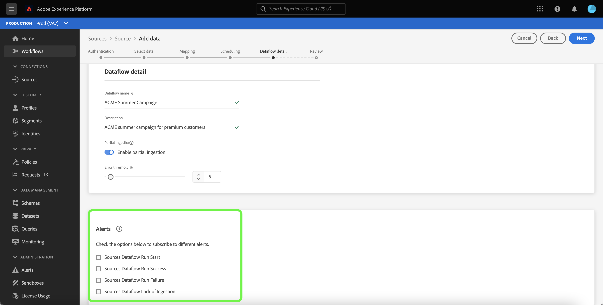
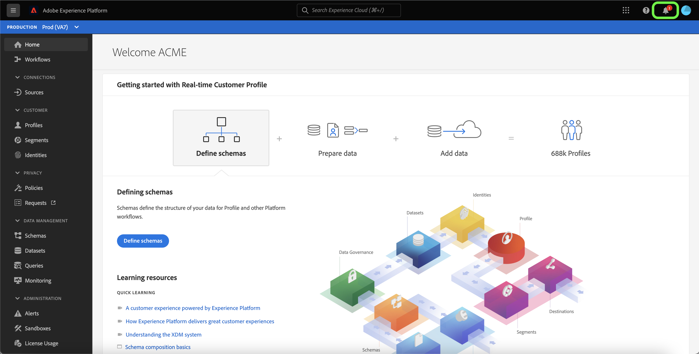
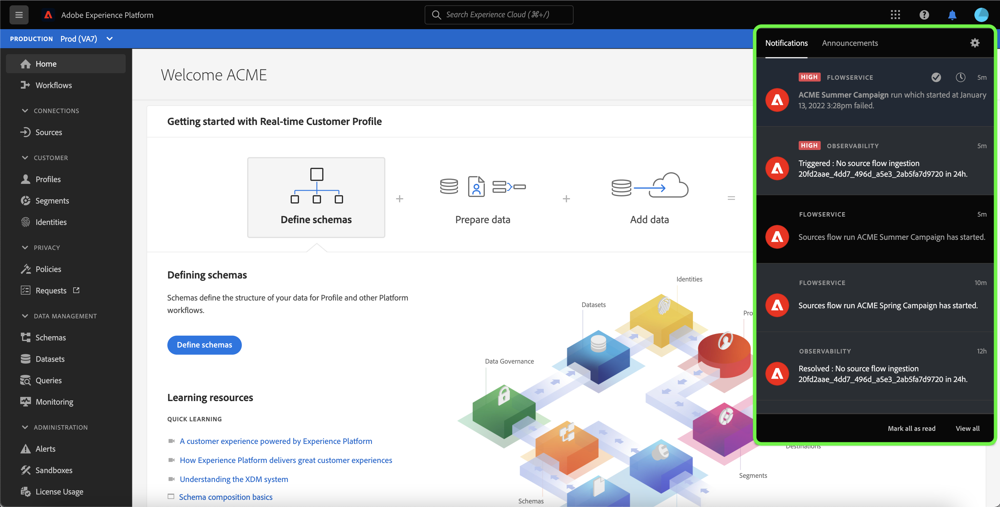
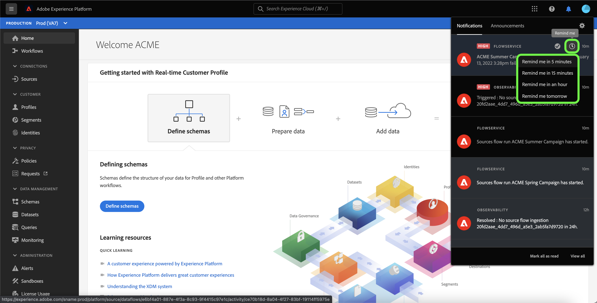
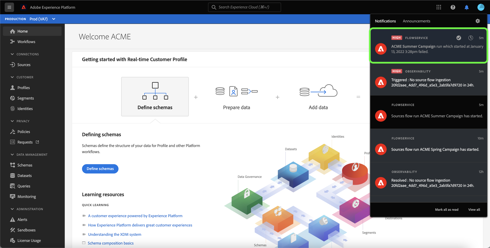
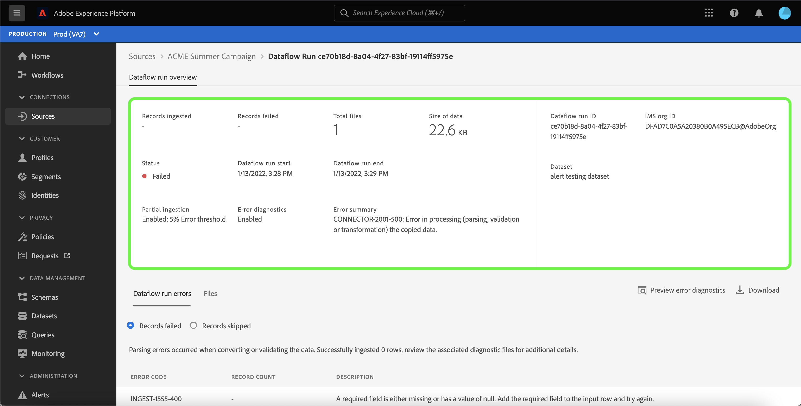
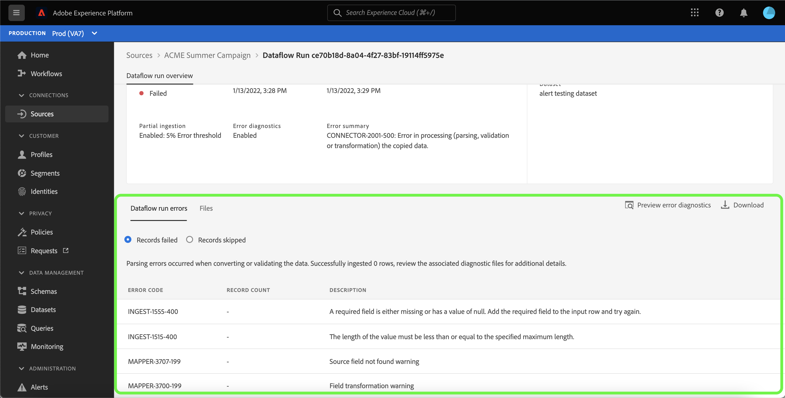
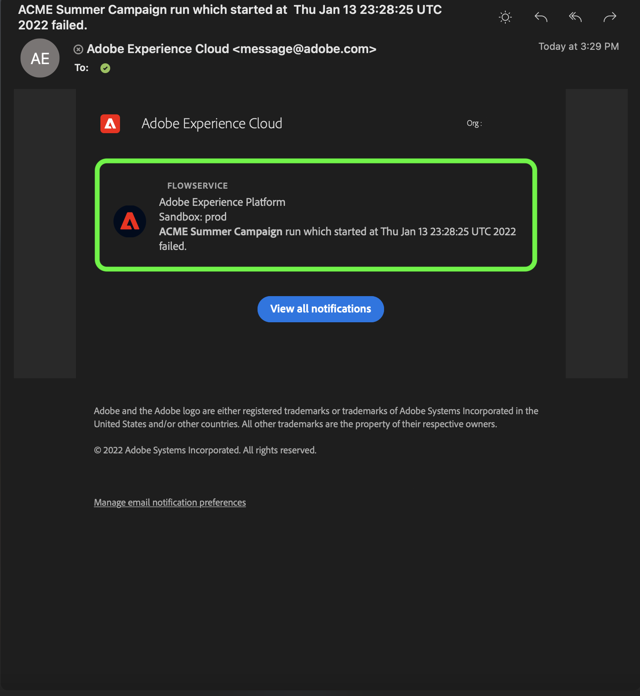
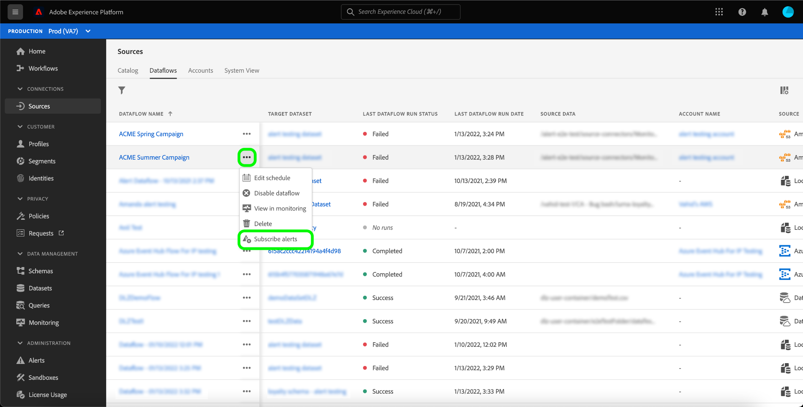
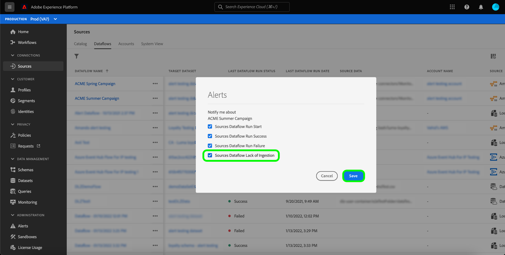

# Subscribe to alerts for sources dataflows in the UI

>[!NOTE]
>
>Alerts are not supported in non-production sandboxes. In order to subscribe to alerts, you must ensure that you are using a production sandbox.

Adobe Experience Platform allows you to subscribe to event-based alerts regarding Adobe Experience Platform activities. Alerts reduce or eliminate the need to poll the [[!DNL Observability Insights] API](../../../observability/api/overview.md) in order to check if a job has completed, if a certain milestone within a workflow has been reached, or if any errors have occurred.

You can subscribe to alerts when creating a dataflow to receive alert messages regarding the status, success, or failure of your flow run.

This document provides steps on how to subscribe receive alerts messages for your sources dataflows.

## Getting started

This document requires a working understanding of the following components of Adobe Experience Platform:

* [Sources](../../home.md): [!DNL Experience Platform] allows data to be ingested from various sources while providing you with the ability to structure, label, and enhance incoming data using [!DNL Platform] services.
* [Observability](../../../observability/home.md): [!DNL Observability Insights] allows you to monitor Platform activities through the use of statistical metrics and event notifications.
  * [Alerts](../../../observability/alerts/overview.md): When a certain set of conditions in your Platform operations is reached (such as a potential problem when the system breaches a threshold), Platform can deliver alert messages to any users in your organization who have subscribed to them.

## Subscribe to alerts in the UI {#subscribe-sources-alerts}

>[!CONTEXTUALHELP]
>id="platform_sources_alerts_subscribe"
>title="Subscribe to sources alerts"
>abstract="Alerts allow you to receive notifications based on the status of your sources dataflows. You can set alert notifications to get updates if your dataflow has started, is successful, has failed, or did not ingest any data."
>text="Learn more in documentation"

>[!IMPORTANT]
>
>You must enable instant notifications of emails for your Platform account in order to receive email-based alert notifications for your dataflows.

You can enable alerts for your dataflows during the [!UICONTROL Dataflow detail] step of the sources workflow in the sources workspace.

The available alerts for sources dataflows are:

>[!NOTE]
>
>Streaming sources are currently not supported by alerts. You can only subscribe to alert notifications for batch sources. 

| Alerts | Description |
| --- | --- |
| Sources Flow Run Start | This alert sends you a message when your source dataflow has started. |
| Sources Flow Run Success | This alert sends you a message when data from your source is successfully ingested to Platform. |
| Sources Flow Run Failure | This alert sends you a message if an error occurs in your dataflow. |

Select the alerts you would like to subscribe to and then select **[!UICONTROL Next]** to review and finish your dataflow.

See the following guides for detailed steps on creating a sources dataflow in the UI:

* [Advertising](./dataflow/advertising.md)
* [Cloud storage](./dataflow/batch/cloud-storage.md)
* [CRM](./dataflow/crm.md)
* [Database](./dataflow/databases.md)
* [E-commerce](./dataflow/ecommerce.md)
* [Local files](./create/local-system/local-file-upload.md)
* [Marketing automation](./dataflow/marketing-automation.md)
* [Payments](./dataflow/payments.md)
* [Protocols](./dataflow/protocols.md)

## Receive alerts

Once your dataflow runs, you can receive alerts through the UI or by email.

### In the UI

Alerts are represented in the UI by a notification icon in the top header of the Platform UI. Select the notification icon to see specific alert messages regarding your dataflows.

The notifications panel appears, displaying a list of status updates on the dataflow that you created.

You can hover on an alert message to mark them as read or you can select the clock icon to set future reminders on the status of your dataflow.

Select the alert message to see specific information on your dataflow.

The [!UICONTROL Dataflow run overview] page appears. The upper half of the screen displays an overview on your dataflow, including information on its attributes, corresponding dataflow run ID, and high-level error summary.

The lower half of the page displays any [!UICONTROL Dataflow run errors] that ocurred during the dataflow run stage. From here, you can preview error diagnostics or use the [[!DNL Data Access] API](https://www.adobe.io/experience-platform-apis/references/data-access/) to download error diagnostics or the file manifest that corresponds to your dataflow.

For more information on handling dataflow errors, see the guide on [monitoring sources dataflows in the UI](../../../dataflows/ui/monitor-sources.md).

### By email

Alerts for your dataflows are also delivered to you by email. Select the dataflow name in the email body to see more information on your dataflow.

Similar to the UI alert, the [!UICONTROL Dataflow run overview] page appears, providing you with an interface to investigate any errors associated with your dataflow.

## Subscribe and unsubscribe to alerts

You can subscribe to more alerts or unsubscribe from established alerts for an existing dataflow in the [!UICONTROL Dataflows] page. Locate the dataflow you create from the list and then select the ellipses (`...`) to see a dropdown menu of options. Next, select **[!UICONTROL Subscribe alerts]** to modify the alert settings of your dataflow.

A pop-up window appears, providing you with a list of sources alerts. Select any alerts you want to subscribe to or deselect alerts that you want to unsubscribe from. When finished, select **[!UICONTROL Save]**.

## Next steps

This document provided a step-by-step guide on how to subscribe to in-context alerts for your sources dataflows. For more information, see the [alerts UI guide](../../../observability/alerts/ui.md).