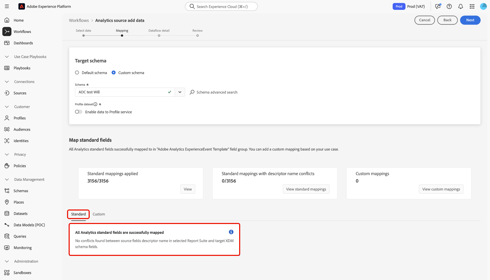
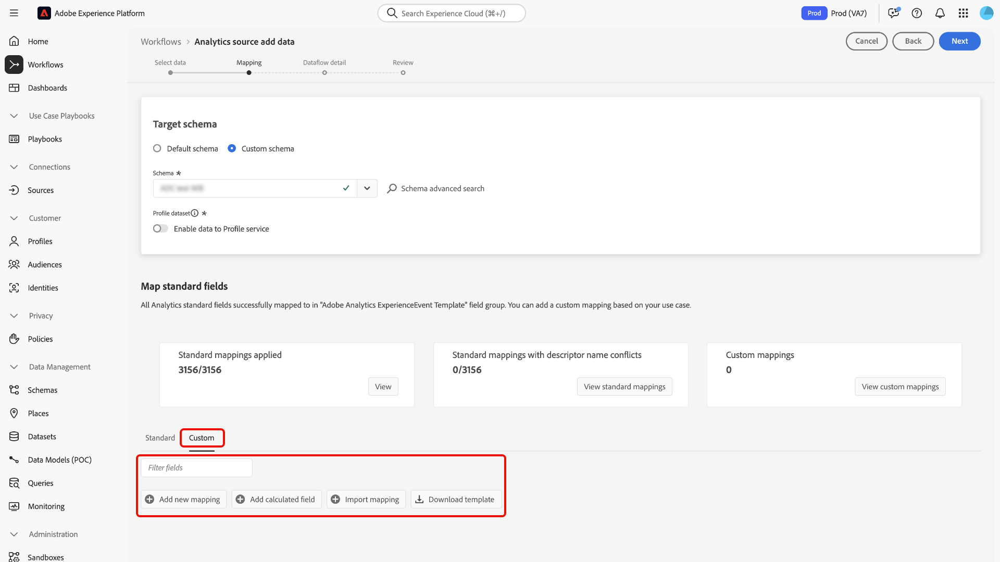
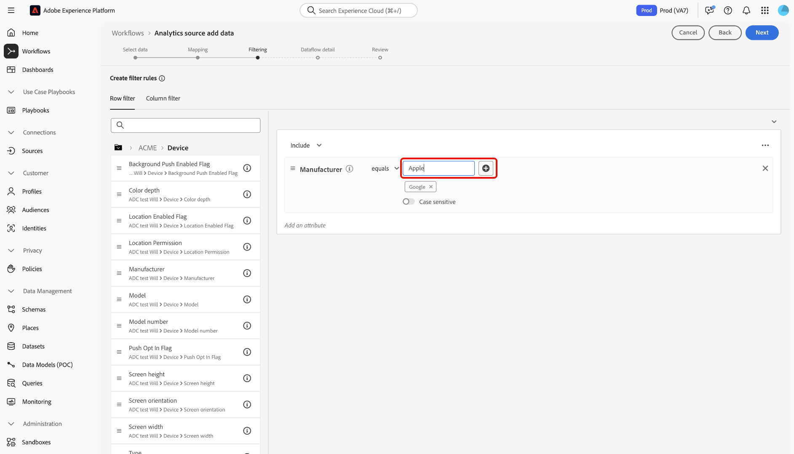
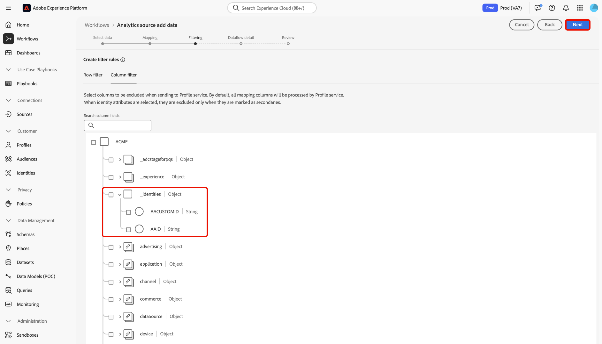

# Connect Adobe Analytics to Experience Platform

Read this guide to learn how to use the Adobe Analytics source to ingest your Analytics report suite data into Adobe Experience Platform.

## Get started

This tutorial requires a working understanding of the following components of Experience Platform:

* [Experience Data Model (XDM) System](../../../../../xdm/home.md): The standardized framework by which Experience Platform organizes customer experience data.
* [Real-Time Customer Profile](../../../../../profile/home.md): Provides a unified, real-time consumer profile based on aggregated data from multiple sources.
* [Sandboxes](../../../../../sandboxes/home.md): Experience Platform provides virtual sandboxes which partition a single Experience Platform instance into separate virtual environments to help develop and evolve digital experience applications.

### Key terminology

It is important to understand the following key terms used throughout this document:

* **Standard attribute**: Standard attributes are any attribute that is pre-defined by Adobe. They contain the same meaning for all customers and are available in the Analytics source data and Analytics schema field groups.
* **Custom attribute**: Custom attributes are any attribute in the custom variable hierarchy in Analytics. Custom attributes are used within an Adobe Analytics implementation to capture specific information into a report suite, and they can differ in their use from report suite to report suite. Custom attributes include eVars, props, and lists. See the following [Analytics documentation on conversion variables](https://experienceleague.adobe.com/docs/analytics/admin/admin-tools/conversion-variables/conversion-var-admin.html) for more information on eVars.
* **Any attribute in Custom field groups**: Attributes that originate from field groups created by customers are all user-defined and are considered to be neither standard nor custom attributes.

## Navigate the sources catalog

>[!NOTE]
>
>When you create an Analytics source dataflow in a production sandbox, two dataflows are created:
>
>* A dataflow that does a 13-month backfill of historical report suite data into data lake. This dataflow ends when the backfill is complete.
>* A dataflow flow which sends live data to data lake and to [!DNL Real-Time Customer Profile]. This dataflow runs continuously.

In the Experience Platform UI, select **[!UICONTROL Sources]** from the left navigation to access the the [!UICONTROL Sources] workspace. In the *[!UICONTROL Adobe applications]* category, select the Adobe Analytics card and then select **[!UICONTROL Add data]**.

## Select data

>[!IMPORTANT]
>
>* The report suites listed on the screen may come from various regions. You are responsible for understanding the limitations and obligations of your data and how you use that data in Adobe Experience Platform cross regions. Please ensure this is permitted by your company.
>* Data from multiple report suites can be enabled for Real-Time Customer Profile only if there are no data conflicts, such as two custom properties (eVars, lists and props) that have different meaning.

A report suite is a container of data that forms the basis of Analytics reporting. An organization can have many report suites, each containing different datasets. 

You can ingest report suites from any region (United States, United Kingdom, or Singapore) as long as they are mapped to the same organization as the Experience Platform sandbox instance in which the source connection is being created in. A report suite can be ingested using only a single active dataflow. If a report suite is grey and cannot be selected, then it has already been ingested, either in the sandbox that you are using or in a different sandbox.

Multiple in-bound connections can be made to bring multiple report suites into the same sandbox. If the report suites have differing schemas for variables (such as eVars or events), they should be mapped to specific fields in the custom field groups and avoid data conflicts using [Data Prep](../../../../../data-prep/ui/mapping.md). Report suites can only be added to a single sandbox.

Select **[!UICONTROL Report suite]** and then use the *[!UICONTROL Analytics source add data]* interface to navigate through the list and identify the Analytics report suite that you want to ingest to Experience Platform. Alternatively, you can search for a specific report suite. Select **[!UICONTROL Next]** to proceed.

<!---Analytics Report Suites can be configured for one sandbox at a time. To import the same Report Suite into a different sandbox, the dataset flow will have to be deleted and instantiated again via configuration for a different sandbox.--->

## Mapping {#mapping}

>[!IMPORTANT]
>
>Data Prep transformations may add latency to the overall dataflow. The additional latency added varies based on the complexity of the transformation logic. 

Before you can map your Analytics data to target XDM schema, you must first determine whether you are using a default schema or a custom schema.

>[!BEGINTABS]

>[!TAB Default schema]

A default schema creates a new schema on your behalf. This newly created schema contains the [!DNL Adobe Analytics ExperienceEvent Template] field group. To use a default schema, select **[!UICONTROL Default schema]**.

>[!TAB Custom schema]

With a custom schema, you can choose any available schema for your Analytics data, as long as that schema has the [!DNL Adobe Analytics ExperienceEvent Template] field group. To use a custom schema, select **[!UICONTROL Custom schema]**.

>[!ENDTABS]

Use the *[!UICONTROL Mapping]* interface to map source fields to their appropriate target schema fields. You can map custom variables to new schema field groups and apply calculations as supported by Data Prep. Select a target schema to start the mapping process.

>[!TIP]
>
>Only schemas that have the [!DNL Adobe Analytics ExperienceEvent Template] field group are displayed in the schema selection menu. Other schemas are omitted. If there are no appropriate schemas available for your report suite data, then you must create a new schema. For detailed steps on creating schemas, see the guide on [creating and editing schemas in the UI](../../../../../xdm/ui/resources/schemas.md).

You can refer to the [!UICONTROL Map standard fields] panel for metrics on your [!UICONTROL Standard mappings applied]. [!UICONTROL Standard mappings with descriptor name conflicts], and [!DNL Custom mappings].

| Map standard fields | Description |
| --- | --- |
| [!UICONTROL Standard mappings applied] | The [!UICONTROL Standard mappings applied] panel displays the total number of mapped attributes. Standard mappings refer to mappings between all attributes in the source Analytics data and corresponding attributes in Analytics field group. These are pre-mapped and cannot be edited. |
| [!UICONTROL Standard mappings with descriptor name conflicts] | The [!UICONTROL Standard mappings with descriptor name conflicts] panel refers to the number of mapped attributes that contain name conflicts. These conflicts appear when you are re-using a schema that already has a populated set of field descriptors from a different report suite. You can proceed with your Analytics dataflow even with name conflicts. |
| [!UICONTROL Custom mappings] | The [!UICONTROL Custom mappings] panel displays the number of mapped custom attributes, including eVars, props, and lists. Custom mappings refer to mapping between custom attributes in the source Analytics data and attributes in custom field groups included in the selected schema. |

### Standard mappings {#standard-mappings}

Experience Platform automatically detects your mapping for any name conflicts. If there are no conflicts with your mappings, select **[!UICONTROL Next]** to proceed.

>[!TIP]
>
>If there are name conflicts between your source report suite and your selected schema, you can still continue with your Analytics dataflow, acknowledging that the field descriptors will not be changed. Alternatively, you can opt to create a new schema with a blank set of descriptors.

## Custom mappings {#custom-mappings}

>[!CONTEXTUALHELP]
>id="platform_analytics_import_mapping"
>title="Download Template"
>abstract="Download the csv template to perform the mapping offline."
>additional-url="https://experienceleague.adobe.com/en/docs/experience-platform/data-prep/ui/mapping#import-mapping" text="Import mapping"

You can use Data Prep functions to add new custom mappings or calculated fields for custom attributes. To add custom mappings, select **[!UICONTROL Custom]**.

* **[!UICONTROL Filter fields]**: Use the [!UICONTROL Filter fields] text input to filter for specific mapping fields in your mappings.
* **[!UICONTROL Add new mapping]**: To add a new source field and target field mapping, select **[!UICONTROL Add new mapping]**.
* **[!UICONTROL Add calculated field]**: If needed, you can select **[!UICONTROL Add calculated field]** to create a new calculated field for your mappings.
* **[!UICONTROL Import mapping]**: You can reduce the manual configuration time of your data ingestion process and limit mistakes by using the import mapping functionality of Data Prep. Select **[!UICONTROL Import mapping]** to import mappings from an existing flow or from an exported file. For more information, read [the guide on importing and exporting mappings](../../../../../data-prep/ui/mapping.md#import-mapping).
* **[!UICONTROL Download template]**: You can also download a CSV copy of your mappings and configure your mappings in your local device. Select **[!UICONTROL Download template]** to download a CSV copy of your mappings. You must ensure that you are using only the fields that are provided in your source file and target schema. 

Refer to the following documentation for more information on Data Prep.

* [Data Prep overview](../../../../../data-prep/home.md)
* [Data Prep mapping functions](../../../../../data-prep/functions.md)
* [Add calculated fields](../../../../../data-prep/ui/mapping.md#calculated-fields)

<!-- 
To use Data Prep functions and add new mapping or calculated fields for custom attributes, select **[!UICONTROL View custom mappings]**.

Next, select **[!UICONTROL Add new mapping]**.

Depending on your needs, you can select either **[!UICONTROL Add new mapping]** or **[!UICONTROL Add calculated field]** from the options that appear. 

An empty mapping set appears. Select the mapping icon to add a source field.

You can use the interface to navigate through the source schema structure and identify the new source field that you want to use. Once you have selected the source field that you want to map, select **[!UICONTROL Select]**.

Next, select the mapping icon under [!UICONTROL Target Field] to map your selected source field to its appropriate target field.

Similar to the source schema, you can use the interface to navigate through the target schema structure and select the target field you want to map to. Once you have selected the appropriate target field, select **[!UICONTROL Select]**.

With your custom mapping set completed, select **[!UICONTROL Next]** to proceed.

 -->

## Filtering for Real-Time Customer Profile {#filtering-for-profile}

>[!CONTEXTUALHELP]
>id="platform_data_prep_analytics_filtering"
>title="Create filter rules"
>abstract="Define row and column-level filtering rules when sending data to Real-Time Customer Profile. Use row-level filtering to apply conditions and dictate which data to **include for Profile ingestion**. Use column-level filtering to select the columns of data that you want to **exclude for Profile ingestion**. Filtering rules do not apply to data sent to data lake."

Once you have completed mappings for your Analytics report suite data, you can apply filtering rules and conditions to selectively include or exclude data from ingestion to the Real-Time Customer Profile. Support for filtering is only available for Analytics data and data is only filtered prior to entering [!DNL Profile.] All data are ingested into the data lake.

>[!BEGINSHADEBOX]

**Additional information on Data Prep and filtering Analytics data for Real-Time Customer Profile**

* You can use the filtering functionality for data that is going to Profile, but not for data going to data lake.
* You can use filtering for live data, but you cannot filter backfill data.
  * The Analytics source does not backfill data into Profile.
* If you utilize Data Prep configurations during the initial setup of an Analytics flow, those changes are applied to the automatic 13-month backfill as well. 
  * However, this is not the case for filtering because filtering is reserved only for live data.
* Data Prep is applied to both streaming and batch ingestion paths. If you modify an existing Data Prep configuration, those changes are then applied to new incoming data across both streaming and batch ingestion pathways. 
  * However, any Data Prep configurations do not apply to data that has already been ingested into Experience Platform, regardless of whether it is streaming or batch data.
* Standard attributes from Analytics are always mapped automatically. Therefore, you cannot apply transformations to standard attributes.
  * However, you can filter out standard attributes as long as they are not required in Identity Service or Profile.
* You cannot use column-level filtering to filter required fields and identity fields.
* While you can filter out secondary identities, specifically AAID and AACustomID, you cannot filter out ECID.
* When a transformation error occurs, the corresponding column results in NULL.

>[!ENDSHADEBOX]

### Row-level filtering

>[!IMPORTANT]
>
>Use row-level filtering to apply conditions and dictate which data to **include for Profile ingestion**. Use column-level filtering to select the columns of data that you want to **exclude for Profile ingestion**.

You can filter data for Profile ingestion at the row-level and the column-level. Use row-level filtering to define criteria such as string contains, equals to, begins, or ends with. You can also use row-level filtering to join conditions using `AND` as well as `OR`, and negate conditions using `NOT`. 

To filter your Analytics data at the row-level, select **[!UICONTROL Row filter]** and use the left rail to navigate through the schema hierarchy and identify the schema attribute that you want to select.

Once you have identified the attribute that you want to configure, select and drag the attribute from the left rail to the filtering panel.

To configure different conditions, select **[!UICONTROL equals]** and then select a condition from the dropdown window that appears.

The list of configurable conditions include:

* [!UICONTROL equals] 
* [!UICONTROL does not equal]
* [!UICONTROL starts with] 
* [!UICONTROL ends with] 
* [!UICONTROL does not end with] 
* [!UICONTROL contains] 
* [!UICONTROL does not contain] 
* [!UICONTROL exists] 
* [!UICONTROL does not exist] 

Next, enter the values that you want to include based on the attribute that you selected. In the example below, [!DNL Apple] and [!DNL Google] are selected for ingestion as part of the **[!UICONTROL Manufacturer]** attribute.

To further specify your filtering conditions, add another attribute from the schema and then add values based on that attribute. In the example below, the **[!UICONTROL Model]** attribute is added and models such as the [!DNL iPhone 16] and [!DNL Google Pixel 9] are filtered for ingestion.

To add a new container, select the ellipses (`...`) on the top right of the filtering interface and then select **[!UICONTROL Add container]**.

Once a new container is added, select **[!UICONTROL Include]** and then select **[!UICONTROL Exclude]** from the dropdown menu. Add the attributes and values that you want to exclude, and then when finished, select **[!UICONTROL Next]**.

### Column-level filtering

Select **[!UICONTROL Column filter]** from the header to apply column-level filtering. 

The page updates into an interactive schema tree, displaying your schema attributes at the column-level. From here, you can select the columns of data that you would like to exclude from Profile ingestion. Alternatively, you can expand a column and select specific attributes for exclusion.

By default, all Analytics go to Profile and this process allows for branches of XDM data to be excluded from Profile ingestion.

### Filter secondary identities

Use a column filter to exclude secondary identities from Profile ingestion. To filter secondary identities, select **[!UICONTROL Column filter]** and then select **[!UICONTROL _identities]**.

The filter only applies when an identity is marked as secondary. If identities are selected, but an event arrives with one of the identities marked as primary, then those do not get filtered out.

### Provide dataflow details

The **[!UICONTROL Dataflow detail]** step appears, where you must provide a name and an optional description for the dataflow. Select **[!UICONTROL Next]** when finished.

### Review

The [!UICONTROL Review] step appears, allowing you to review your new Analytics dataflow before it is created. Details of the connection are grouped by categories, including:

* [!UICONTROL Connection]: Displays the source platform of the connection.
* [!UICONTROL Data type]: Displays the selected Report Suite and its corresponding Report Suite ID.

>[!TIP]
>
>Follow these best practices to avoid exceeding your license entitlements and overwhelming your total storage and data richness metrics:
>
>* Set up the Experience Event Dataset Retention Time-To-Live (TTL) in the beginning to optimize data lifecycle management and storage efficiency. For more details, see the guide on [managing Experience Event Dataset Retention in the data lake using TTL](../../../../../catalog/datasets/experience-event-dataset-retention-ttl-guide.md).
>
>* When you create an Analytics source dataflow, start by configuring the connector to ingest data only into the data lake. After confirming that the dataflow is working, you can enable profile ingestion for the dataset. This approach works best when row and column filters effectively reduce the data volume.

## Monitor your dataflow {#monitor-your-dataflow}

Once your dataflow is complete, you can use the *[!UICONTROL Dataflows]* interface to monitor the status of your Analytics dataflow.

Use the [!UICONTROL Dataset activity] interface for information on the progress of data that is being sent from Analytics to Experience Platform. The interface displays metrics such as the total of records in the previous month, the total of ingested records in the last seven days, and the size of data in the previous month.

The source instantiates two dataset flows. One flow represents backfill data and the other is for live data. Backfill data is not configured for ingestion into Real-Time Customer Profile but is sent to the data lake for analytical and data-science use-cases.

For more information on backfill, live data, and their respective latencies, read the [Analytics source overview](../../../../connectors/adobe-applications/analytics.md).

>[!NOTE]
>
>The dataset activity page does not display information about batches since the Analytics source connector is entirely managed by Adobe. You can monitor that data is flowing by looking at the metrics around ingested records.

## Delete your dataflow {#delete-dataflow}

>[!NOTE]
>
>You cannot disable an Analytics dataflow. To stop the flow of Analytics data, you must **delete** the dataflow entirely.

To delete your Analytics dataflow, select **[!UICONTROL Dataflows]** from the top header of the sources workspace. Use the dataflows page to locate the Analytics dataflow that you want to delete and then select the ellipses (`...`) beside it. Next, use the dropdown menu and select **[!UICONTROL Delete]**.

* Deleting the live Analytics dataflow will also delete its underlying dataset.
* Deleting the backfill Analytics dataflow does not delete the underlying dataset, but will stop the backfill process for its corresponding report suite. If you delete the backfill dataflow, ingested data may still be viewed through the dataset.

## Next steps and additional resources

Once the connection is created, the dataflow is automatically created to contain the incoming data and populate a dataset with your selected schema. Furthermore, data back-filling occurs and ingests up to 13 months of historical data. When the initial ingestion completes, Analytics data and be used by downstream Experience Platform services such as [!DNL Real-Time Customer Profile] and Segmentation Service. See the following documents for more details:

* [[!DNL Real-Time Customer Profile] overview](../../../../../profile/home.md)
* [[!DNL Segmentation Service] overview](../../../../../segmentation/home.md)
* [[!DNL Data Science Workspace] overview](../../../../../data-science-workspace/home.md)
* [[!DNL Query Service] overview](../../../../../query-service/home.md)

The following video is intended to support your understanding of ingesting data using the Adobe Analytics Source connector:

>[!WARNING]
>
> The [!DNL Experience Platform] UI shown in the following video is out-of-date. Please refer to the documentation above for the latest UI screenshots and functionality.

>[!VIDEO](https://video.tv.adobe.com/v/29687?quality=12&learn=on)

