# Create an Adobe Analytics source connection in the UI

This tutorial provides steps for creating an Adobe Analytics source connection in the UI to bring Adobe Analytics report suite data into Adobe Experience Platform.

## Getting started

This tutorial requires a working understanding of the following components of Experience Platform:

* [Experience Data Model (XDM) System](../../../../../xdm/home.md): The standardized framework by which Experience Platform organizes customer experience data.
* [Real-Time Customer Profile](../../../../../profile/home.md): Provides a unified, real-time consumer profile based on aggregated data from multiple sources.
* [Sandboxes](../../../../../sandboxes/home.md): Experience Platform provides virtual sandboxes which partition a single Platform instance into separate virtual environments to help develop and evolve digital experience applications.

### Key terminology

It is important to understand the following key terms used throughout this document:

* **Standard attribute**: Standard attributes are any attribute that is pre-defined by Adobe. They contain the same meaning for all customers and are available in the [!DNL Analytics] source data and [!DNL Analytics] schema field groups.
* **Custom attribute**: Custom attributes are any attribute in the custom variable hierarchy in [!DNL Analytics]. Custom attributes are used within an Adobe Analytics implementation to capture specific information into a report suite, and they can differ in their use from report suite to report suite. Custom attributes include eVars, props, and lists. See the following [[!DNL Analytics] documentation on conversion variables](https://experienceleague.adobe.com/docs/analytics/admin/admin-tools/conversion-variables/conversion-var-admin.html?lang=en) for more information on eVars.
* **Any attribute in Custom field groups**: Attributes that originate from field groups created by customers are all user-defined and are considered to be neither standard nor custom attributes.
* **Friendly names**: Friendly names are human-provided labels for custom variables in an [!DNL Analytics] implementation. See the following [[!DNL Analytics] documentation on conversion variables](https://experienceleague.adobe.com/docs/analytics/admin/admin-tools/conversion-variables/conversion-var-admin.html?lang=en) for more information on friendly names.

## Create a source connection with Adobe Analytics

In the Platform UI, select **[!UICONTROL Sources]** from the left navigation to access the [!UICONTROL Sources] workspace. The [!UICONTROL Catalog] screen displays a variety of sources that you can create an account with.

You can select the appropriate category from the catalog on the left-hand side of your screen. You can also use the search bar to narrow down the displayed sources.

Under the **[!UICONTROL Adobe applications]** category, select **[!UICONTROL Adobe Analytics]** and then select **[!UICONTROL Add data]**.

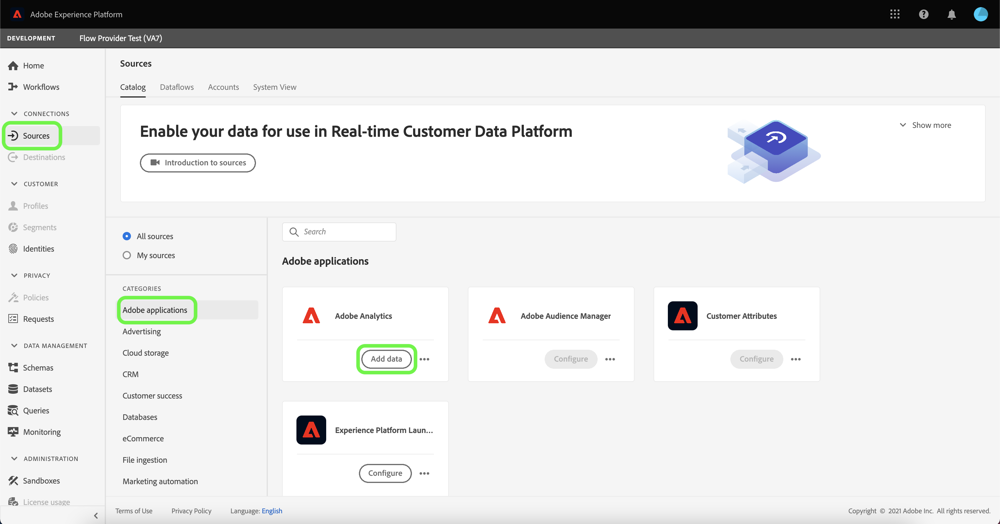

### Select data

>[!IMPORTANT]
>
>The report suites listed on the screen may come from various regions. You are responsible for understanding the limitations and obligations of your data and how you use that data in Adobe Experience Platform cross regions. Please ensure this is permitted by your company.

The **[!UICONTROL Analytics source add data]** step provides you with a list of [!DNL Analytics] report suite data to create a source connection with. 

A report suite is a container of data that forms the basis of [!DNL Analytics] reporting. An organization can have many report suites, each containing different datasets. 

You can ingest report suites from any region (United States, United Kingdom, or Singapore) as long as they are mapped to the same organization as the Experience Platform sandbox instance in which the source connection is being created in. A report suite can be ingested using only a single active dataflow. A report suite that is not selectable has already been ingested, either in the the sandbox that you are using or in a different sandbox.

Multiple in-bound connections can be made to bring multiple report suites into the same sandbox. If the report suites have differing schemas for variables (such as eVars or events), they should be mapped to specific fields in the custom field groups and avoid data conflicts using [Data Prep](../../../../../data-prep/ui/mapping.md). Report suites can only be added to a single sandbox.

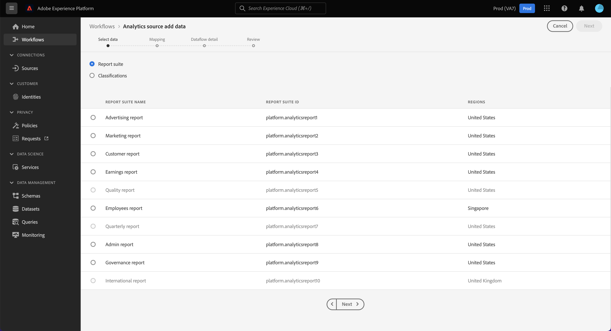

>[!NOTE]
>
>Data from multiple report suites can be enabled for Real-Time Customer Profile only if there are no data conflicts, such as two custom properties (eVars, lists and props) that have different meaning.

To create an [!DNL Analytics] source connection, select a report suite and then select **[!UICONTROL Next]** to proceed.

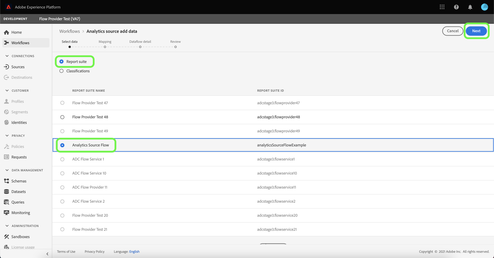

<!---Analytics Report Suites can be configured for one sandbox at a time. To import the same Report Suite into a different sandbox, the dataset flow will have to be deleted and instantiated again via configuration for a different sandbox.--->

### Mapping

>[!IMPORTANT]
>
>Data Prep transformations may add latency to the overall dataflow. The additional latency added varies based on the complexity of the transformation logic. 

Before you can map your [!DNL Analytics] data to target XDM schema, you must first select whether you are using a default schema or a custom schema.

A default schema creates a new schema on your behalf, containing the [!DNL Adobe Analytics ExperienceEvent Template] field group. To use a default schema, select **[!UICONTROL Default schema]**.

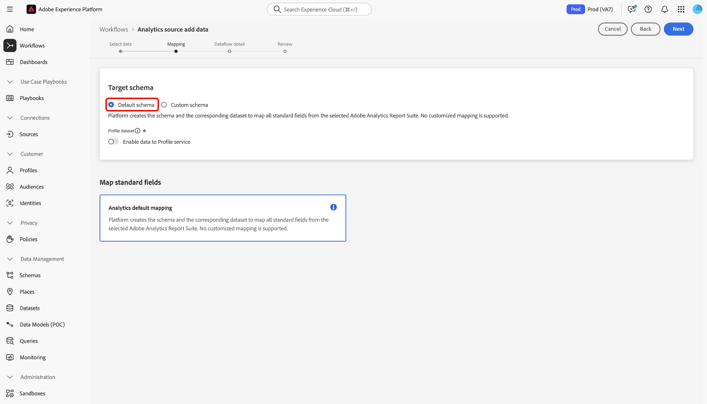

With a custom schema, you can choose any available schema for your [!DNL Analytics] data, as long as that schema has the [!DNL Adobe Analytics ExperienceEvent Template] field group. To use a custom schema, select **[!UICONTROL Custom schema]**.

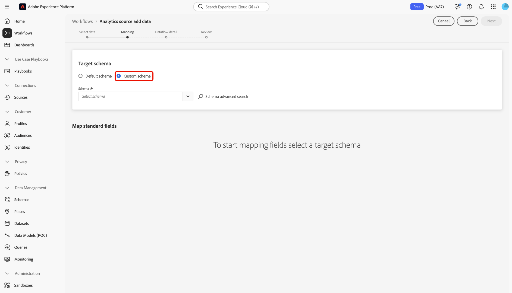

The [!UICONTROL Mapping] page provides an interface to map source fields to their appropriate target schema fields. From here, you can map custom variables to new schema field groups and apply calculations as supported by Data Prep. Select a target schema to start the mapping process.

>[!TIP]
>
>Only schemas that have the [!DNL Adobe Analytics ExperienceEvent Template] field group are displayed in the schema selection menu. Other schemas are omitted. If there are no appropriate schemas available for your Report Suite data, then you must create a new schema. For detailed steps on creating schemas, see the guide on [creating and editing schemas in the UI](../../../../../xdm/ui/resources/schemas.md).

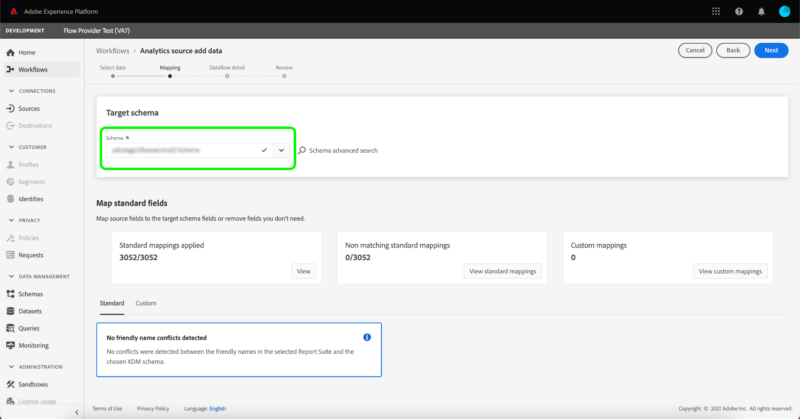

The [!UICONTROL Map standard fields] section displays panels for [!UICONTROL Standard mappings applied], [!UICONTROL Non matching standard mappings] and [!UICONTROL Custom mappings]. See the following table for specific information regarding each category:

| Map standard fields | Description |
| --- | --- |
| [!UICONTROL Standard mappings applied] | The [!UICONTROL Standard mappings applied] panel displays the total number of mapped attributes. Standard mappings refer to mapping sets between all attributes in the source [!DNL Analytics] data and corresponding attributes in [!DNL Analytics] field group. These are pre-mapped and cannot be edited. |
| [!UICONTROL Non matching standard mappings] | The [!UICONTROL Non matching standard mappings] panel refers to the number of mapped attributes that contain friendly name conflicts. These conflicts appear when you are re-using a schema that already has a populated set of field descriptors from a different Report Suite. You can proceed with your [!DNL Analytics] dataflow even with friendly name conflicts. |
| [!UICONTROL Custom mappings] | The [!UICONTROL Custom mappings] panel displays the number of mapped custom attributes, including eVars, props, and lists. Custom mappings refer to mapping sets between custom attributes in the source [!DNL Analytics] data and attributes in custom field groups included in the selected schema. |

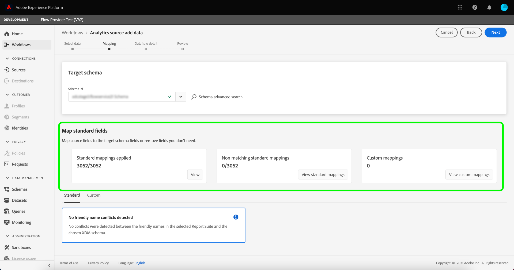

To preview the [!DNL Analytics] ExperienceEvent template schema field group, select **[!UICONTROL View]** in the [!UICONTROL Standard mappings applied] panel.

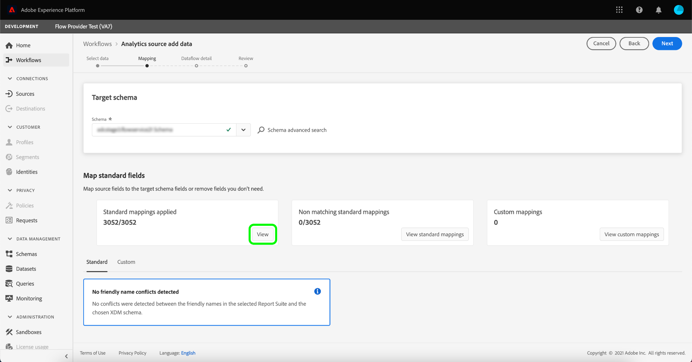

The [!UICONTROL Adobe Analytics ExperienceEvent Template Schema Field Group] page provides you with an interface to use for inspecting the structure of your schema. When finished, select **[!UICONTROL Close]**.

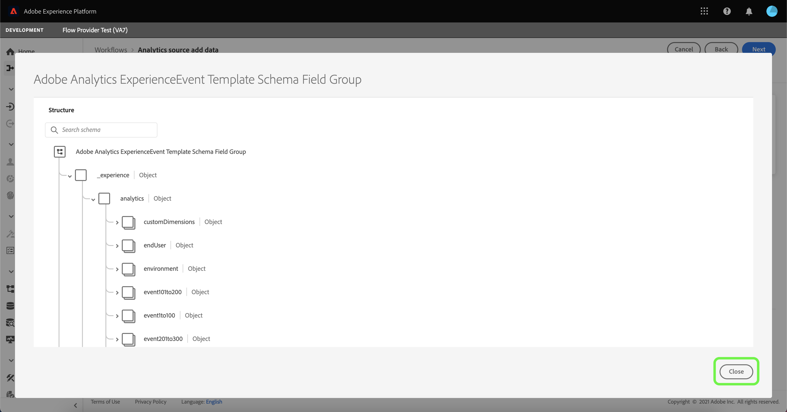

Platform automatically detects your mapping sets for any friendly name conflicts. If there are no conflicts with your mapping sets, select **[!UICONTROL Next]** to proceed.

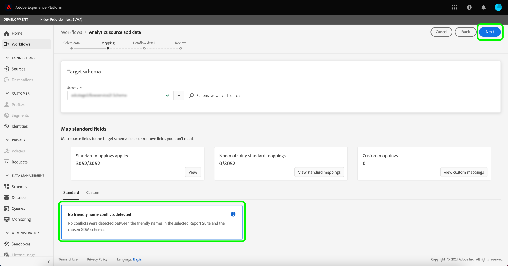

If there are friendly name conflicts between your source Report Suite and your selected schema, you can still continue with your [!DNL Analytics] dataflow, acknowledging that the field descriptors will not be changed. Alternatively, you can opt to create a new schema with a blank set of descriptors.

Select **[!UICONTROL Next]** to proceed.

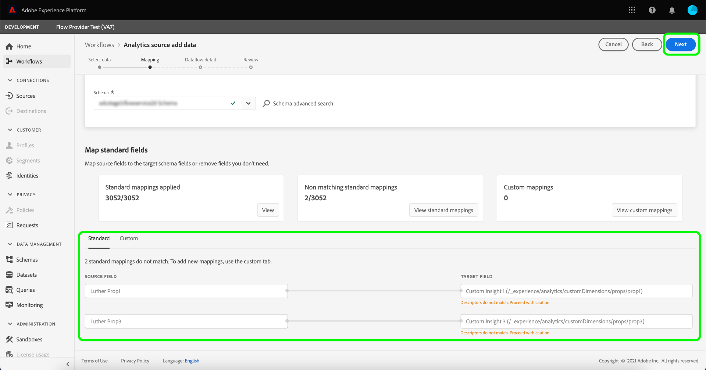

#### Custom mappings

To use Data Prep functions and add new mapping or calculated fields for custom attributes, select **[!UICONTROL View custom mappings]**.

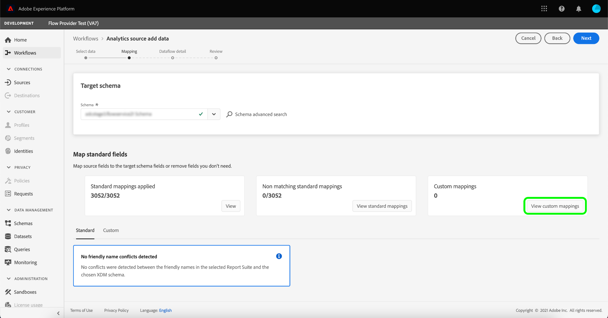

Next, select **[!UICONTROL Add new mapping]**.

Depending on your needs, you can select either **[!UICONTROL Add new mapping]** or **[!UICONTROL Add calculated field]** from the options that appear. 

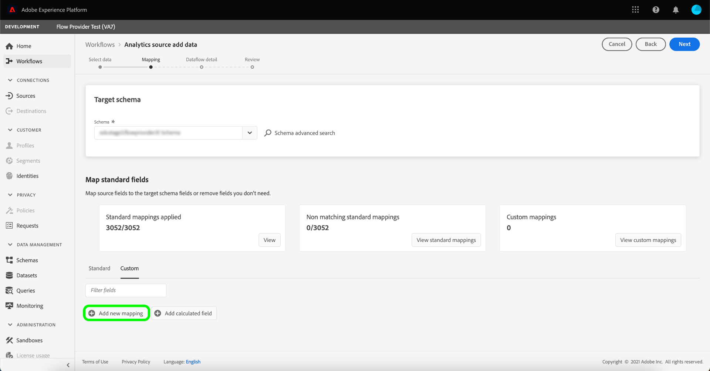

An empty mapping set appears. Select the mapping icon to add a source field.

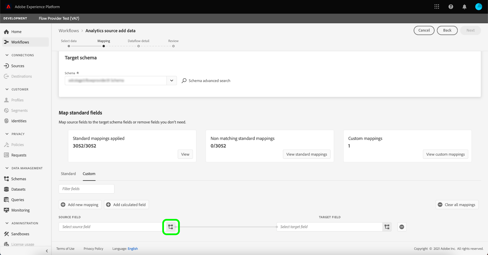

You can use the interface to navigate through the source schema structure and identify the new source field that you want to use. Once you have selected the source field that you want to map, select **[!UICONTROL Select]**.

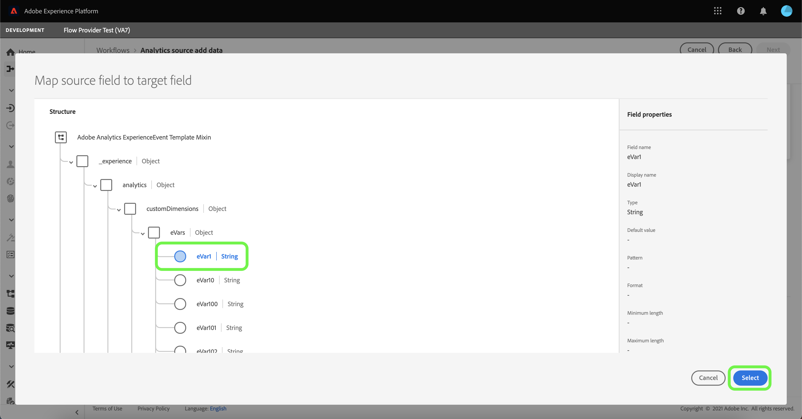

Next, select the mapping icon under [!UICONTROL Target Field] to map your selected source field to its appropriate target field.

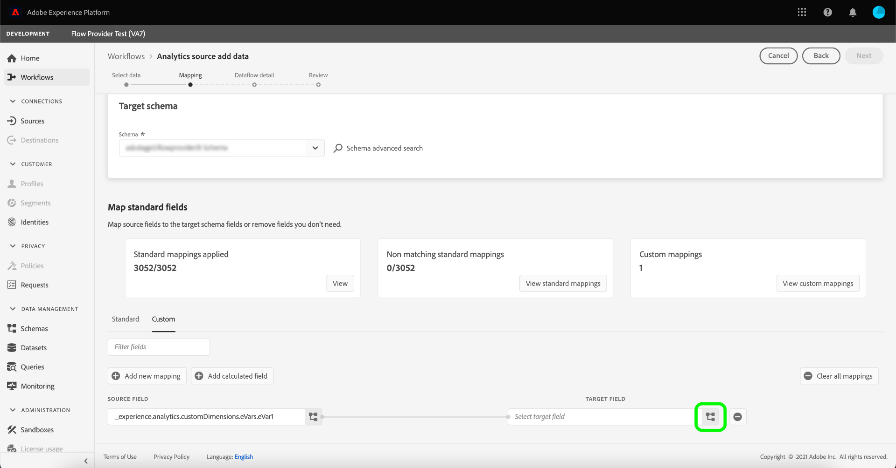

Similar to the source schema, you can use the interface to navigate through the target schema structure and select the target field you want to map to. Once you have selected the appropriate target field, select **[!UICONTROL Select]**.

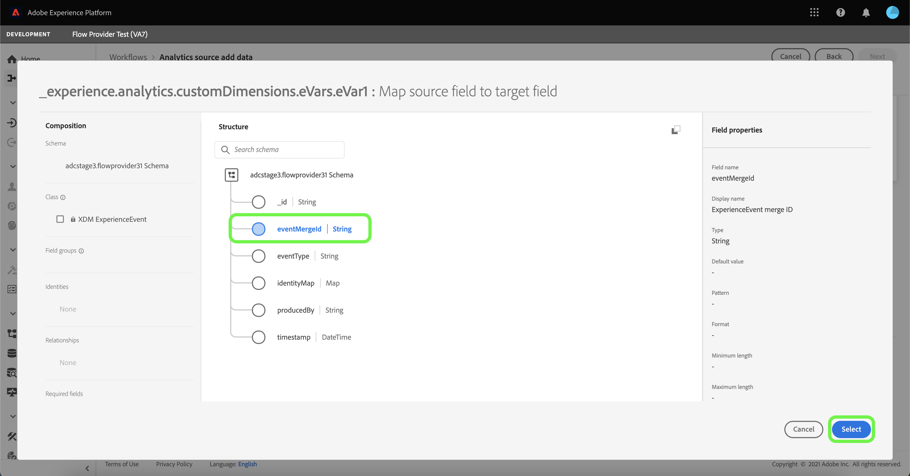

With your custom mapping set completed, select **[!UICONTROL Next]** to proceed.

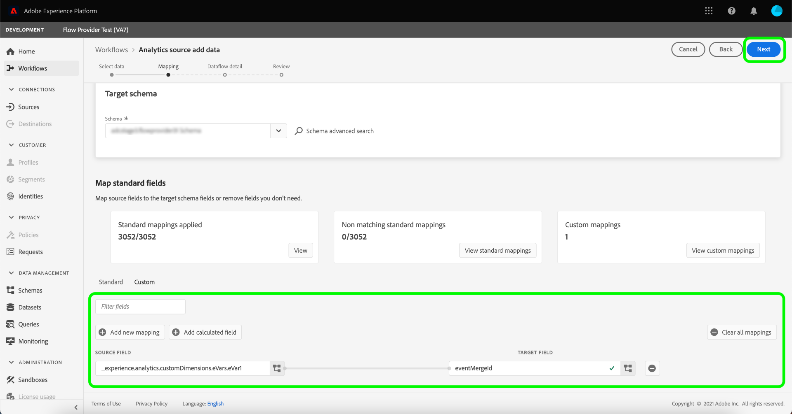

The following documentation provides further resources on understanding Data Prep, calculated fields, and mapping functions:

* [Data Prep overview](../../../../../data-prep/home.md)
* [Data Prep mapping functions](../../../../../data-prep/functions.md)
* [Add calculated fields](../../../../../data-prep/ui/mapping.md#calculated-fields)

### Filtering for Real-Time Customer Profile {#filtering-for-profile}

>[!CONTEXTUALHELP]
>id="platform_data_prep_analytics_filtering"
>title="Create filter rules"
>abstract="Define row and column-level filtering rules when sending data to Real-Time Customer Profile. Use row-level filtering to apply conditions and dictate which data to **include for Profile ingestion**. Use column-level filtering to select the columns of data that you want to **exclude for Profile ingestion**. Filtering rules do not apply to data sent to data lake."

Once you have completed mappings for your [!DNL Analytics] report suite data, you can apply filtering rules and conditions to selectively include or exclude data from ingestion to the Real-Time Customer Profile. Support for filtering is only available for [!DNL Analytics] data and data is only filtered prior to entering [!DNL Profile.] All data are ingested into the data lake.

#### Row-level filtering

>[!IMPORTANT]
>
>Use row-level filtering to apply conditions and dictate which data to **include for Profile ingestion**. Use column-level filtering to select the columns of data that you want to **exclude for Profile ingestion**.

You can filter data for [!DNL Profile] ingestion at the row-level and the column-level. Row-level filtering allows you to define criteria such as string contains, equals to, begins, or ends with. You can also use row-level filtering to join conditions using `AND` as well as `OR`, and negate conditions using `NOT`. 

To filter your [!DNL Analytics] data at the row-level, select **[!UICONTROL Row filter]**.

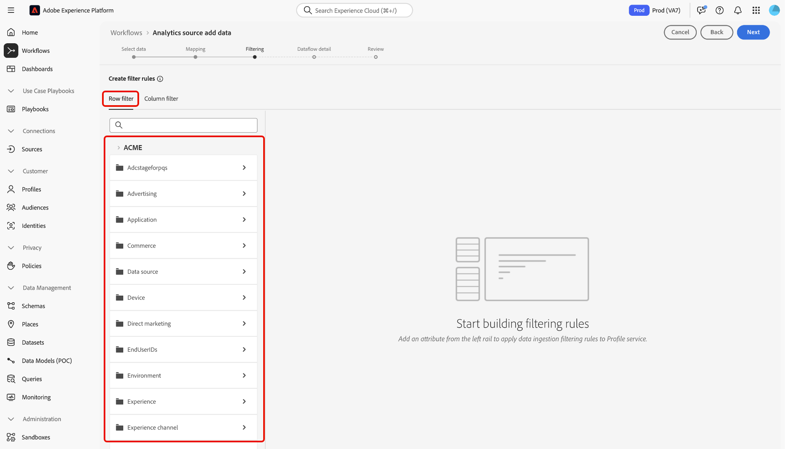

Use the left rail to navigate through the schema hierarchy and select the schema attribute of your choice to further drill down a particular schema. 

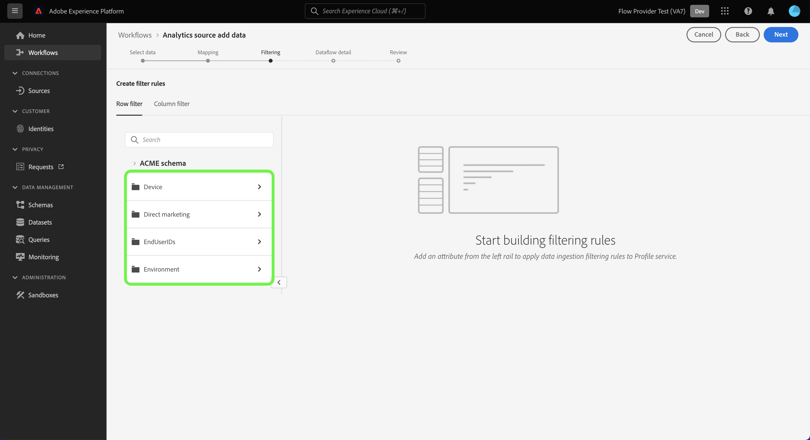

Once you have identified the attribute that you want to configure, select and drag the attribute from the left rail to the filtering panel.

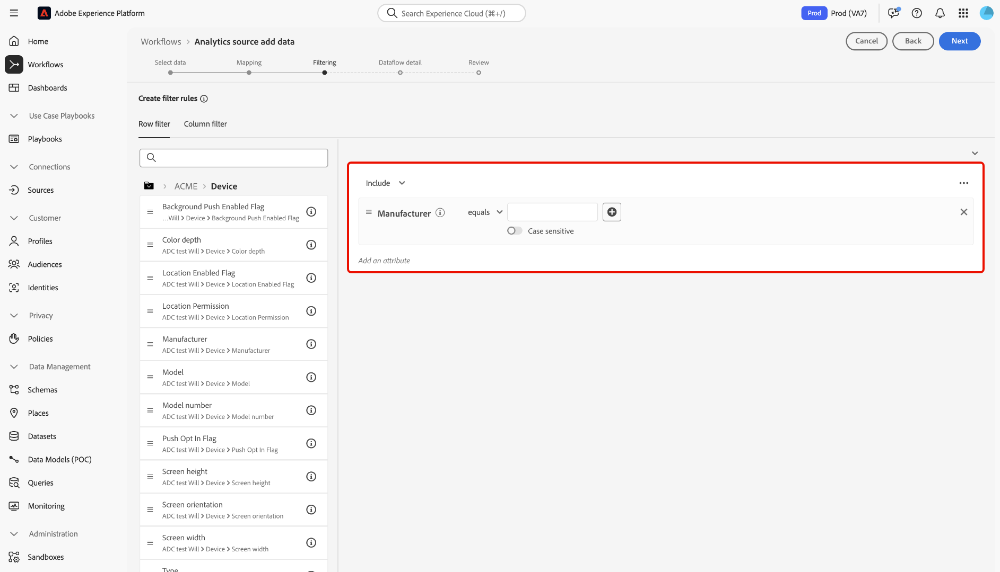

To configure different conditions, select **[!UICONTROL equals]** and then select a condition from the dropdown window that appears.

The list of configurable conditions include:

* [!UICONTROL equals] 
* [!UICONTROL does not equal]
* [!UICONTROL starts with] 
* [!UICONTROL ends with] 
* [!UICONTROL does not end with] 
* [!UICONTROL contains] 
* [!UICONTROL does not contain] 
* [!UICONTROL exists] 
* [!UICONTROL does not exist] 

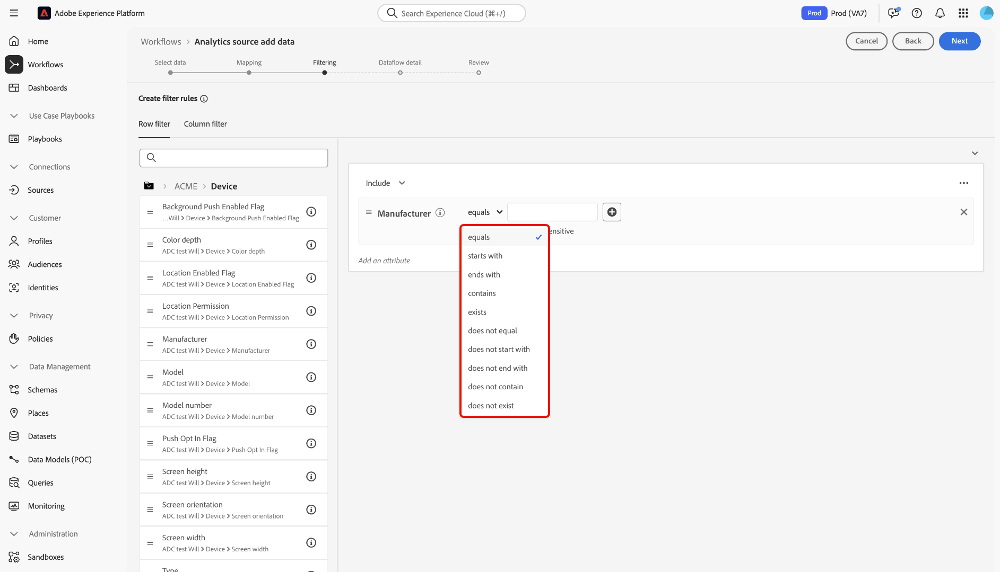

Next, enter the values that you want to include based on the attribute that you selected. In the example below, [!DNL Apple] and [!DNL Google] are selected for ingestion as part of the **[!UICONTROL Manufacturer]** attribute.

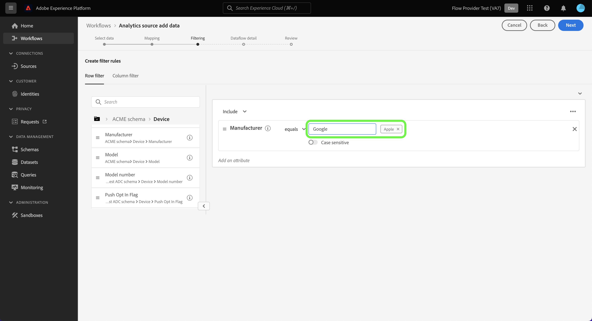

To further specify your filtering conditions, add another attribute from the schema and then add values based on that attribute. In the example below, the **[!UICONTROL Model]** attribute is added and models such as the [!DNL iPhone 13] and [!DNL Google Pixel 6] are filtered for ingestion.

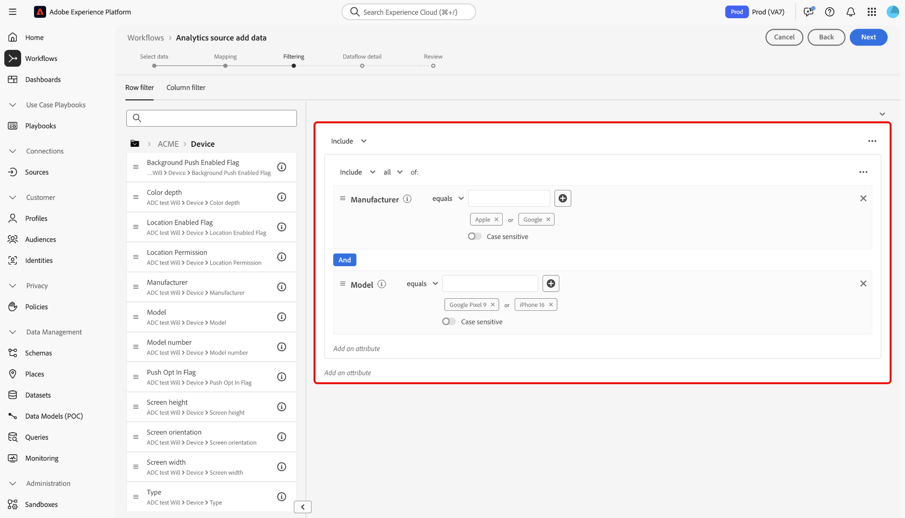

To add a new container, select the ellipses (`...`) on the top right of the filtering interface and then select **[!UICONTROL Add container]**.

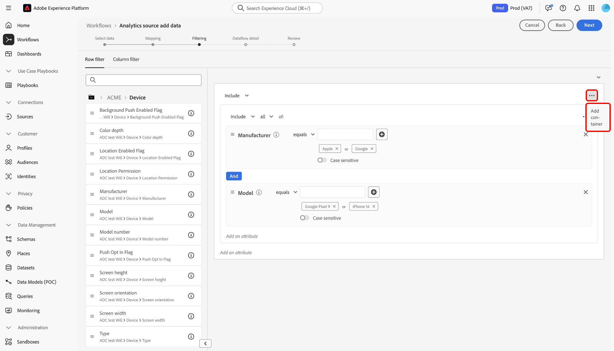

Once a new container is added, select **[!UICONTROL Include]** and then select **[!UICONTROL Exclude]** from the dropdown window that appears.

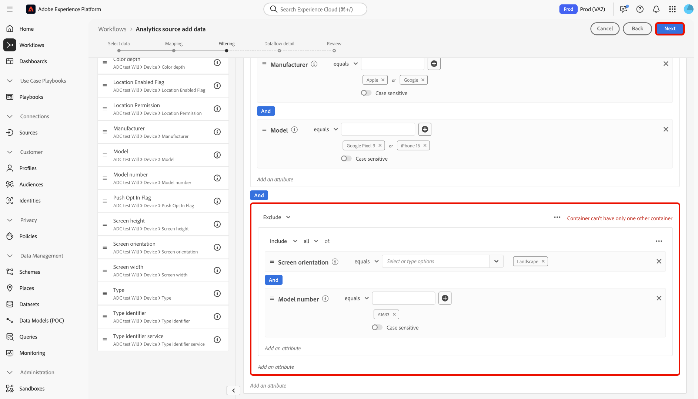

Next, complete the same process by dragging schema attributes and adding their corresponding values that you want to exclude from filtering. In the example below, the [!DNL iPhone 12], [!DNL iPhone 12 mini], and [!DNL Google Pixel 5] are all filtered from exclusion from the **[!UICONTROL Model]** attribute, landscape is excluded from the **[!UICONTROL Screen orientation]**, and model number [!DNL A1633] is excluded from **[!UICONTROL Model number]**.

When finished, select **[!UICONTROL Next]**.

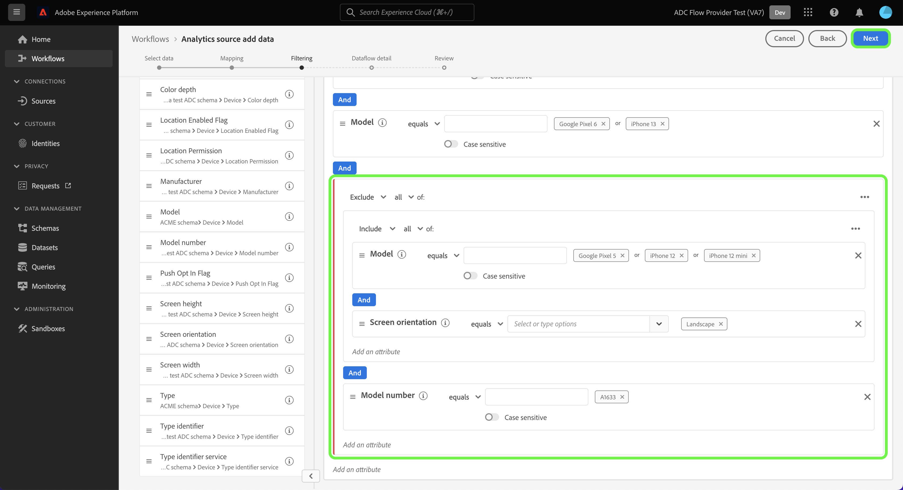

#### Column-level filtering

Select **[!UICONTROL Column filter]** from the header to apply column-level filtering. 

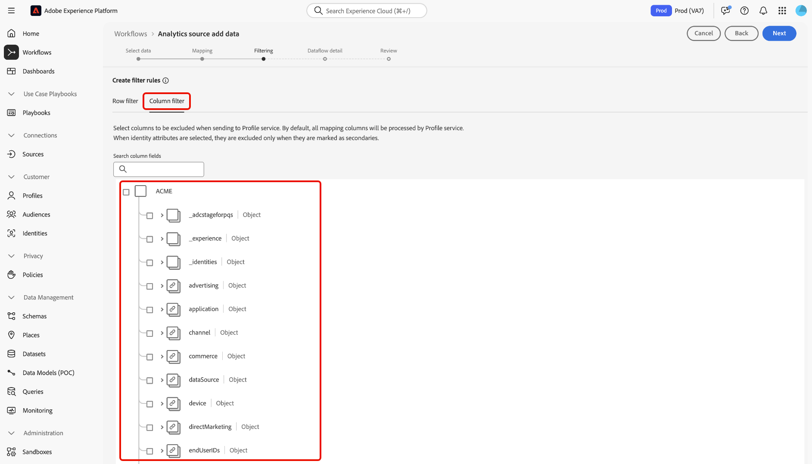

The page updates into an interactive schema tree, displaying your schema attributes at the column-level. From here, you can select the columns of data that you would like to exclude from [!DNL Profile] ingestion. Alternatively, you can expand a column and select specific attributes for exclusion.

By default, all [!DNL Analytics] go to [!DNL Profile] and this process allows for branches of XDM data to be excluded from [!DNL Profile] ingestion.

When finished, select **[!UICONTROL Next]**.

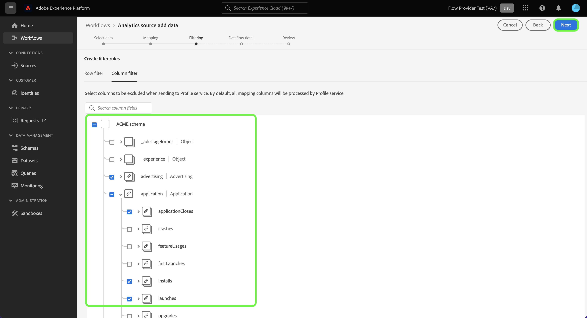

### Provide dataflow details

The **[!UICONTROL Dataflow detail]** step appears, where you must provide a name and an optional description for the dataflow. Select **[!UICONTROL Next]** when finished.

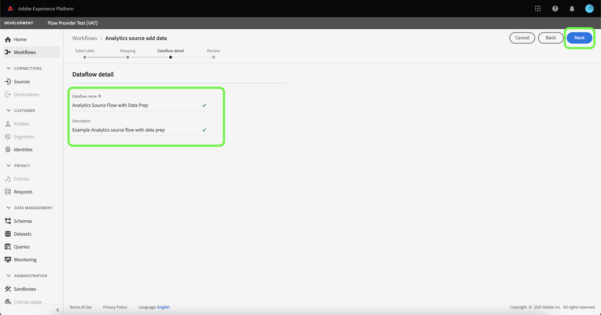

### Review

The [!UICONTROL Review] step appears, allowing you to review your new Analytics dataflow before it is created. Details of the connection are grouped by categories, including:

* [!UICONTROL Connection]: Displays the source platform of the connection.
* [!UICONTROL Data type]: Displays the selected Report Suite and its corresponding Report Suite ID.

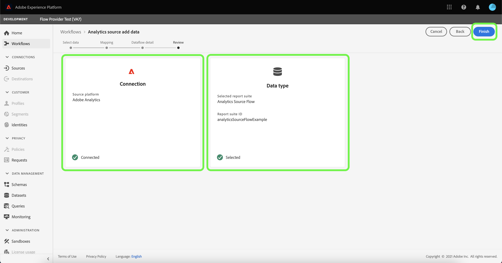

### Monitor your dataflow

Once your dataflow has been created, you can monitor the data that is being ingested through it. From the [!UICONTROL Catalog] screen, select **[!UICONTROL Dataflows]** to view a list of established flows associated with your Analytics account.

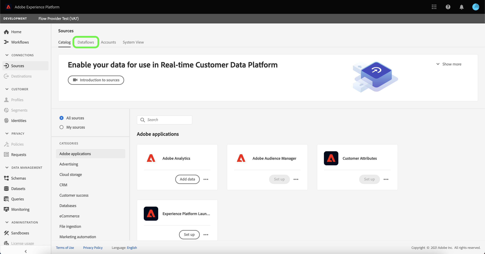

The **Dataflows** screen appears. On this page is a pair of dataset flows, including information about their name, source data, creation time, and status.

The connector instantiates two dataset flows. One flow represents backfill data and the other is for live data. Backfill data is not configured for Profile but is sent to the data lake for analytical and data-science use-cases.

For more information on backfill, live data, and their respective latencies, see the [Analytics Data Connector overview](../../../../connectors/adobe-applications/analytics.md).

Select the dataset flow you wish to view from the list.

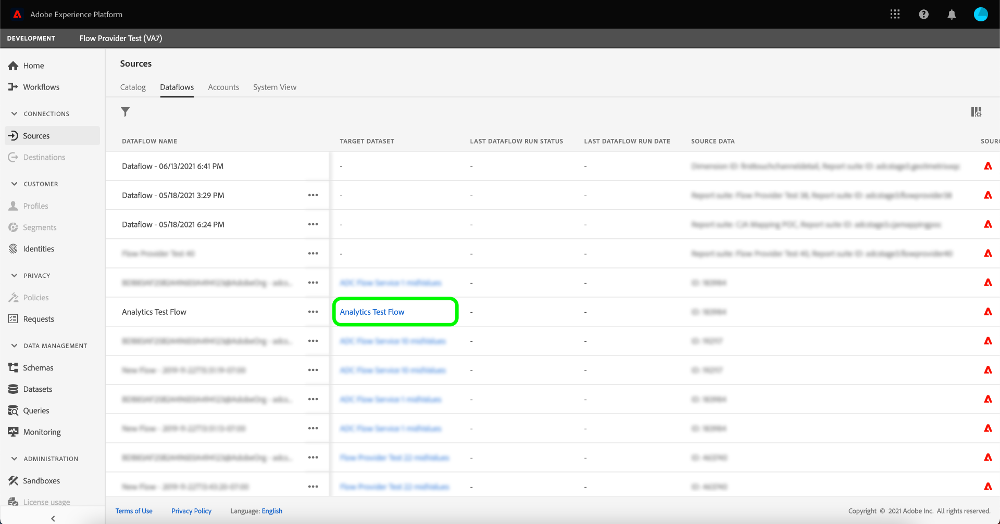

The **[!UICONTROL Dataset activity]** page appears. This page displays the rate of messages being consumed in the form of a graph. Select **[!UICONTROL Data governance]** from the top header to access the labelling fields.

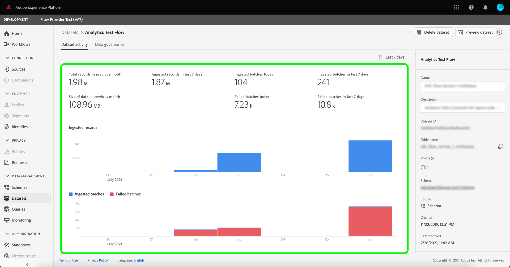

You can view a dataset flow's inherited labels from the [!UICONTROL Data governance] screen. For more information on how to label data coming from Analytics, visit the [data usage labels guide](../../../../../data-governance/labels/user-guide.md).

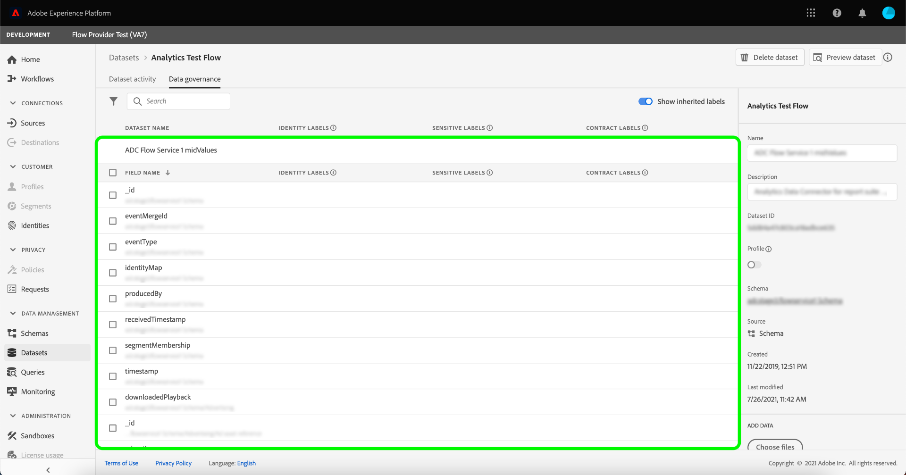

To delete a dataflow, head to the [!UICONTROL Dataflows] page and then select the ellipses (`...`) beside the dataflow name and then select [!UICONTROL Delete].

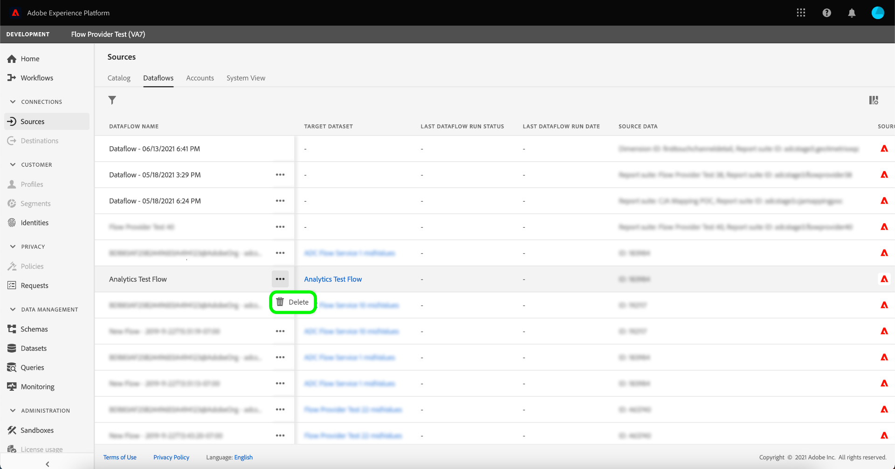

## Next steps and additional resources

Once the connection is created, the dataflow is automatically created to contain the incoming data and populate a dataset with your selected schema. Furthermore, data back-filling occurs and ingests up to 13 months of historical data. When the initial ingestion completes, [!DNL Analytics] data and be used by downstream Platform services such as [!DNL Real-Time Customer Profile] and Segmentation Service. See the following documents for more details:

* [[!DNL Real-Time Customer Profile] overview](../../../../../profile/home.md)
* [[!DNL Segmentation Service] overview](../../../../../segmentation/home.md)
* [[!DNL Data Science Workspace] overview](../../../../../data-science-workspace/home.md)
* [[!DNL Query Service] overview](../../../../../query-service/home.md)

The following video is intended to support your understanding of ingesting data using the Adobe Analytics Source connector:

>[!WARNING]
>
> The [!DNL Platform] UI shown in the following video is out-of-date. Please refer to the documentation above for the latest UI screenshots and functionality.

>[!VIDEO](https://video.tv.adobe.com/v/29687?quality=12&learn=on)
