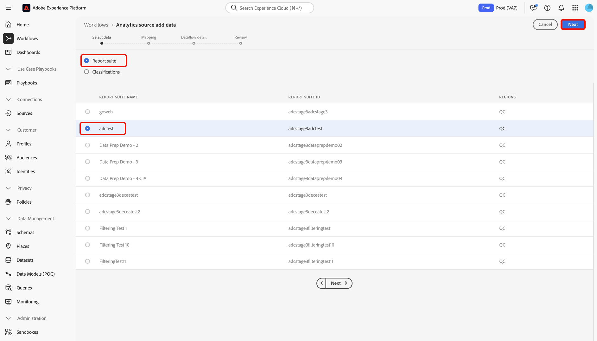
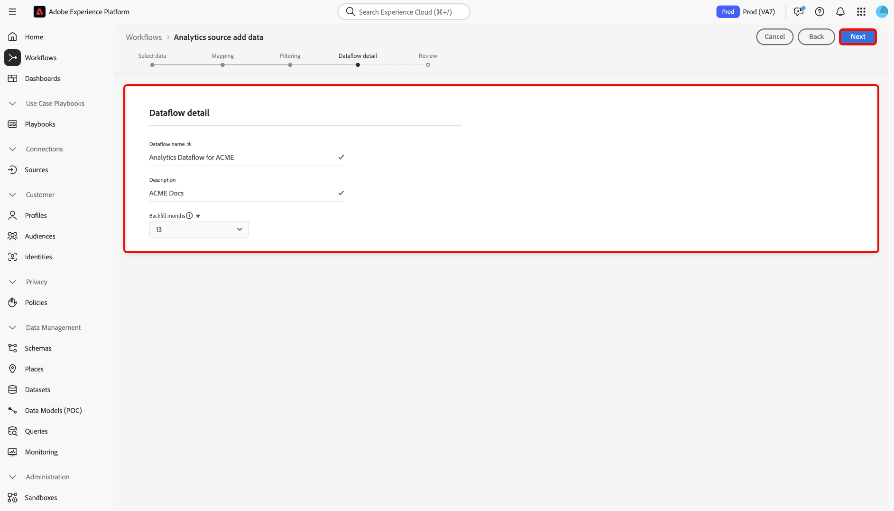

# Create an Adobe Analytics source connection in the UI

This tutorial provides steps for creating an Adobe Analytics source connection in the UI to bring [!DNL Analytics] report suite data into Adobe Experience Platform.

## Getting started

This tutorial requires a working understanding of the following components of Adobe Experience Platform:

* [Experience Data Model (XDM) System](../../../../../xdm/home.md): The standardized framework by which Experience Platform organizes customer experience data.
* [Real-time Customer Profile](../../../../../profile/home.md): Provides a unified, real-time consumer profile based on aggregated data from multiple sources.
* [Sandboxes](../../../../../sandboxes/home.md): Experience Platform provides virtual sandboxes which partition a single Platform instance into separate virtual environments to help develop and evolve digital experience applications.

## Create a source connection with Adobe Analytics

In the Platform UI, select **[!UICONTROL Sources]** from the left navigation to access the [!UICONTROL Sources] workspace. The [!UICONTROL Catalog] screen displays a variety of sources that you can create an account with.

You can select the appropriate category from the catalog on the left-hand side of your screen. Alternatively, you can find the specific source you wish to work with using the search option.

Under the **[!UICONTROL Adobe applications]** category, select **[!UICONTROL Adobe Analytics]** and then select **[!UICONTROL Add data]**.

### Select data

The **[!UICONTROL Analytics source add data]** step appears. Select [!UICONTROL Report suite] to start creating a source connection for Analytics report suite data, and then select the report suite you would like to ingest. Select [!UICONTROL Next] to proceed.

>[!NOTE]
>
>Multiple in-bound connections to a source can be made for bringing in different data.

<!---Analytics report suites can be configured for one sandbox at a time. To import the same report suite into a different sandbox, the dataset flow will have to be deleted and instantiated again via configuration for a different sandbox.--->

### Mapping

The [!UICONTROL Mapping] page provides an interface to map source fields to their appropriate target schema fields. Select a target schema to start the mapping process.

The [!UICONTROL Map standard fields] section displays panels for [!UICONTROL Standard mappings applied], [!UICONTROL Non matching standard mappings] and [!UICONTROL Custom mappings]. See the following table for specific information regarding each category:

| Map standard fields | Description |
| --- | --- |
| [!UICONTROL Standard mappings applied] | Displays the number of mapped standard attributes. |
| [!UICONTROL Non matching standard mappings] | Displays the number of conflicted mapping sets among all mapped standard attributes. |
| [!UICONTROL Custom mappings] | Displays the number of mapped custom attributes. This includes eVars and props. |

To preview the [!DNL Analytics] ExperienceEvent template schema field group, select **[!UICONTROL View]** in the [!UICONTROL Standard mappings applied] panel.

The [!UICONTROL Adobe Analytics ExperienceEvent Template Schema Field Group] page provides you with an interface to use for inspecting the structure of your schema. When finished, select **[!UICONTROL Close]**.

#### View custom mappings

To use Data Prep functions and add new mapping or calculated fields, select **[!UICONTROL View custom mappings]**.

Depending on your needs, you can select either **[!UICONTROL Add new mapping]** or **[!UICONTROL Add calculated field]** from the options that appear. For specific instructions on using calculated fields, see the following tutorial on [adding calculated fields](../../../../../ingestion/tutorials/map-a-csv-file.md#add-calculated-field). For more information on Data Prep and mapping functions, see the following guide on [Data Prep mapping functions](../../../../../data-prep/functions.md).

Platform automatically detects your mapping sets for any friendly name conflicts. If there are no conflicts with your mapping sets, select **[!UICONTROL Next]** to proceed.

You can still proceed and create an [!DNL Analytics] dataflow even if your mapping sets contain name conflicts. Select **[!UICONTROL Next]** to proceed.

### Provide dataflow details

The **[!UICONTROL Dataflow detail]** step appears, where you must provide a name and an optional description for the dataflow. Select **[!UICONTROL Next]** when finished.

### Review

The [!UICONTROL Review] step appears, allowing you to review your new Analytics dataflow before it is created. Details of the connection are grouped by categories, including:

* [!UICONTROL Connection]: Displays the source platform of the connection.
* [!UICONTROL Data type]: Displays the selected report suite and its corresponding report suite ID.

### Monitor your dataflow

Once your dataflow has been created, you can monitor the data that is being ingested through it. From the **[!UICONTROL Catalog]** screen, select **[!UICONTROL Dataflows]** to view a list of established flows associated with your Analytics account.

The **Dataflows** screen appears. On this page is a pair of dataset flows, including information about their name, source data, creation time, and status.

The connector instantiates two dataset flows. One flow represents backfill data and the other is for live data. Backfill data is not configured for Profile but is sent to the data lake for analytical and data-science use-cases.

For more information on backfill, live data, and their respective latencies, see the [Analytics Data Connector overview](../../../../connectors/adobe-applications/analytics.md).

Select the dataset flow you wish to view from the list.

The **Dataset activity** page appears. This page displays the rate of messages being consumed in the form of a graph. Select *Data governance* from the top header to access the labelling fields.

You can view a dataset flow's inherited labels from the *Data governance* screen. To access specific labels, select the edit button on the top right.

The **Edit governance labels** panel appears. This screen allows you to access and edit a dataset flow's contract, identity, and sensitive labels.

For more information on how to label data coming from Analytics, visit the [data usage labels guide](../../../../../data-governance/labels/user-guide.md).

## Next steps and additional resources

Once the connection is created, a target schema and dataset flow is automatically created to contain the incoming data. Furthermore, data back-filling occurs and ingests up to 13 months of historical data. When the initial ingestion completes, Analytics data and be used by downstream Platform services such as Real-time Customer Profile and Segmentation Service. See the following documents for more details:

* [Real-time Customer Profile overview](../../../../../profile/home.md)
* [Segmentation Service overview](../../../../../segmentation/home.md)
* [Data Science Workspace overview](../../../../../data-science-workspace/home.md)
* [Query Service overview](../../../../../query-service/home.md)

The following video is intended to support your understanding of ingesting data using the Adobe Analytics Source connector:

>[!WARNING]
>
> The [!DNL Platform] UI shown in the following video is out-of-date. Please refer to the documentation above for the latest UI screenshots and functionality.

>[!VIDEO](https://video.tv.adobe.com/v/29687?quality=12&learn=on)
