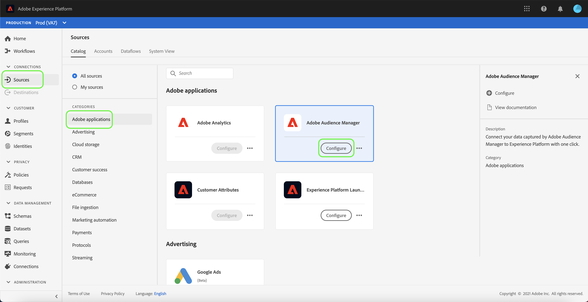
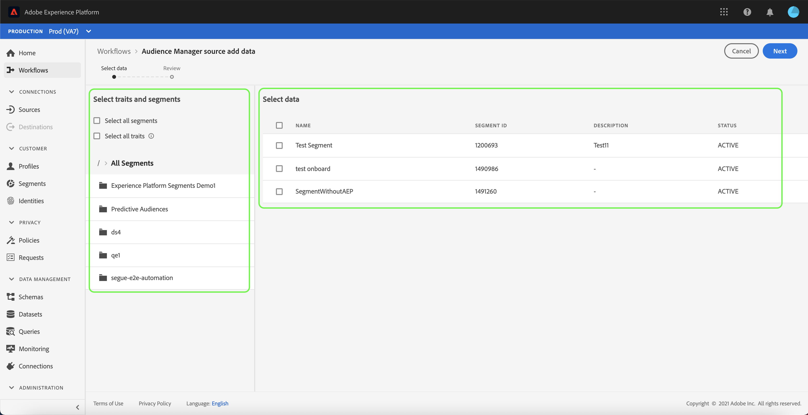
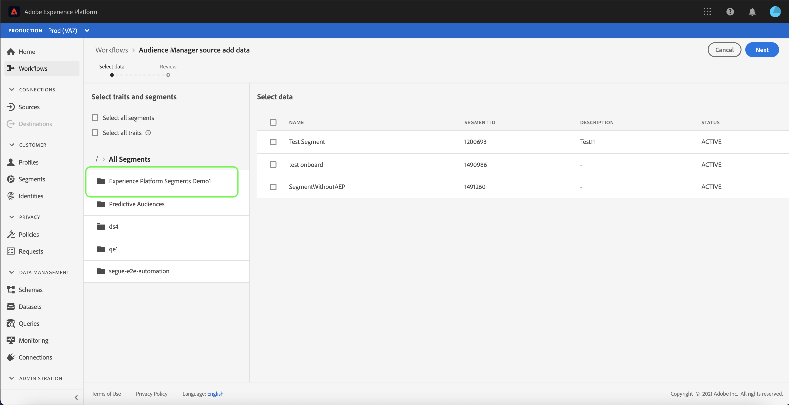
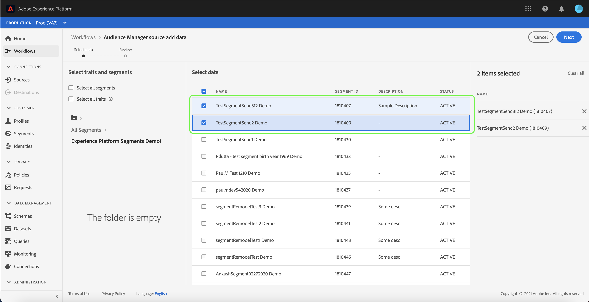
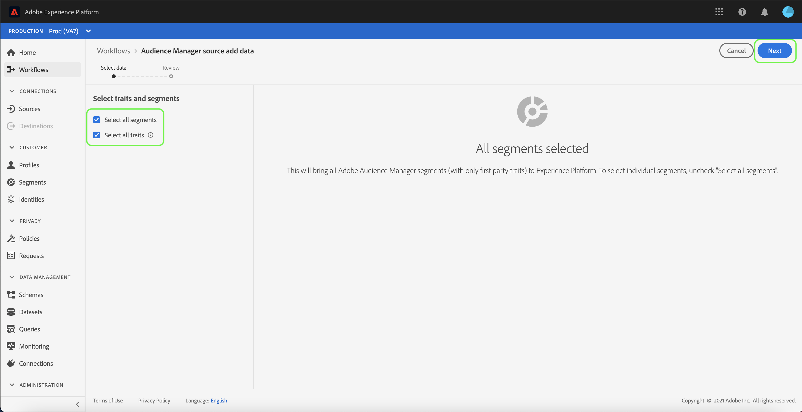

# Create an Adobe Audience Manager source connection in the UI

This tutorial walks you through the steps to create a source connector for Adobe Audience Manager to bring in Consumer Experience Event data into Platform using the user interface.

## Create a source connection with Adobe Audience Manager

In the Platform UI, select **[!UICONTROL Sources]** from the left navigation to access the [!UICONTROL Sources] workspace. The [!UICONTROL Catalog] screen displays a variety of sources that you can create an account with.

You can select the appropriate category from the catalog on the left-hand side of your screen. Alternatively, you can find the specific source you wish to work with using the search bar.

Under [!UICONTROL Adobe Application], select **[!UICONTROL Adobe Audience Manager]** and then select **[!UICONTROL Set up]**.

### Select traits and segments

>[!NOTE]
>
>You cannot ingest regional data from the Audience Manager source to Experience Platform. If you have Analytics use cases that require regional data, then please use the [Analytics source connector](../adobe-applications/analytics.md).

The [!UICONTROL Select traits and segments] step appears, providing you with an interactive interface to explore and select your traits, segments, and data.

* The left panel of the interface contains the [!UICONTROL Select traits and segments] options, as well as a hierarchical directory of all segments available to you.
* The right half of the interface allows you to interact with selected segments and pick through specific data you want to use.

To navigate through available segments, select the folder you want to access from the [!UICONTROL All Segments] panel. Selecting a folder allows you to traverse a folder's hierarchy and provides you with a list of segments to filter through.

Once you have identified and selected the segments you want to use, a new panel appears on the right, displaying your list of selected items. You can continue to access different folders and select different segments for your connection. Selecting more segments updates the panel on the right.

Alternatively, you can select the **[!UICONTROL Select all segments]** and **[!UICONTROL Select all traits]** boxes. Selecting all segments will bring Audience Manager segments to Platform, while selecting all traits enables all first party traits from Audience Manager.

>[!WARNING]
>
>The ingestion of sizeable Audience Manager segment populations has a direct impact on your total profile count when you first send an Audience Manager segment to Platform using the Audience Manager source. This means that selecting all segments can potentially lead to a Profile count in excess of your license usage entitlement. Please review your [license usage allowance](../../../../../dashboards/guides/license-usage.md) before proceeding.

Once you are finished, select **[!UICONTROL Next]**

The [!UICONTROL Review] step appears, allowing you to review your selected traits and segments before they are connected to Platform. Details are grouped within the following categories:

* **[!UICONTROL Connection]**: Shows the source platform and the status of the connection.
* **[!UICONTROL Selected data]**: Shows the number of selected segments and enabled traits.

Once you have reviewed your dataflow, select **[!UICONTROL Finish]** and allow some time for the dataflow to be created.

## Next steps

While an Audience Manager dataflow is active, incoming data is automatically ingested into Real-time Customer Profiles. You can now utilize this incoming data and create audience segments using Platform Segmentation Service. See the following documents for more details:

* [Real-time Customer Profile overview](../../../../../profile/home.md)
* [Segmentation Service overview](../../../../../segmentation/home.md)
