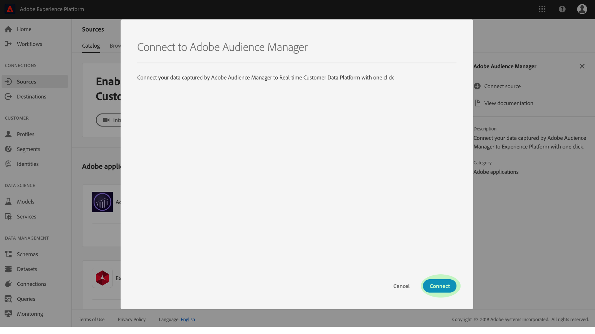
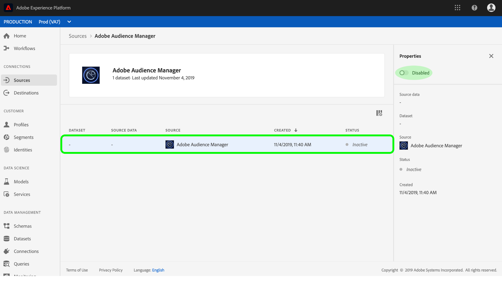

# Create an Adobe Audience Manager source connector in the UI

This tutorial walks you through the steps to create a source connectors for Adobe Audience Manager to bring in Consumer Experience Event data into Platform using the user interface.

## Create a source connection with Adobe Audience Manager

Log in to [Adobe Experience Platform](https://platform.adobe.com) and then select **Sources** from the left navigation bar to access the sources workspace. The **Catalog** screen displays a variety of sources for which you can create source connections with, and each source shows the number of existing connections associated to them.

Under the **Adobe applications** category, select **Adobe Audience Manager** to expose an information bar on the right-side of your screen. The information bar provides a brief description for the selected source as well as options to view its documentation or to connect with the source.

To create a new source connector for Adobe Audience Manager, click **Add data**.

A dialog box appears. Click **Connect** to create the connection.

If a source connection with Adobe Audience Manager is established, the **Source activity** page for Audience Manager connector be displayed.

If you wish to pause incoming Audience Manager data, you can do so by clicking the dataflow listing and toggle its *Status* from the right *Properties* column.

## Next steps

While an Audience Manager dataflow is active, incoming data is automatically ingested into Real-time Customer Profiles. You can now utilize this incoming data and create audience segments using Platform Segmentation Service. See the following documents for more details:

-   [Real-time Customer Profile overview](../../../../../profile/home.md)
-   [Segmentation Service overview](../../../../../segmentation/home.md)