# Create an Adobe Campaign Managed Cloud Services source connection using Platform UI

This tutorial provides steps to create a source connection to bring your Adobe Campaign Managed Cloud Services data to Adobe Experience Platform.

## Getting started

This guide requires a working understanding of the following components of Experience Platform:

* [Sources](../../../../home.md): Platform allows data to be ingested from various sources while providing you with the ability to structure, label, and enhance incoming data using Platform services.
* [[!DNL Experience Data Model (XDM)] System](../../../../../xdm/home.md): The standardized framework by which Experience Platform organizes customer experience data.
    * [Basics of schema composition](../../../../../xdm/schema/composition.md): Learn about the basic building blocks of XDM schemas, including key principles and best practices in schema composition.
    * [Schema Editor tutorial](../../../../../xdm/tutorials/create-schema-ui.md): Learn how to create custom schemas using the Schema Editor UI.
* [Sandboxes](../../../../../sandboxes/home.md): Platform provides virtual sandboxes which partition a single Platform instance into separate virtual environments to help develop and evolve digital experience applications.

## Connect Adobe Campaign Managed Cloud Services to Platform

In the Platform UI, select **[!UICONTROL Sources]** from the left navigation to access the [!UICONTROL Sources] workspace. The [!UICONTROL Catalog] screen displays a variety of sources that you can create an account with.

You can select the appropriate category from the catalog on the left-hand side of your screen. You can also use the search bar to narrow down the displayed sources.

Under the **[!UICONTROL Adobe applications]** category, select **[!UICONTROL Adobe Campaign Managed Cloud Services]** and then select **[!UICONTROL Add data]**.

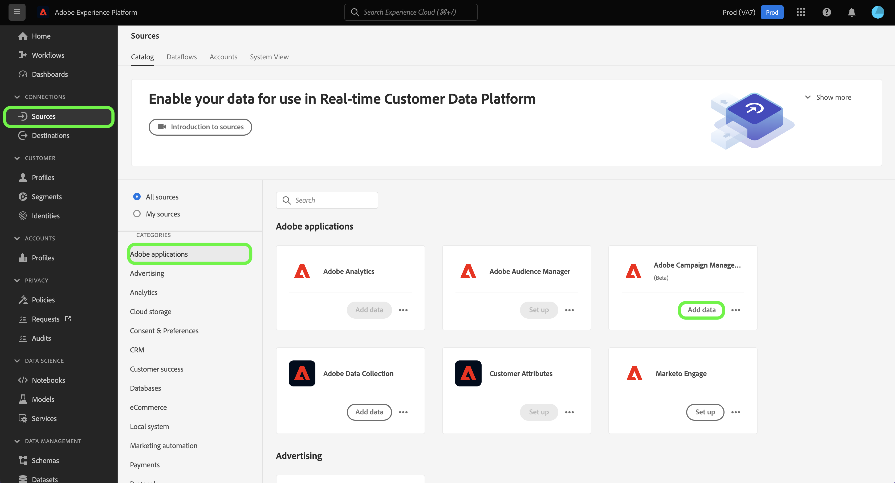

### Select data {#select-data}

>[!CONTEXTUALHELP]
>id="platform_sources_campaign_instance"
>title="Adobe Campaign environment instance"
>abstract="The name of the Adobe Campaign environment that you want to use."
>text="Learn more in documentation"

>[!CONTEXTUALHELP]
>id="platform_sources_campaign_mapping"
>title="Target mapping"
>abstract="Target mappings are technical objects used by Campaign in order to deliver messages, and contain all the technical settings required to send deliveries (addresses, phone numbers, opt-in indicators, additional identifiers…)."
>text="Learn more in documentation"

>[!CONTEXTUALHELP]
>id="platform_sources_campaign_schema"
>title="Schema name"
>abstract="The name of the entity defined in the Adobe Campaign database."
>text="Learn more in documentation"

The [!UICONTROL Select data] step appears, providing you with an interface to configure your [!UICONTROL Adobe Campaign instance], [!UICONTROL Target mapping], and [!UICONTROL Schema name].

| Property | Description |
| --- | --- |
| Adobe Campaign instance | The name of the Adobe Campaign environment instance that you are using. |
| Target mapping | The technical objects used by Campaign in order to deliver messages, and contain all the technical settings required to send deliveries. |
| Schema name | The name of the schema entity that you are bringing to Platform. Options include Delivery Log and Tracking Log. |

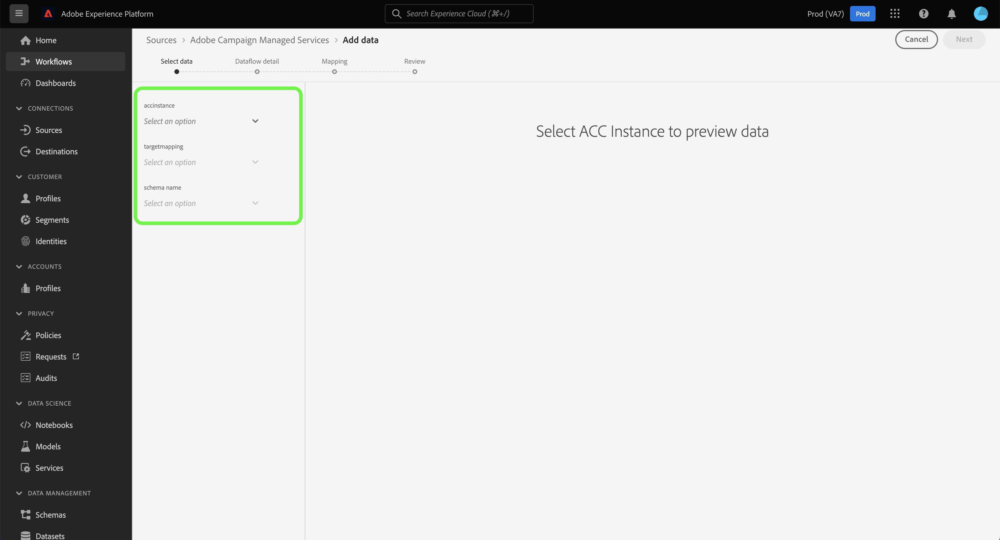

Once you have provided values for your Campaign instance, target mapping, and schema name, the screen updates to display a preview of your schema as well as a sample dataset. When finished, select **[!UICONTROL Next]**.

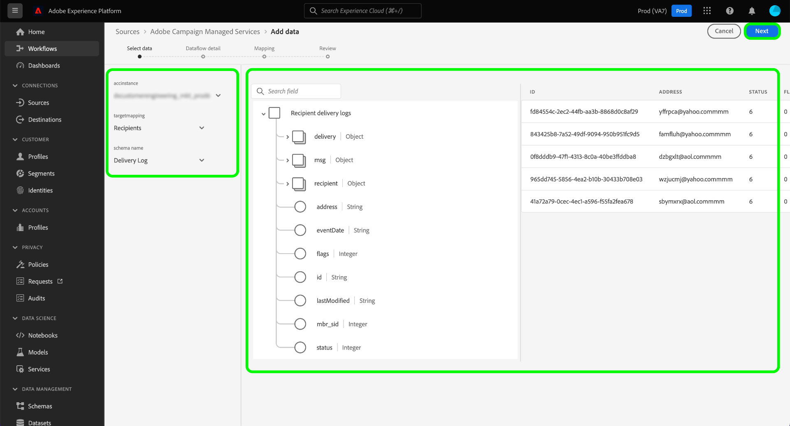

### Use an existing dataset

The [!UICONTROL Dataflow detail] page allows you to select whether you want to use an existing dataset or configure a new dataset for your dataflow.

To use an existing dataset, select **[!UICONTROL Existing dataset]**. You can either retrieve an existing dataset using the [!UICONTROL Advanced search] option or by scrolling through the list of existing datasets in the dropdown menu.

With a dataset selected, provide a name for your dataflow and an optional description.

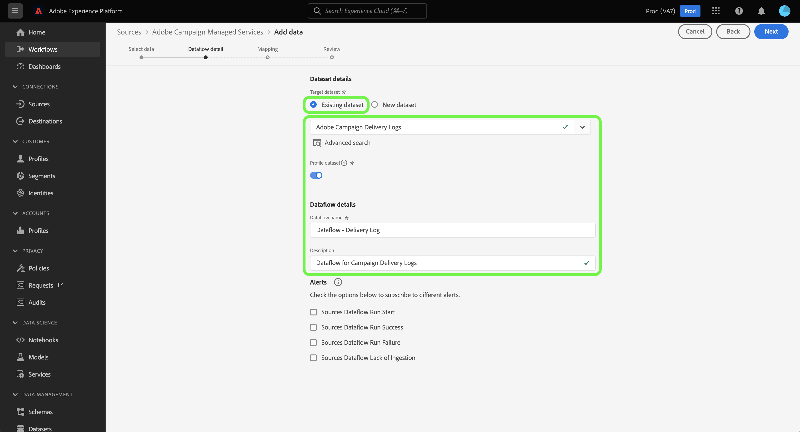

### Use a new dataset

To use a new dataset, select **[!UICONTROL New dataset]** and then provide an output dataset name and an optional description. Next, select a schema to map to using the [!UICONTROL Advanced search] option or by scrolling through the list of existing schemas in the dropdown menu. When finished, select **[!UICONTROL Next]**.

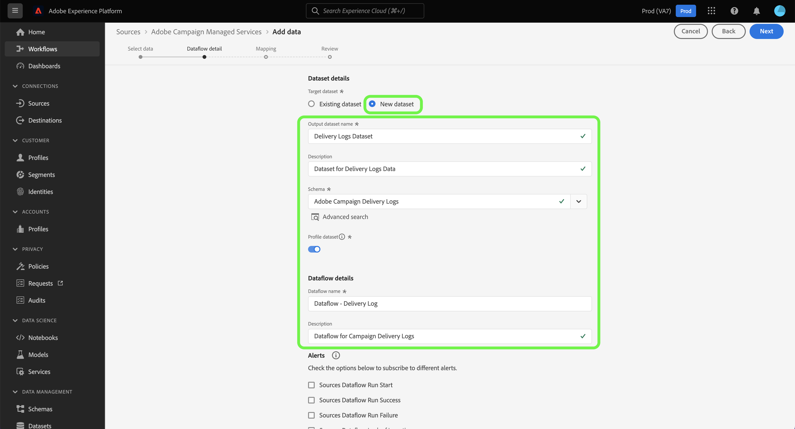

### Enable alerts

You can enable alerts to receive notifications on the status of your dataflow. Select an alert from the list to subscribe and receive notifications on the status of your dataflow. For more information on alerts, see the guide on [subscribing to sources alerts using the UI](../../alerts.md).

When you are finished providing details to your dataflow, select **[!UICONTROL Next]**.

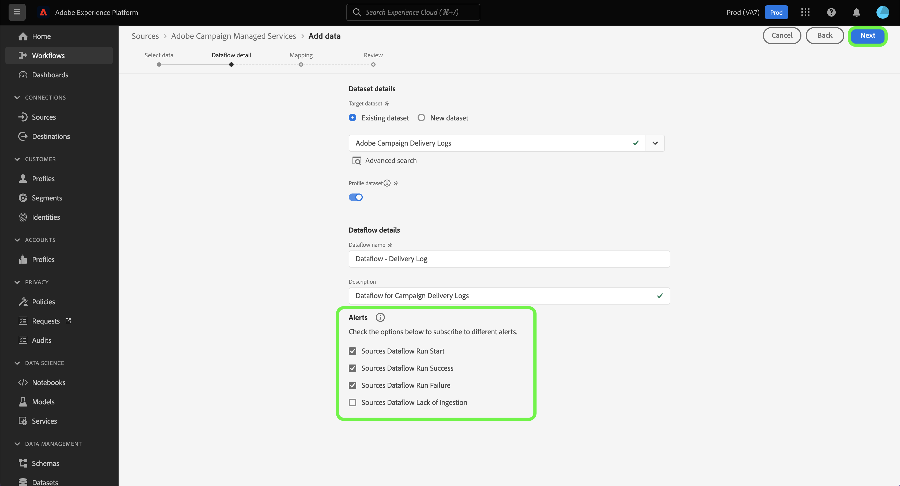

### Map data fields to an XDM schema

The [!UICONTROL Mapping] step appears, providing you with an interface to map the source fields from your source schema to their appropriate target XDM fields in the target schema.

Platform provides intelligent recommendations for auto-mapped fields based on the target schema or dataset that you selected. You can manually adjust mapping rules to suit your use cases. Based on your needs, you can choose to map fields directly, or use data prep functions to transform source data to derive computed or calculated values. For comprehensive steps on using the mapper interface and calculated fields, see the [Data Prep UI guide](../../../../../data-prep/ui/mapping.md).

>[!IMPORTANT]
>
>When mapping your source fields to target XDM fields, you must ensure that you map your designated primary identity field to its appropriate target XDM field.

Once your source data is successfully mapped, select **[!UICONTROL Next]**.

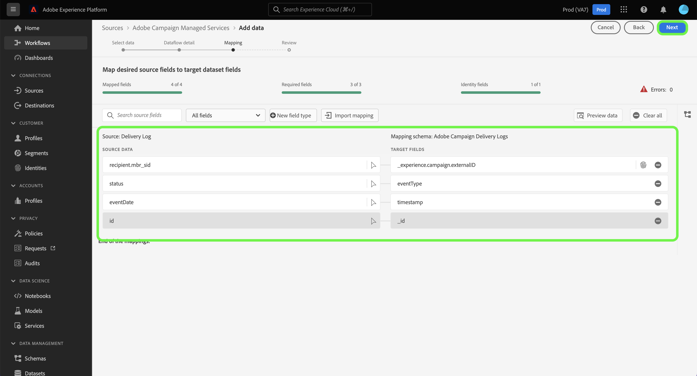

### Review your dataflow

The **[!UICONTROL Review]** step appears, allowing you to review your new dataflow before it is created. Details are grouped within the following categories:

* **[!UICONTROL Connection]**: Shows the source type, the relevant path of the chosen source file, and the amount of columns within that source file.
* **[!UICONTROL Assign dataset & map fields]**: Shows which dataset the source data is being ingested into, including the schema that the dataset adheres to.

Once you have reviewed your dataflow, select **[!UICONTROL Finish]** and allow some time for the dataflow to be created.

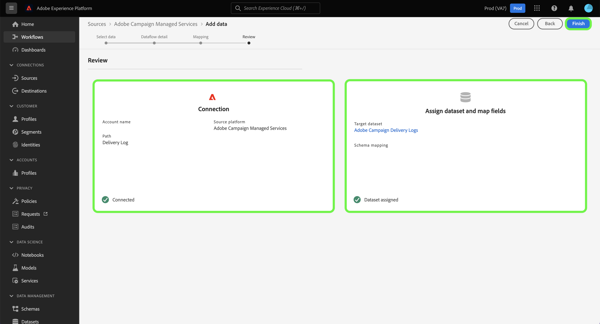

### Monitor your dataset activity

Once your dataflow has been created, you can monitor the data that is being ingested through it to see information on ingested rates and successful and failed batches.

To start viewing your dataset activity, select **[!UICONTROL Dataflows]** in the sources catalog.

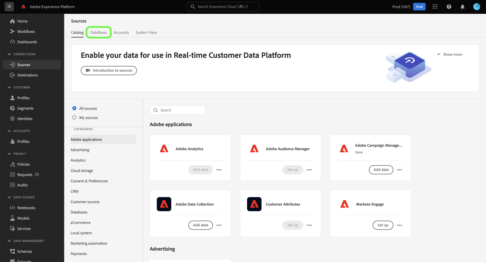

Next, select the target dataset from the list of dataflows that appear.

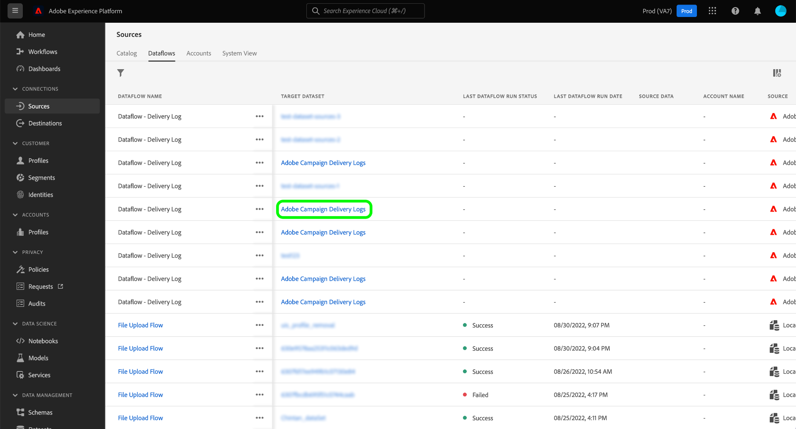

The dataset activity page appears. From here, you can see information on the performance of your dataflow, including rate of ingestion, successful batches, and failed batches. 

This page also provides you with an interface to update the metadata description of your dataflow, enable partial ingestion and error diagnostics, as well as add new data to your dataset.

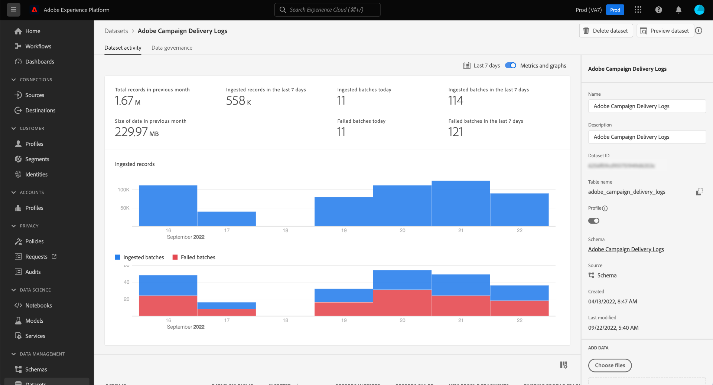

## Next steps

By following this tutorial, you have successfully created a dataflow to bring your Campaign v8 delivery logs and tracking logs data to Platform. Incoming data can now be used by downstream Platform services such as [!DNL Real-time Customer Profile] and [!DNL Data Science Workspace]. See the following documents for more details:

* [[!DNL Real-time Customer Profile] overview](../../../../../profile/home.md)
* [[!DNL Data Science Workspace] overview](../../../../../data-science-workspace/home.md)
