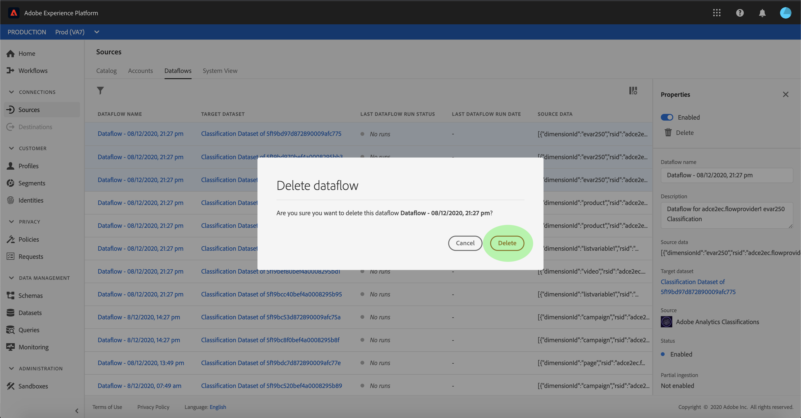

# Create an Adobe Analytics Classifications Data connector in the UI

This tutorial provides steps for creating an Adobe Analytics Classifications Data connector in the UI to bring classifications data into Adobe Experience Platform.

## Getting started

This tutorial requires a working understanding of the following components of Adobe Experience Platform:

*   [Experience Data Model (XDM) System](../../../../../xdm/home.md): The standardized framework by which Experience Platform organizes customer experience data.
*   [Real-time Customer Profile](../../../../../profile/home.md): Provides a unified, real-time consumer profile based on aggregated data from multiple sources.
*   [Sandboxes](../../../../../sandboxes/home.md): Experience Platform provides virtual sandboxes which partition a single Platform instance into separate virtual environments to help develop and evolve digital experience applications.

## Select your classifications

Log in to [Adobe Experience Platform](https://platform.adobe.com) and then select **[!UICONTROL Sources]** from the left navigation bar to access the sources workspace. The *Catalog* screen displays available sources to create inbound connections with. Each source card shows an option to either configure a new account or add data to an existing account.

You can select the appropriate category from the catalog on the left-hand side of your screen. Alternatively, you can find the specific source you wish to work with using the search option.

Under the *Adobe applications* category, select the **[!UICONTROL Adobe Analytics]** card and then select **[!UICONTROL Add data]** to start working with Analytics Classifications Data.

The *[!UICONTROL Analytics source add data]* step appears. Select **[!UICONTROL Classifications]** from the top header to see a list of classifications datasets, including information about their Dimension ID, Report Suite name, and Report Suite ID.

Each page shows up to 10 different classifications you can choose from. Select **[!UICONTROL Next]** at the bottom of the page to browse for more options. The panel on the right shows the total number of classifications you selected, as well as their names. This panel also allows you to remove any classifications you may have selected by mistake or clear all selections with one action.

You can select up to 30 different classifications to bring into [!DNL Platform].

Once you have selected your classifications, select **[!UICONTROL Next]** on the top right of the page.

## Review your classifications

The *[!UICONTROL Review]* step appears, allowing you to review your selected classifications before it is created. Details are grouped within the following categories:

* *[!UICONTROL Connection]*: Shows the source platform and the status of the connection.
* *[!UICONTROL Data type]*: Shows the number of selected classifications and the status of the connections.

Once you have reviewed your classifications, click **[!UICONTROL Finish]** and allow some time for the classifications dataflow to be created.

## Monitor and delete your classifications dataflow

Once your classifications dataflow has been created, you can monitor the data that is being ingested through it. From the *[!UICONTROL Catalog]* screen, select **[!UICONTROL Dataflows]** to view a list of established flows associated with your Analytics account.

The *[!UICONTROL Dataflows]* screen appears. On this page is a list of dataflows, including information about their name, source data, and dataflow run status. The *[!UICONTROL Properties]* panel contains metadata regarding your classifications dataflow, as well as options to disable or delete your classifications dataflow.

Select **[!UICONTROL Delete]** to start the process.

A dialog box appears confirming the deletion. Select **[!UICONTROL Delete]** to complete.

## Next steps

By following this tutorial, you have created an Analytics Classifications Data connector that brings classifications data into [!DNL Platform]. See the following documents for more information on Adobe Analytics and classifications data:

* [Analytics Data connector overview](../../../../connectors/adobe-applications/analytics.md)
* [Create an Analytics Data connector in the UI](./analytics.md)
* [About classifications](https://docs.adobe.com/content/help/en/analytics/components/classifications/c-classifications.html#)