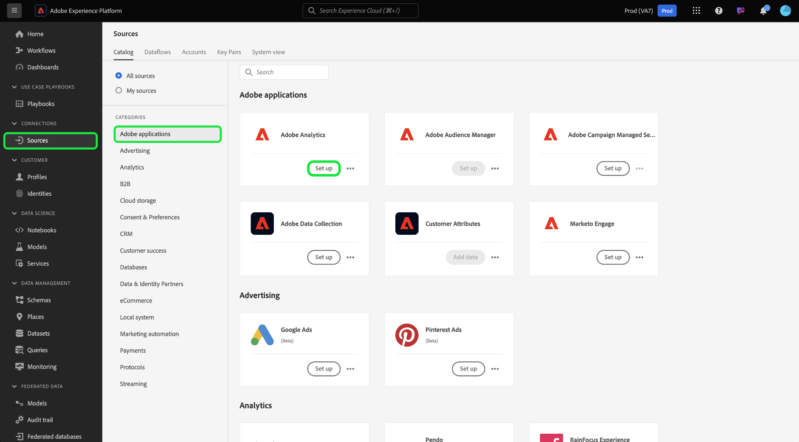
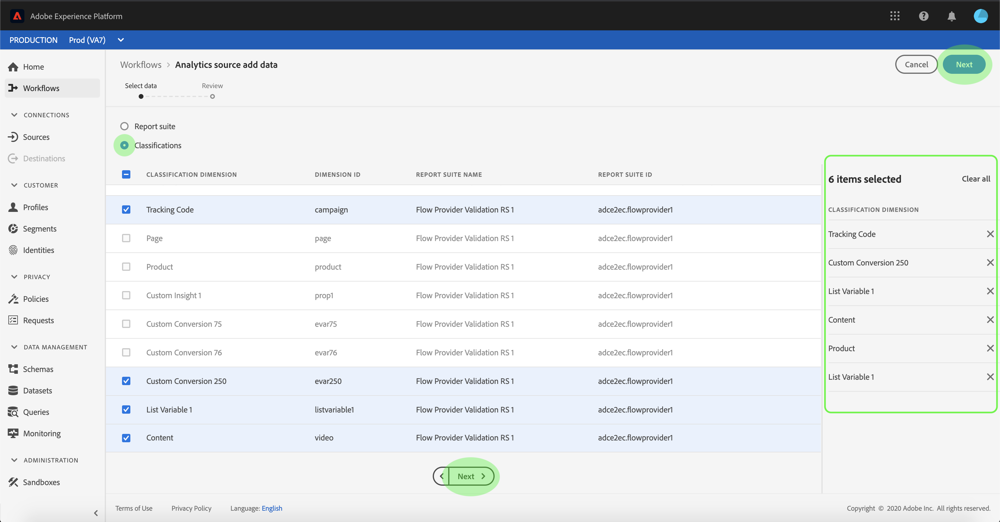
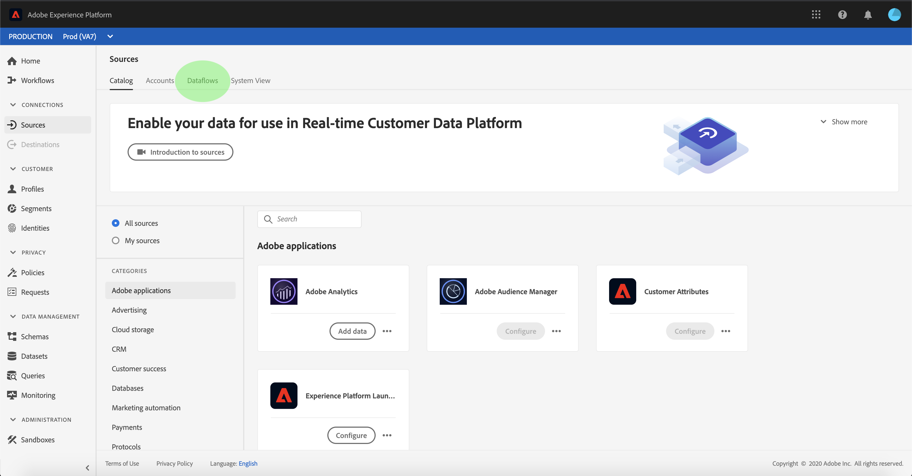
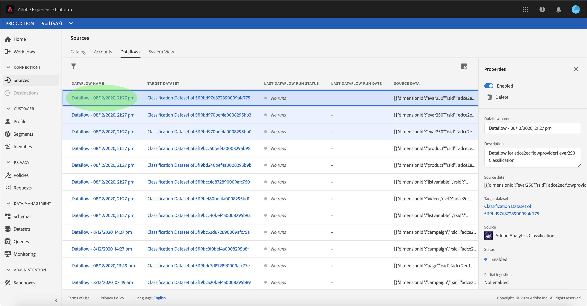
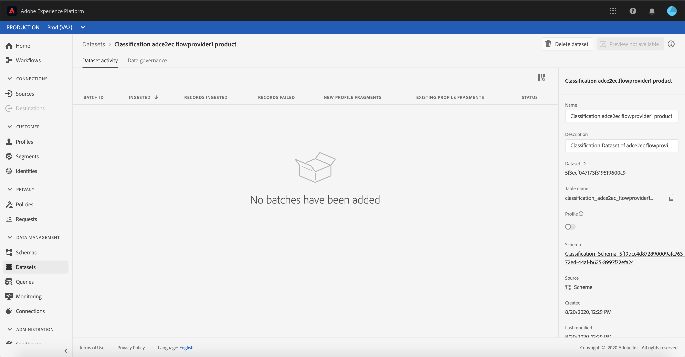

# Create an Adobe Analytics source connection for classifications data in the UI

This tutorial provides steps for creating an Adobe Analytics Classifications Data source connection in the UI to bring classifications data into Adobe Experience Platform.

## Getting started

This tutorial requires a working understanding of the following components of Adobe Experience Platform:

*   [[!DNL Experience Data Model (XDM)] System](../../../../../xdm/home.md): The standardized framework by which Experience Platform organizes customer experience data.
*   [[!DNL Real-Time Customer Profile]](../../../../../profile/home.md): Provides a unified, real-time consumer profile based on aggregated data from multiple sources.
*   [[!DNL Sandboxes]](../../../../../sandboxes/home.md): Experience Platform provides virtual sandboxes which partition a single Platform instance into separate virtual environments to help develop and evolve digital experience applications.

The Analytics Classifications Data Connector requires your data to have been migrated to the new [!DNL Classifications] infrastructure of Adobe Analytics prior to use. To confirm the migration status of your data, please contact your Adobe account team.

## Select your classifications

Log in to [Adobe Experience Platform](https://platform.adobe.com) and then select **[!UICONTROL Sources]** from the left navigation bar to access the sources workspace. The **[!UICONTROL Catalog]** screen displays available sources to create inbound connections with. Each source card shows an option to either configure a new account or add data to an existing account.

You can select the appropriate category from the catalog on the left-hand side of your screen. Alternatively, you can find the specific source that you want to work with using the search option.

Under the **[!UICONTROL Adobe applications]** category, select the **[!UICONTROL Adobe Analytics]** card and then select **[!UICONTROL Add data]** to start working with Analytics Classifications Data.

The **[!UICONTROL Analytics source add data]** step appears. Select **[!UICONTROL Classifications]** from the top header to see a list of [!DNL Classifications] datasets, including information about their dimension ID, report suite name, and report suite ID.

Each page shows up to ten different [!DNL Classifications] datasets you can choose from. Select **[!UICONTROL Next]** at the bottom of the page to browse for more options. The panel on the right shows the total number of [!DNL Classifications] datasets you selected, as well as their names. This panel also allows you to remove any [!DNL Classifications] datasets you may have selected by mistake or clear all selections with one action.

You can select up to 30 different [!DNL Classifications] datasets to bring into [!DNL Platform].

Once you have selected your [!DNL Classifications] datasets, select **[!UICONTROL Next]** on the top right of the page.

## Review your classifications

The **[!UICONTROL Review]** step appears, allowing you to review your selected [!DNL Classifications] datasets before it is created. Details are grouped within the following categories:

* **[!UICONTROL Connection]**: Shows the source platform and the status of the connection.
* **[!UICONTROL Data type]**: Shows the number of selected [!DNL Classifications].
* **[!UICONTROL Scheduling]**: Shows the frequency of synchronization for [!DNL Classifications] data.

Once you have reviewed your dataflow, click **[!UICONTROL Finish]** and allow some time for the dataflow to be created.

## Monitor your classifications dataflow

Once your dataflow has been created, you can monitor the data that is being ingested through it. From the **[!UICONTROL Catalog]** screen, select **[!UICONTROL Dataflows]** to view a list of established flows associated with your [!DNL Classifications] account.

The **[!UICONTROL Dataflows]** screen appears. On this page is a list of dataflows, including information about their name, source data, and dataflow run status. On the right, is the **[!UICONTROL Properties]** panel that contains metadata regarding your [!DNL Classifications] dataflow.

Select the **[!UICONTROL Target dataset]** you wish to access.

The **[!UICONTROL Dataset activity]** page displays information about the target dataset you selected, including details about its batch status, dataset ID, and schema.

## Next steps

By following this tutorial, you have created an Analytics Classifications Data connector that brings [!DNL Classifications] data into [!DNL Platform]. See the following documents for more information on [!DNL Analytics] and [!DNL Classifications] data:

* [Analytics Data connector overview](../../../../connectors/adobe-applications/analytics.md)
* [Create an Analytics Data connection in the UI](./analytics.md)
* [About classifications](https://experienceleague.adobe.com/docs/analytics/components/classifications/c-classifications.html)
