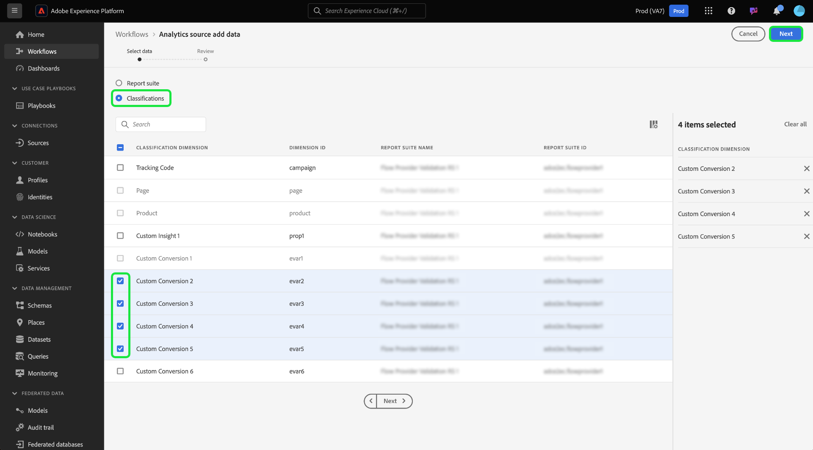

# Create an Adobe Analytics source connection for classifications data in the UI

>[!TIP]
>
>By default, Adobe Analytics classifications data is updated weekly. Data ingestion for your classifications data will be processed seven days after the initial set up of your dataflow. The first load ingests the entire data and the ensuing weekly ingestion runs incremental data.

Read this tutorial for steps on how to ingest your Adobe Analytics classifications data into Adobe Experience Platform through the user interface.

## Get started

This tutorial requires a working understanding of the following components of Adobe Experience Platform:

* [[!DNL Experience Data Model (XDM)] System](../../../../../xdm/home.md): The standardized framework by which Experience Platform organizes customer experience data.
* [[!DNL Real-Time Customer Profile]](../../../../../profile/home.md): Provides a unified, real-time consumer profile based on aggregated data from multiple sources.
* [[!DNL Sandboxes]](../../../../../sandboxes/home.md): Experience Platform provides virtual sandboxes which partition a single Experience Platform instance into separate virtual environments to help develop and evolve digital experience applications.

The Analytics classifications source connector requires your data to have been migrated to the new classifications infrastructure of Adobe Analytics prior to use. To confirm the migration status of your data, please contact your Adobe account team.

## Select your classifications

In the Experience Platform UI, select **[!UICONTROL Sources]** from the left navigation to access the [!UICONTROL Sources] workspace. You can select the appropriate category from the catalog on the left-hand side of your screen. Alternatively, you can find the specific source you wish to work with using the search option.

Under the *Adobe applications* category, select **[!UICONTROL Adobe Analytics]**, and then select **[!UICONTROL Set up]**.

>[!TIP]
>
>Sources in the sources catalog display the **[!UICONTROL Set up]** option if there is no authenticated account. Once an account is authenticated, the option changes to **[!UICONTROL Add data]**.

Next, select [!UICONTROL Classifications] and then select the classifications datasets that you want to ingest to Experience Platform. Alternatively, you can use search to filter and select for specific classifications.

You can select up to 30 different classifications datasets to bring into Experience Platform. Any datasets that you select will appear in the right rail. When you are finished, select [!UICONTROL Next] to proceed.

## Review your classifications

The **[!UICONTROL Review]** step appears, allowing you to review your selected classifications datasets before it is created. Details are grouped within the following categories:

* **[!UICONTROL Connection]**: Shows the source platform and the status of the connection.
* **[!UICONTROL Data type]**: Shows the number of selected classifications.
* **[!UICONTROL Scheduling]**: Shows the frequency of synchronization for classifications data. **Note**: Classifications data is updated on a weekly basis.

Once you have reviewed your dataflow, click **[!UICONTROL Finish]** and allow some time for the dataflow to be created.

## Next steps

By following this tutorial, you have created an Analytics classifications sata connector that brings classifications data into Experience Platform. See the following documents for more information on [!DNL Analytics] and classifications data:

* [Adobe Analytics source connector overview](../../../../connectors/adobe-applications/analytics.md)
* [Create an Analytics source connection for report suite data in the UI](./analytics.md)
* [About classifications](https://experienceleague.adobe.com/docs/analytics/components/classifications/c-classifications.html)
