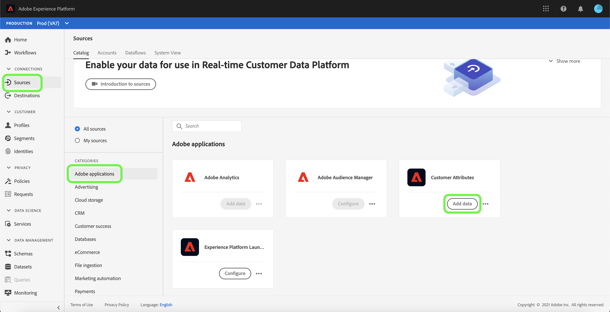
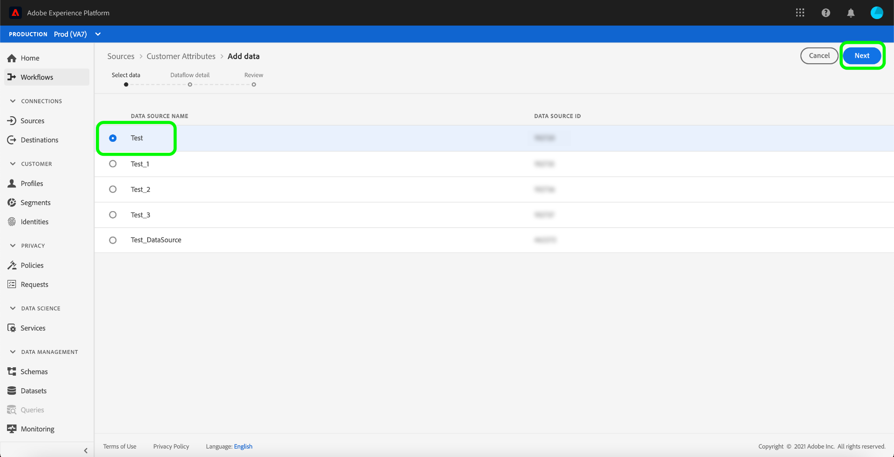
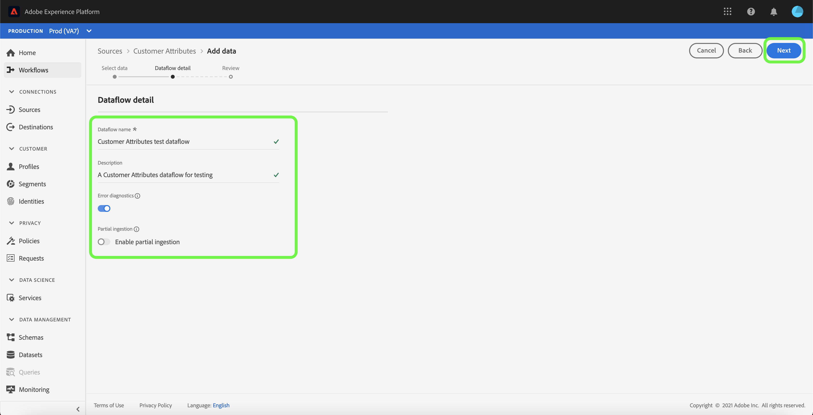
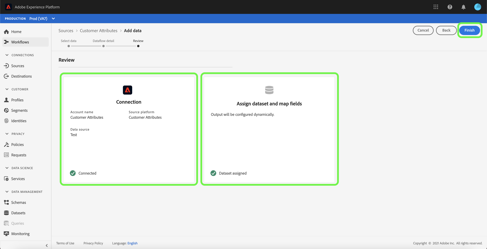

# Create a Customer Attributes source connection in the UI

This tutorial provides steps for creating a source connection in the UI to bring Customer Attributes profile data into Adobe Experience Platform. For more information about Customer Attributes, see the [Customer Attributes overview](https://experienceleague.adobe.com/docs/core-services/interface/customer-attributes/attributes.html).

>[!IMPORTANT]
>
>The Customer Attributes source currently does not support enabling or disabling dataflows.

## Create a source connection

>[!NOTE]
>
>If you've already established a source connection for Customer Attributes profile data, the option to connect with the source is disabled.

In the Platform UI, select **[!UICONTROL Sources]** from the left navigation to access the [!UICONTROL Sources] workspace. The [!UICONTROL Catalog] screen displays a variety of sources that you can create a connection with.

You can select the appropriate category from the catalog on the left-hand side of your screen. Alternatively, you can find the specific source you wish to work with using the search bar.

Under the [!UICONTROL Adobe applications] category, select **[!UICONTROL Customer Attributes]** and then select **[!UICONTROL Add data]**.

### Select customer attributes data source

The [!UICONTROL Add data] screen lists all available data sources for Customer Attributes. Only one dataset can be selected per Customer Attributes source connection. 

>[!NOTE]
>
>Field groups, schemas, and datasets are created out-of-box as a part of flow provisioning. They will remain as-is and you will have to manually delete them, if needed.

Schema evolution is not supported by the customer attributes source. If the schema input of a customer attributes data source is changed, then it would become incompatible with Platform. As a workaround, you can delete an existing customer attributes dataflow, along with its associated dataset, schema, and field group, and then create a new one with the updated schema and data source.

>[!IMPORTANT]
>
>While you can delete a customer attributes dataflow, its corresponding dataset will remain even after deletion of the dataflow. See the guide on [deleting a dataset](../../../../../catalog/datasets/user-guide.md) for steps on how to manually delete a dataset.

To create a new connection, select a data source from the list, and then select **[!UICONTROL Next]**.

### Provide dataflow details

The [!UICONTROL Dataflow detail] step appears, allowing you to provide a name and a brief description for your dataflow. During this process, you can also configure settings for [!UICONTROL Error diagnostics], [!UICONTROL Partial ingestion], and [!UICONTROL Alerts].

[!UICONTROL Error diagnostics] enables detailed error message generation for any erroneous records that occur in your dataflow, while [!UICONTROL Partial ingestion] allows you to ingest data containing errors, up to a certain threshold that you manually define. See the [partial batch ingestion overview](../../../../../ingestion/batch-ingestion/partial.md) for more information.

You can enable alerts to receive notifications on the status of your dataflow. Select an alert from the list to subscribe to receive notifications on the status of your dataflow. For more information on alerts, see the guide on [subscribing to sources alerts using the UI](../../alerts.md).

When you are finished providing details to your dataflow, select **[!UICONTROL Next]**.

### Review dataflow

The [!UICONTROL Review] step appears, allowing you to review your new dataflow before it is created. Details are grouped within the following categories:

* **[!UICONTROL Connection]**: Shows the source type, the relevant path of the chosen source file, and the number of columns within that source file.
* **[!UICONTROL Assign dataset & map fields]**: Shows which dataset the source data is being ingested into, including the schema that the dataset adheres to.

## Next steps

Once the connection is created, a target schema and dataset is automatically created to contain the incoming data. When the initial ingestion completes, customer attributes profile data can be used by downstream Platform services such as [!DNL Real-Time Customer Profile] and [!DNL Segmentation Service]. See the following documents for more details:

* [[!DNL Real-Time Customer Profile] overview](../../../../../profile/home.md)
* [[!DNL Segmentation Service] overview](../../../../../segmentation/home.md)
