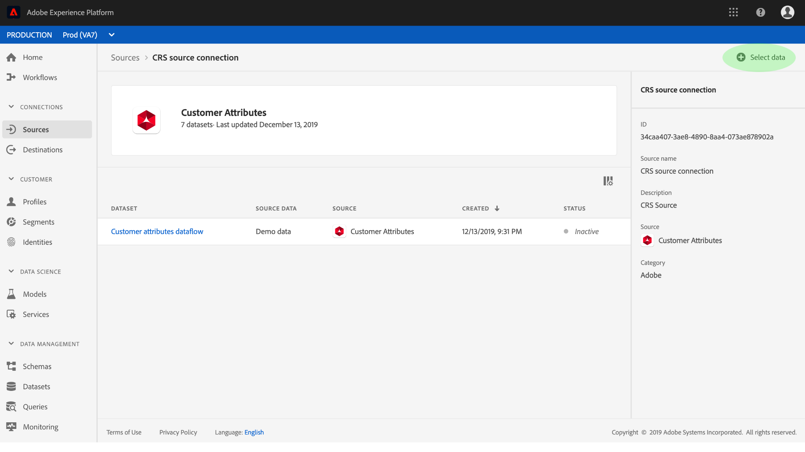
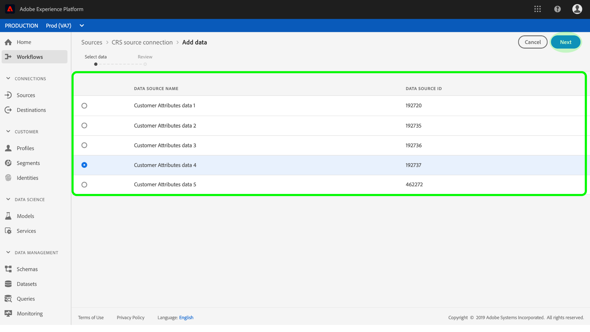

# Create a customer attributes source connector in the UI

This tutorial provides steps for creating a source connector in the UI for collecting customer attributes profile data into Adobe Experience Platform. For more information about customer attributes, see the [overview document](https://docs.adobe.com/content/help/en/core-services/interface/customer-attributes/attributes.html).

## Create a source connection

Log in to [Adobe Experience Platform](https://platform.adobe.com) and then select **[!UICONTROL Sources]** from the left navigation bar to access the sources workspace. The **[!UICONTROL Catalog]** screen displays available sources to create inbound connections with, and each source shows the number of existing connections associated to them. Select the option for **[!UICONTROL Customer Attributes]** and then select **[!UICONTROL Add data]**. Allow some time for the connection to establish, you will be redirected if a connection is successfully made.

>[!NOTE]
>
>If you've already established a source connector for customer attributes profile data, the option to connect with the source will be disabled.

The **Source activity** screen lists all previously established connections for customer attributes profile data, you can create a new connection by clicking **Select data**. 

>[!NOTE]
>
>Multiple inbound connections to a source can be made for bringing in different data. 

From the list of available customer attributes profile datasets, select the one you want to bring into [!DNL Platform] and click **Next**.

>[!NOTE]
>
>Only one dataset can be selected per customer attributes source connection.

The **Review** step appears, allowing you to review your new inbound connection before it is created. Details of the connection are grouped by categories, including:

*   **Source details**: Shows the type of the source connection and the selected source data.
*   **Target details**: When creating other source connectors, this container shows which dataset the source data is ingesting into, including the schema the dataset adheres to. Customer attributes profile data is automatically mapped and ingested into Real-time Customer Profiles.

## Next steps

Once the connection is created, a target schema and dataset is automatically created to contain the incoming data. When the initial ingestion completes, customer attributes profile data can be used by downstream [!DNL Platform] services such as [!DNL Real-time Customer Profile] and [!DNL Segmentation Service]. See the following documents for more details:

* [[!DNL Real-time Customer Profile] overview](../../../../../profile/home.md)
* [[!DNL Segmentation Service] overview](../../../../../segmentation/home.md)
