# Create a [!DNL Marketo Engage] source connection and dataflow for custom activity data in the UI

>[!NOTE]
>
>This tutorial provides specific steps on how to set up and bring **custom activity** data from [!DNL Marketo] to Experience Platform. For steps on how to bring **standard activity** data, read the [[!DNL Marketo] UI guide](./marketo.md).

In addition to [standard activities](../../../../connectors/adobe-applications/mapping/marketo.md#activities), you can also use the [!DNL Marketo] source to bring custom activities data to Adobe Experience Platform. This document provides steps on how to create a source connection and dataflow for custom activity data using the [!DNL Marketo] source in the UI.

## Getting started

This tutorial requires a working understanding of the following components of Adobe Experience Platform:

* [B2B namespaces and schema auto-generation utility](../../../../connectors/adobe-applications/marketo/marketo-namespaces.md): The B2B namespaces and schema auto-generation utility allows you to use [!DNL Postman] to auto-generate values for your B2B namespaces and schemas. You must complete your B2B namespaces and schemas first, before creating a [!DNL Marketo] source connection and dataflow.
* [Sources](../../../../home.md): Experience Platform allows data to be ingested from various sources while providing you with the ability to structure, label, and enhance incoming data using Platform services.
* [Experience Data Model (XDM)](../../../../../xdm/home.md): The standardized framework by which Experience Platform organizes customer experience data.
  * [Create and edit schemas in the UI](../../../../../xdm/ui/resources/schemas.md): Learn how to create and edit schemas in the UI.
* [Identity namespaces](../../../../../identity-service/namespaces.md): Identity namespaces are a component of [!DNL Identity Service] that serve as indicators of the context to which an identity relates. A fully qualified identity includes an ID value and a namespace.
* [[!DNL Real-Time Customer Profile]](/help/profile/home.md): Provides a unified, real-time consumer profile based on aggregated data from multiple sources.
* [Sandboxes](../../../../../sandboxes/home.md): Experience Platform provides virtual sandboxes which partition a single Platform instance into separate virtual environments to help develop and evolve digital experience applications.

## Retrieve your custom activity details

The first step to bringing custom activity data from [!DNL Marketo] to Experience Platform is to retrieve the API name and the display name of your custom activity.

Login to your account using the [[!DNL Marketo]](https://app-sjint.marketo.com/#MM0A1) interface. In the left navigation, under [!DNL Database Management], select **Marketo Custom Activities**.

The interface updates to a display of your custom activities, including information on their respective display names and API names. You can also use the right-rail to select and view other custom activities from your account.

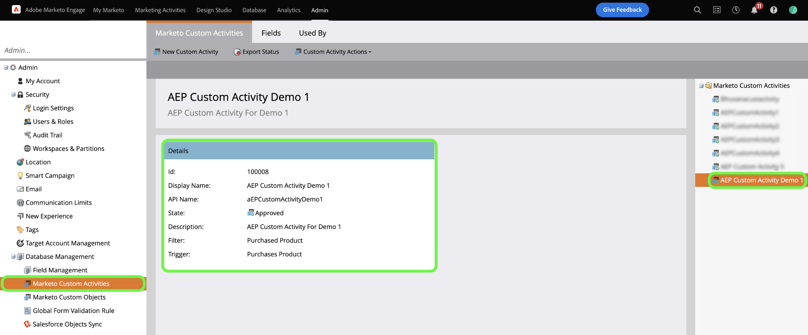

Select **Fields** from the top header to view the fields associated with your custom activity. In this page, you can view the names, API names, descriptions, and data types of the fields in your custom activity. Details regarding individual fields will be used in a later step, when creating a schema.

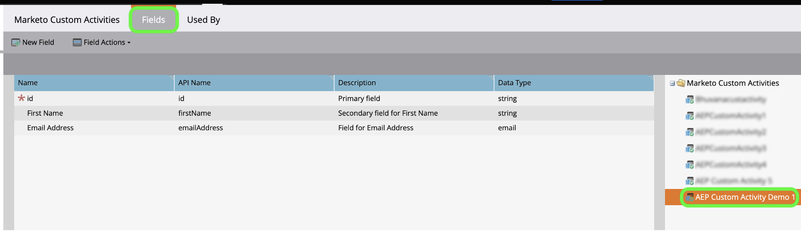

## Set up field groups for custom activities in the B2B activities schema

In the *[!UICONTROL Schemas]* dashboard of the Experience Platform UI, select **[!UICONTROL Browse]** and then select **[!UICONTROL B2B Activity]** from the list of schemas.

>[!TIP]
>
>Use the search bar to expedite your navigation through the list of schemas.

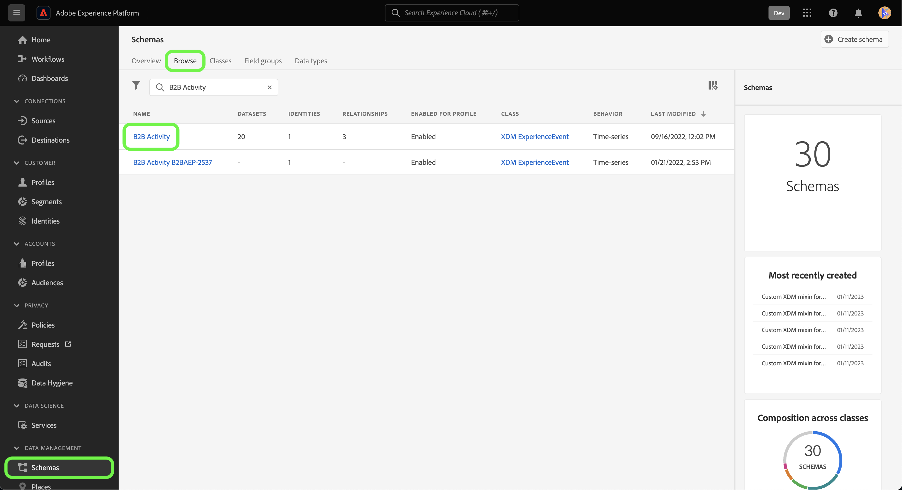

### Create a new field group for custom activity

Next, add a new field group to the [!DNL B2B Activity] schema. This field group should correspond with the custom activity that you want to ingest and should use the custom activity's display name that you retrieved earlier.

To add a new field group, select **[!UICONTROL + Add]** beside the *[!UICONTROL Field groups]* panel under *[!UICONTROL Composition]*.

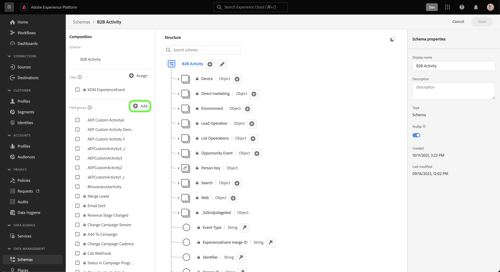

The *[!UICONTROL Add field groups]* window appears. Select **[!UICONTROL Create new field group]** and then provide the same display name for the custom activity that you retrieved in an earlier step and provide an optional description for your new field group. When finished, select **[!UICONTROL Add field groups]**.

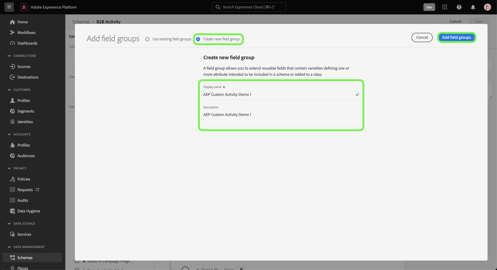

Once created, your new field group for custom activity appears in the [!UICONTROL Field groups] catalog.

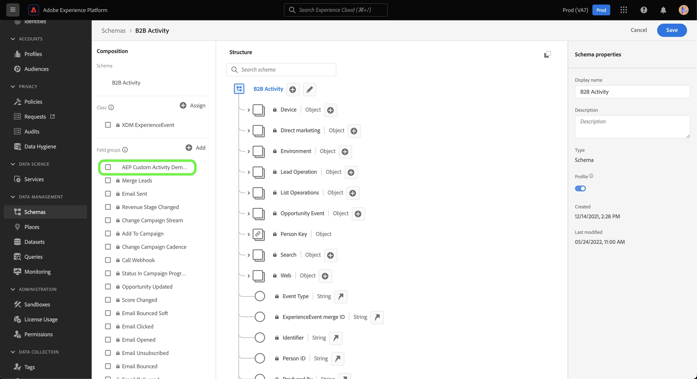

### Add a new field to your schema structure

Next, add a new field to your schema. This new field must be set to `type: object` and will contain the individual fields of the custom activity.

To add a new field, select the plus sign (`+`) beside the schema name. An entry for *[!UICONTROL Untitled Field | Type]* appears. Next, configure properties of your field using the *[!UICONTROL Field properties]* panel. Set the field name to be your custom activity's API name and set the display name to be your custom activity's display name. Then, set the type as `object` and assign the field group to the custom activity field group that you created in the previous step. When finished, select **[!UICONTROL Apply]**.

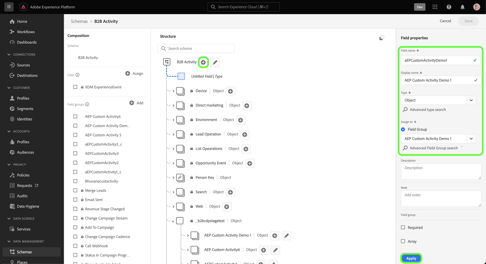

The new field appears in your schema.

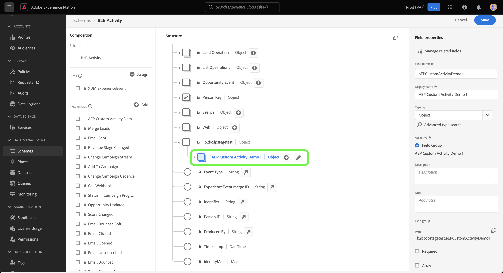

### Add sub-fields to the object field {#add-sub-fields-to-the-object-field}

The last step in preparing your schema is to add individual fields inside the field that you created in the previous step.

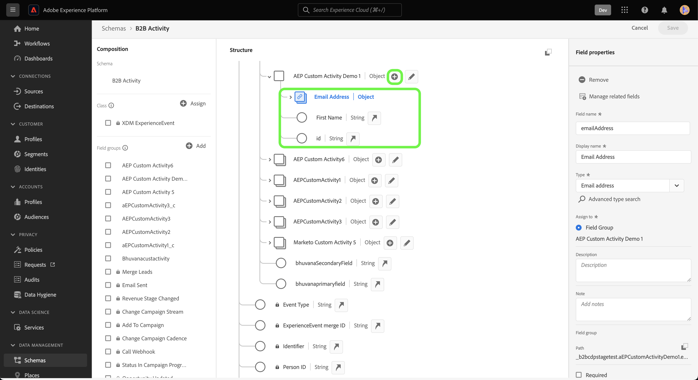

## Create a dataflow 

With your schema setup complete, you can now proceed to create a dataflow for your custom activity data.

In the Platform UI, select **[!UICONTROL Sources]** from the left navigation bar to access the [!UICONTROL Sources] workspace. The [!UICONTROL Catalog] screen displays a variety of sources with which you can create an account.

You can select the appropriate category from the catalog on the left-hand side of your screen. Alternatively, you can find the specific source you wish to work with using the search bar.

Under the [!UICONTROL Adobe applications] category, select **[!UICONTROL Marketo Engage]**. Then, select **[!UICONTROL Add data]** to create a new [!DNL Marketo] dataflow.

### Select data

Select **[!UICONTROL Activities]** from the list of [!DNL Marketo] datasets and then select **[!UICONTROL Next]**.

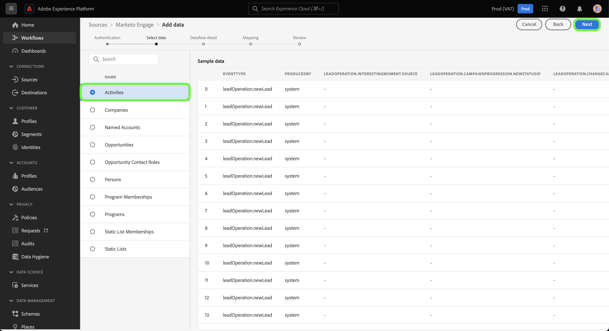

### Dataflow detail

Next, [provide information for your dataflow](./marketo.md#provide-dataflow-details), including names and descriptions for your dataset and dataflow, the schema that you will be using, and configurations for [!DNL Profile] ingestion, error diagnostics, and partial ingestion.

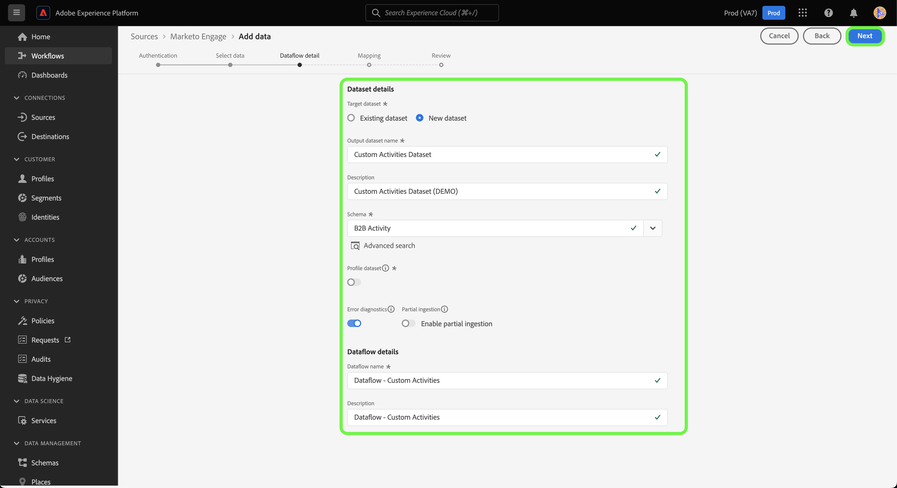

### Mapping

Mappings for standard activity fields are auto-populated, but custom activity fields must be mapped to their corresponding target fields manually. 

To start mapping your custom activity fields, select **[!UICONTROL New field type]** and then select **[!UICONTROL Add new field]**.

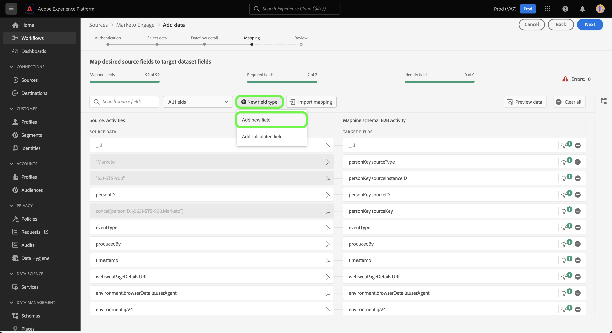

Navigate through the source data structure and find the custom activity field that you want to ingest. When finished, select **[!UICONTROL Select]**.

>[!TIP]
>
>To avoid confusion and handle duplicate field names, custom activity fields are prefixed with the API name.

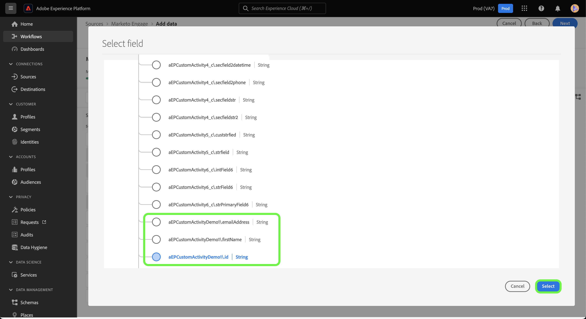

To add a target field, select the schema icon  and then select the [fields that you created in an earlier step](#add-sub-fields-to-the-object-field).

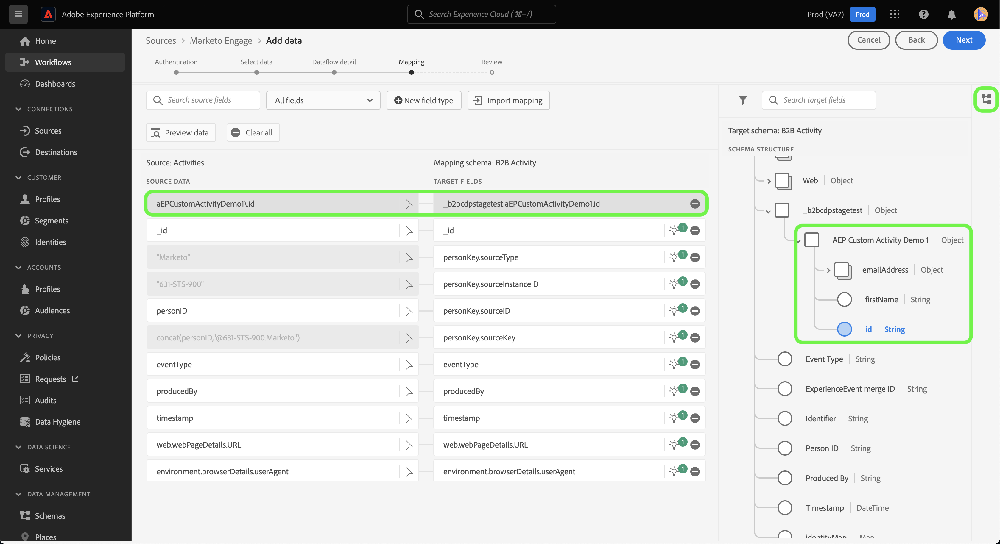

Repeat the steps to add the rest of your custom activity mapping fields. When finished, select **[!UICONTROL Next]**.

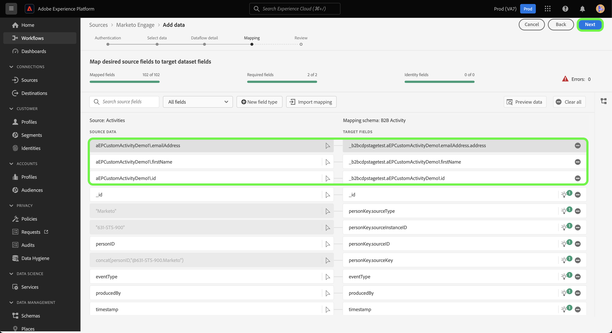

### Review

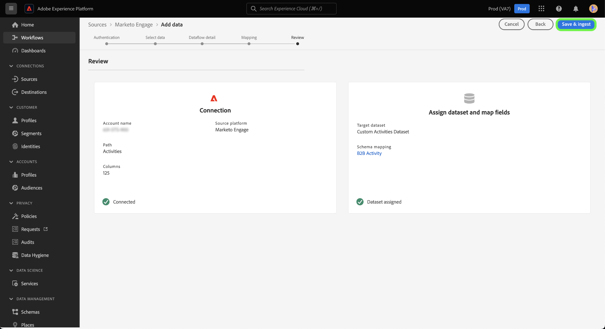