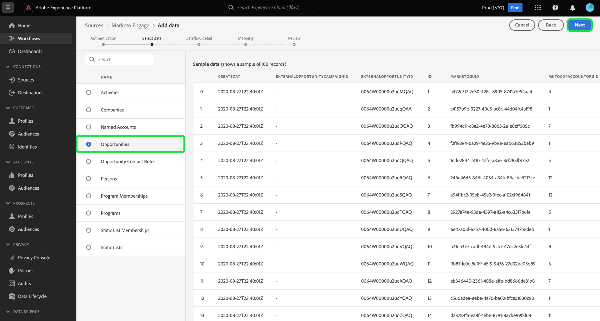
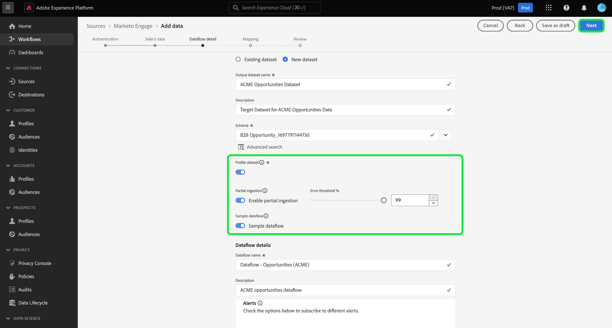
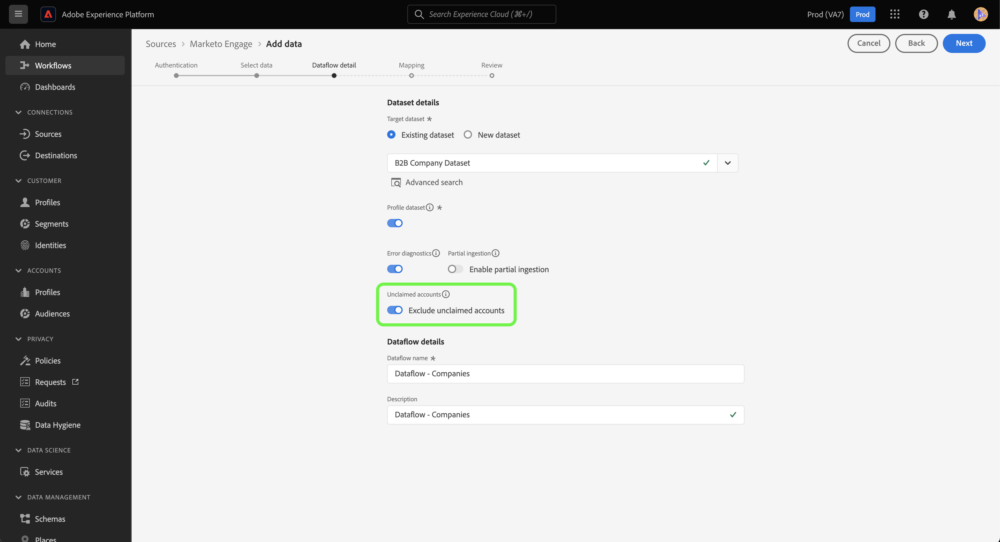
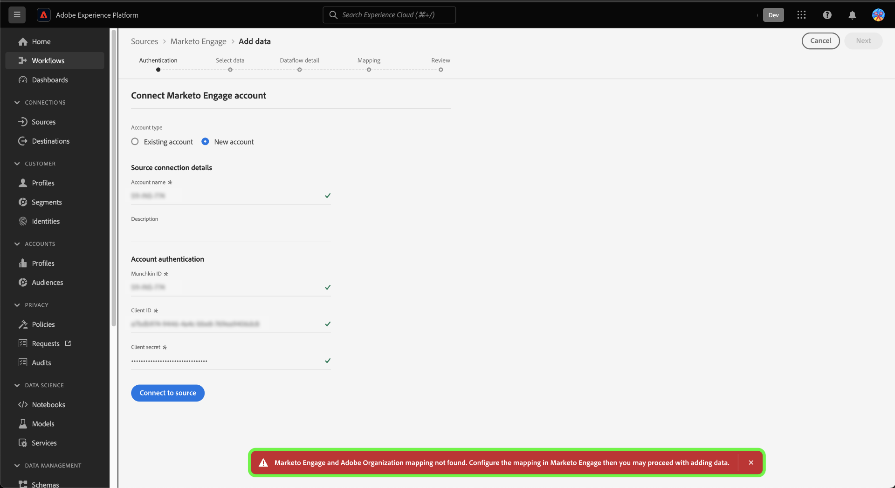
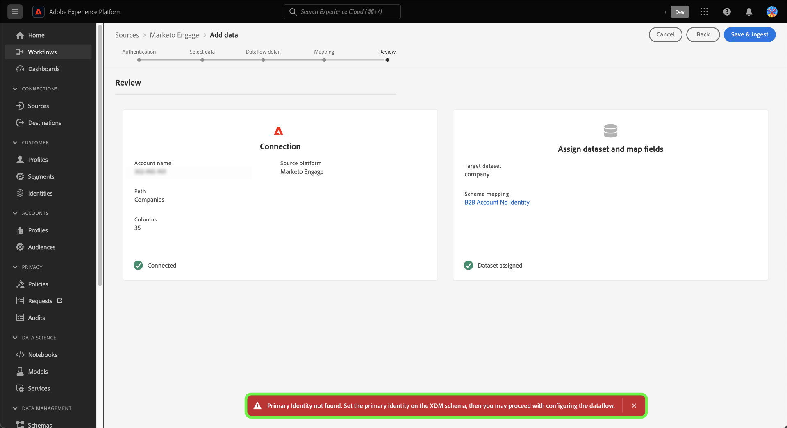

# Create a [!DNL Marketo Engage] source connection and dataflow in the UI

>[!IMPORTANT]
>
>Before creating a [!DNL Marketo Engage] source connection and a dataflow, you must first ensure that you have [mapped your Adobe Organization ID](https://experienceleague.adobe.com/docs/marketo/using/product-docs/core-marketo-concepts/miscellaneous/set-up-adobe-organization-mapping.html) in [!DNL Marketo]. Furthermore, you must also ensure that you have completed [auto-populating your [!DNL Marketo] B2B namespaces and schemas](../../../../connectors/adobe-applications/marketo/marketo-namespaces.md) prior to creating a source connection and a dataflow.

This tutorial provides steps for creating a [!DNL Marketo Engage] (hereinafter referred to as "[!DNL Marketo]") source connector in the UI to bring B2B data into Adobe Experience Platform.

## Get started

This tutorial requires a working understanding of the following components of Adobe Experience Platform:

* [B2B namespaces and schema auto-generation utility](../../../../connectors/adobe-applications/marketo/marketo-namespaces.md): The B2B namespaces and schema auto-generation utility allows you to use [!DNL Postman] to auto-generate values for your B2B namespaces and schemas. You must complete your B2B namespaces and schemas first, before creating a [!DNL Marketo] source connection and dataflow.
* [Sources](../../../../home.md): Experience Platform allows data to be ingested from various sources while providing you with the ability to structure, label, and enhance incoming data using Platform services.
* [Experience Data Model (XDM)](../../../../../xdm/home.md): The standardized framework by which Experience Platform organizes customer experience data.
  * [Create and edit schemas in the UI](../../../../../xdm/ui/resources/schemas.md): Learn how to create and edit schemas in the UI.
* [Identity namespaces](../../../../../identity-service/features/namespaces.md): Identity namespaces are a component of [!DNL Identity Service] that serve as indicators of the context to which an identity relates. A fully qualified identity includes an ID value and a namespace.
* [[!DNL Real-Time Customer Profile]](/help/profile/home.md): Provides a unified, real-time consumer profile based on aggregated data from multiple sources.
* [Sandboxes](../../../../../sandboxes/home.md): Experience Platform provides virtual sandboxes which partition a single Platform instance into separate virtual environments to help develop and evolve digital experience applications.

### Gather required credentials

In order to access your [!DNL Marketo] account on Experience Platform, you must provide the following values:

| Credential | Description |
| ---- | ---- |
| `munchkinId` |  The Munchkin ID is the unique identifier for a specific [!DNL Marketo] instance. |
| `clientId` | The unique client ID of your [!DNL Marketo] instance. |
| `clientSecret` | The unique client secret of your [!DNL Marketo] instance. |

For more information on acquiring these values, refer to the [[!DNL Marketo] authentication guide](../../../../connectors/adobe-applications/marketo/marketo-auth.md).

Once you have gathered your required credentials, you can follow the steps in the next section.

## Connect your [!DNL Marketo] account

In the Experience Platform UI, select **[!UICONTROL Sources]** from the left navigation to access the [!UICONTROL Sources] workspace. You can select the appropriate category from the catalog on the left-hand side of your screen. Alternatively, you can find the specific source you wish to work with using the search option.

Under the *Adobe applications* category, select **[!UICONTROL Marketo Engage]**, and then select **[!UICONTROL Add data]**.

>[!TIP]
>
>Sources in the sources catalog display the **[!UICONTROL Set up]** option when a given source does not yet have an authenticated account. Once an authenticated account exists, this option changes to **[!UICONTROL Add data]**.

The **[!UICONTROL Connect Marketo Engage account]** page appears. On this page, you can either use a new account or access an existing account.

>[!BEGINTABS]

>[!TAB Create a new account]

To create a new account, select **[!UICONTROL New account]** and provide a name, an optional description, and your credentials. 

When finished, select **[!UICONTROL Connect to source]** and then allow some time for the new connection to establish.

>[!TAB Use an existing account]

To use an existing account, select **[!UICONTROL Existing account]** and then select the account that you want to use from the existing account catalog.

Select **[!UICONTROL Next]** to proceed.

>[!ENDTABS]

## Select a dataset

After creating your [!DNL Marketo] account, the next step provides an interface for you to explore [!DNL Marketo] datasets.

The left half of the interface is a directory browser, displaying the 10 [!DNL Marketo] datasets. A fully-functioning [!DNL Marketo] source connection requires the ingestion of the nine different datasets. If you are also using the [!DNL Marketo] account-based marketing (ABM) feature, then you must also create a 10th dataflow to ingest the [!UICONTROL Named Accounts] dataset.

>[!NOTE]
>
>For the purposes of brevity, the following tutorial uses [!UICONTROL Opportunities] as an example, but the steps outlined below apply to any of the 10 [!DNL Marketo] datasets.

Select the dataset that you want to ingest. This updates the interface to display a preview of your dataset. When finished, select **[!UICONTROL Next]**.

## Provide dataset and dataflow details {#provide-dataset-and-dataflow-details}

Next, you must provide information on your dataset and your dataflow. 

### Dataset details {#dataset-details}

A dataset is a storage and management construct for a collection of data, typically a table, that contains a schema (columns) and fields (rows). Data that is successfully ingested into Experience Platform is stored within the data lake as datasets. During this step, you can create a new dataset or use an existing dataset.

>[!BEGINTABS]

>[!TAB Use a new dataset]

To use a new dataset, select **[!UICONTROL New dataset]** and then provide a name, and an optional description for your dataset. You must also select an Experience Data Model (XDM) schema that your dataset adheres to.

>[!TAB Use an existing dataset]

If you already have an existing dataset, select **[!UICONTROL Existing dataset]** and then use the **[!UICONTROL Advanced search]** option to view a window of all datasets in your organization, including their respective details, such as whether they are enabled for ingestion to Real-Time Customer Profile or not.

>[!ENDTABS]

### Dataflow configurations {#dataflow-configurations}

>[!IMPORTANT]
>
>The [!DNL Marketo] source uses batch ingestion to ingest all historical records and uses streaming ingestion for real-time updates. This allows the source to continue streaming while ingesting any erroneous records. Enable the **[!UICONTROL Partial ingestion]** toggle and then set the [!UICONTROL Error threshold %] to maximum to prevent the dataflow from failing.

If your dataset is enabled for Real-Time Customer Profile, then during this step, you can toggle **[!UICONTROL Profile dataset]** to enable your data for Profile-ingestion. You can also use this step to enable **[!UICONTROL Error diagnostics]** and **[!UICONTROL Partial ingestion]**.

* **[!UICONTROL Error diagnostics]**: Select **[!UICONTROL Error diagnostics]** to instruct the source to produce error diagnostics that you can later reference when monitoring your dataset activity and dataflow status.
* **[!UICONTROL Partial ingestion]**: [Partial batch ingestion](../../../../../ingestion/batch-ingestion/partial.md) is the ability to ingest data containing errors, up to a certain configurable threshold. This feature allows you to successfully ingest all of your accurate data into Experience Platform, while all of your incorrect data is batched separately with information on why it is invalid.

During this step, you can enable **[!UICONTROL Sample dataflow]** to limit data ingestion and avoid additional costs that come with ingesting all historical data, including Person identities. 

>[!BEGINSHADEBOX]

**Quick guide on using sample dataflow**

Sample dataflow is a configuration that you can set for your [!DNL Marketo] dataflow to limit your ingestion rate and then try out Experience Platform features without having to ingest large amounts of data.

* Enable sample dataflow to limit historical data by ingesting up to 100k (from the largest record ID) records or up to the last 10 days of activity during the backfill job.
* When using the sample dataflow configuration for all B2B entities, you must consider that it is possible that some related records may be missing because the entire history of the source data does not get ingested.

>[!ENDSHADEBOX]

Additionally, if you are ingesting data from the companies dataset, you can enable **[!UICONTROL Exclude unclaimed accounts]** to exclude unclaimed accounts from ingestion.

When individuals fill out a form, [!DNL Marketo] creates a phantom account record based on the Company Name that contains no other data. For new dataflows, the toggle to exclude unclaimed accounts is enabled by default. For existing dataflows, you can enable or disable the feature, with changes applying to newly ingested data and not existing data.

## Map your [!DNL Marketo] dataset source fields to target XDM fields

The [!UICONTROL Mapping] step appears, providing you with an interface to map the source fields from your source schema to their appropriate target XDM fields in the target schema.

Each [!DNL Marketo] dataset has its own specific mapping rules to follow. See the following for more information on how to map [!DNL Marketo] datasets to XDM:

* [Activities](../../../../connectors/adobe-applications/mapping/marketo.md#activities)
* [Programs](../../../../connectors/adobe-applications/mapping/marketo.md#programs)
* [Program memberships](../../../../connectors/adobe-applications/mapping/marketo.md#program-memberships)
* [Companies](../../../../connectors/adobe-applications/mapping/marketo.md#companies)
* [Static lists](../../../../connectors/adobe-applications/mapping/marketo.md#static-lists)
* [Static list memberships](../../../../connectors/adobe-applications/mapping/marketo.md#static-list-memberships)
* [Named Accounts](../../../../connectors/adobe-applications/mapping/marketo.md#named-accounts)
* [Opportunities](../../../../connectors/adobe-applications/mapping/marketo.md#opportunities)
* [Opportunity contact roles](../../../../connectors/adobe-applications/mapping/marketo.md#opportunity-contact-roles)
* [Persons](../../../../connectors/adobe-applications/mapping/marketo.md#persons)

Based on your needs, you can choose to map fields directly, or use data prep functions to transform source data to derive computed or calculated values. For comprehensive steps on using the mapping interface, see the [Data Prep UI guide](../../../../../data-prep/ui/mapping.md).

Once your mapping sets are ready, select **[!UICONTROL Next]** and allow for a few moments for the new dataflow to be created.

## Review your dataflow

The **[!UICONTROL Review]** step appears, allowing you to review your new dataflow before it is created. Details are grouped within the following categories:

* **[!UICONTROL Connection]**: Shows the source type, the relevant path of the chosen source entity, and the amount of columns within that source entity.
* **[!UICONTROL Assign dataset & map fields]**: Shows which dataset the source data is being ingested into, including the schema that the dataset adheres to.

Once you have reviewed your dataflow, select **[!UICONTROL Save & ingest]** and allow some time for the dataflow to be created.

## Monitor your dataflow

Once your dataflow has been created, you can monitor the data that is being ingested through it to see information on ingestion rates, success, and errors. For more information on how to monitor dataflows, see the tutorial on [monitoring dataflows in the UI](../../../../../dataflows/ui/monitor-sources.md).

## Delete your attributes

Custom attributes in datasets cannot be retroactively hidden or removed. If you want to hide or remove a custom attribute from an existing dataset, then you must create a new dataset without this custom attribute, a new XDM schema, and configure a new dataflow for the new dataset that you create. You must also disable or delete the original dataflow that consists of the dataset with the custom attribute you want to hide or remove.

## Delete your dataflow

You can delete dataflows that are no longer necessary or were incorrectly created using the **[!UICONTROL Delete]** function available in the [!UICONTROL Dataflows] workspace. For more information on how to delete dataflows, see the tutorial on [deleting dataflows in the UI](../../delete.md).

## Next steps

By following this tutorial, you have successfully created a dataflow to ingest B2B data from your [!DNL Marketo Engage] source to Experience Platform.

## Appendix {#appendix}

The following sections provide additional guidelines that you may follow when using the [!DNL Marketo] source.

### Error messages in the UI {#error-messages}

The following error messages are displayed in the UI when Platform detects issues with your setup:

#### [!DNL Munchkin ID] is not mapped to the appropriate organization

Authentication will be denied if your [!DNL Munchkin ID] is not mapped to the Platform organization that you are using. Configure the mapping between your [!DNL Munchkin ID] and your organization using the [[!DNL Marketo] interface](https://app-sjint.marketo.com/#MM0A1).

#### Primary identity is missing

A dataflow will fail to save and ingest if a primary identity is missing. Ensure that [a primary identity exists within your XDM schema](../../../../../xdm/tutorials/create-schema-ui.md), before attempting to configure a dataflow.

