# Create a [!DNL Marketo Engage] source connector in the UI

>[!IMPORTANT]
>
>Before creating a [!DNL Marketo Engage] source connection and a dataflow, you must first ensure that you have [mapped your Adobe IMS Organization ID](https://experienceleague.adobe.com/docs/marketo/using/product-docs/core-marketo-concepts/miscellaneous/set-up-adobe-organization-mapping.html?lang=en) in [!DNL Marketo]. Furthermore, you must also ensure that you have completed [auto-populating your [!DNL Marketo] B2B namespaces and schemas](../../../../connectors/adobe-applications/marketo/marketo-namespaces.md) prior to creating a source connection and a dataflow.

This tutorial provides steps for creating a [!DNL Marketo Engage] (hereinafter referred to as "[!DNL Marketo]") source connector in the UI to bring B2B data into Adobe Experience Platform.

## Getting started

This tutorial requires a working understanding of the following components of Adobe Experience Platform:

* [B2B namespaces and schema auto-generation utility](../../../../connectors/adobe-applications/marketo/marketo-namespaces.md): The B2B namespaces and schema auto-generation utility allows you to use [!DNL Postman] to auto-generate values for your B2B namespaces and schemas. You must complete your B2B namespaces and schemas first, before creating a [!DNL Marketo] source connection and dataflow.
* [Sources](../../../../home.md): Experience Platform allows data to be ingested from various sources while providing you with the ability to structure, label, and enhance incoming data using Platform services.
* [Experience Data Model (XDM)](../../../../../xdm/home.md): The standardized framework by which Experience Platform organizes customer experience data.
  * [Create and edit schemas in the UI](../../../../../xdm/ui/resources/schemas.md): Learn how to create and edit schemas in the UI.
* [Identity namespaces](../../../../../identity-service/namespaces.md): Identity namespaces are a component of [!DNL Identity Service] that serve as indicators of the context to which an identity relates. A fully qualified identity includes an ID value and a namespace.
* [[!DNL Real-time Customer Profile]](/help/profile/home.md): Provides a unified, real-time consumer profile based on aggregated data from multiple sources.
* [Sandboxes](../../../../../sandboxes/home.md): Experience Platform provides virtual sandboxes which partition a single Platform instance into separate virtual environments to help develop and evolve digital experience applications.

### Gather required credentials

In order to access your [!DNL Marketo] account on Platform, you must provide the following values:

| Credential | Description |
| ---------- | ----------- |
| `munchkinId` |  The Munchkin ID is the unique identifier for a specific [!DNL Marketo] instance. |
| `clientId` | The unique client ID of your [!DNL Marketo] instance. |
| `clientSecret` | The unique client secret of your [!DNL Marketo] instance. |

For more information on acquiring these values, refer to the [[!DNL Marketo] authentication guide](../../../../connectors/adobe-applications/marketo/marketo-auth.md).

Once you have gathered your required credentials, you can follow the steps in the next section.

## Connect your [!DNL Marketo] account

In the Platform UI, select **[!UICONTROL Sources]** from the left navigation bar to access the [!UICONTROL Sources] workspace. The [!UICONTROL Catalog] screen displays a variety of sources for which you can create an account with.

You can select the appropriate category from the catalog on the left-hand side of your screen. Alternatively, you can find the specific source you wish to work with using the search bar.

Under the [!UICONTROL Adobe applications] category, select **[!UICONTROL Marketo Engage]**. Then, select **[!UICONTROL Add data]** to create a new [!DNL Marketo] dataflow.

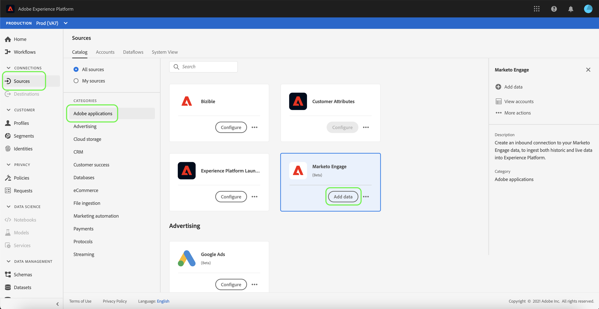

The **[!UICONTROL Connect Marketo Engage account]** page appears. On this page, you can either use a new account or access an existing account.

### Existing account

To create a dataflow with an existing account, select **[!UICONTROL Existing account]** and then select the [!DNL Marketo] account you want to use. Select **[!UICONTROL Next]** to proceed.

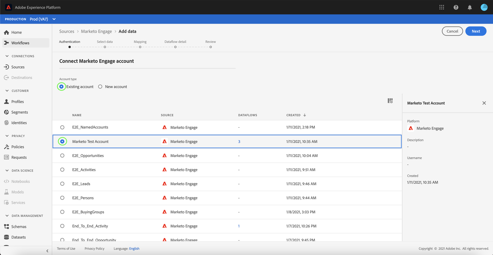

### New account

If you are creating a new account, select **[!UICONTROL New account]**. On the input form that appears, provide an account name, an optional description, and your [!DNL Marketo] authentication credentials. When finished, select **[!UICONTROL Connect to source]** and then allow some time for the new connection to establish.

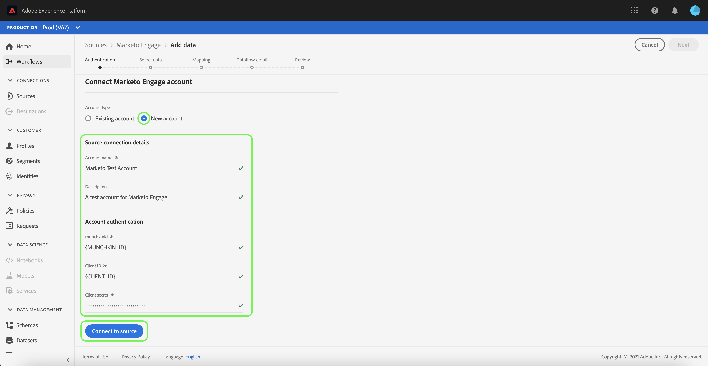

## Select a dataset

After creating your [!DNL Marketo] account, the next step provides an interface for you to explore [!DNL Marketo] datasets.

The left half of the interface is a directory browser, displaying the 10 [!DNL Marketo] datasets. A fully-functioning [!DNL Marketo] source connection requires the ingestion of the nine different datasets. If you are also using the [!DNL Marketo] account-based marketing (ABM) feature, then you must also create a 10th dataflow to ingest the [!UICONTROL Named Accounts] dataset.

>[!NOTE]
>
>For the purposes of brevity, the following tutorial uses [!UICONTROL Opportunities] as an example, but the steps outlined below apply to any of the 10 [!DNL Marketo] datasets.

Select the dataset you wish to ingest first, then select **[!UICONTROL Next]**.

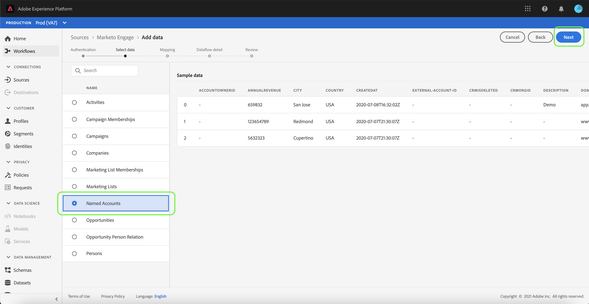

## Provide dataflow details

The [!UICONTROL Dataflow detail] page allows you to select whether you want to use an existing dataset or a new dataset. During this process, you can also configure settings for [!UICONTROL Profile dataset], [!UICONTROL Error diagnostics], [!UICONTROL Partial ingestion], and [!UICONTROL Alerts]. 

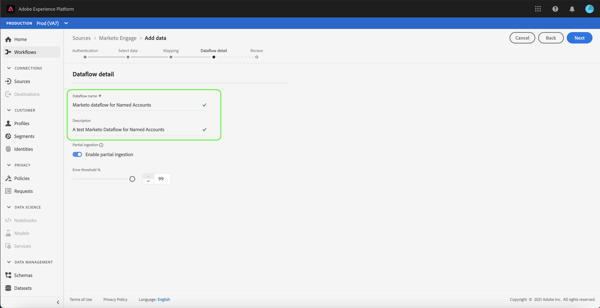

### Use an existing dataset

To ingest data into an existing dataset, select **[!UICONTROL Existing dataset]**. You can either retrieve an existing dataset using the [!UICONTROL Advanced search] option or by scrolling through the list of existing datasets in the dropdown menu. Once you have selected a dataset, provide a name and a description for your dataflow.

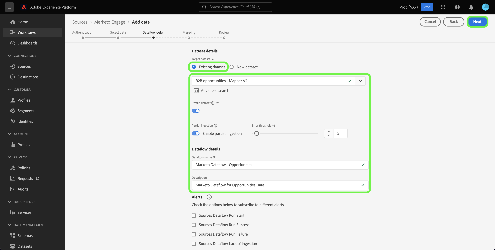

### Use a new dataset

To ingest into a new dataset, select **[!UICONTROL New dataset]** and then provide an output dataset name and an optional description. Next, select a schema to map to using the [!UICONTROL Advanced search] option or by scrolling through the list of existing schemas in the dropdown menu. Once you have selected a schema, provide a name and a description for your dataflow.

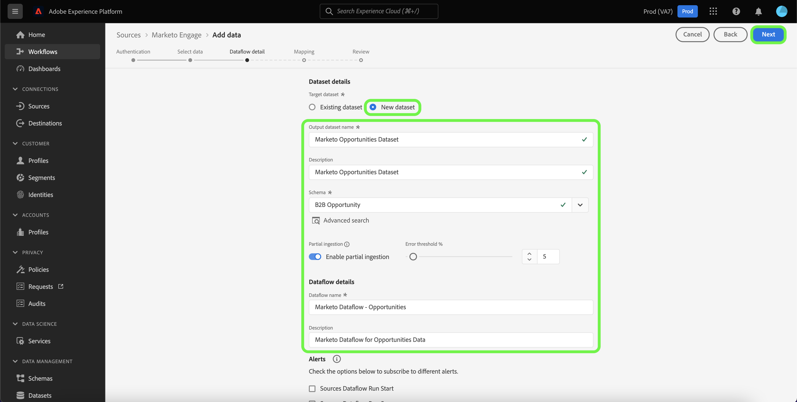

### Enable [!DNL Profile] and error diagnostics

Next, select the **[!UICONTROL Profile dataset]** toggle to enable your dataset for [!DNL Profile]. This allows you to create a holistic view of an entity's attributes and behaviors. Data from all [!DNL Profile]-enabled datasets will be included in [!DNL Profile] and changes are applied when you save your dataflow.

[!UICONTROL Error diagnostics] enables detailed error message generation for any erroneous records that occur in your dataflow, while [!UICONTROL Partial ingestion] allows you to ingest data containing errors, up to a certain threshold that you manually define. See the [partial batch ingestion overview](../../../../../ingestion/batch-ingestion/partial.md) for more information.

>[!IMPORTANT]
>
>The [!DNL Marketo] connector uses batch ingestion to ingest all historical records and uses streaming ingestion for real-time updates. This allows the connector to continue streaming while ingesting any erroneous records. Enable the **[!UICONTROL Partial ingestion]** toggle and then set the [!UICONTROL Error threshold %] to maximum to prevent the dataflow from failing.

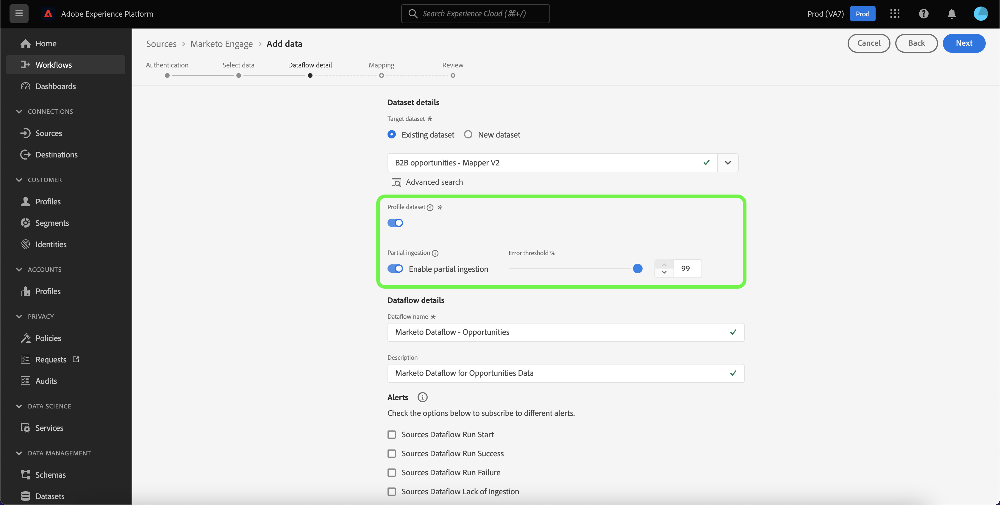

### Enable alerts

You can enable alerts to receive notifications on the status of your dataflow. Select an alert from the list to subscribe to receive notifications on the status of your dataflow. For more information on alerts, see the guide on [subscribing to sources alerts using the UI](../../alerts.md).

When you are finished providing details to your dataflow, select **[!UICONTROL Next]**.

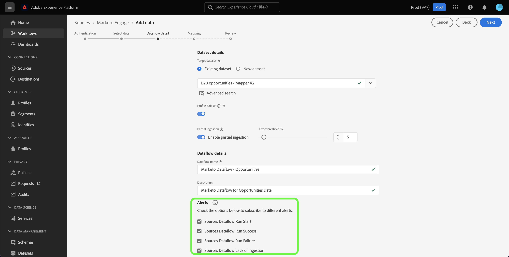

## Map your [!DNL Marketo] dataset source fields to target XDM fields

The [!UICONTROL Mapping] step appears, providing you with an interface to map the source fields from your source schema to their appropriate target XDM fields in the target schema.

Each [!DNL Marketo] dataset has its own specific mapping rules to follow. See the following for more information on how to map [!DNL Marketo] datasets to XDM:

* [Activities](../../../../connectors/adobe-applications/mapping/marketo.md#activities)
* [Programs](../../../../connectors/adobe-applications/mapping/marketo.md#programs)
* [Program memberships](../../../../connectors/adobe-applications/mapping/marketo.md#program-memberships)
* [Companies](../../../../connectors/adobe-applications/mapping/marketo.md#companies)
* [Static lists](../../../../connectors/adobe-applications/mapping/marketo.md#static-lists)
* [Static list memberships](../../../../connectors/adobe-applications/mapping/marketo.md#static-list-memberships)
* [Named Accounts](../../../../connectors/adobe-applications/mapping/marketo.md#named-accounts)
* [Opportunities](../../../../connectors/adobe-applications/mapping/marketo.md#opportunities)
* [Opportunity contact roles](../../../../connectors/adobe-applications/mapping/marketo.md#opportunity-contact-roles)
* [Persons](../../../../connectors/adobe-applications/mapping/marketo.md#persons)

Based on your needs, you can choose to map fields directly, or use data prep functions to transform source data to derive computed or calculated values. For comprehensive steps on using the mapping interface, see the [Data Prep UI guide](../../../../../data-prep/ui/mapping.md).

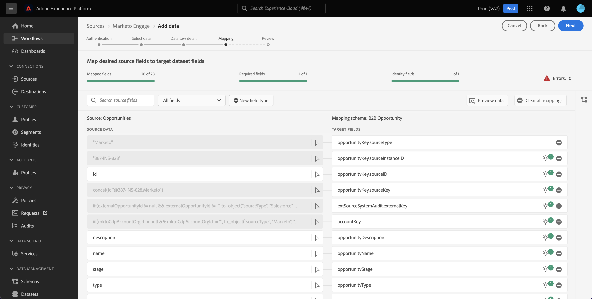

Once your mapping sets are ready, select **[!UICONTROL Next]** and allow for a few moments for the new dataflow to be created.

## Review your dataflow

The **[!UICONTROL Review]** step appears, allowing you to review your new dataflow before it is created. Details are grouped within the following categories:

* **[!UICONTROL Connection]**: Shows the source type, the relevant path of the chosen source entity, and the amount of columns within that source entity.
* **[!UICONTROL Assign dataset & map fields]**: Shows which dataset the source data is being ingested into, including the schema that the dataset adheres to.

Once you have reviewed your dataflow, select **[!UICONTROL Save & ingest]** and allow some time for the dataflow to be created.

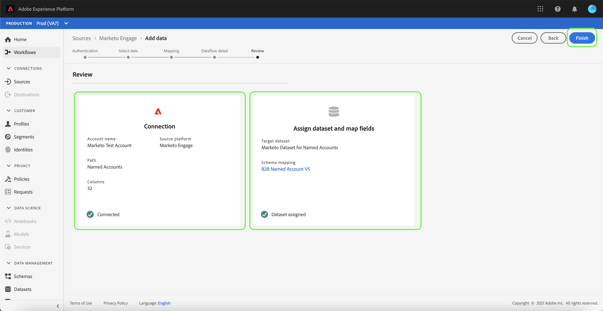

## Monitor your dataflow

Once your dataflow has been created, you can monitor the data that is being ingested through it to see information on ingestion rates, success, and errors. For more information on how to monitor dataflows, see the tutorial on [monitoring dataflows in the UI](../../../../../dataflows/ui/monitor-sources.md).

## Delete your attributes

Custom attributes in datasets cannot be retroactively hidden or removed. If you want to hide or remove a custom attribute from an existing dataset, then you must create a new dataset without this custom attribute, a new XDM schema, and configure a new dataflow for the new dataset that you create. You must also disable or delete the original dataflow that consists of the dataset with the custom attribute you want to hide or remove.

## Delete your dataflow

You can delete dataflows that are no longer necessary or were incorrectly created using the **[!UICONTROL Delete]** function available in the [!UICONTROL Dataflows] workspace. For more information on how to delete dataflows, see the tutorial on [deleting dataflows in the UI](../../delete.md).

## Next steps

By following this tutorial, you have successfully created a dataflow to bring in [!DNL Marketo] data. Incoming data can now be used by downstream Platform services such as [!DNL Real-time Customer Profile] and [!DNL Data Science Workspace]. See the following documents for more details:

* [[!DNL Real-time Customer Profile] overview](/help/profile/home.md)
* [[!DNL Data Science Workspace] overview](/help/data-science-workspace/home.md)
