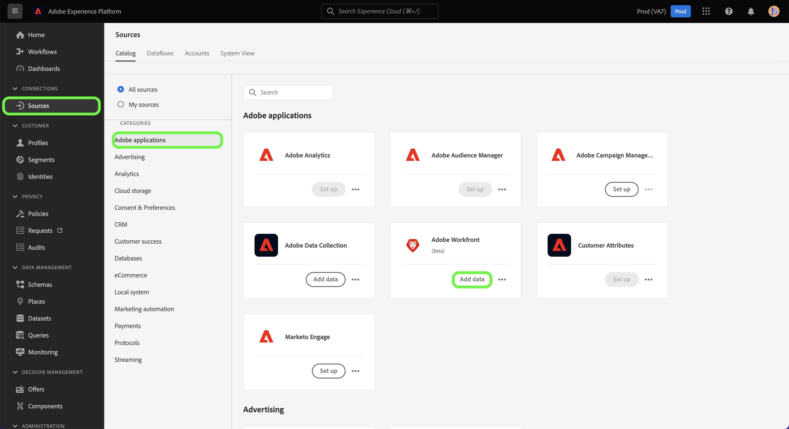
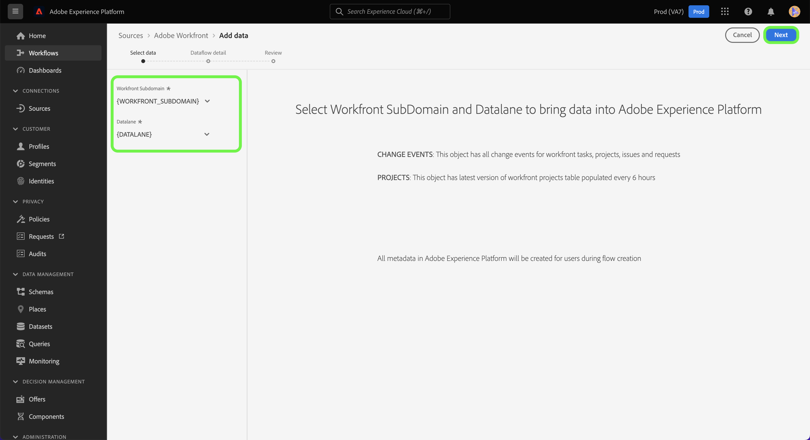
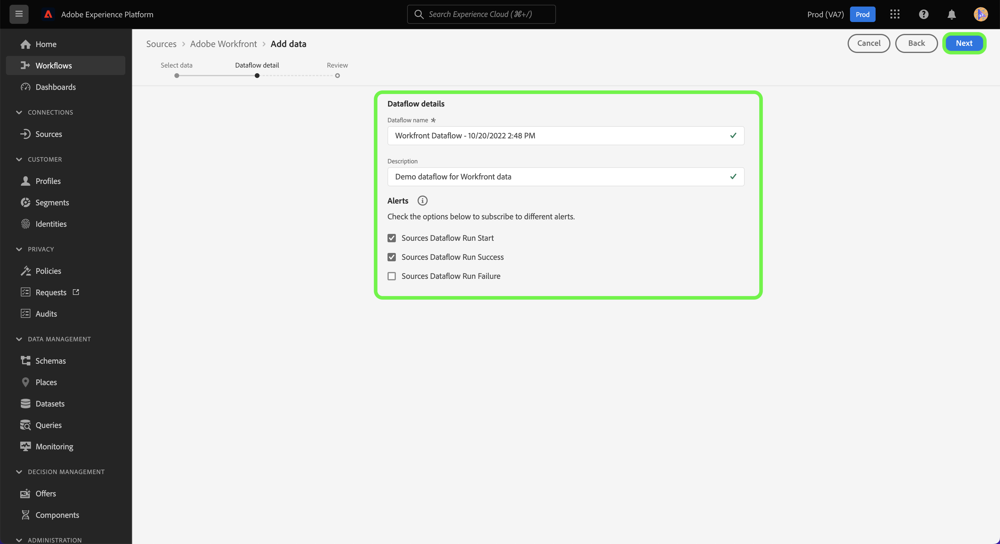
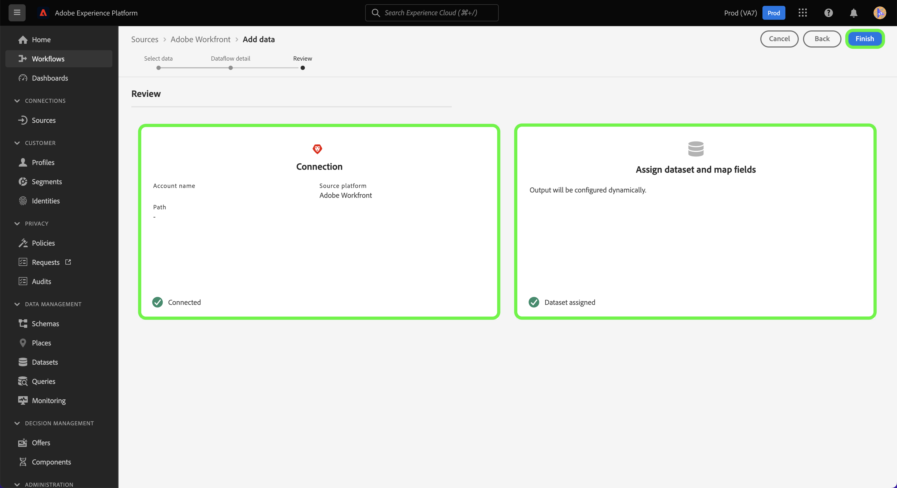

# (Beta) Create an Adobe Workfront source connection in the UI

>[!NOTE]
>
>The Adobe Workfront source is in beta. See the [sources overview](../../../../home.md#terms-and-conditions) for more information on using beta-labelled sources.

This tutorial provides steps to create an Adobe Workfront source connection to bring your Workfront data to Adobe Experience Platform using the user interface.

## Getting started

>[!IMPORTANT]
>
>You must be configured as an administrator in the Adobe Admin Console to access the Workfront source.

This tutorial requires a working understanding of the following components of Experience Platform:

* [Experience Data Model (XDM) System](../../../../../xdm/home.md): The standardized framework by which Experience Platform organizes customer experience data.
* [Real-time Customer Profile](../../../../../profile/home.md): Provides a unified, real-time consumer profile based on aggregated data from multiple sources.
* [Sandboxes](../../../../../sandboxes/home.md): Experience Platform provides virtual sandboxes which partition a single Platform instance into separate virtual environments to help develop and evolve digital experience applications.

## Create a Workfront source connection in the UI

In the Platform UI, select **[!UICONTROL Sources]** from the left navigation to access the [!UICONTROL Sources] workspace. The [!UICONTROL Catalog] screen displays a variety of sources that can be used to create an account.

You can select the appropriate category from the catalog on the left-hand side of your screen. You can also use the search bar to narrow down the displayed sources.

Under the **[!UICONTROL Adobe applications]** category, select **[!UICONTROL Adobe Workfront]** and then select **[!UICONTROL Add data]**.

## Select data

The [!UICONTROL Select data] step appears. Here, you must provide values for your Workfront subdomain and Datalane. Your Workfront subdomain is the same URL that you use to access your Workfront instance, for example `https://acme.workfront.com/`, while your datalane represents the workfront environment that you want to use.

Once you have added your subdomain and datalane, select **[!UICONTROL Next]**.

## Provide dataflow details

The dataflow detail step allows you to provide a name and an optional description for your dataflow. During this step, you can also subscribe to alerts to receive notifications regarding the status of your dataflow. For more information on alerts, visit the tutorial on [subscribing to alerts in the sources UI](../../alerts.md).

Once you have provided your dataflow details and configured your desired alert settings, select **[!UICONTROL Next]**.

## Review

The **[!UICONTROL Review]** step appears, allowing you to review your new dataflow before it is created. Details are grouped within the following categories:

* **[!UICONTROL Connection]**: Shows the source type, the relevant path of the chosen source file, and the amount of columns within that source file.
* **[!UICONTROL Assign dataset & map fields]**: Shows which dataset the source data is being ingested into, including the schema that the dataset adheres to.

Once you have reviewed your dataflow, select **[!UICONTROL Finish]** and allow some time for the dataflow to be created.

## Appendix

The following sections provide additional information on the Workfront source.

### Workfront Change Event Schema

Workfront data in Platform is represented as time-series record data, where each row in the data has a timestamp displaying when the event occurred and the attributes that are related to that event.

During setup, a schema named Workfront Change Events from Flow is created. 

| Schema field | Description |
| --- | --- |
| `timestamp` | The time in which the selected event occurred. The timestamp is represented in GTM timezone. |
| `_workfront.objectType` | The object type. Available values can include `project`, `task`, `portfolio`, and others, depending on the object that was changed or created. |
| `_workfront.objectID` | The ID that corresponds to the object type. |
| `_workfront.created` | This value is set to `1` if the event represents an object creation. |
| `_workfront.deleted` | This value is set to `1` if the object is deleted. |
| `_worfkront.updated` | This value is set to `1` if the object is updated. |
| `_workfront.completed` | This value is set to `1` if the object is marked as completed. |
| `_workfront.parentObjectType` | (Optional) The object type that corresponds to the parent of the object. |
| `_workfront.parentID` | The ID of the parent object. |
| `_workfront.customData` | A map of all custom form fields and values populated during the event. |

>[!IMPORTANT]
>
>Only attributes that have changed or have been created as part of an event are populated. For example, if you only change the name of the object, then the only fields that will be populated are:<ul><li>`timestamp`</li><li>`_workfront.update (=1)`</li><li>`_workfront.objectType`</li><li>`_workfront.objectID`</li><li>`_workfront.objectName`</li></ul>

## Next steps

By following this tutorial, you now have created a dataflow to bring your data from Workfront to Experience Platform. You can now use services such as [Query Service](../../../../../query-service/home.md) to run further analysis on your data. For more information on Workfront, read the [Workfront overview](../../../../connectors/adobe-applications/workfront.md).