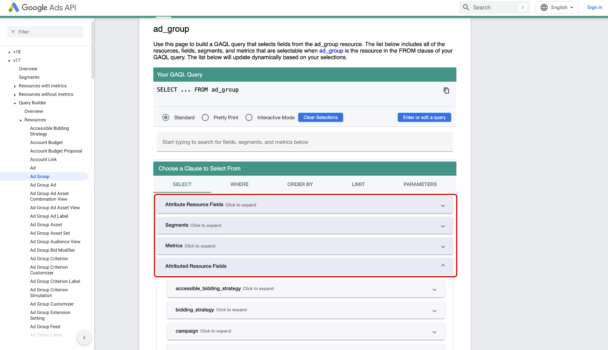
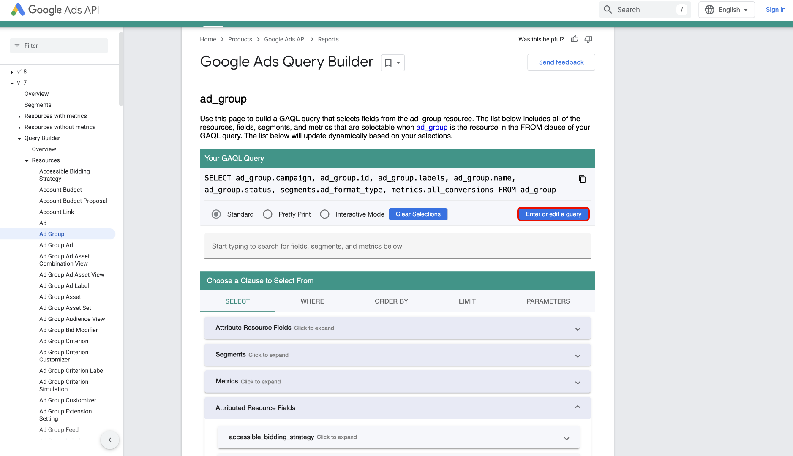
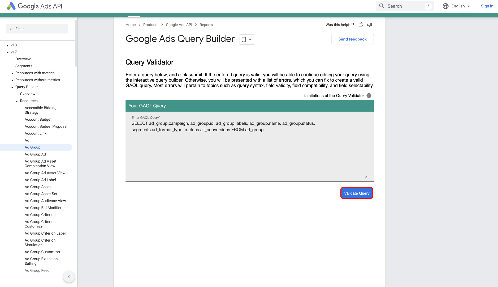
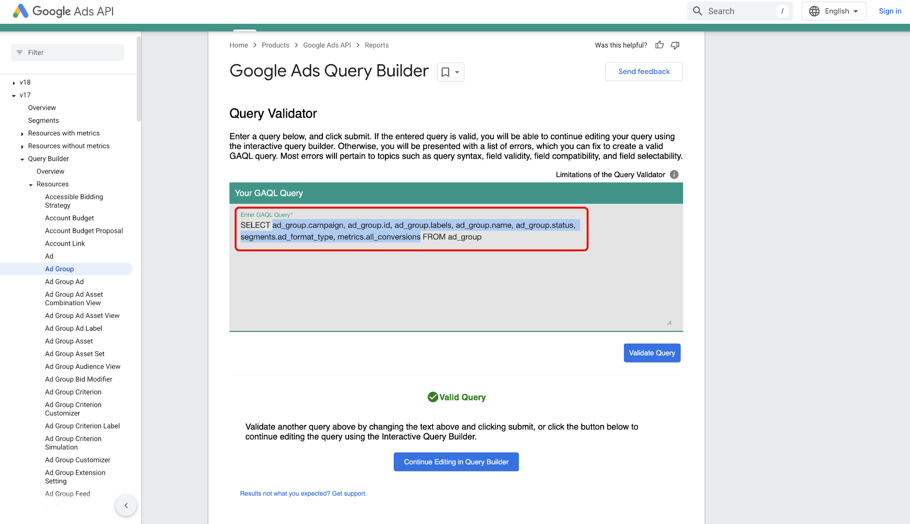
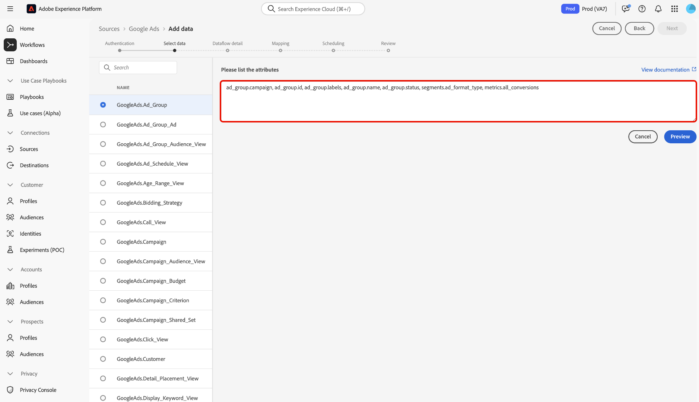

# Connect [!DNL Google Ads] to Experience Platform using the UI

>[!WARNING]
>
>The [!DNL Google Ads] source is currently not available in the UI. You can continue to ingest your [!DNL Google Ads] data to Experience Platform [using the API](../../../api/create/advertising/ads.md).

>[!NOTE]
>
>The [!DNL Google Ads] source is in beta. See the [Sources overview](../../../../home.md#terms-and-conditions) for more information on using beta-labeled sources.

Read this guide to learn how to connect your [!DNL Google Ads] account to Adobe Experience Platform using the sources workspace in the Experience Platform UI.

## Get started

This tutorial requires a working understanding of the following components of Experience Platform:

* [[!DNL Experience Data Model (XDM)] System](../../../../../xdm/home.md): The standardized framework by which Experience Platform organizes customer experience data.
  * [Basics of schema composition](../../../../../xdm/schema/composition.md): Learn about the basic building blocks of XDM schemas, including key principles and best practices in schema composition.
  * [Schema Editor tutorial](../../../../../xdm/tutorials/create-schema-ui.md): Learn how to create custom schemas using the Schema Editor UI.
* [[!DNL Real-Time Customer Profile]](../../../../../profile/home.md): Provides a unified, real-time consumer profile based on aggregated data from multiple sources.

If you already have a valid [!DNL Google Ads] connection, you may skip the remainder of this document and proceed to the tutorial on [configuring a dataflow](../../dataflow/advertising.md)

### Gather required credentials

For information on authentication, read the [[!DNL Google Ads] source overview](../../../../connectors/advertising/ads.md).

## Connect your Google Ads account

In the Experience Platform UI, select **[!UICONTROL Sources]** from the left navigation to access the *[!UICONTROL Sources]* workspace. You can select the appropriate category in the *[!UICONTROL Categories]* panel. Alternatively, you can use the search bar to navigate to the specific source that you want to use.

To use [!DNL Google Ads], select the **[!UICONTROL Google Ads]** source card under *[!UICONTROL Advertising]* and then select **[!UICONTROL Add data]**.

.

### Existing account

To use an existing account, select **[!UICONTROL Existing account]** and then select the account that you want to use from the list of accounts on the interface.

Once you have selected your account, select **[!UICONTROL Next]** to proceed to the next step.

.

### New account

If you do not have an existing account, then you must create a new account by providing the necessary authentication credentials that correspond with your source.

To create a new account, select **[!UICONTROL New account]** and then provide an account name and optionally, a description for your account details. Next, provide the appropriate authentication values to authenticate your source against Experience Platform:

* **Client customer ID**: The client customer ID is the account number that  corresponds with the [!DNL Google Ads] client account that you want to manage with the [!DNL Google Ads] API. This ID follows the template of `123-456-7890`.
* **Login customer ID**: The login customer ID is the account number that corresponds with your [!DNL Google Ads] manager account and is used to fetch report data from a specific operating customer. For more information on the login customer ID, read the [[!DNL Google Ads] API documentation](https://developers.google.com/search-ads/reporting/concepts/login-customer-id).
* **Developer token**: The developer token allows you to access the [!DNL Google Ads] API. You can use the same developer token to make requests against all of your [!DNL Google Ads] accounts. Retrieve your developer token by [logging in to your manager account](https://ads.google.com/home/tools/manager-accounts/) and then navigating to the API Center page.
* **Refresh token**: The refresh token is a part of [!DNL OAuth2] authentication. This token allows you to regenerate your access tokens after they expire. 
* **Client ID**: The client ID is used in tandem with the client secret as part of [!DNL OAuth2] authentication. Together, the client ID and client secret enables your application to operate on behalf of your account by identifying your application to [!DNL Google].
* **Client secret**: The client secret is used in tandem with the client ID as part of [!DNL OAuth2] authentication. Together, the client ID and client secret enables your application to operate on behalf of your account by identifying your application to [!DNL Google].
* **[!DNL Google Ads] API version**: The current API version supported by [!DNL Google Ads]. While the latest version is `v18`, the latest supported version on Experience Platform is `v17`. 

Once you have inputted your credentials, select **[!UICONTROL Connect to source]** and allow for a few moments for the connection to process. When finished, select **[!UICONTROL Next]**.

.

## Select data {#select-data}

With [!DNL Google Ads], you must provide the list of attributes for ingestion during the data selection phase of the workflow. In order to retrieve these attributes, you must use the [[!DNL Google Ads Query Builder]](https://developers.google.com/google-ads/api/fields/v17/overview_query_builder).

In the [!DNL Google Ads Query Builder], navigate to the resource type that you want to use and then use the attributes selector to select your attributes, segments, and metrics.

The attributes that you select populates the [!DNL Google Ads Query Language] panel. Ensure that you use the [!DNL Standard] mode and then select, **[!DNL Enter or edit a query]**.

Next, select **[!DNL Validate Query]** to validate your [!DNL Google Ads] query.

If successful, the [!DNL Google Ads Query Builder] returns a message indicating that your query is valid. Next, copy **only the attributes** from within the query.

Navigate back to the data selection phase of the sources workflow in the Experience Platform UI and then paste the attributes in the *[!UICONTROL List attributes]* panel.

Select **[!UICONTROL Preview]** to preview the data, and then select **[!UICONTROL Next]** to proceed.

## Create a dataflow to ingest advertising data

By following this tutorial, you have established a connection to your Google Ads account. You can now continue on to the next tutorial and [configure a dataflow to bring advertising data into Experience Platform](../../dataflow/advertising.md).
