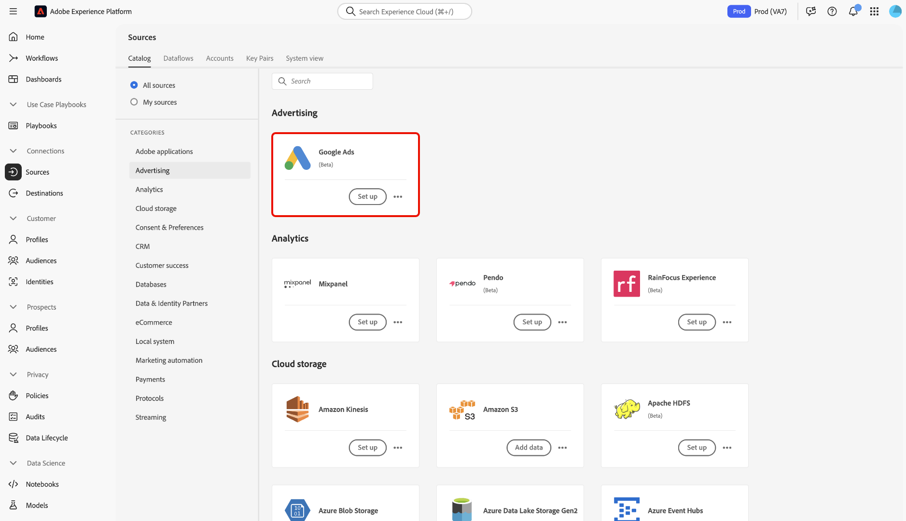
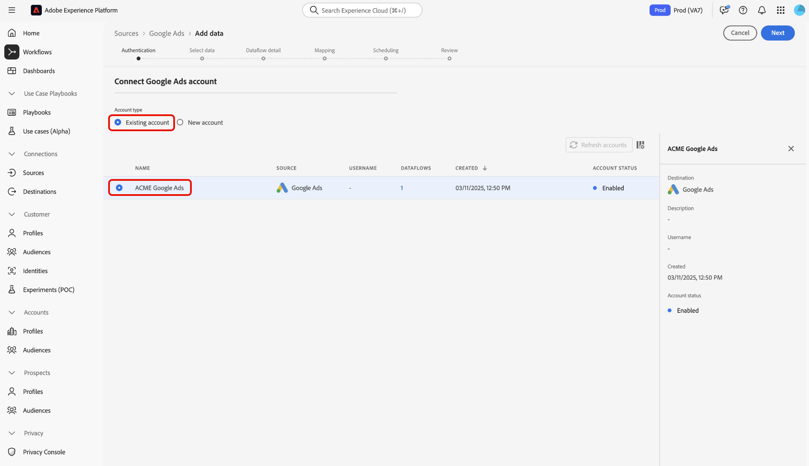
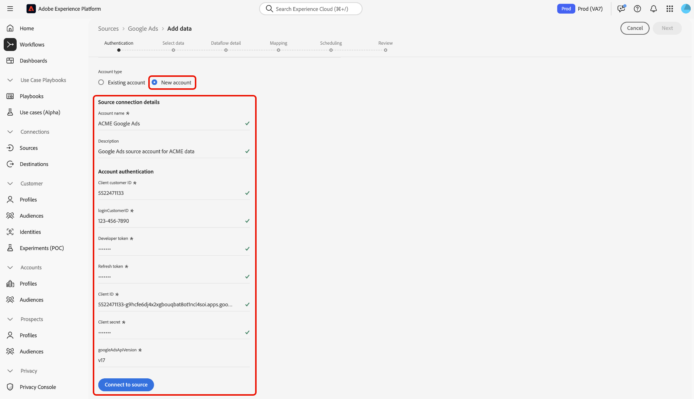

# Create a Google Ads source connection in the UI

>[!WARNING]
>
>The [!DNL Google Ads] source is temporarily unavailable. Adobe is working to resolve issues with this source.

>[!NOTE]
>
>The Google Ads source is in beta. See the [Sources overview](../../../../home.md#terms-and-conditions) for more information on using beta-labeled sources.

This tutorial provides steps for creating a Google Ads source connection using the Adobe Experience Platform user interface.

## Getting started

This tutorial requires a working understanding of the following components of Experience Platform:

* [[!DNL Experience Data Model (XDM)] System](../../../../../xdm/home.md): The standardized framework by which Experience Platform organizes customer experience data.
  * [Basics of schema composition](../../../../../xdm/schema/composition.md): Learn about the basic building blocks of XDM schemas, including key principles and best practices in schema composition.
  * [Schema Editor tutorial](../../../../../xdm/tutorials/create-schema-ui.md): Learn how to create custom schemas using the Schema Editor UI.
* [[!DNL Real-Time Customer Profile]](../../../../../profile/home.md): Provides a unified, real-time consumer profile based on aggregated data from multiple sources.

If you already have a valid Google Ads connection, you may skip the remainder of this document and proceed to the tutorial on [configuring a dataflow](../../dataflow/advertising.md)

### Gather required credentials

In order to access your Google Ads account Platform, you must provide the following values:

| Credential | Description |
| ---------- | ----------- |
| Client customer ID | The client customer ID is the account number that  corresponds with the Google Ads client account that you want to manage with the Google Ads API. This ID follows the template of `123-456-7890`. |
| Login customer ID | The login customer ID is the account number that corresponds with your Google Ads manager account and is used to fetch report data from a specific operating customer. For more information on the login customer ID, read the [Google Ads API documentation](https://developers.google.com/search-ads/reporting/concepts/login-customer-id). |
| Developer token | The developer token allows you to access the Google Ads API. You can use the same developer token to make requests against all of your Google Ads accounts. Retrieve your developer token by [logging in to your manager account](https://ads.google.com/home/tools/manager-accounts/) and then navigating to the API Center page. |
| Refresh token | The refresh token is a part of [!DNL OAuth2] authentication. This token allows you to regenerate your access tokens after they expire. |
| Client ID | The client ID is used in tandem with the client secret as part of [!DNL OAuth2] authentication. Together, the client ID and client secret enables your application to operate on behalf of your account by identifying your application to Google. |
| Client secret | The client secret is used in tandem with the client ID as part of [!DNL OAuth2] authentication. Together, the client ID and client secret enables your application to operate on behalf of your account by identifying your application to Google. |

Read the API overview document for [more information about getting started with Google Ads](https://developers.google.com/google-ads/api/docs/first-call/overview).

## Connect your Google Ads account

In the Platform UI, select **[!UICONTROL Sources]** from the left navigation bar to access the [!UICONTROL Sources] workspace. The [!UICONTROL Catalog] screen displays a variety of sources with which you can create an account.

You can select the appropriate category from the catalog on the left-hand side of your screen. Alternatively, you can find the specific source you wish to work with using the search option.

Under the **[!UICONTROL Advertising]** category, select **[!UICONTROL Google Ads]**, and then select **[!UICONTROL Add data]**.

.

The **[!UICONTROL Connect to Google Ads]** page appears. On this page, you can either use new credentials or existing credentials.

### Existing account

To connect an existing account, select the  Google Ads account you want to connect with, then select **[!UICONTROL Next]** to proceed.

.

### New account

If you are using new credentials, select **[!UICONTROL New account]**. On the input form that appears, provide a name, an optional description, and your Google Ads credentials. When finished, select **[!UICONTROL Connect to source]** and then allow some time for the new connection to establish.

.

## Next steps

By following this tutorial, you have established a connection to your Google Ads account. You can now continue on to the next tutorial and [configure a dataflow to bring advertising data into Platform](../../dataflow/advertising.md).
