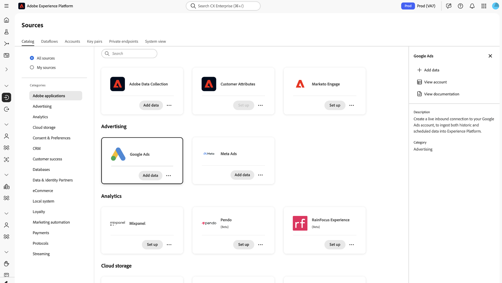
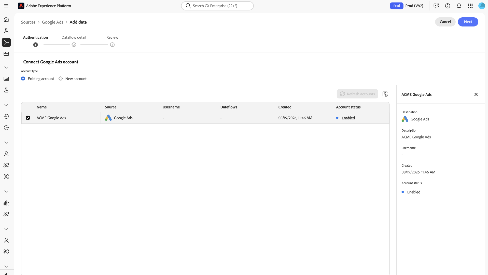
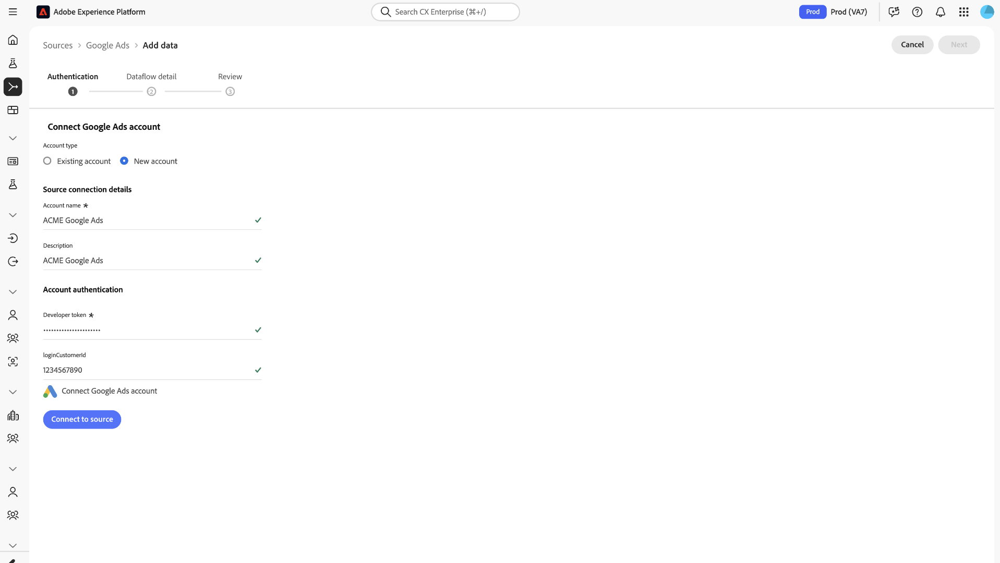

# Connect [!DNL Google Ads] (V2) to Experience Platform using the UI

Learn how to connect your [!DNL Google Ads] account to Adobe Experience Platform using the Sources workspace. The [!DNL Google Ads] source retrieves read-only [!DNL Google Ads] account, campaign, ad group, ad, asset, and performance data and maps it to Experience Data Model (XDM)-compatible datasets.

The [!DNL Google Ads] source is intended for paid media reporting and analysis across Experience Platform applications.

## Getting started

This tutorial requires a working understanding of the following Experience Platform components:

- [Sources](../../../../home.md): Experience Platform allows you to ingest data from external applications and services.
- [Experience Data Model (XDM)](../../../../../xdm/home.md): The standardized framework that Experience Platform uses to organize customer experience data.
- [Schema composition](../../../../../xdm/schema/composition.md): The basic building blocks and principles of XDM schemas.
- [Schema Editor tutorial](../../../../../xdm/tutorials/create-schema-ui.md): Learn how to create custom schemas using the Schema Editor UI.
- [Datasets](../../../../../catalog/datasets/overview.md): The storage construct used to hold ingested data.
- [Real-Time Customer Profile](../../../../../profile/home.md): Provides a unified profile from data collected across multiple sources.

For more information, read the [[!DNL Google Ads] source overview](../../../../connectors/advertising/google-ads.md).

### Prerequisites

Before you connect [!DNL Google Ads] (V2) to Experience Platform, make sure that you have:

- Access to a [!DNL Google Ads] advertiser account containing the campaigns and reporting data that you want to ingest.
- A Google user account with sufficient permissions to access the [!DNL Google Ads] account.
- Access to the relevant [!DNL Google Ads] manager account if the advertiser account is managed through a manager account.
- The required permissions to create sources, connections, schemas, datasets, and dataflows in the Experience Platform sandbox.
- A target XDM schema and dataset, unless the [!DNL Google Ads] (V2) workflow provisions them automatically.
- A data ingestion plan that identifies the [!DNL Google Ads] accounts, entities, metrics, and date range that you want to ingest.

[!DNL Google Ads] (V2) uses a read-only integration. The connector does not create, modify, or delete campaigns, ads, assets, or other [!DNL Google Ads] resources.

>[!TIP]
>
>**Manager account access**: If an advertiser account is accessible through a [!DNL Google Ads] manager account, the connector resolves the account hierarchy and presents the accessible advertiser accounts for selection. Manager accounts are used for account management and are not themselves the target advertising accounts.

## Connect your [!DNL Google Ads] account

In the Experience Platform UI, select **[!UICONTROL Sources]** from the left navigation to access the *[!UICONTROL Sources]* workspace. Locate the [!DNL Google Ads] source card under **[!UICONTROL Advertising]** and then select **[!UICONTROL Add data]**.

>[!IMPORTANT]
>
>The **[!UICONTROL Advertising]** category displays two [!DNL Google Ads] source cards. Select the card that does not display a **[!UICONTROL Beta]** label. The card labeled **[!UICONTROL Beta]** connects to the previous version of the [!DNL Google Ads] source.

The **[!UICONTROL Connect Google Ads account]** page appears. On this page, you can either create a new account connection or use an existing account connection.

### Use an existing account

To use an existing account connection, select **[!UICONTROL Existing account]** and select the [!DNL Google Ads] account that you want to use. When finished, select **[!UICONTROL Next]**.

### Create a new account

To create a new [!DNL Google Ads] account connection, select **[!UICONTROL New account]**. Next, enter a name for the connection and an optional description. When finished, select **[!UICONTROL Connect to source]**. You are prompted for your Google account credentials to establish the connection to your Google Ads environment.

## Authorize your [!DNL Google] account

Once your account is connected, you are prompted to select the [!DNL Google] account that you would like to use for [!DNL Google Ads].

When complete, select **[!UICONTROL Next]** to proceed.

## Provide dataflow details

Provide a name and optional description for your dataflow. You can also configure alerts for your dataflow during this step.

## Review your dataflow

Review your dataflow. Use the [!UICONTROL Connection] panel to review details of your dataflow, including its corresponding account name, source platform, and path to file. Use the [!UICONTROL Assign dataset and map fields] panel to confirm that your dataset is correctly assigned.
