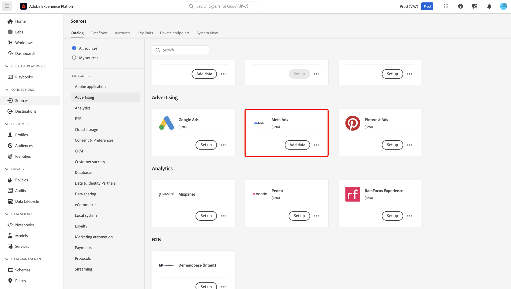
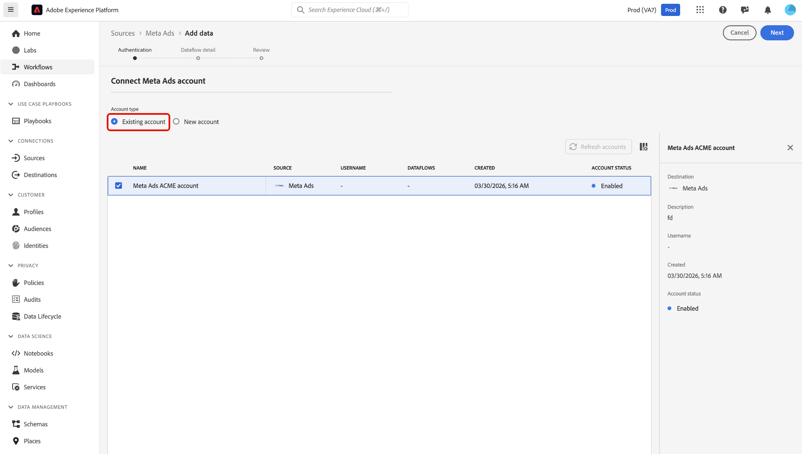
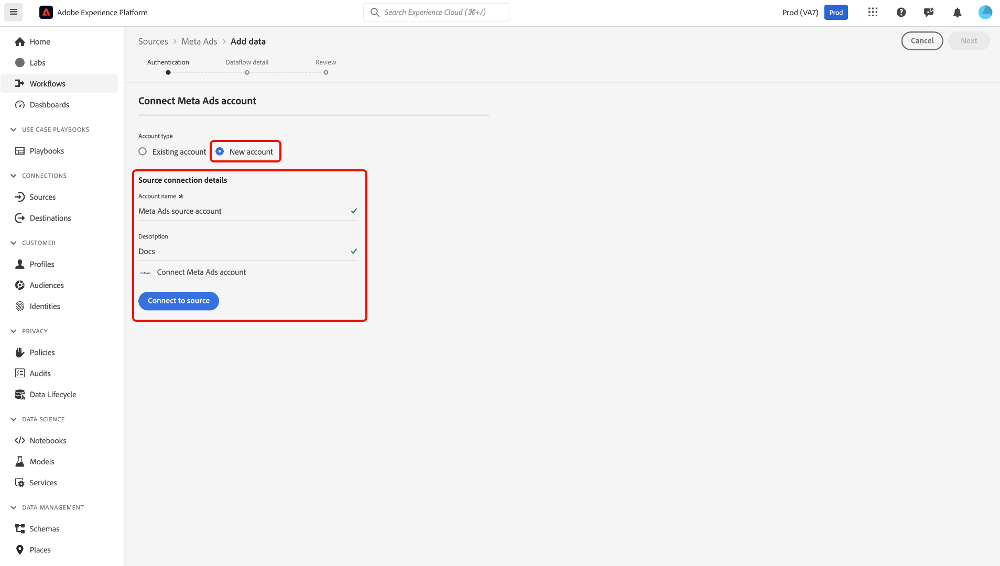
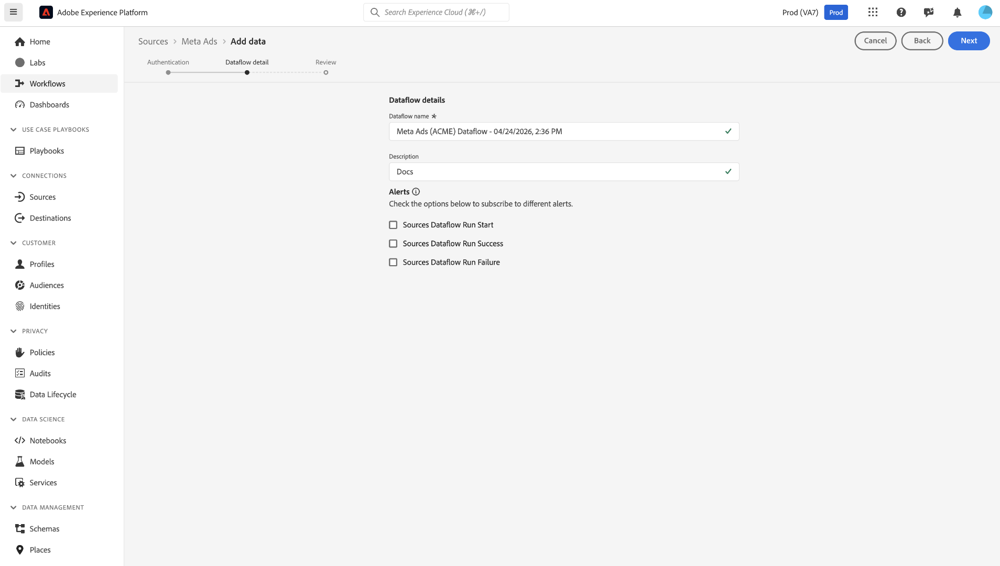
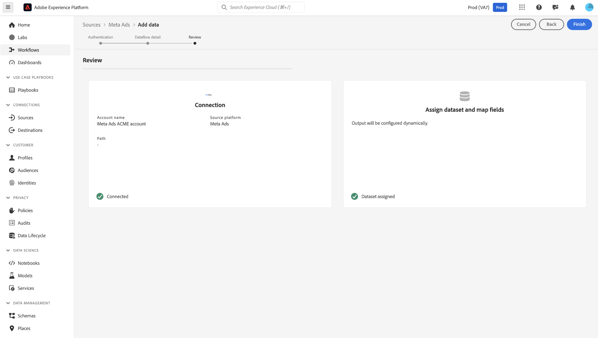

# Ingest [!DNL Meta Ads] data to Experience Platform in the UI

>[!NOTE]
>
>The [!DNL Meta Ads] source is in beta. Read the [sources overview](../../../../home.md#terms-and-conditions) for more information on using beta-labeled sources.

Learn how to connect your [!DNL Meta Ads] account and import ads data into Adobe Experience Platform using the sources workspace.

## Getting started

This tutorial requires a working understanding of the following components of Experience Platform:

- [[!DNL Experience Data Model (XDM)] System](../../../../../xdm/home.md): The standardized framework by which Experience Platform organizes customer experience data.
  - [Basics of schema composition](../../../../../xdm/schema/composition.md): Learn about the basic building blocks of XDM schemas, including key principles and best practices in schema composition.
  - [Schema Editor tutorial](../../../../../xdm/tutorials/create-schema-ui.md): Learn how to create custom schemas using the Schema Editor UI.
- [[!DNL Real-Time Customer Profile]](../../../../../profile/home.md): Provides a unified, real-time consumer profile based on aggregated data from multiple sources.

>[!IMPORTANT]
>
>Read the [[!DNL Meta Ads] overview](../../../../connectors/advertising/meta-ads.md) to learn about prerequisite steps that you need to complete before connecting your account to Experience Platform.

## Navigate the sources catalog

In the Experience Platform UI, select **[!UICONTROL Sources]** from the left navigation to access the *[!UICONTROL Sources]* workspace. Select the appropriate category in the *[!UICONTROL Categories]* panel. Alternatively, use the search bar to navigate to the specific source that you want to use.

To ingest data from [!DNL Meta Ads], select the **[!UICONTROL Meta Ads]** source card under *[!UICONTROL Advertising]* and then select **[!UICONTROL Add data]**.

>[!TIP]
>
>Sources in the sources catalog display the **[!UICONTROL Set up]** option when a given source does not yet have an authenticated account. Once an authenticated account is created, this option changes to **[!UICONTROL Add data]**.

### Use an existing account

To use an existing account, select **[!UICONTROL Existing account]** and select the [!DNL Meta Ads] account that you want to use from the accounts interface.

### Create a new account

To create a new account, select **[!UICONTROL New account]** and provide a name and description for your new [!DNL Meta Ads] source account. Select **[!UICONTROL Connect to source]**.

After selecting **[!UICONTROL Connect to source]**, you will be redirected to the [!DNL Facebook] login page. Enter your credentials to authenticate. Once logged in, you will be prompted to configure the necessary [!DNL Facebook] permissions for Experience Platform.

### Configure permissions on [!DNL Meta]

First, specify which Pages you want Experience Platform to access:

- **Opt in to all current and future Pages**: Grant Experience Platform access to all your existing Pages, as well as any Pages you create in the future.
- **Opt in to current Pages only**: Grant access only to the Pages you select at this time.

Next, select which Instagram accounts Experience Platform should access:

- **Opt in to all current and future Instagram accounts**: Allow access to all of your current and future Instagram accounts.
- **Opt in to current Instagram accounts only**: Allow access only to the Instagram accounts you currently select.

After reviewing the access requests, select **[!UICONTROL Save]** to confirm your permissions and continue.

## Provide dataflow details

Use the [!UICONTROL Dataflow details] page to provide a name and description for your dataflow. Additionally, you can configure alerts for your dataflow during this step.

## Review dataflow

Finally, use the [!UICONTROL Review] interface review the details of your dataflow before it is created. Details are grouped within the following categories:

- **[!UICONTROL Connection]**: Shows the account name, source platform, and the source name.
- **[!UICONTROL Assign dataset and map fields]**: Shows the target dataset and the schema that the dataset adheres to.

After confirming the details are correct, select **[!UICONTROL Finish]**.

