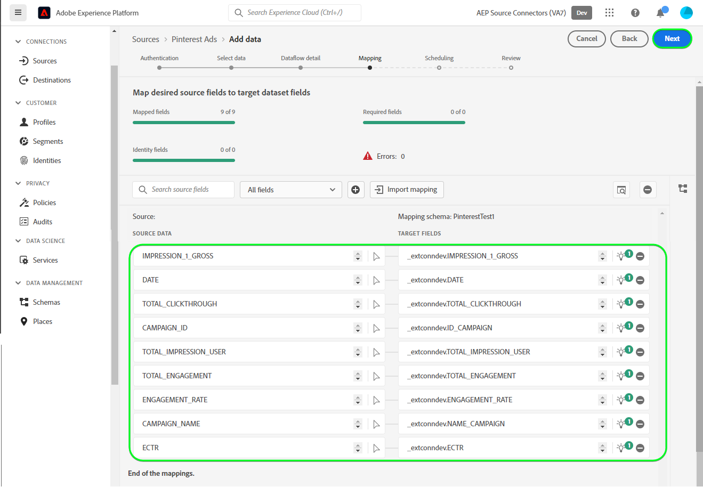
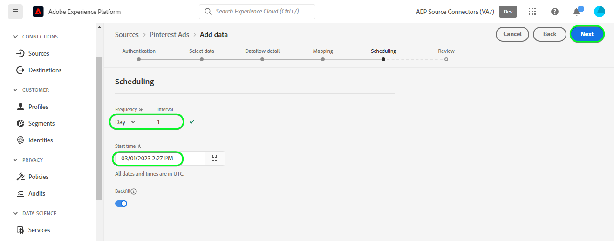
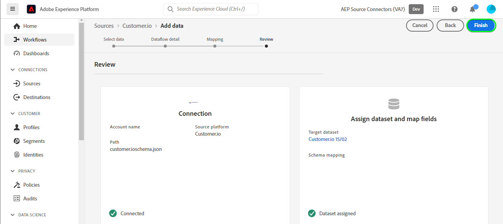

# Beta Create a [!DNL Pinterest Ads] source connection in the UI

>[!NOTE]
>
>The [!DNL Pinterest Ads] source is in beta. See the [sources overview](../../../../home.md#terms-and-conditions) for more information on using beta-labelled sources.

This tutorial provides steps for creating a [!DNL Pinterest Ads] source connector using the Platform user interface.

## Getting started {#getting-started}

This tutorial requires a working understanding of the following components of Experience Platform:

* [[!DNL Experience Data Model (XDM)] System](../../../../../xdm/home.md): The standardized framework by which [!DNL Experience Platform] organizes customer experience data.
  * [Basics of schema composition](../../../../../xdm/schema/composition.md): Learn about the basic building blocks of XDM schemas, including key principles and best practices in schema composition.
  * [Schema Editor tutorial](../../../../../xdm/tutorials/create-schema-ui.md): Learn how to create custom schemas using the Schema Editor UI.
* [[!DNL Real-Time Customer Profile]](../../../../../profile/home.md): Provides a unified, real-time consumer profile based on aggregated data from multiple sources.

## Prerequisites {#prerequisites}

In order to connect [!DNL Pinterest Ads] to Experience Platform, you must provide values for the following connection properties:

* The [!DNL Pinterest] `Access Token`.
* The [!DNL Pinterest] `Ad Account ID`.
* One of [!DNL Pinterest] `Campaign`, `Ad Group` or `Ad` ID's as required.

For more information on each of these, see their individual sections in the [prerequisites](../../../../connectors/advertising/pinterest-ads.md#prerequisites) section of the [!DNL Pinterest Ads] source overview documentation.

### Create Platform Schema {#create-platform-schema}

Create a Platform [schema](/help/xdm/schema/composition.md) required for Linked In Ads.


You can obtain sample definitions [here](#schema-example).

## Connect your [!DNL Pinterest Ads] account {#connect-account}

In the Platform UI, select **[!UICONTROL Sources]** from the left navigation bar to access the [!UICONTROL Sources] workspace. The [!UICONTROL Catalog] screen displays a variety of sources with which you can create an account.

You can select the appropriate category from the catalog on the left-hand side of your screen. Alternatively, you can find the specific source you wish to work with using the search option.

Under the *Advertising* category, select *[!DNL Pinterest Ads]*, and then select **[!UICONTROL Add data]**.


The **[!UICONTROL Connect Pinterest Ads account]** page appears. On this page, you can either use new credentials or existing credentials.

### Existing account {#existing-account}

To use an existing account, select the [!DNL Pinterest Ads] account you want to create a new dataflow with, then select **[!UICONTROL Next]** to proceed.


### New account {#new-account}

If you are creating a new account, select **[!UICONTROL New account]**, and then provide a name, an optional description, and your credentials. Refer to the [prerequisites](#prerequisites) section for the values needed. When finished, select **[!UICONTROL Connect to source]** and then allow some time for the new connection to establish.


If the details provided are valid, the UI displays a **[!UICONTROL Connected]** status with a green check mark, you can then proceed to the next step.


## Next steps {#next-steps}

By following this tutorial, you have established a connection to your [!DNL Pinterest Ads] account. You can now continue on to the next tutorial and [configure a dataflow to bring data into Platform](/help/sources/ui-tutorials/dataflow/advertising.md).

## Select data {#select-data}

The **[!UICONTROL Select data]** step appears, providing an interface for you to input the information that would be passed to the APIs to bring the data you want to Platform.

Finally, you must provide as a mandatory input the field values below:
| Field | Description |
| --- | --- |
| **[!UICONTROL ad_account_id]** | Your [!DNL Pinterest Ads] ad_account_id. You can refer to the [Find IDs in Ads Manager](https://help.pinterest.com/en/business/article/find-ids-in-ads-manager) page for guidance on how to get the value. |
| **[!UICONTROL object_type]** | Select one of **Campaigns**, **Ad Groups** or **Ads** depending on which of the [!DNL Pinterest] Analytics APIs you want to obtain information from. |
| **[!UICONTROL object_ids]** | The selected object's IDs. Navigate to the [!DNL Pinterest] page for **Pinterest Business Hub** > **Ad Account Summary** > **Campaigns** / **Ad Groups** / **Ads** and copy the required ID's mentioned just below each of their names. |

>[!NOTE]
>
> Multiple **[!UICONTROL object_ids]** can be provided by passing comma separated values.
> A maximum of 100 IDs can be passed at a time.
> If incorrect values are passed platform will show an error prompt with the message below :
> `The request could not be processed. Error from flow provider: Unknown error while processing request.` 

After providing the values, select the **[!UICONTROL Select]**. If the values provided are valid, the right part of the interface, preview data, will get populated.


## Dataflow detail {#dataflow-detail}

The **Dataflow detail** step appears, providing you with options to use an existing dataset or establish a new dataset for your dataflow, as well as an opportunity to provide a name and description for your dataflow. During this step, you can also configure settings for Profile ingestion, error diagnostics, partial ingestion, and alerts.

When finished, select **[!UICONTROL Next]**.


## Mapping {#mapping}

The [!UICONTROL Mapping] step appears, providing you with an interface to map the source fields from your source schema to their appropriate target XDM fields in the target schema.

Platform provides intelligent recommendations for auto-mapped fields based on the target schema or dataset that you selected. You can manually adjust mapping rules to suit your use cases. Based on your needs, you can choose to map fields directly, or use data prep functions to transform source data to derive computed or calculated values. For comprehensive steps on using the mapper interface and calculated fields, see the [Data Prep UI guide](../../../../../data-prep/ui/mapping.md).

Once your source data is successfully mapped, select **[!UICONTROL Next]**.



## Scheduling {#scheduling}

The **[!UICONTROL Scheduling]** step appears, allowing you to specify the schedule for execution of the dataflow.

The Time Granularity for [!DNL Pinterest Ads] API is daily, accordingly select one of the below to ensure that daily data will be retrieved. For more details refer to the [guardrails](../../../../connectors/advertising/pinterest-ads.md#guardrails) section of the [!DNL Pinterest Ads] source overview documentation.

| Frequency | Interval |
| --- | --- |
| `Day` | 1 |
| `Hour` | 24 |

Once your have provided the values for your schedule, select **[!UICONTROL Next]**.



## Review {#review}

The **[!UICONTROL Review]** step appears, allowing you to review your new dataflow before it is created. Details are grouped within the following categories:

* **[!UICONTROL Connection]**: Shows the source type, the relevant path of the chosen source file, and the amount of columns within that source file.
* **[!UICONTROL Assign dataset & map fields]**: Shows which dataset the source data is being ingested into, including the schema that the dataset adheres to.

Once you have reviewed your dataflow, select **[!UICONTROL Finish]** and allow some time for the dataflow to be created.



## Additional resources {#additional-resources}

The sections below provide additional resources that you can refer to when using the [!DNL Pinterest Ads] source.

### Validation {#validation}

To validate that you have correctly set up the source and [!DNL Pinterest Ads] data is being ingested, follow the steps below:

In the Platform UI, select View Dataflows besides the [!DNL Pinterest Ads] card menu on the Catalog page. You can then select [!UIControl Preview dataset] to verify the data that was ingested.


You can verify the data against the counts visible on the [!DNL Pinterest] Campaigns page below :


Or if you had selected [!DNL Pinterest] Ad groups, then the below page :


Or if you selected [!DNL Pinterest] Ads, then the below page :


### Platform Schema Example {#schema-example}
An example of definitions is as below.

```json
{
    "definitions": {
      "customFields": {
        "properties": {
          "_<XDM_TENANTID_PLACEHOLDER>": {
            "properties": {
              "ID_CAMPAIGN": {
                "required": [],
                "type": "string",
                "description": "",
                "title": "CAMPAIGN_ID",
                "meta:xdmType": "string"
              },
              "NAME_CAMPAIGN": {
                "required": [],
                "type": "string",
                "description": "",
                "title": "CAMPAIGN_NAME",
                "meta:xdmType": "string"
              },
              "ENGAGEMENT_RATE": {
                "maximum": 9007199254740991,
                "minimum": -9007199254740991,
                "required": [],
                "type": "number",
                "description": "",
                "title": "ENGAGEMENT_RATE",
                "meta:xdmType": "number"
              },
              "AD_GROUP_ID": {
                "required": [],
                "type": "string",
                "description": "",
                "title": "AD_GROUP_ID",
                "meta:xdmType": "string"
              },
              "AD_ID": {
                "required": [],
                "type": "string",
                "description": "",
                "title": "AD_ID",
                "meta:xdmType": "string"
              },
              "TOTAL_CLICKTHROUGH": {
                "required": [],
                "type": "integer",
                "description": "",
                "title": "TOTAL_CLICKTHROUGH",
                "meta:xdmType": "int"
              },
              "TOTAL_ENGAGEMENT": {
                "required": [],
                "type": "integer",
                "description": "",
                "title": "TOTAL_ENGAGEMENT",
                "meta:xdmType": "int"
              },
              "IMPRESSION_1_GROSS": {
                "required": [],
                "type": "integer",
                "description": "",
                "title": "IMPRESSION_1_GROSS",
                "meta:xdmType": "int"
              },
              "REPIN_1": {
                "required": [],
                "type": "integer",
                "description": "",
                "title": "REPIN_1",
                "meta:xdmType": "int"
              },
              "ECTR": {
                "required": [],
                "type": "number",
                "description": "",
                "title": "ECTR",
                "meta:xdmType": "number"
              },
              "DATE": {
                "required": [],
                "type": "string",
                "description": "",
                "title": "DATE",
                "meta:xdmType": "string"
              },
              "TOTAL_IMPRESSION_USER": {
                "required": [],
                "type": "integer",
                "description": "",
                "title": "TOTAL_IMPRESSION_USER",
                "meta:xdmType": "int"
              }
            },
            "type": "object",
            "meta:xdmType": "object"
          }
        }
      }
    }
}
```