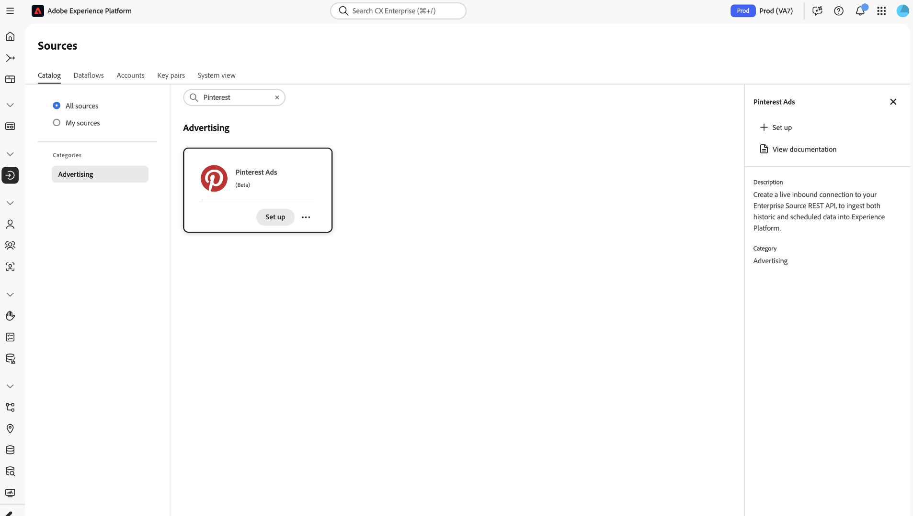
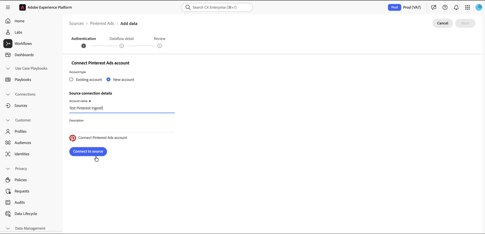
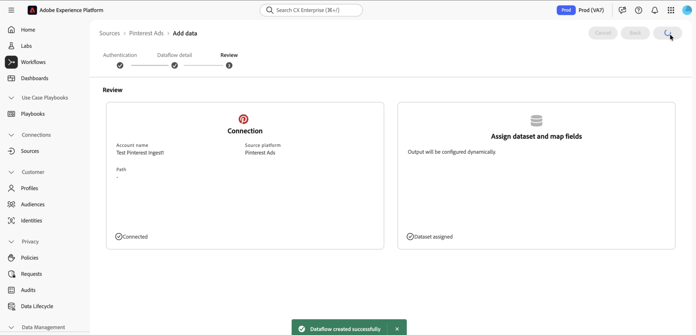
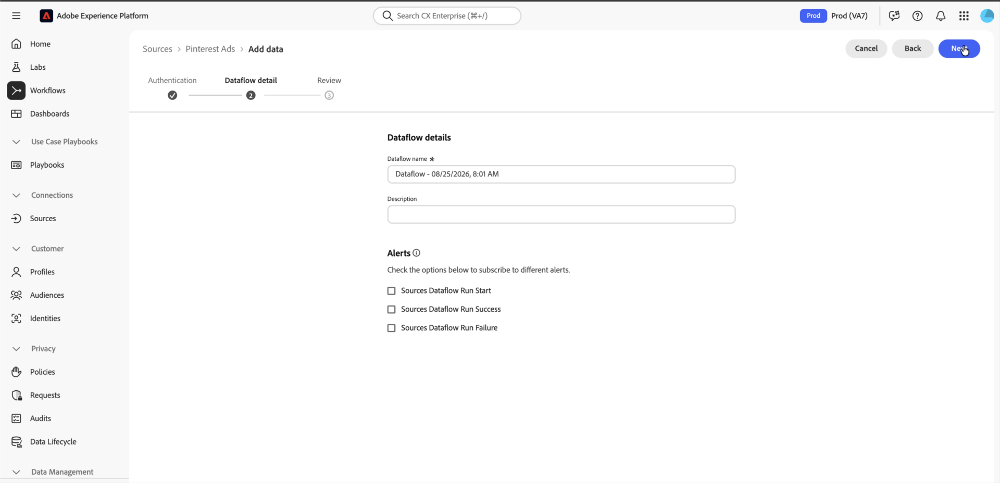

# Connect your [!DNL Pinterest Ads] account

>[!NOTE]
>
>The [!DNL Pinterest Ads] source is in beta. Read the [Sources overview](/help/sources/home.md#terms-and-conditions) for the terms and conditions.

Connect your [!DNL Pinterest Ads] account to [!DNL Adobe Experience Platform] using the **[!UICONTROL Sources]** workspace. Create a dataflow to ingest paid media metadata and performance metrics into automatically assigned datasets.

## Prepare your account {#getting-started}

Before you begin, review the [Pinterest Ads prerequisites](/help/sources/connectors/advertising/pinterest-ads.md#prerequisites). You need an existing ad account with campaigns and ads, and permission to authorize access to that account.

You do not need to generate an access token, create a target schema, or prepare field mappings.

## Connect your account {#connect-account}

Open the **[!UICONTROL Sources]** workspace and use the **[!UICONTROL Authentication]** tab to create or reuse a connection.

In [!DNL Experience Platform], select **[!UICONTROL Sources]**. Locate the **[!UICONTROL Pinterest Ads]** source card and select **[!UICONTROL Set up]**. Choose whether to create a new account or reuse an existing account.

### Create a new account {#new-account}

Create a connection by signing in to [!DNL Pinterest] and authorizing access to your advertising data.

Select **[!UICONTROL New account]** and enter the following connection details.

| Field | What to enter |
| --- | --- |
| [!UICONTROL Account name] | A name for the connection. |
| [!UICONTROL Description] | An optional description of the connection. |

1. Select **[!UICONTROL Connect Pinterest Ads account]** to open the authorization page.
1. Follow the authorization prompts to sign in to [!DNL Pinterest].
1. On the **[!UICONTROL Authorize app]** page, review the requested permissions and select **[!UICONTROL Give access]**.
1. Select **[!UICONTROL Connect to source]** to validate and create the account, then select **[!UICONTROL Next]**.

The authorization request includes access to your advertising data, public boards, and public Pins.

You can reuse this connection for multiple dataflows without entering API credentials manually.

### Reuse an existing account {#existing-account}

Use an existing connection if you have already authorized your account. Select **[!UICONTROL Existing account]**. Select the account to use, then select **[!UICONTROL Next]**.

## Select your ad accounts {#select-data}

During dataflow setup, select the ad accounts whose metadata and metrics you want to ingest. You do not enter individual campaign, ad group, or ad identifiers.

## Provide dataflow details {#dataflow-details}

Use the **[!UICONTROL Dataflow detail]** tab to name your dataflow and configure optional alerts.

Enter a **[!UICONTROL Dataflow name]** and an optional **[!UICONTROL Description]**. Optionally select **[!UICONTROL Sources Dataflow Run Start]**, **[!UICONTROL Sources Dataflow Run Success]**, or **[!UICONTROL Sources Dataflow Run Failure]** under **[!UICONTROL Alerts]**.

Select **[!UICONTROL Next]** to continue to **[!UICONTROL Review]**.

## Review your dataflow {#review}

Check your connection and dataflow details before creating the dataflow.

On the **[!UICONTROL Review]** tab, confirm your connection and dataflow details. Select **[!UICONTROL Finish]**.

>[!IMPORTANT]
>
>The connector assigns datasets, schemas, and field mappings automatically. You do not select a target dataset, map fields, or configure an ingestion schedule.

## Understand scheduled ingestion {#scheduling}

After dataflow creation, [!DNL Experience Platform] schedules a backfill for 30 minutes later to retrieve the past 30 days. Daily ingestion starts the following day and retrieves the previous day's data.

Restatement runs one, two, and three days after each daily ingestion run to retrieve updated historical data. Read [how Pinterest Ads ingestion works](/help/sources/connectors/advertising/pinterest-ads.md#how-it-works) for details.

## Verify ingested data {#validation}

After the backfill runs, use [source dataflow monitoring](/help/sources/tutorials/ui/monitor.md) to review ingestion status and errors. Use [dataset preview](/help/catalog/datasets/user-guide.md#preview) to inspect ingested records.

## Next steps {#next-steps}

Review the [Pinterest Ads XDM field mappings](/help/sources/connectors/advertising/pinterest-ads.md#pinterest-fields) to understand the data available for analysis. Use the paid media datasets in [!DNL Adobe Customer Journey Analytics] to analyze your marketing campaigns.
