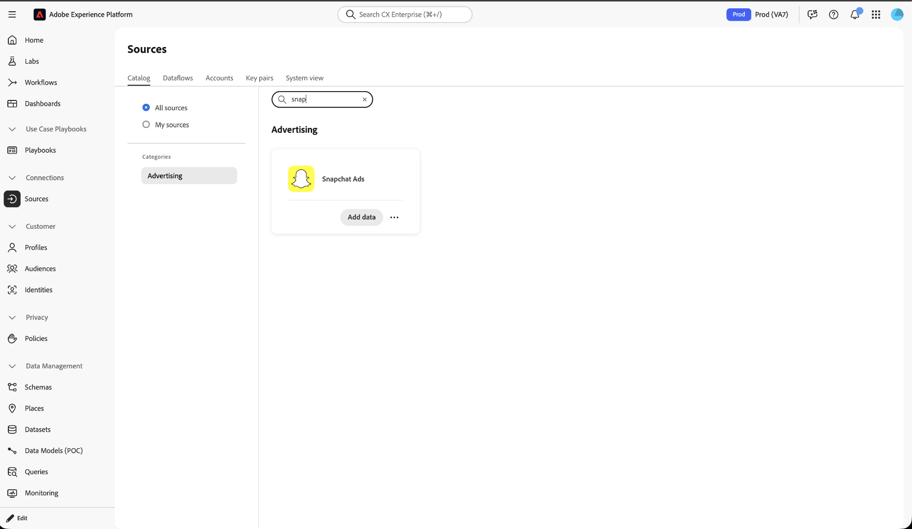
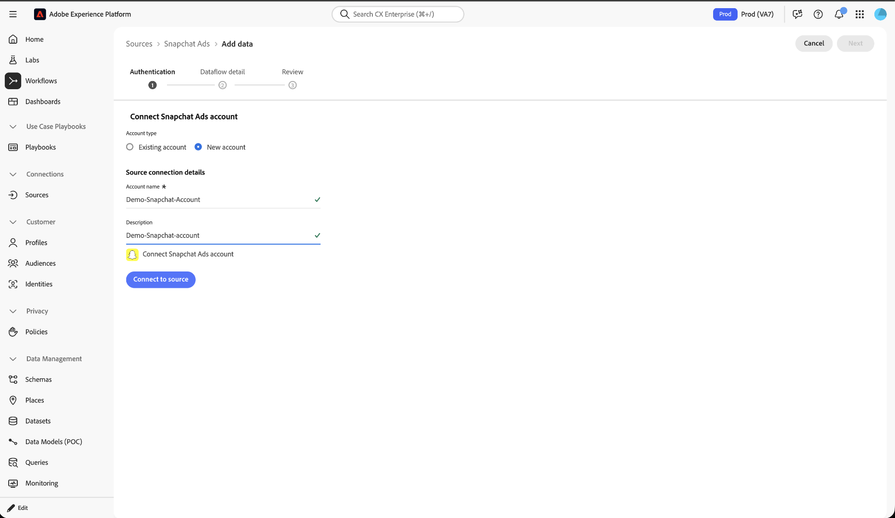
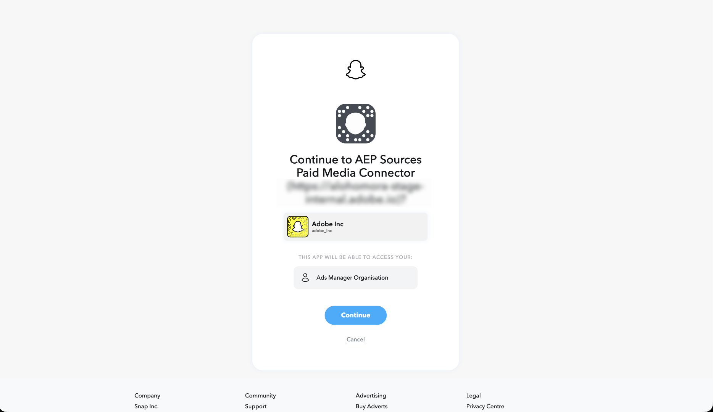
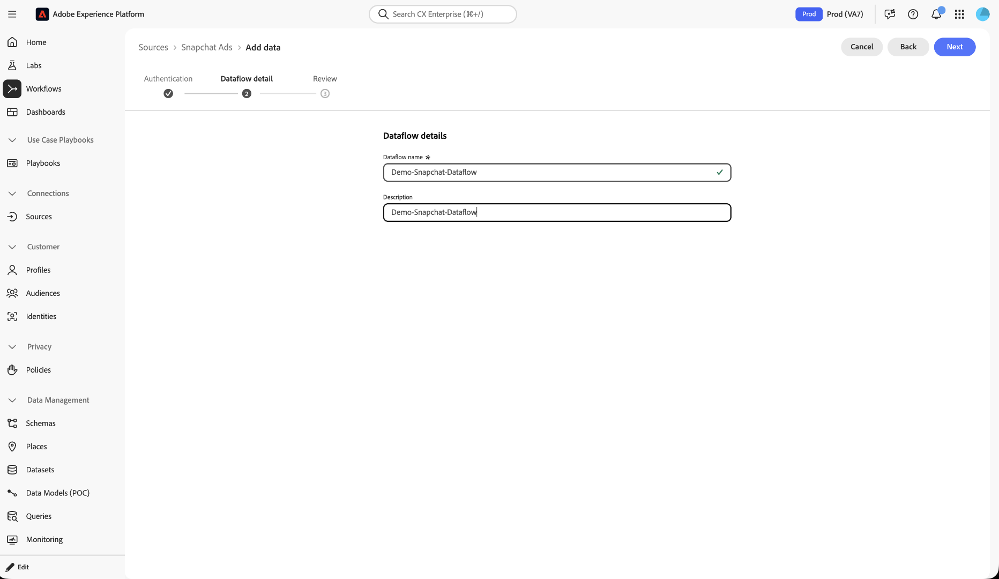
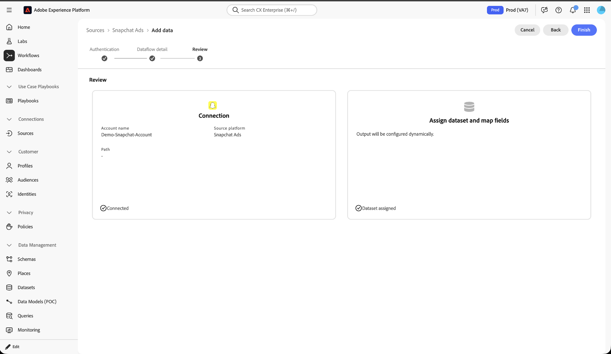

# Connect [!DNL Snapchat Ads] to Experience Platform using the UI

>[!NOTE]
>
>The [!DNL Snapchat Ads] source is in beta. Read the [Sources overview](../../../../home.md#terms-and-conditions) for more information on using beta-labeled sources.

>[!IMPORTANT]
>
>The [!DNL Snapchat Ads] source is available as part of the [!DNL Customer Journey Analytics] SKU.

Learn how to connect your [!DNL Snapchat] ad account to Adobe Experience Platform using the Sources workspace. The [!DNL Snapchat Ads] source retrieves campaign, ad, and performance data and maps it to Experience Data Model (XDM) compatible datasets.

## Getting started

This tutorial requires a working understanding of the following Experience Platform components:

- [Sources](../../../../home.md): Experience Platform allows you to ingest data from external applications and services.
- [Experience Data Model (XDM)](../../../../../xdm/home.md): The standardized framework that Experience Platform uses to organize customer experience data.
- [Datasets](../../../../../catalog/datasets/overview.md): The storage construct used to hold ingested data.
- [Real-Time Customer Profile](../../../../../profile/home.md): Provides a unified profile from data collected across multiple sources.

For more information, read the [[!DNL Snapchat Ads] source overview](../../../../connectors/advertising/snapchat-ads.md).

### Prerequisites

Before you connect [!DNL Snapchat Ads] to Experience Platform, ensure that you have an existing [!DNL Snapchat] ad account with campaigns and ads already set up. For more information, read the [[!DNL Snapchat Ads] source overview](../../../../connectors/advertising/snapchat-ads.md#prerequisites).

You must also have permission to authorize third-party access to your [!DNL Snapchat] [!UICONTROL Ads Manager Organization], since account creation requires you to sign in to [!DNL Snapchat] and grant access.

## Connect your [!DNL Snapchat Ads] account

In the Experience Platform UI, select **[!UICONTROL Sources]** from the left navigation to access the **[!UICONTROL Sources]** workspace. Locate the **[!UICONTROL Snapchat Ads]** source card and then select **[!UICONTROL Add data]**.

The **[!UICONTROL Authentication]** tab is where you create the account that stores your [!DNL Snapchat] connection details. Select **[!UICONTROL New account]**, or select **[!UICONTROL Existing account]** to reuse an account, then provide the following under **[!UICONTROL Source connection details]**:

| Field | What to enter |
| --- | --- |
| [!UICONTROL Account name] | A name for this connection. |
| [!UICONTROL Description] (optional) | A short description of the account. |

Select **[!UICONTROL Connect Snapchat Ads account]** to open [!DNL Snapchat]'s authorization page.

On the [!DNL Snapchat] authorization page, review the requested permissions and select **[!UICONTROL Continue]** to grant Experience Platform access to your **[!UICONTROL Ads Manager Organization]**.

Once authorized, select **[!UICONTROL Connect to source]** to validate and create the account, then select **[!UICONTROL Next]**. An account can be reused across multiple dataflows, so you authorize your [!DNL Snapchat] account only once per account.

## Provide dataflow details

Enter a **[!UICONTROL Dataflow name]** and an optional **[!UICONTROL Description]**.

Select **[!UICONTROL Next]** to continue to the review step.

## Review your dataflow

Review your dataflow, then select **[!UICONTROL Finish]**.

>[!IMPORTANT]
>
>You do not select a target dataset or map fields. The [!DNL Snapchat Ads] source assigns the dataset, schema, and field mapping automatically.

## Next steps

By following this tutorial, you have connected your [!DNL Snapchat Ads] account to Experience Platform. Read the [[!DNL Snapchat Ads] source overview](../../../../connectors/advertising/snapchat-ads.md#how-it-works) to understand the backfill, incremental, and restatement jobs that run against your new dataflow.
