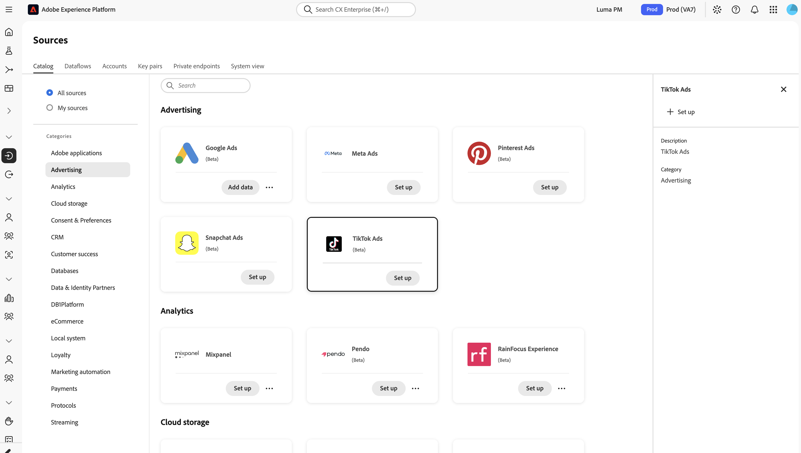
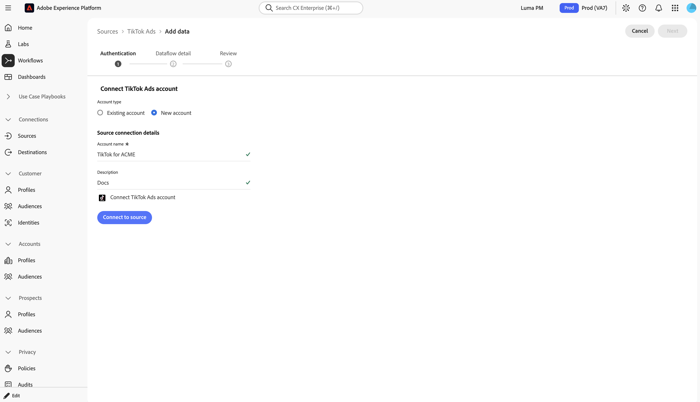

# Connect [!DNL TikTok Ads] to Experience Platform using the UI

>[!NOTE]
>
>The [!DNL TikTok Ads] source is in beta. Read the [Sources overview](../../../../home.md#terms-and-conditions) for more information on using beta-labeled sources.

>[!IMPORTANT]
>
>The [!DNL TikTok Ads] source is available as part of the Customer Journey Analytics SKU.

<!--
TODO(satkapoo/eng): This entire tutorial is a draft based on the eng wiki description of the flow, not a
confirmed UI walkthrough. The account-picker/Explore-step UI design is still pending sign-off per the launch
tracker (as of 2026-08-31). Verify every step, field label, and button label below against the actual UI once
it's built, and replace every placeholder image comment with a real screenshot before this leaves draft.
-->

Learn how to connect your [!DNL TikTok] advertiser account to Adobe Experience Platform using the Sources workspace. The [!DNL TikTok Ads] source retrieves campaign, ad, and performance data and maps it to Experience Data Model (XDM) compatible datasets.

## Getting started

This tutorial requires a working understanding of the following Experience Platform components:

- [Sources](../../../../home.md): Experience Platform allows you to ingest data from external applications and services.
- [Experience Data Model (XDM)](../../../../../xdm/home.md): The standardized framework that Experience Platform uses to organize customer experience data.
- [Datasets](../../../../../catalog/datasets/overview.md): The storage construct used to hold ingested data.
- [Real-Time Customer Profile](../../../../../profile/home.md): Provides a unified profile from data collected across multiple sources.

For more information, read the [[!DNL TikTok Ads] source overview](../../../../connectors/advertising/tiktok-ads.md).

### Prerequisites

Before you connect [!DNL TikTok Ads] to Experience Platform, complete the app setup and approval steps described in the [[!DNL TikTok Ads] source overview](../../../../connectors/advertising/tiktok-ads.md#prerequisites), including business verification and app permission group configuration.

You must also have permission to authorize third-party access to your [!DNL TikTok] advertiser account, since account creation requires you to sign in to [!DNL TikTok] and grant access.

## Connect your [!DNL TikTok Ads] account

In the Experience Platform UI, select **[!UICONTROL Sources]** from the left navigation to access the **[!UICONTROL Sources]** workspace. Locate the **[!UICONTROL TikTok Ads]** source card and then select **[!UICONTROL Add data]**.

<!--
TODO: Add catalog.png once the source card name is confirmed and a screenshot is captured.

-->

The **[!UICONTROL Authentication]** tab is where you create the account that stores your [!DNL TikTok] connection details. Select **[!UICONTROL New account]**, or select **[!UICONTROL Existing account]** to reuse an account, then provide the following under **[!UICONTROL Source connection details]**:

| Field | What to enter |
| --- | --- |
| [!UICONTROL Account name] | A name for this connection. |
| [!UICONTROL Description] (optional) | A short description of the account. |

Select **[!UICONTROL Connect to source]** to open [!DNL TikTok]'s authorization page.

<!--
TODO: Add new.png once the button label is confirmed and a screenshot is captured.

-->

On the [!DNL TikTok] authorization page, review the requested permissions and grant Experience Platform access to your advertiser account.

<!--
TODO: Add authorized.png once a screenshot of the TikTok authorization page is captured.

-->

Once authorized, select **[!UICONTROL Connect to source]** to validate and create the account, then select **[!UICONTROL Next]**. An account can be reused across multiple dataflows, so you authorize your [!DNL TikTok] account only once per account.

## Select your [!DNL TikTok] advertiser account

<!--
TODO(satkapoo/eng): Confirm whether advertiser selection is its own tab (as modeled here) or is merged into the
Dataflow detail step, and confirm the exact tab/field names. This section is a placeholder based on the eng
wiki's description of the Explore step ("lists every advertiser the authorized user has access to").
-->

Select the [!DNL TikTok] advertiser account that you want to sync with this dataflow.

<!--
TODO: Add explore.png once the account-picker UI design is locked and a screenshot is captured.

-->

Select **[!UICONTROL Next]** to continue.

## Provide dataflow details

Enter a **[!UICONTROL Dataflow name]** and an optional **[!UICONTROL Description]**.

<!--
TODO: Add dataflow-detail.png once a screenshot is captured.

-->

Select **[!UICONTROL Next]** to continue to the review step.

## Review your dataflow

Review your dataflow, then select **[!UICONTROL Finish]**.

>[!IMPORTANT]
>
>You do not select a target dataset or map fields. The [!DNL TikTok Ads] source assigns the dataset, schema, and field mapping automatically.

<!--
TODO: Add review.png once a screenshot is captured.

-->

## Next steps

By following this tutorial, you have connected your [!DNL TikTok Ads] account to Experience Platform. Read the [[!DNL TikTok Ads] source overview](../../../../connectors/advertising/tiktok-ads.md#how-it-works) to understand the backfill and incremental jobs that run against your new dataflow.
