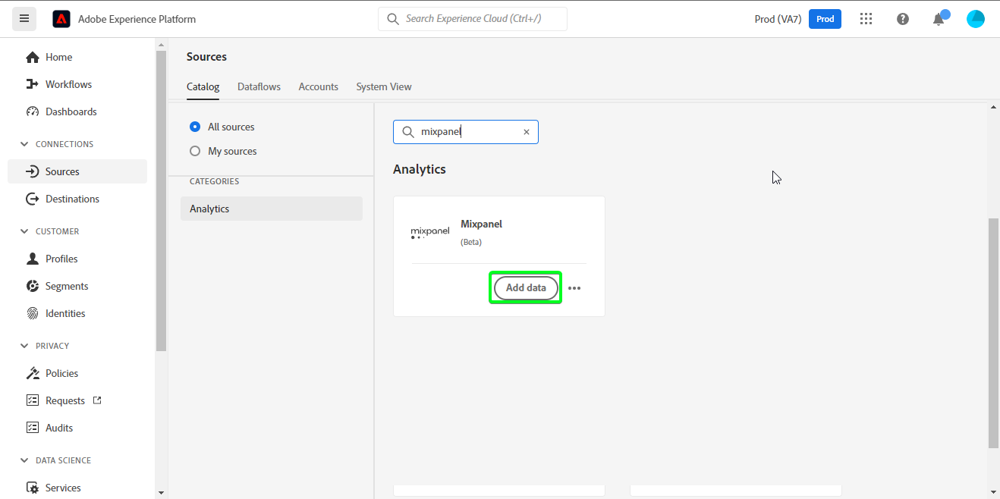
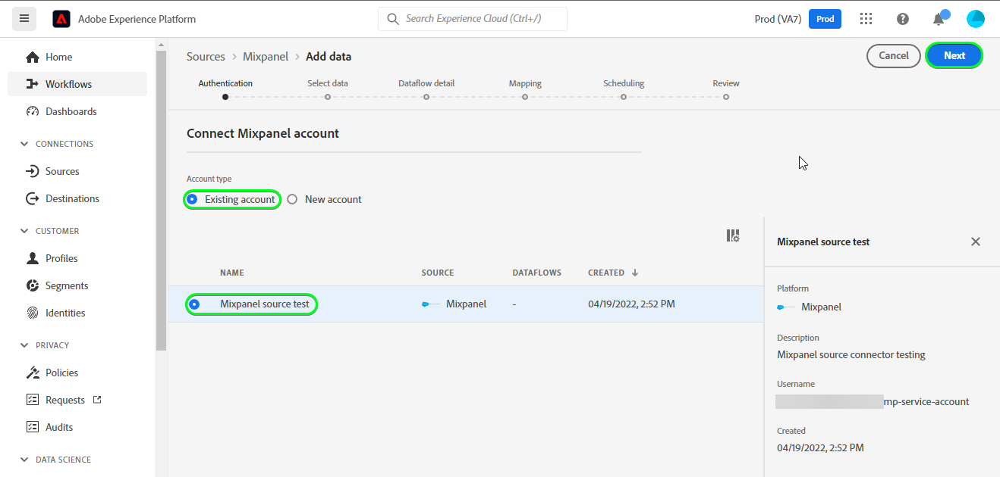
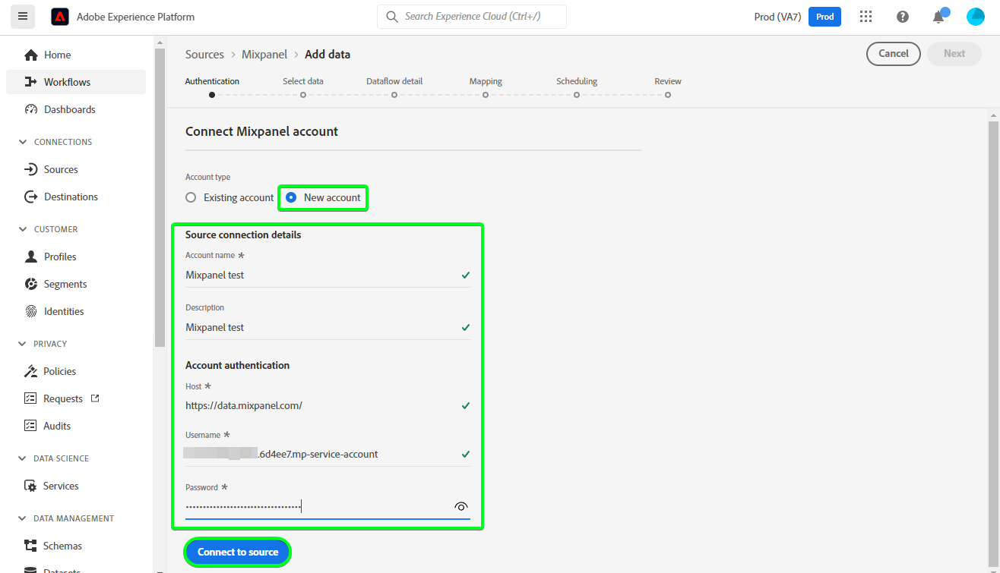
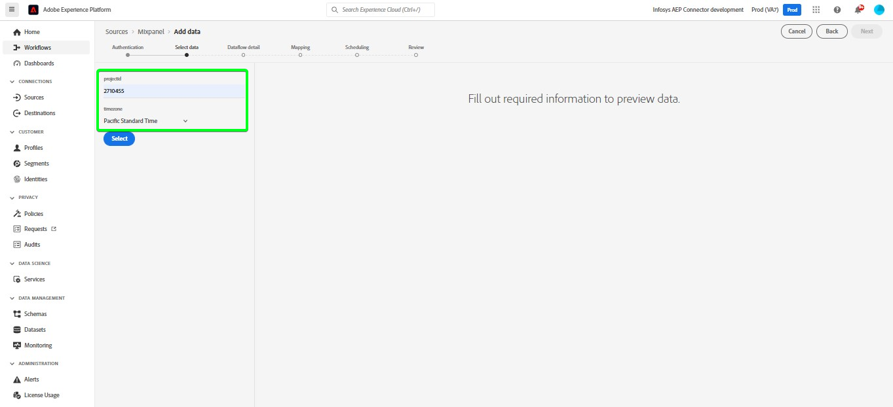
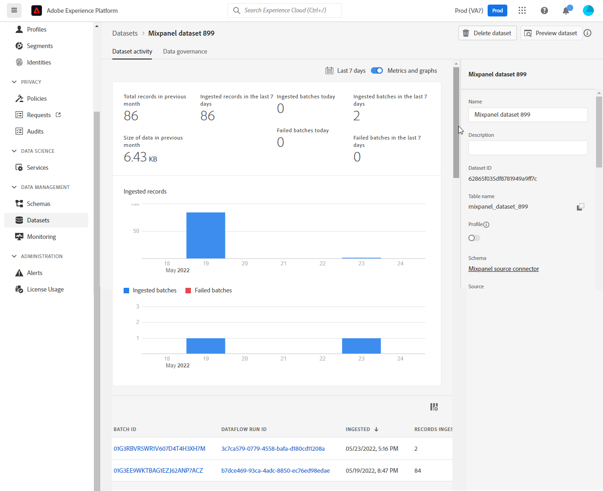
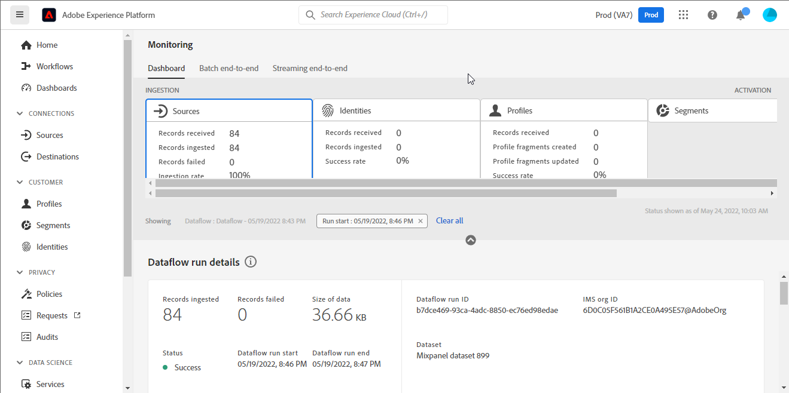
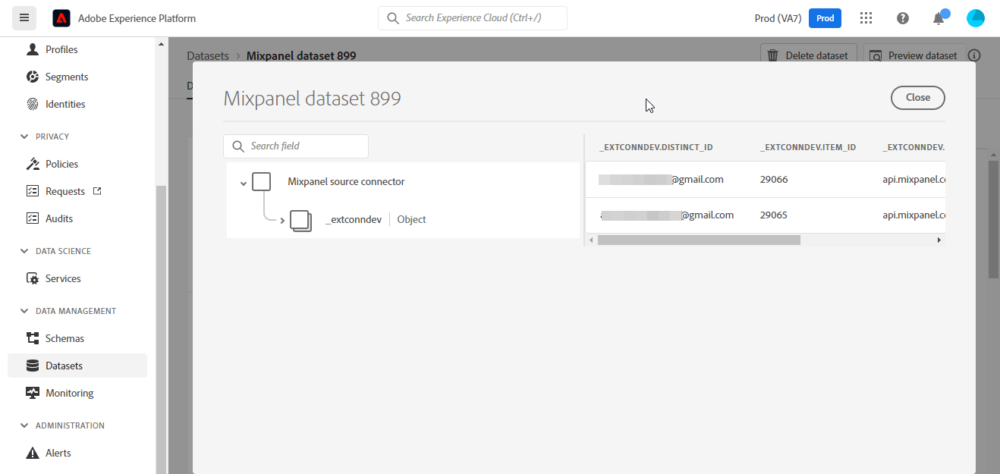
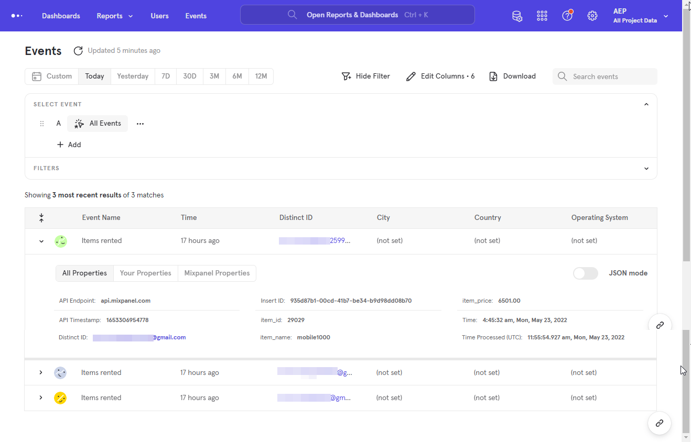

# (Beta) Create a [!DNL Mixpanel] source connection in the UI

>[!NOTE]
>
>The [!DNL Mixpanel] source is in beta. See the [sources overview](../../../../home.md#terms-and-conditions) for more information on using beta-labeled sources.

This tutorial provides steps for creating a [!DNL Mixpanel] source connection using the Adobe Experience Platform Platform user interface.

## Getting started

This tutorial requires a working understanding of the following components of Experience Platform:

* [[!DNL Experience Data Model (XDM)] System](../../../../../xdm/home.md): The standardized framework by which [!DNL Experience Platform] organizes customer experience data.
  * [Basics of schema composition](../../../../../xdm/schema/composition.md): Learn about the basic building blocks of XDM schemas, including key principles and best practices in schema composition.
  * [Schema Editor tutorial](../../../../../xdm/tutorials/create-schema-ui.md): Learn how to create custom schemas using the Schema Editor UI.
* [[!DNL Real-Time Customer Profile]](../../../../../profile/home.md): Provides a unified, real-time consumer profile based on aggregated data from multiple sources.

### Gather required credentials

In order to connect [!DNL Mixpanel] to Platform, you must provide values for the following connection properties:

| Credential | Description | Example |
| --- | --- | --- |
| Username | The service account username that corresponds with your [!DNL Mixpanel] account. See the [[!DNL Mixpanel] service accounts documentation](https://developer.mixpanel.com/reference/service-accounts#authenticating-with-a-service-account) for more information. | `Test8.6d4ee7.mp-service-account` |
| Password | The service account password that corresponds with your [!DNL Mixpanel] account. | `dLlidiKHpCZtJhQDyN2RECKudMeTItX1` |
| Project ID | Your [!DNL Mixpanel] project ID. This ID is required to create a source connection. See the [[!DNL Mixpanel] project settings documentation](https://help.mixpanel.com/hc/en-us/articles/115004490503-Project-Settings) and the [[!DNL Mixpanel] guide on creating and managing projects](https://help.mixpanel.com/hc/en-us/articles/115004505106-Create-and-Manage-Projects) for more information. | `2384945` |
| Timezone | The timezone that corresponds with your [!DNL Mixpanel] project. Timezone is required to create a source connection. See the [Mixpanel project settings documentation](https://help.mixpanel.com/hc/en-us/articles/115004490503-Project-Settings) for more information.| `Pacific Standard Time` |

For more information on authenticating your [!DNL Mixpanel] source, see the [[!DNL Mixpanel] source overview](../../../../connectors/analytics/mixpanel.md).

## Connect your [!DNL Mixpanel] account

In the Platform UI, select **[!UICONTROL Sources]** from the left navigation bar to access the [!UICONTROL Sources] workspace. The [!UICONTROL Catalog] screen displays a variety of sources with which you can create an account.

You can select the appropriate category from the catalog on the left-hand side of your screen. Alternatively, you can find the specific source you wish to work with using the search option.

Under the *Analytics* category, select [!DNL Mixpanel], and then select **[!UICONTROL Add data]**.

The **[!UICONTROL Connect Mixpanel account]** page appears. On this page, you can either use new credentials or existing credentials.

### Existing account

To use an existing account, select the [!DNL Mixpanel] account you want to create a new dataflow with, then select **[!UICONTROL Next]** to proceed.

### New account

If you are creating a new account, select **[!UICONTROL New account]**, and then provide a name, an optional description, and your credentials. When finished, select **[!UICONTROL Connect to source]** and then allow some time for the new connection to establish.

## Select your project ID and timezone {#project-id-and-timezone}

>[!CONTEXTUALHELP]
>id="platform_sources_mixpanel_timezone"
>title="Set a timezone for Mixpanel ingestion"
>abstract="The timezone must be the same as your Mixpanel profile timezone setting because Platform uses the designated project timezone to ingest relevant data from Mixpanel. Mixpanel will adjust its timezone to coordinate with your project timezone before recording the event to a Mixpanel data store."
>additional-url="https://experienceleague.adobe.com/docs/experience-platform/sources/ui-tutorials/create/analytics/mixpanel.html?lang=en#project-id-and-timezone" text="Learn more in documentation"

Once your source is authenticated, provide your project ID and timezone and then select **[!UICONTROL Select]**. 

The timezone that you designate prior to ingesting your [!DNL Mixpanel] data to Platform must be the same as your [!DNL Mixpanel] profile timezone setting. Any changes to your data's timezone will only be applied to new events and old events will remain in the timezone that you previously designated. [!DNL Mixpanel] accommodates Daylight Savings Time and will adjust your ingestion timestamp appropriately. For more information on how timezones affect your data, see the [!DNL Mixpanel] guide on [managing timezones for projects](https://help.mixpanel.com/hc/en-us/articles/115004547203-Manage-Timezones-for-Projects-in-Mixpanel).

After a few moments, the right interface updates to a preview panel, allowing you to inspect your schema before creating a dataflow. When finished, select **[!UICONTROL Next]**.

## Next steps

By following this tutorial, you have established a connection to your [!DNL Mixpanel] account. You can now continue on to the next tutorial and [configure a dataflow to bring analytics data into Platform](../../dataflow/analytics.md).

## Additional resources {#additional-resources}

The sections below provides additional resources that you can refer to when using the [!DNL Mixpanel] source.

### Validation {#validation}

The following outlines steps you can take to validate that you have successfully connected your [!DNL Mixpanel] source and that [!DNL Mixpanel] events are being ingested to Platform.

In the Platform UI, select **[!UICONTROL Datasets]** from the left navigation bar to access the [!UICONTROL Datasets] workspace. The [!UICONTROL Dataset Activity] screen displays the details of executions.

Next, select the dataflow run ID of the dataflow that you want to view to see specific details about that dataflow run.

Finally, select **[!UICONTROL Preview dataset]** to display the data that was ingested.

You can verify this data against the data on the [!DNL Mixpanel] > [!DNL Events] page. See the [[!DNL Mixpanel] document on Events](https://help.mixpanel.com/hc/en-us/articles/4402837164948-Events-formerly-Live-View-) for more information.

### Mixpanel schema

The table below lists the supported mappings that must be set up for [!DNL Mixpanel].

>[!TIP]
>
>See [Event Export API > Download](https://developer.mixpanel.com/reference/raw-event-export) for more information on the API.

| Source | Type |
|---|---|
| `distinct_id` | string |
| `event_name` | string |
| `import` | boolean |
| `insert_id` | string |
| `item_id` | string |
| `item_name` | string |
| `item_price` | string |
| `mp_api_endpoint` | string |
| `mp_api_timestamp_ms` | integer |
| `mp_processing_time_ms` | integer |
| `time` | integer |

### Limits {#limits}

* You have a maximum of 100 concurrent queries and 60 queries per hour as indicated on [Export API Rate Limits](https://help.mixpanel.com/hc/en-us/articles/115004602563-Rate-Limits-for-API-Endpoints).
