# Create a [!DNL Pendo] source connection dataflow and in the UI

>[!NOTE]
>
>The [!DNL Pendo] source is in beta. See the [sources overview](../../../../home.md#terms-and-conditions) for more information on using beta-labelled sources.

This tutorial provides steps for creating a [!DNL Pendo] source connection and dataflow using the Adobe Experience Platform user interface.

## Getting started {#getting-started}

This tutorial requires a working understanding of the following components of Experience Platform:

* [[!DNL Experience Data Model (XDM)] System](../../../../../xdm/home.md): The standardized framework by which [!DNL Experience Platform] organizes customer experience data.
  * [Basics of schema composition](../../../../../xdm/schema/composition.md): Learn about the basic building blocks of XDM schemas, including key principles and best practices in schema composition.
  * [Schema Editor tutorial](../../../../../xdm/tutorials/create-schema-ui.md): Learn how to create custom schemas using the Schema Editor UI.
* [[!DNL Real-Time Customer Profile]](../../../../../profile/home.md): Provides a unified, real-time consumer profile based on aggregated data from multiple sources.

## Prerequisites {#prerequisites}

The following section provides information on prerequisites to complete before you can create a [!DNL Pendo] source connection.

### Sample JSON to define the source schema for [!DNL Pendo] {#prerequisites-json-schema}

Before creating a [!DNL Pendo] source connection, you will require a source schema to be provided. You can use the JSON below.

```
{
  "accountId": "58f79ee324d3f",
  "timestamp": 1673372516,
  "visitorId": "test@test.com",
  "uniqueId": "166e50cdf40930fe1367e4d44795c9c74d88b83a",
  "properties": {
    "guideProperties": {
  "name": "Guide Conversion Test"
  }
}
}
```

For more information, read the [[!DNL Pendo] guide on webhooks](https://support.pendo.io/hc/en-us/articles/360032285012-Webhooks).

### Create a Platform schema for [!DNL Pendo] {#create-platform-schema}

You must also ensure that you first create a Platform schema to use for your source. See the tutorial on [creating a Platform schema](../../../../../xdm/schema/composition.md) for comprehensive steps on how to create a schema.

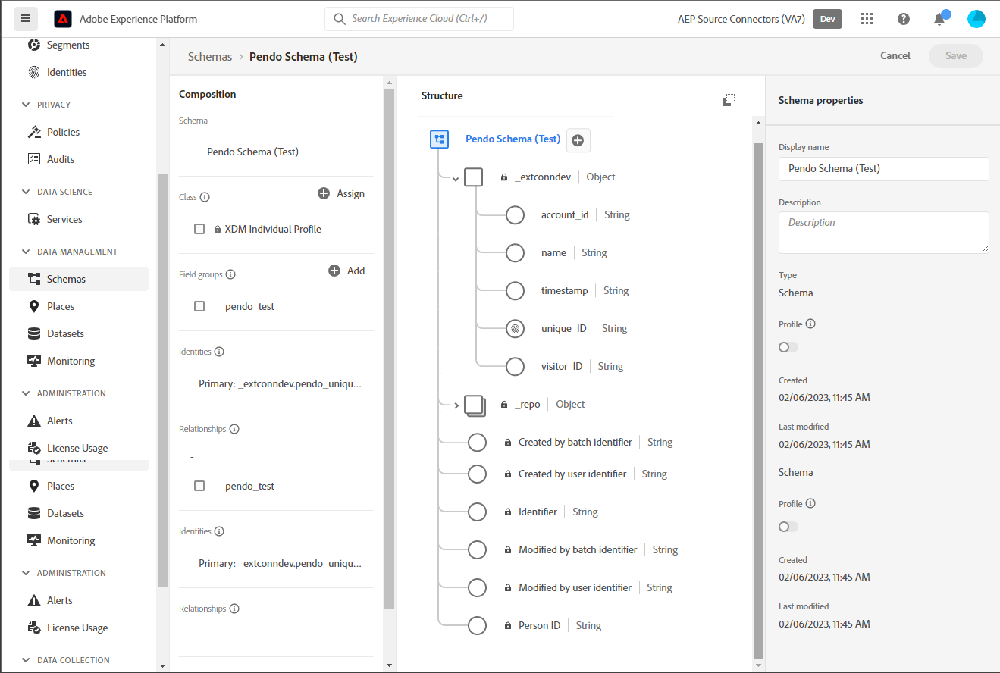

## Connect your [!DNL Pendo] account {#connect-account}

In the Platform UI, select **[!UICONTROL Sources]** from the left navigation to access the [!UICONTROL Sources] workspace and see a catalog of sources available in Experience Platform.

Use the *[!UICONTROL Categories]* menu to filter sources by category. Alternatively, enter a source name in the search bar to find a specific source from the catalog.

Go to the [!UICONTROL Analytics] category to see the [!DNL Pendo] source card. To begin, select **[!UICONTROL Add data]**.

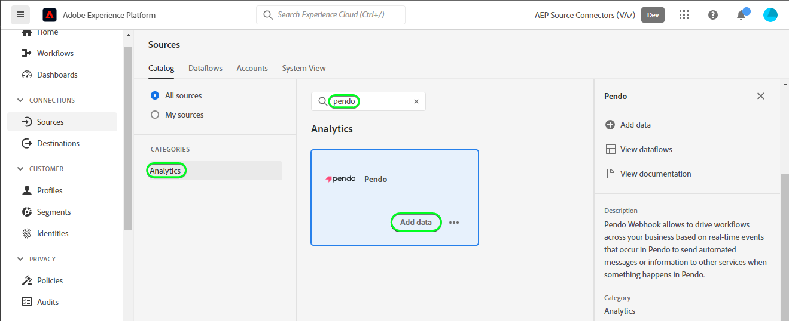

## Select data {#select-data}

The **[!UICONTROL Select data]** step appears, providing an interface for you to select the data that you want to bring to Platform.

* The left part of the interface is a browser that allows you to view the available data streams within your account;
* The right part of the interface lets you preview up to 100 rows of data from a JSON file.

Select **[!UICONTROL Upload files]** to upload a JSON file from your local system. Alternatively, you can drag and drop the JSON file you want to upload into the [!UICONTROL Drag and drop files] panel.

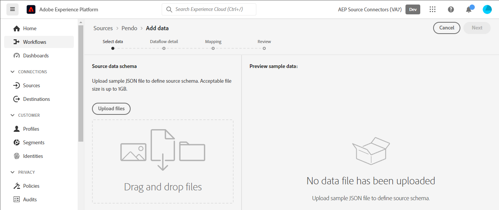

Once your file uploads, the preview interface updates to display a preview of the schema you uploaded. The preview interface allows you to inspect the contents and structure of a file. You can also use the [!UICONTROL Search field] utility to access specific items from within your schema.

When finished, select **[!UICONTROL Next]**.

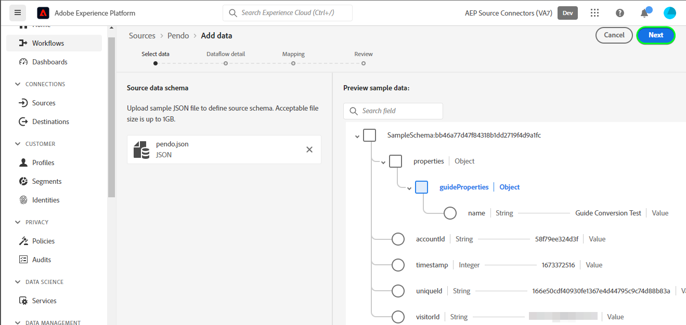

## Dataflow detail {#dataflow-detail}

The **Dataflow detail** step appears, providing you with options to use an existing dataset or establish a new dataset for your dataflow, as well as an opportunity to provide a name and description for your dataflow. During this step, you can also configure settings for Profile ingestion, error diagnostics, partial ingestion, and alerts.

When finished, select **[!UICONTROL Next]**.

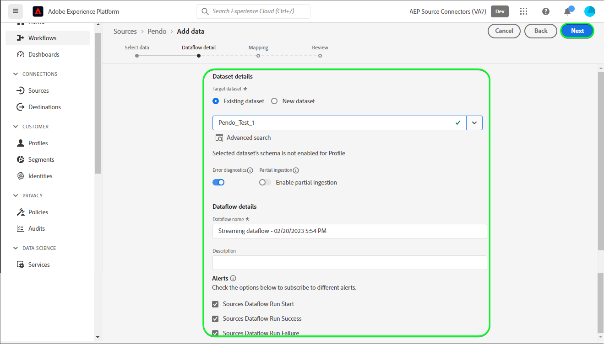

## Mapping {#mapping}

The [!UICONTROL Mapping] step appears, providing you with an interface to map the source fields from your source schema to their appropriate target XDM fields in the target schema.

Platform provides intelligent recommendations for auto-mapped fields based on the target schema or dataset that you selected. You can manually adjust mapping rules to suit your use cases. Based on your needs, you can choose to map fields directly, or use data prep functions to transform source data to derive computed or calculated values. For comprehensive steps on using the mapper interface and calculated fields, see the [Data Prep UI guide](../../../../../data-prep/ui/mapping.md).

The mappings listed below are mandatory and should be setup before proceeding to the [!UICONTROL Review] stage.

| Target Field | Description |
| --- | --- |
| `uniqueId` | The [!DNL Pendo] identifier for the event. |

Once your source data is successfully mapped, select **[!UICONTROL Next]**.

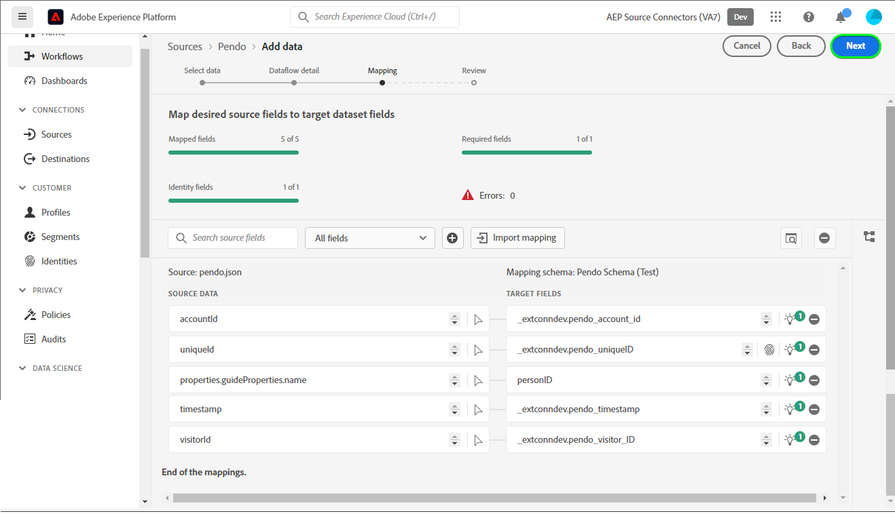

## Review {#review}

The **[!UICONTROL Review]** step appears, allowing you to review your new dataflow before it is created. Details are grouped within the following categories:

* **[!UICONTROL Connection]**: Shows the source type, the relevant path of the chosen source file, and the amount of columns within that source file.
* **[!UICONTROL Assign dataset & map fields]**: Shows which dataset the source data is being ingested into, including the schema that the dataset adheres to.

Once you have reviewed your dataflow, select **[!UICONTROL Finish]** and allow some time for the dataflow to be created.

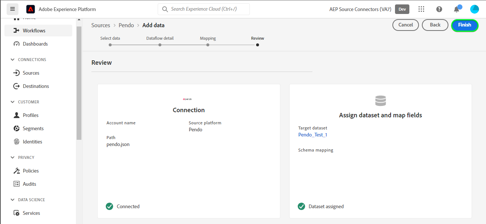

## Get your streaming endpoint URL {#get-streaming-endpoint-url}

With your streaming dataflow created, you can now retrieve your streaming endpoint URL. This endpoint will be used to subscribe to your webhook, allowing your streaming source to communicate with Experience Platform. 

In order to construct the URL used to configure the webhook on [!DNL Pendo] you must retrieve the following:

* **[!UICONTROL Dataflow ID]**
* **[!UICONTROL Streaming endpoint]**

To retrieve your **[!UICONTROL Dataflow ID]** and **[!UICONTROL Streaming endpoint]**, go to the [!UICONTROL Dataflow activity] page of the dataflow that you just created and copy the details from the bottom of the [!UICONTROL Properties] panel.

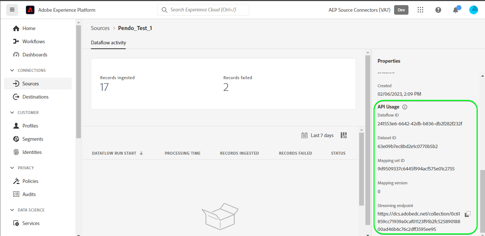

Once you have retrieved your streaming endpoint and dataflow ID, build a URL based on the following pattern: ```{STREAMING_ENDPOINT}?x-adobe-flow-id={DATAFLOW_ID}```. For example, a constructed webhook URL may look like: ```https://dcs.adobedc.net/collection/0c61859cc71939a0caf01123f91b2fc52589018800ad46b6c76c2dff3595ee95```

## Set up Webhook in [!DNL Pendo] {#set-up-webhook}

Next, login to your account on [[!DNL Pendo]](https:/pendo.io/) and create a webhook. For steps on how to create a webhook using the [!DNL Pendo] user interface, please refer to the [[!DNL Pendo] guide on creating webhook](https://support.pendo.io/hc/en-us/articles/360032285012-Webhooks#create-a-webhook-0-4). 

Once your webhook is created, navigate to the settings page of your [!DNL Pendo] webhook and input your webhook URL in the [!DNL URL] field.

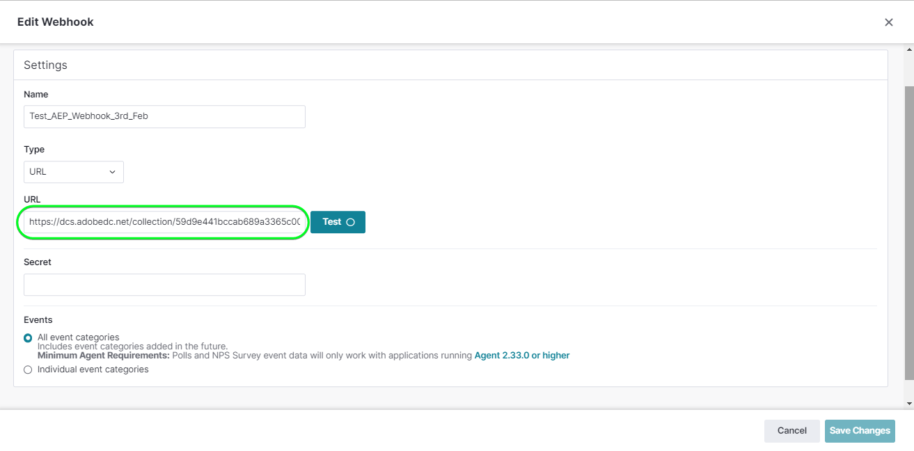

>[!TIP]
>
>You can subscribe to a variety of different events categories to determine the kind of events you want to send from your [!DNL Pendo] instance to Platform. For more information on the different events, please refer to the the [[!DNL Pendo] documentation](https://support.pendo.io/hc/en-us/articles/360032285012-Webhooks#create-a-webhook-0-4).

## Next steps {#next-steps}

By following this tutorial you have successfully [configured a dataflow to bring data into Platform](https:/experienceleague.adobe.com/docs/experience-platform/sources/ui-tutorials/dataflow/analytics.html).

## Additional resources {#additional-resources}

The sections below provide additional resources that you can refer to when using the [!DNL Pendo] source.

### Validation {#validation}

To validate that you have correctly set up the source and [!DNL Pendo] messages are being ingested, follow the steps below:

* You can check the [!DNL Pendo] **[!UICONTROL Reports]** > **[!UICONTROL Chat History]** page to identify the events being captured by [!DNL Pendo].

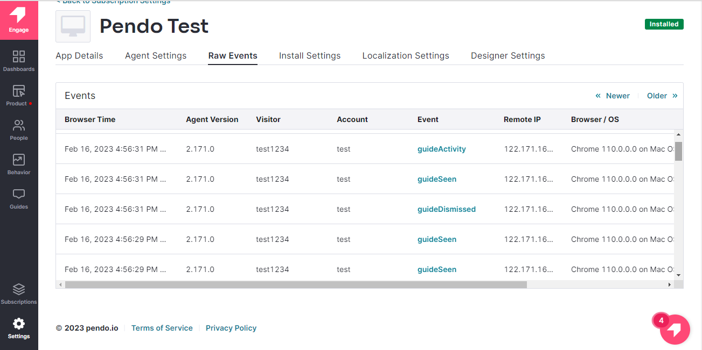

* In the Platform UI, select **[!UICONTROL View Dataflows]** beside the [!DNL Pendo] card menu on the sources catalog. Next, select **[!UICONTROL Preview dataset]** to verify the data that was ingested for the webhooks that you have configured within [!DNL Pendo].

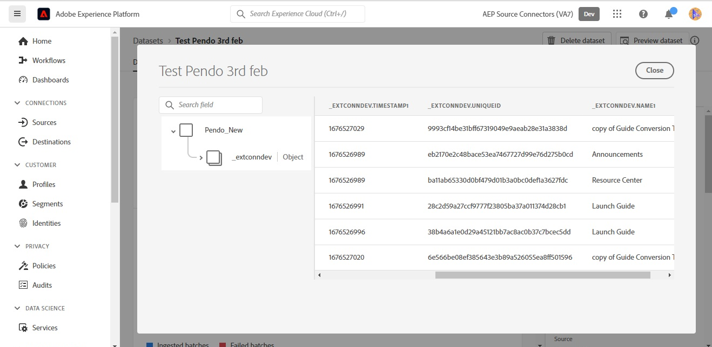

### Errors and troubleshooting {#errors-and-troubleshooting}

When checking a dataflow run, you might encounter the following error message: `The message can't be validated ... uniqueID:expected minLength:1, actual 0].`

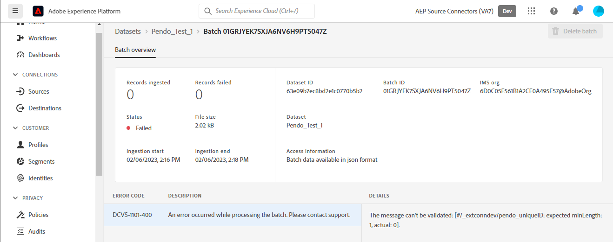

To fix this error, you must verify that the *uniqueID* mapping has been set up. For additional guidance, refer to the [Mmpping](#mapping) section.

For more information visit the [[!DNL Pendo] Help Center](https://www.pendo.io/help-center/).