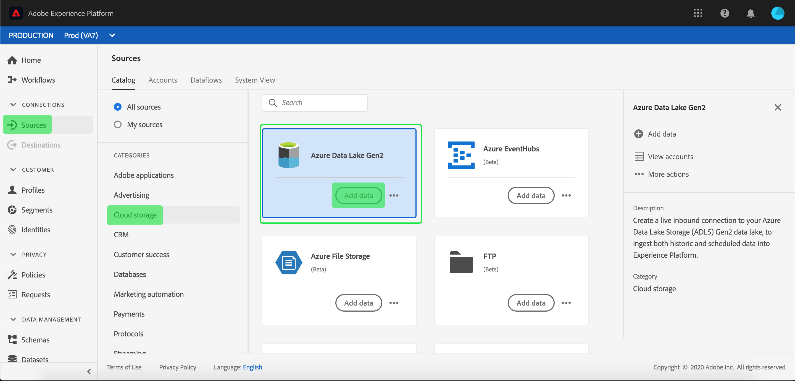
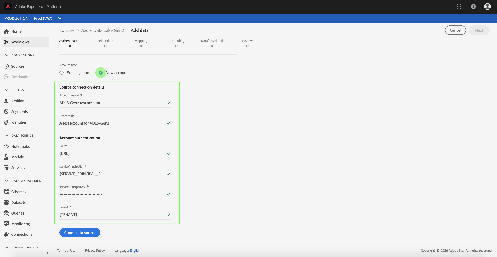
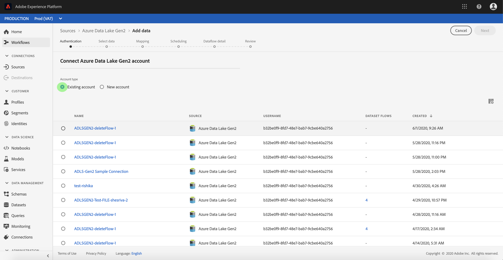

# Create an [!DNL Azure Data Lake Storage Gen2] source connector in the UI

Source connectors in Adobe Experience Platform provide the ability to ingest externally sourced data on a scheduled basis. This tutorial provides steps for authenticating an [!DNL Azure Data Lake Storage Gen2] (hereinafter referred to as "ADLS Gen2") source connector using the [!DNL Platform] user interface.

## Getting started

This tutorial requires a working understanding of the following components of Adobe Experience Platform:

-   [[!DNL Experience Data Model] (XDM) System](../../../../../xdm/home.md): The standardized framework by which [!DNL Experience Platform] organizes customer experience data.
    -   [Basics of schema composition](../../../../../xdm/schema/composition.md): Learn about the basic building blocks of XDM schemas, including key principles and best practices in schema composition.
    -   [Schema Editor tutorial](../../../../../xdm/tutorials/create-schema-ui.md): Learn how to create custom schemas using the Schema Editor UI.
-   [[!DNL Real-time Customer Profile]](../../../../../profile/home.md): Provides a unified, real-time consumer profile based on aggregated data from multiple sources.

If you already have an ADLS Gen2 base connection, you may skip the remainder of this document and proceed to the tutorial on [configuring a dataflow](../../dataflow/batch/cloud-storage.md).

### Gather required credentials

In order to authenticate your ADLS Gen2 source connector, you must provide values for the following connection properties:

| Credential | Description |
| ---------- | ----------- |
| `url` | The endpoint for ADLS Gen2. |
| `servicePrincipalId` | The application's client ID. |
| `servicePrincipalKey` | The application's key. |
| `tenant` | The tenant information that contains your application. |

For more information about these values, refer to [this ADLS Gen2 document](https://docs.microsoft.com/en-us/azure/data-factory/connector-azure-data-lake-storage).

## Connect your ADLS Gen2 account

Once you have gathered your required credentials, you can follow the steps below to create a new inbound base connection to link your ADLS Gen2 account to [!DNL Platform].

Log in to [Adobe Experience Platform](https://platform.adobe.com) and then select **[!UICONTROL Sources]** from the left navigation bar to access the **[!UICONTROL Sources]** workspace. The **[!UICONTROL Catalog]** tab displays a variety of sources for which can be used to create inbound base connections. Each source shows the number of existing base connections associated to them.

Under the **[!UICONTROL Cloud Storage]* category**, select **[!UICONTROL Azure Data Lake Gen2]** to expose an information bar on the right-hand side of your screen. The information bar provides a brief description for the selected source as well as options to connect with the source view its documentation. To create a new inbound base connection, click **[!UICONTROL Add data]**.

The **[!UICONTROL Connect to Azure Data Lake Gen2]** dialog appears. On this page, you can either use new credentials or existing credentials. 

### New account

If you are using new credentials, select **[!UICONTROL New Account]**. On the input form that appears, provide the base connection with a name, an optional description, and your ADLS Gen2 credentials. When finished, select **[!UICONTROL Connect]** and then allow some time for the new base connection to establish.

### Existing account

To connect an existing account, select the ADLS Gen2 account you want to connect with, then select **[!UICONTROL Next]** to proceed.

## Next steps

By following this tutorial, you have established a base connection to your ADLS Gen2 account. You can now continue on to the next tutorial and [configure a dataflow to bring data from your cloud storage into [!DNL Platform]](../../dataflow/batch/cloud-storage.md).