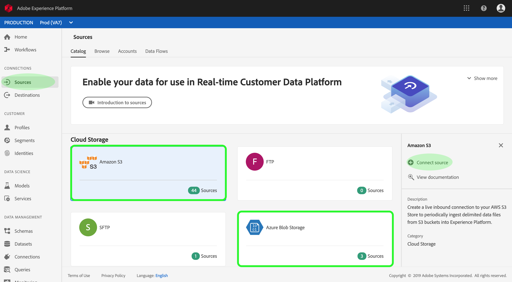
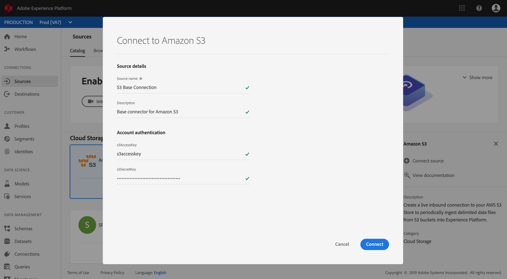

# Create an Azure Blob or Amazon S3 source connector in the UI

Source connectors in Adobe Experience Platform provide the ability to ingest externally sourced data on a scheduled basis. This tutorial provides steps for creating an Azure Blob (hereinafter referred to as "Blob") or Amazon S3 (hereinafter referred to as "S3") source connector using the Platform user interface.

## Getting started

This tutorial requires a working understanding of the following components of Adobe Experience Platform:

*   [Experience Data Model (XDM) System](../../../../../xdm/home.md): The standardized framework by which Experience Platform organizes customer experience data.
    *   [Basics of schema composition](../../../../../xdm/schema/composition.md): Learn about the basic building blocks of XDM schemas, including key principles and best practices in schema composition.
    *   [Schema Editor tutorial](../../../../../xdm/tutorials/create-schema-ui.md): Learn how to create custom schemas using the Schema Editor UI.
*   [Real-time Customer Profile](../../../../../profile/home.md): Provides a unified, real-time consumer profile based on aggregated data from multiple sources.

If you already have a Blob or S3 base connection, you may skip the remainder of this document and proceed to the tutorial on [configuring a dataflow](../../dataflow/cloud-storage.md).

### Supported file formats

Experience Platform supports the following file formats to be ingested from external storages:

*   Delimiter-separated values (DSV): Support for DSV formatted data files is currently limited to comma-separated values. The value of field headers within DSV formatted files must only consist of alphanumeric characters and underscores. Support for general DSV files will be provided in the future.
*   JavaScript Object Notation (JSON): JSON formatted data files must be XDM compliant.
*   Apache Parquet: Parquet formatted data files must be XDM compliant.

### Gather required credentials

In order to access your Blob storage on Platform, you must provide a valid **Azure Storage connection string**. You can learn more about connection strings including ways to obtain them through <a href="https://docs.microsoft.com/en-us/azure/storage/common/storage-configure-connection-string" target="_blank">this Microsoft Azure document</a>.

Similarly, accessing your S3 bucket on Platform requires you to provide your **S3 Access Key** and **S3 Secret Key**. For more information, refer to <a href="https://aws.amazon.com/blogs/security/wheres-my-secret-access-key/" target="_blank">this AWS document</a>.

## Connect your Blob or S3 account

With your cloud storage's credentials ready, you can follow the steps below to create a new inbound base connection to link your Blob or S3 account to Platform.

Log in to <a href="https://platform.adobe.com" target="_blank">Adobe Experience Platform</a> and then select **Sources** from the left navigation bar to access the sources workspace. The *Catalog* screen displays a variety of sources for which you can create inbound base connections with, and each source shows the number of existing base connections associated to them.

Under the *Cloud Storage* category, select either **Azure Blob Storage** or **Amazon S3** to expose an information bar on the right-side of your screen. The information bar provides a brief description for the selected source as well as options to view its documentation or to connect with the source. To create a new inbound base connection, click **Connect source**. 

On the input form, provide the base connection with a name, an optional description, and your Blob or S3 credentials. Lastly, click **Connect** and then allow some time for the new base connection to establish.

## Next steps

By following this tutorial, you have established a base connection to your Azure Blob or Amazon S3 account. You can now continue on to the next tutorial and [configure a dataflow to bring data into Platform](../../dataflow/cloud-storage.md).