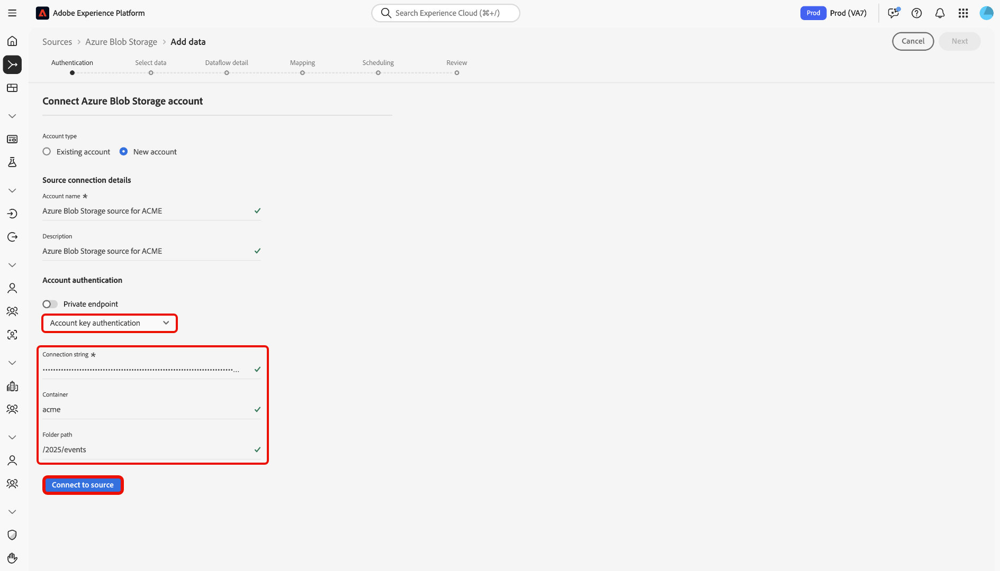
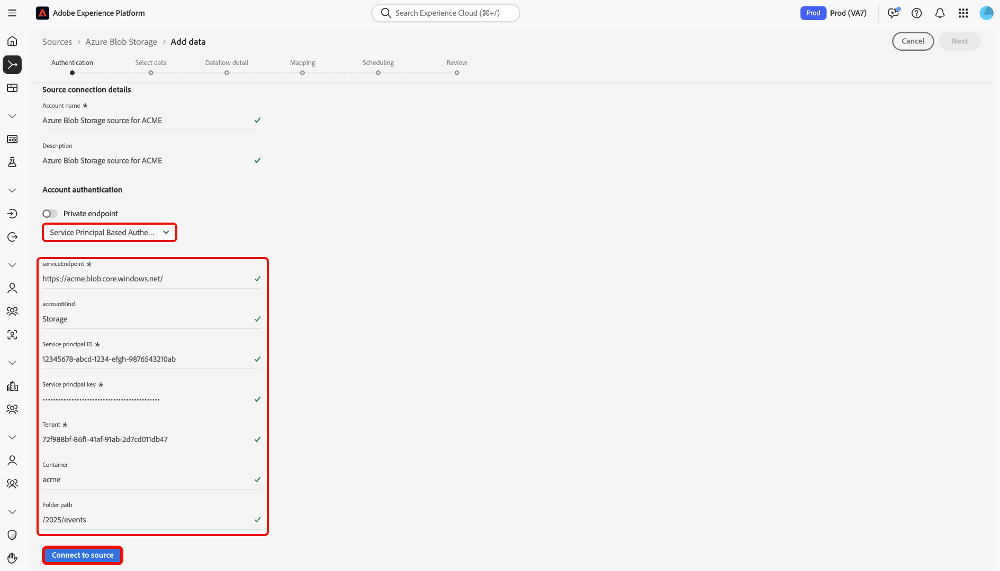

# Connect [!DNL Azure Blob Storage] to Experience Platform using the UI

Read this guide to learn how to connect your[!DNL Azure Blob Storage] instance to Adobe Experience Platform using the sources workspace in the Experience Platform user interface.

## Getting started

This tutorial requires a working understanding of the following components of Adobe Experience Platform:

* [[!DNL Experience Data Model (XDM)] System](../../../../../xdm/home.md): The standardized framework for organizing customer experience data in Experience Platform.
  * [Basics of schema composition](../../../../../xdm/schema/composition.md): Learn about the basic building blocks of XDM schemas, including key principles and best practices in schema composition.
  * [Schema Editor tutorial](../../../../../xdm/tutorials/create-schema-ui.md): Learn how to create custom schemas using the Schema Editor UI.
* [[!DNL Real-Time Customer Profile]](../../../../../profile/home.md): Provides a unified, real-time consumer profile based on aggregated data from multiple sources.

If you already have a valid [!DNL Azure Blob Storage] connection, you may skip the remainder of this document and proceed to the tutorial on [configuring a dataflow](../../dataflow/batch/cloud-storage.md).

### Supported file formats

Experience Platform supports the following file formats to be ingested from external storages:

* Delimiter-separated values (DSV): You can use any single column delimiter such as a tab, comma, pipe, semicolon, or hash to collect flat files in any format.
* JavaScript Object Notation (JSON): JSON formatted data files must be XDM compliant.
* Apache Parquet: Parquet formatted data files must be XDM compliant.

### Gather required credentials

Read the [[!DNL Azure Blob Storage] overview](../../../../connectors/cloud-storage/blob.md#authentication) for information on authentication.

## Navigate the sources catalog

In the Experience Platform UI, select **[!UICONTROL Sources]** from the left navigation to access the *[!UICONTROL Sources]* workspace. Choose a category or use the search bar to find your source.

To connect to [!DNL Azure Blob Storage], go to the *[!UICONTROL Cloud storage]* category, select the **[!UICONTROL Azure Blob Storage]** source card, and then select **[!UICONTROL Set up]**.

>[!TIP]
>
>Sources show **[!UICONTROL Set up]** for new connections and **[!UICONTROL Add data]** if an account already exists.

## Use an existing account

To use an existing account, select **[!UICONTROL Existing account]** and then select the [!DNL Azure Blob Storage] account that you want to use.

## Create a new account

To create a new account, select **[!UICONTROL New account]** and then provide a name and optionally add a description for your account. You can connect your [!DNL Azure Blob Storage] account to Experience Platform using the following authentication types:

* **Account key authentication**: Uses the storage account's access key to authenticate and connect to your [!DNL Azure Blob Storage] account.
* **Shared access signature (SAS)**: Uses a SAS URI to provide delegated, time-limited access to resources in your [!DNL Azure Blob Storage] account.
* **Service principal based authentication**: Uses an Azure Active Directory (AAD) service principal (client ID and secret) to securely authenticate to your Azure Blob Storage account.

>[!BEGINTABS]

>[!TAB Account key authentication]

Select **[!UICONTROL Account key authentication]** and provide your `connectionString`, `container`, and `folderPath`. Next, select **[!UICONTROL Connect to source]** and allow for a few moments for the connection to establish.

>[!TAB Shared access signature]

Select **[!UICONTROL Shared access signature]** and provide your `sasUri`, `container`, and `folderPath`. Next, select **[!UICONTROL Connect to source]** and allow for a few moments for the connection to establish.

>[!TAB Service principal based authentication]

Select **[!UICONTROL Service principal based authentication]** and provide your `serviceEndpoint`, `servicePrincipalId`, `servicePrincipalKey`, `accountKind`, `tenant`, `container`, and `folderPath`. Next, select **[!UICONTROL Connect to source]** and allow for a few moments for the connection to establish.

>[!ENDTABS]

## Next steps

By following this tutorial, you have established a connection to your [!DNL Azure Blob Storage] account. You can now continue on to the next tutorial and [configure a dataflow to bring data from your cloud storage into Experience Platform](../../dataflow/batch/cloud-storage.md).
