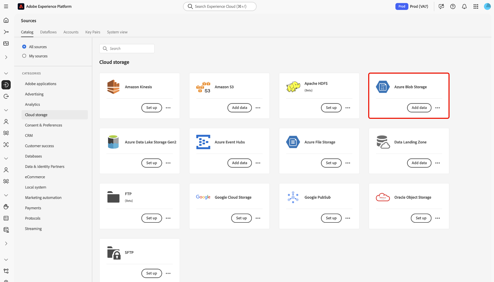
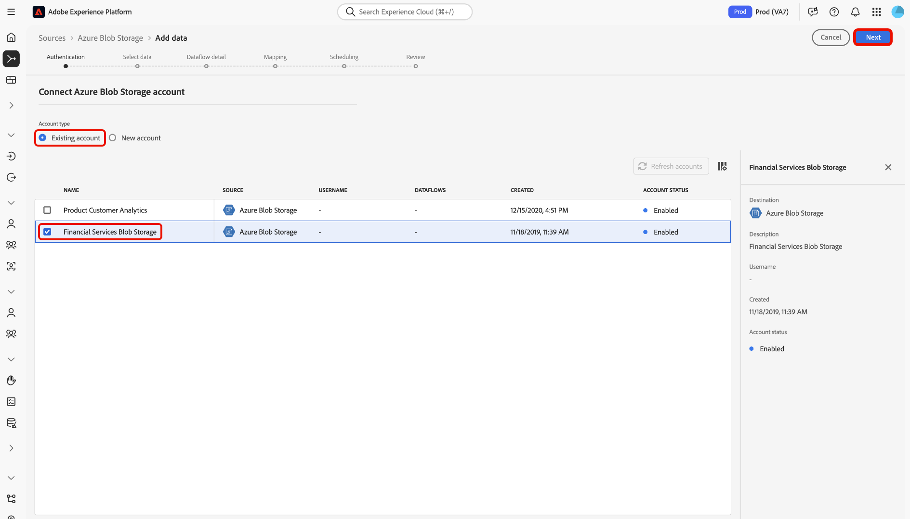
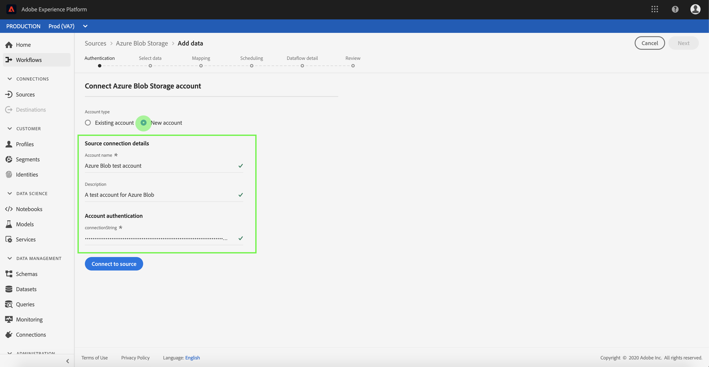
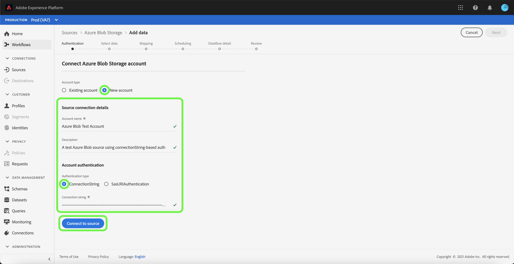
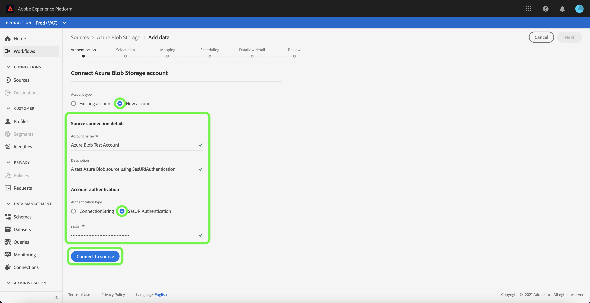

# Create an [!DNL Azure Blob] source connection in the UI

This tutorial provides steps for creating an [!DNL Azure Blob] (hereinafter referred to as "[!DNL Blob]") source connection using the Platform user interface.

## Getting started

This tutorial requires a working understanding of the following components of Adobe Experience Platform:

* [[!DNL Experience Data Model (XDM)] System](../../../../../xdm/home.md): The standardized framework by which Experience Platform organizes customer experience data.
  * [Basics of schema composition](../../../../../xdm/schema/composition.md): Learn about the basic building blocks of XDM schemas, including key principles and best practices in schema composition.
  * [Schema Editor tutorial](../../../../../xdm/tutorials/create-schema-ui.md): Learn how to create custom schemas using the Schema Editor UI.
* [[!DNL Real-Time Customer Profile]](../../../../../profile/home.md): Provides a unified, real-time consumer profile based on aggregated data from multiple sources.

If you already have a valid [!DNL Blob] connection, you may skip the remainder of this document and proceed to the tutorial on [configuring a dataflow](../../dataflow/batch/cloud-storage.md).

### Supported file formats

Experience Platform supports the following file formats to be ingested from external storages:

* Delimiter-separated values (DSV): You can use any single column delimiter such as a tab, comma, pipe, semicolon, or hash to collect flat files in any format.
* JavaScript Object Notation (JSON): JSON formatted data files must be XDM compliant.
* Apache Parquet: Parquet formatted data files must be XDM compliant.

### Gather required credentials

In order to access your [!DNL Blob] storage on Platform, you must provide a valid value for the following credential:

| Credential | Description |
| ---------- | ----------- |
| Connection string | A string that contains the authorization information necessary to authenticate [!DNL Blob] to Experience Platform. The [!DNL Blob] connection string pattern is: `DefaultEndpointsProtocol=https;AccountName={ACCOUNT_NAME};AccountKey={ACCOUNT_KEY}`. For more information about connection strings, see this [!DNL Blob] document on [configuring connection strings](https://docs.microsoft.com/en-us/azure/storage/common/storage-configure-connection-string). |
| SAS URI| The shared access signature URI that you can use as an alternative authentication type to connect your [!DNL Blob] account. The [!DNL Blob] SAS URI pattern is: `https://{ACCOUNT_NAME}.blob.core.windows.net/?sv=<storage version>&st={START_TIME}&se={EXPIRE_TIME}&sr={RESOURCE}&sp={PERMISSIONS}>&sip=<{IP_RANGE}>&spr={PROTOCOL}&sig={SIGNATURE}>` For more information, see this [!DNL Blob] document on [shared access signature URIs](https://docs.microsoft.com/en-us/azure/data-factory/connector-azure-blob-storage#shared-access-signature-authentication). |
| Container | The name of the container that you want to designate access to. When creating a new account with the [!DNL Blob] source, you can provide a container name to specify user access to sub folder of your choice. |
| Folder path | The path to the folder that you want to provide access to. |

Once you have gathered your required credentials, you can follow the steps below to link your [!DNL Blob] account to Platform.

## Connect your [!DNL Blob] account

In the Platform UI, select **[!UICONTROL Sources]** from the left navigation bar to access the [!UICONTROL Sources] workspace. The [!UICONTROL Catalog] screen displays a variety of sources with which you can create an account.

You can select the appropriate category from the catalog on the left-hand side of your screen. Alternatively, you can find the specific source you wish to work with using the search bar.

Under the [!UICONTROL Cloud storage] category, select **[!UICONTROL Azure Blob Storage]**, and then select **[!UICONTROL Add data]**.

The **[!UICONTROL Connect to Azure Blob Storage]** page appears. On this page, you can either use new credentials or existing credentials.

### Existing account

To use an existing account, select the [!DNL Blob] account you want to create a new dataflow with, then select **[!UICONTROL Next]** to proceed.

### New account

If you are creating a new account, select **[!UICONTROL New account]**, and then provide a name and an optional description for your new [!DNL Blob] account.

The [!DNL Blob] source supports both account key authentication and shared access signature (SAS) authentication. An account key-based authentication requires a connection string for verification, while a SAS authentication utilizes a URI that allows for secure delegated authorization of your account.

During this step, you can also designate the sub folders that your account will have access to by defining the name of the container and the path to the sub folder.

>[!BEGINTABS]

>[!TAB Connection String]

To authenticate with an account key, select **[!UICONTROL Account key authentication]** and provide your connection string. During this step, you can also designate the container name and path to the sub folder that you want access to. When finished, select **[!UICONTROL Connect to source]**.

>[!TAB SAS URI]

You can use SAS to create authentication credentials with varying degrees of access, as a SAS-based authentication allows you to set permissions, start and expiry dates, as well as provisions to specific resources.

To authenticate with a shared access signature, select **[!UICONTROL Shared access signature authentication]** and then provide your SAS URI. During this step, you can also designate the container name and path to the sub folder that you want access to. When finished, select **[!UICONTROL Connect to source]**.

>[!ENDTABS]

## Next steps

By following this tutorial, you have established a connection to your [!DNL Blob] account. You can now continue on to the next tutorial and [configure a dataflow to bring data from your cloud storage into Platform](../../dataflow/batch/cloud-storage.md).
