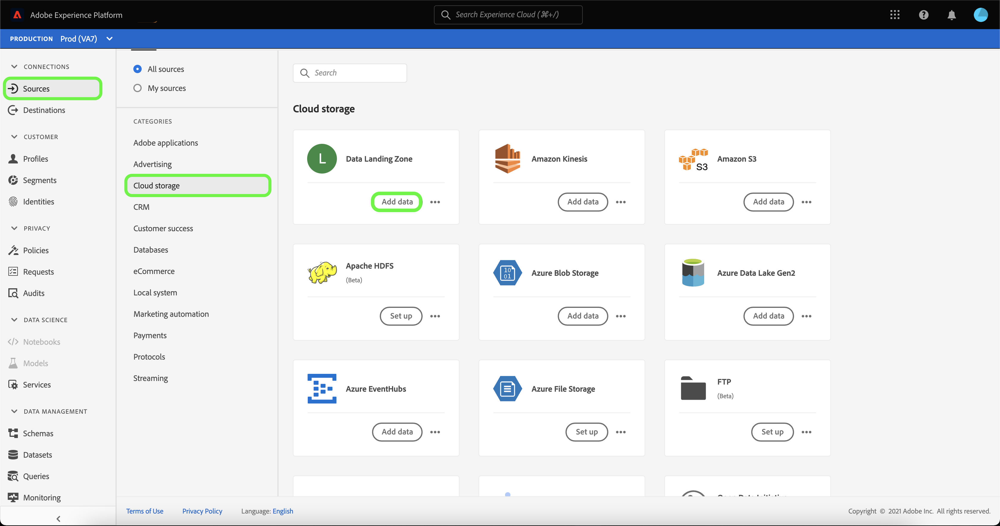
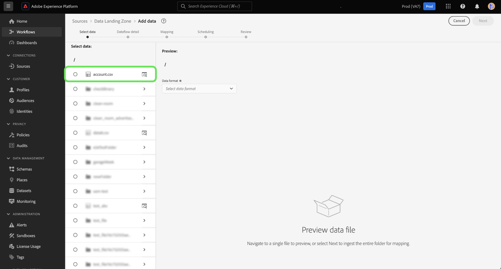
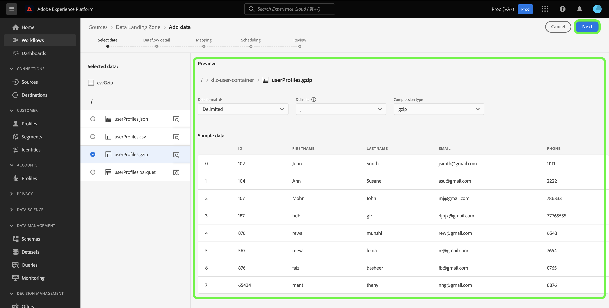
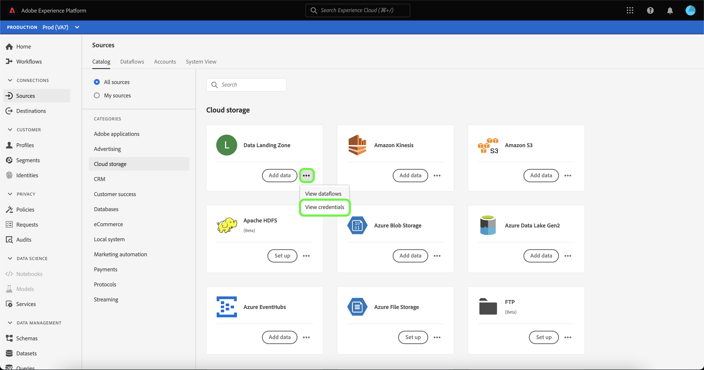
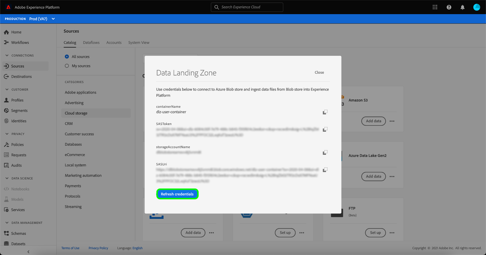

# Connect [!DNL Data Landing Zone] to Platform using the UI

[!DNL Data Landing Zone] is a secure, cloud-based file storage facility to bring files into Adobe Experience Platform. Data is automatically deleted from the [!DNL Data Landing Zone] after seven days.

This tutorial provides steps for creating a [!DNL Data Landing Zone] source connection using the Platform user interface.

## Getting started

This tutorial requires a working understanding of the following components of Adobe Experience Platform:

* [Sources](../../../../home.md): Experience Platform allows data to be ingested from various sources while providing you with the ability to structure, label, and enhance incoming data using Platform services.
* [Sandboxes](../../../../../sandboxes/home.md): Experience Platform provides virtual sandboxes which partition a single Platform instance into separate virtual environments to help develop and evolve digital experience applications.

## Bring your files from [!DNL Data Landing Zone] to Platform

In the Platform UI, select **[!UICONTROL Sources]** from the left navigation to access the [!UICONTROL Sources] workspace. The [!UICONTROL Catalog] screen displays a variety of sources that you can create an account with.

You can select the appropriate category from the catalog on the left-hand side of your screen. Alternatively, you can find the specific source you wish to work with using the search bar.

Under the [!UICONTROL cloud storage] category, select [!DNL Data Landing Zone] and then select **[!UICONTROL Add data]**.

The [!UICONTROL Add data] step appears, providing you with an interface to select and preview the data you want to bring to Platform.

* The left part of the interface is a folder browser, providing you with a list of files from your container that you can then bring to Platform.
* The right part of the interface lets you preview up to 100 rows of data from a compatible file.

Select the file that you want to bring to Platform and allow for a few moments for the right interface to update into a preview screen.

>[!TIP]
>
>Platform auto-detects property information of the file you selected, including information on the file's data format, designated column delimiter, and compression type.

The preview interface allows you to inspect the contents and structure of a file. By default, the preview interface displays the first file in the folder you selected.

To preview a different file, select the preview icon beside the name of the file you want to inspect.

When finished, select **[!UICONTROL Next]**.

For a detailed, step-by-step guide on how to create a dataflow for a cloud storage source, see the tutorial on [creating a cloud storage dataflow to bring data to Platform](../../dataflow/batch/cloud-storage.md).

## Retrieve and refresh your [!DNL Data Landing Zone] credentials

[!DNL Data Landing Zone] is an out-of-the-box source that comes with your Adobe Experience Platform Sources license. [!DNL Data Landing Zone] uses an SAS URI and SAS Token-based authentication. You can retrieve and refresh your authentication credentials from the [!UICONTROL Sources catalog] page.

In the [!UICONTROL Sources catalog], under the [!UICONTROL Cloud storage] category, select the ellipses (**...**) from the **[!UICONTROL Data Landing Zone]** card. From the dropdown menu that appears, select **[!UICONTROL View credentials]**.

A popover appears, displaying your container name, SAS token, storage account name, and SAS URI. 

Select **[!UICONTROL Refresh credentials]** and allow for a few seconds for your updated credentials to be processed.

>[!TIP]
>
>Your [!DNL Data Landing Zone] credentials are set to auto-expire after 90 days and you must use new credentials to re-connect to [!DNL Data Landing Zone] after expiration. Your dataflows in Platform are not affected by expiring credentials and you can still continue working with new and existing dataflows with your new credentials.

## Next steps

By following this tutorial, you have accessed your [!DNL Data Landing Zone] container and learned to retrieve and refresh your credentials. You can now proceed to the next tutorial on [creating a dataflow to bring data from a cloud storage to Platform](../../dataflow/batch/cloud-storage.md).
