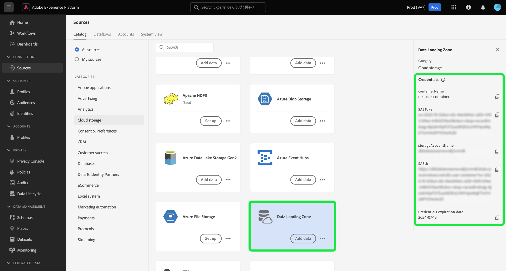
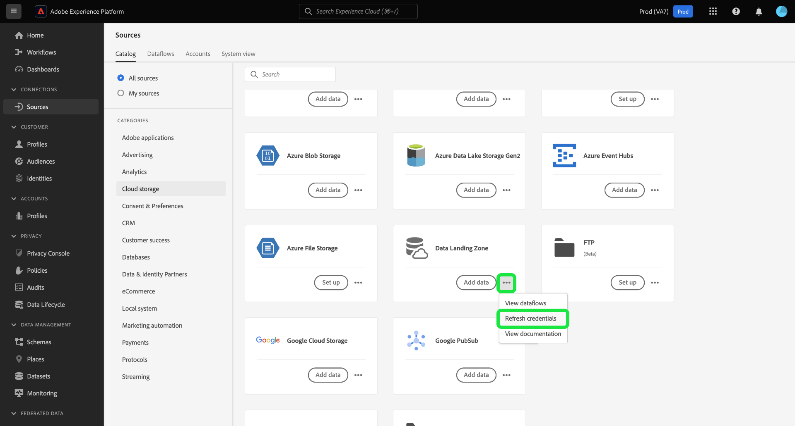
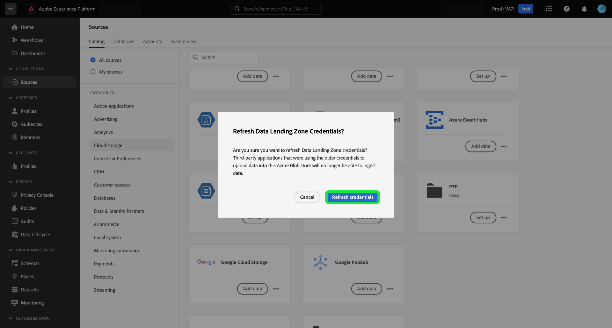
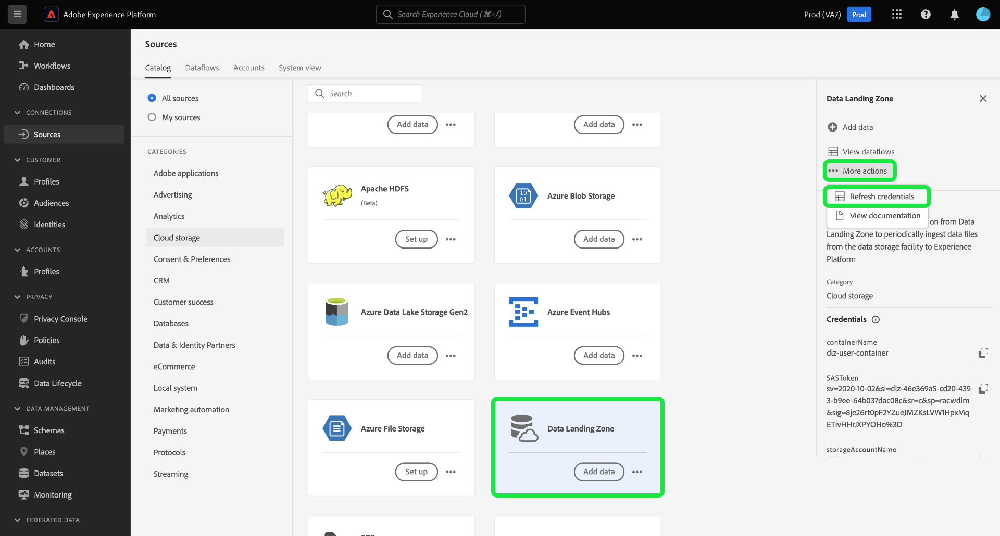

# Connect [!DNL Data Landing Zone] to Experience Platform using the UI

>[!IMPORTANT]
>
>This page is specific to the [!DNL Data Landing Zone] *source* connector in Experience Platform. For information on connecting to the [!DNL Data Landing Zone] *destination* connector, refer to the [[!DNL Data Landing Zone] destination documentation page](/help/destinations/catalog/cloud-storage/data-landing-zone.md).

[!DNL Data Landing Zone] is a secure, cloud-based file storage facility to bring files into Adobe Experience Platform. Data is automatically deleted from the [!DNL Data Landing Zone] after seven days.

This tutorial provides steps for creating a [!DNL Data Landing Zone] source connection using the Experience Platform user interface.

## Getting started

This tutorial requires a working understanding of the following components of Adobe Experience Platform:

* [Sources](../../../../home.md): Experience Platform allows data to be ingested from various sources while providing you with the ability to structure, label, and enhance incoming data using Experience Platform services.
* [Sandboxes](../../../../../sandboxes/home.md): Experience Platform provides virtual sandboxes which partition a single Experience Platform instance into separate virtual environments to help develop and evolve digital experience applications.

## Bring your files from [!DNL Data Landing Zone] to Experience Platform

>[!IMPORTANT]
>
> To connect to the source, you need the **[!UICONTROL View Sources]** and **[!UICONTROL Manage Sources]** access control permissions. Read the [access control overview](../../../../../access-control/home.md) or contact your product administrator to obtain the required permissions.

In the Experience Platform UI, select **[!UICONTROL Sources]** from the left navigation to access the [!UICONTROL Sources] workspace. The [!UICONTROL Catalog] screen displays a variety of sources that you can create an account with.

You can select the appropriate category from the catalog on the left-hand side of your screen. Alternatively, you can find the specific source you wish to work with using the search bar.

Under the [!UICONTROL cloud storage] category, select [!DNL Data Landing Zone] and then select **[!UICONTROL Add data]**.

The [!UICONTROL Add data] step appears, providing you with an interface to select and preview the data you want to bring to Experience Platform.

* The left part of the interface is a folder browser, providing you with a list of files from your container that you can then bring to Experience Platform.
* The right part of the interface lets you preview up to 100 rows of data from a compatible file.

Select the file that you want to bring to Experience Platform and allow for a few moments for the right interface to update into a preview screen.

>[!TIP]
>
>Experience Platform auto-detects property information of the file you selected, including information on the file's data format, designated column delimiter, and compression type.

The preview interface allows you to inspect the contents and structure of a file. By default, the preview interface displays the first file in the folder you selected.

To preview a different file, select the preview icon beside the name of the file you want to inspect.

When finished, select **[!UICONTROL Next]**.

For a detailed, step-by-step guide on how to create a dataflow for a cloud storage source, see the tutorial on [creating a cloud storage dataflow to bring data to Experience Platform](../../dataflow/batch/cloud-storage.md).

## Retrieve your [!DNL Data Landing Zone] credentials

[!DNL Data Landing Zone] is a source that comes with your Adobe Experience Platform Sources license. [!DNL Data Landing Zone] uses an SAS URI and SAS Token-based authentication. You can retrieve your authentication credentials from the [!UICONTROL Sources catalog] page.

To retrieve your credentials, select the **[!UICONTROL Data Landing Zone]** card and then copy your credentials from the right rail that appears.

A popover appears, displaying your container name, SAS token, storage account name, SAS URI, and expiry date.

## Refresh your [!DNL Data Landing Zone] credentials

Your [!DNL Data Landing Zone] credentials are set to auto-expire after 90 days and you must use new credentials to re-connect to [!DNL Data Landing Zone] after expiration. Your dataflows in Experience Platform are not affected by expiring credentials and you can still continue working with new and existing dataflows with your new credentials.

There are two ways to refresh your [!DNL Data Landing Zone] credentials:

>[!BEGINTABS]

>[!TAB Use the source card]

To refresh your credentials from the sources catalog page, select the ellipses (**`...`**) in the [!DNL Data Landing Zone] card and then select **[!UICONTROL Refresh credentials]**.

A pop up window appears, prompting your confirmation before you can proceed. When you are ready, select **[!UICONTROL Refresh credentials]**.

>[!TAB Use the right rail]

To refresh your credentials using the right rail, select the **[!UICONTROL Data Landing Zone]** source card and then select **[!UICONTROL More actions]**. Next, select **[!UICONTROL Refresh Credentials]** and then confirm using the pop up window that appears.

>[!ENDTABS]

## Next steps

By following this tutorial, you have accessed your [!DNL Data Landing Zone] container and learned to retrieve and refresh your credentials. You can now proceed to the next tutorial on [creating a dataflow to bring data from a cloud storage to Experience Platform](../../dataflow/batch/cloud-storage.md).
