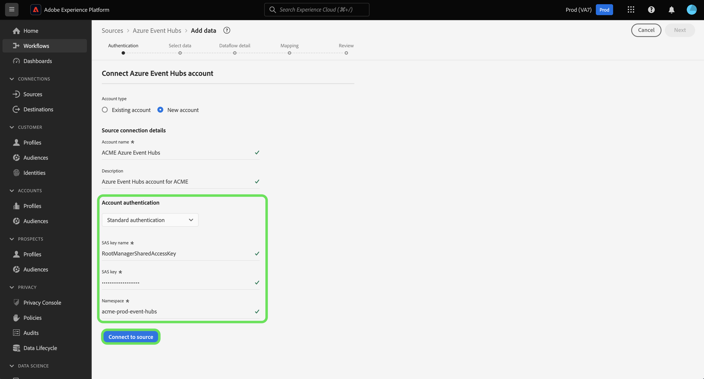
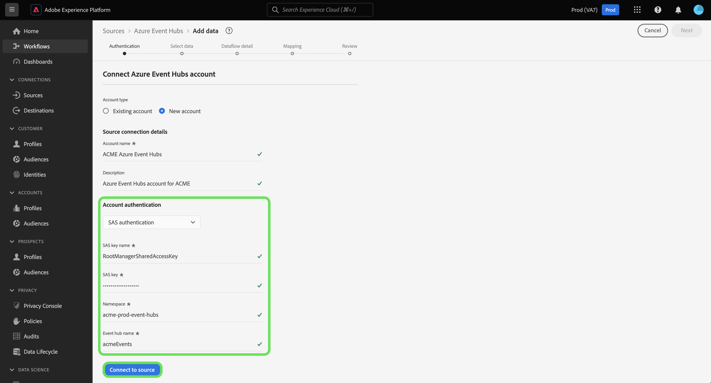

# Create an [!DNL Azure Event Hubs] source connection in the UI

>[!IMPORTANT]
>
>The [!DNL Azure Event Hubs] source is available in the sources catalog to users who have purchased Real-Time Customer Data Platform Ultimate.

This tutorial provides steps to create an [!DNL Azure Event Hubs] account using the Adobe Experience Platform user interface.

## Getting started

This tutorial requires a working understanding of the following components of Adobe Experience Platform:

* [[!DNL Experience Data Model (XDM)] System](../../../../../xdm/home.md): The standardized framework by which [!DNL Experience Platform] organizes customer experience data.
  * [Basics of schema composition](../../../../../xdm/schema/composition.md): Learn about the basic building blocks of XDM schemas, including key principles and best practices in schema composition.
  * [Schema Editor tutorial](../../../../../xdm/tutorials/create-schema-ui.md): Learn how to create custom schemas using the Schema Editor UI.
* [[!DNL Real-Time Customer Profile]](../../../../../profile/home.md): Provides a unified, real-time consumer profile based on aggregated data from multiple sources.

If you already have a valid [!DNL Event Hubs] connection, you may skip the remainder of this document and proceed to the tutorial on [configuring a dataflow](../../dataflow/streaming/cloud-storage-streaming.md).

### Gather required credentials

In order to authenticate your [!DNL Event Hubs] source connector, you must provide values for the following connection properties:

>[!BEGINTABS]

>[!TAB Standard authentication]

| Credential | Description |
| --- | --- |
| SAS key name | The name of the authorization rule, which is also known as the SAS key name. |
| SAS key | The primary key of the [!DNL Event Hubs] namespace. The `sasPolicy` that the `sasKey` corresponds to must have `manage` rights configured in order for the [!DNL Event Hubs] list to be populated. |
| Namespace | The namespace of the [!DNL Event Hubs] you are accessing. An [!DNL Event Hubs] namespace provides a unique scoping container, in which you can create one or more [!DNL Event Hubs]. |

>[!TAB SAS authentication]

| Credential | Description |
| --- | --- |
| SAS key name | The name of the authorization rule, which is also known as the SAS key name. |
| SAS key | The primary key of the [!DNL Event Hubs] namespace. The `sasPolicy` that the `sasKey` corresponds to must have `manage` rights configured in order for the [!DNL Event Hubs] list to be populated. |
| Namespace | The namespace of the [!DNL Event Hubs] you are accessing. An [!DNL Event Hubs] namespace provides a unique scoping container, in which you can create one or more [!DNL Event Hubs]. |
| Event Hub name | The name for your [!DNL Event Hubs] source. |

>[!ENDTABS]

For more information about these values, refer to [this Event Hubs document](https://docs.microsoft.com/en-us/azure/event-hubs/authenticate-shared-access-signature).

Once you have gathered your required credentials, you can follow the steps below to link your [!DNL Event Hubs] account to Experience Platform.

## Connect your [!DNL Event Hubs] account

In the Platform UI, select **[!UICONTROL Sources]** from the left navigation to access the [!UICONTROL Sources] workspace. The [!UICONTROL Catalog] screen displays a variety of sources you can create an account with.

You can select the appropriate category from the catalog on the left-hand side of your screen. Alternatively, you can find the specific source you wish to work with using the search option.

Under the [!UICONTROL Cloud storage] category, select **[!UICONTROL Azure Event Hubs]**, and then select **[!UICONTROL Add data]**.

The **[!UICONTROL Connect to Azure Event Hubs]** dialog appears. On this page, you can either use new credentials or existing credentials. 

### Existing account

To use an existing account, select the [!DNL Event Hubs] account you want to use, then select **[!UICONTROL Next]** to proceed.

### New account

>[!TIP]
>
>Once created, you cannot change the authentication type of an [!DNL Event Hubs] base connection. To change the authentication type, you must create a new base connection.

To create a new account, select **[!UICONTROL New account]**, and then provide a name and an optional description for your new [!DNL Event Hubs] account.

>[!BEGINTABS]

>[!TAB Standard authentication]

To create an [!DNL Event Hubs] account with standard authentication, select **[!UICONTROL Standard authentication]** and then provide values for your [!UICONTROL SAS key name], [!UICONTROL SAS key], and [!UICONTROL Namespace].

Once you have inputted your authentication credentials, select **[!UICONTROL Connect to source]**.

>[!TAB SAS authentication]

To create an [!DNL Event Hubs] account with SAS authentication, select **[!UICONTROL SAS authentication]** and then provide values for your [!UICONTROL SAS key name], [!UICONTROL SAS key], [!UICONTROL Namespace], and [!UICONTROL Event Hubs name].

Once you have inputted your authentication credentials, select **[!UICONTROL Connect to source]**.

>[!ENDTABS]

## Next steps

By following this tutorial, you have connected your [!DNL Event Hubs] account to Experience Platform. You can now continue on to the next tutorial and [configure a dataflow to bring data from your cloud storage into Experience Platform](../../dataflow/streaming/cloud-storage-streaming.md).
