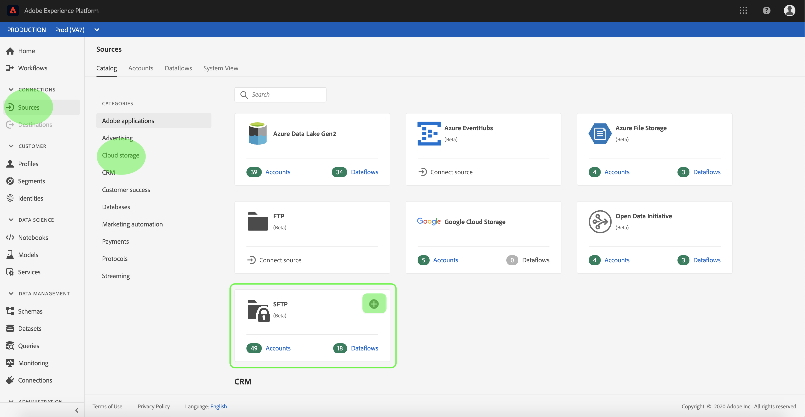
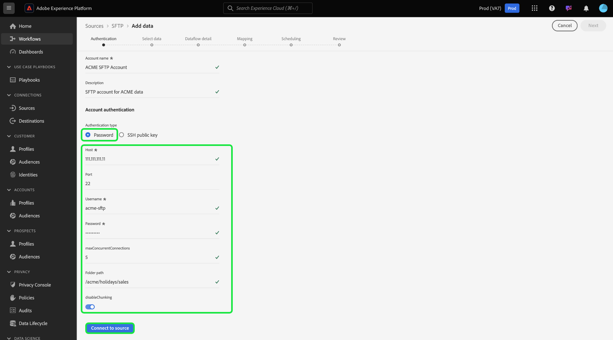
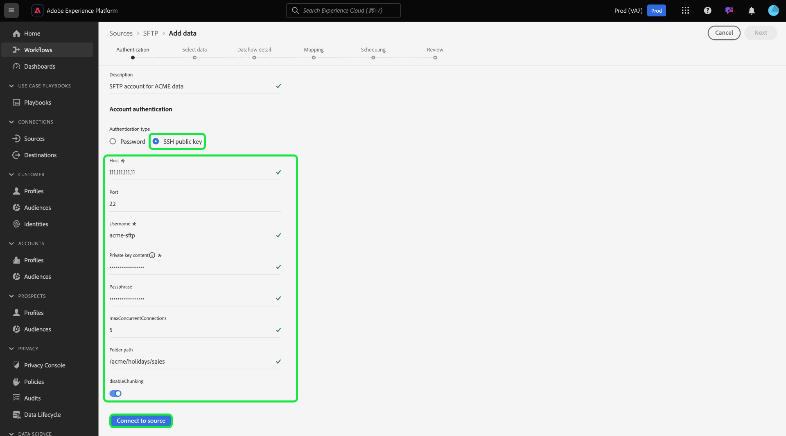
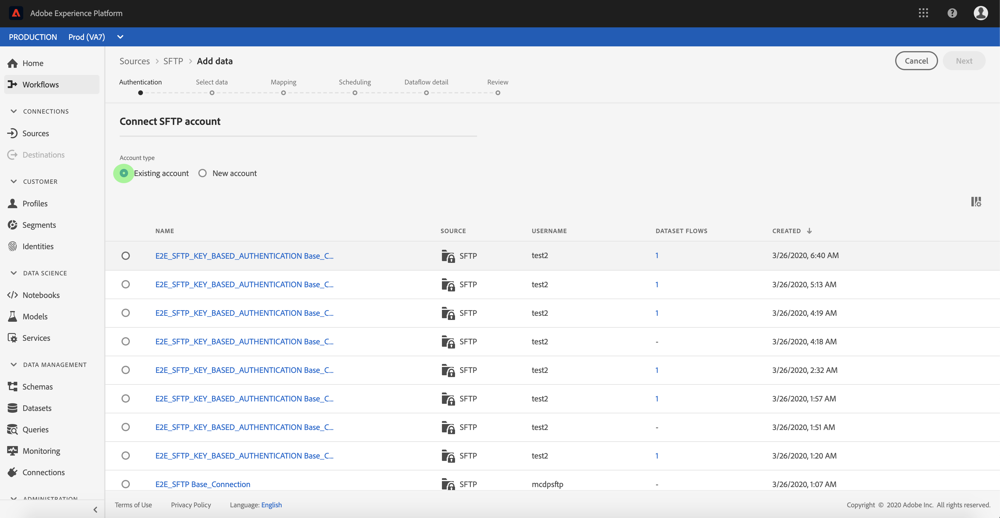

# Create an FTP or SFTP source connector in the UI

>[!NOTE]
>
>The FTP and SFTP connectors are in beta. See the [Sources overview](../../../../home.md#terms-and-conditions) for more information on using beta-labelled connectors.

Source connectors in Adobe Experience Platform provide the ability to ingest externally sourced data on a scheduled basis. This tutorial provides steps for creating a FTP or SFTP source connector using the [!DNL Platform] user interface.

## Getting started

This tutorial requires a working understanding of the following components of Adobe Experience Platform:

*   [[!DNL Experience Data Model] (XDM) System](../../../../../xdm/home.md): The standardized framework by which Experience Platform organizes customer experience data.
    *   [Basics of schema composition](../../../../../xdm/schema/composition.md): Learn about the basic building blocks of XDM schemas, including key principles and best practices in schema composition.
    *   [Schema Editor tutorial](../../../../../xdm/tutorials/create-schema-ui.md): Learn how to create custom schemas using the Schema Editor UI.
*   [[!DNL Real-time Customer Profile]](../../../../../profile/home.md): Provides a unified, real-time consumer profile based on aggregated data from multiple sources.

If you already have a valid FTP or SFTP connection, you may skip the remainder of this document and proceed to the tutorial on [configuring a dataflow](../../dataflow/batch/cloud-storage.md).

### Supported file formats

[!DNL Experience Platform] supports the following file formats to be ingested from external sources:

*   Delimiter-separated values (DSV): Support for DSV formatted data files are currently limited to Comma-separated values (CSV). The value of field headers within DSV formatted files must only consist of alphanumeric characters and underscores. Support for general DSV is to be provided in the future.
*   JavaScript Object Notation (JSON): JSON formatted data files must be XDM compliant.
*   Apache Parquet: Parquet formatted data files must be XDM compliant.

### Gather required credentials

In order to access your FTP or SFTP server on [!DNL Platform], you must provide the server's **host name**, a **user name**, and a **password**. 

## Connect to your FTP or SFTP server

Once you have gathered your required credentials, you can follow the steps below to create a new FTP or SFTP account to connect to [!DNL Platform].

Log in to [Adobe Experience Platform](https://platform.adobe.com) and then select **[!UICONTROL Sources]** from the left navigation bar to access the **[!UICONTROL Sources]** workspace. The **[!UICONTROL Catalog]** screen displays a variety of sources for which you can create an inbound account with.

You can select the appropriate category from the catalog on the left-hand side of your screen. Alternatively, you can find the specific source you wish to work with using the search option.

Under the **[!UICONTROL Databases]** category, select **[!UICONTROL SFTP]**. If this is your first time using this connector, select **[!UICONTROL Configure]**. Otherwise, select **[!UICONTROL Add data]** to create a new FTP or SFTP connector.

The **[!UICONTROL Connect to SFTP]** page appears. On this page, you can either use new credentials or existing credentials.

### New account

If you are using new credentials, select **[!UICONTROL New account]**. On the input form that appears, provide a name, an optional description, and your credentials. When finished, select **[!UICONTROL Connect]** and then allow some time for the new connection to establish.

The SFTP connector provides you different authentication types for access. Under **[!UICONTROL Account authentication]** select **[!UICONTROL Password]** to use a password-based credential.

Alternatively, you can select **[SSH public key]** and connect your SFTP account using a combination of **[!UICONTROL Private key content]** and **[!UICONTROL Passphrase]**.

>[!IMPORTANT]
>
>The SFTP connector supports an RSA/DSA OpenSSH key. Ensure that your key file content starts with `"-----BEGIN [RSA/DSA] PRIVATE KEY-----"`. If the private key file is a PPK-format file, use the PuTTY tool to convert from PPK to OpenSSH format.

| Credential | Description |
| ---------- | ----------- |
| Private key content | A Base64 encoded SSH private key content. The SSH private key should should be OpenSSH format. |
| Passphrase | Specifies the pass phrase or password to decrypt the private key if the key file or the key content is protected by a pass phrase. If PrivateKeyContent is password protected, this parameter needs to be used with the PrivateKeyContent's passphrase as value. |

### Existing account

To connect an existing account, select the FTP or SFTP account you want to connect with, then select **[!UICONTROL Next]** to proceed.

## Next steps

By following this tutorial, you have established a connection to your FTP or SFTP account. You can now continue on to the next tutorial and [configure a dataflow to bring data from your cloud storage into [!DNL Platform]](../../dataflow/batch/cloud-storage.md).