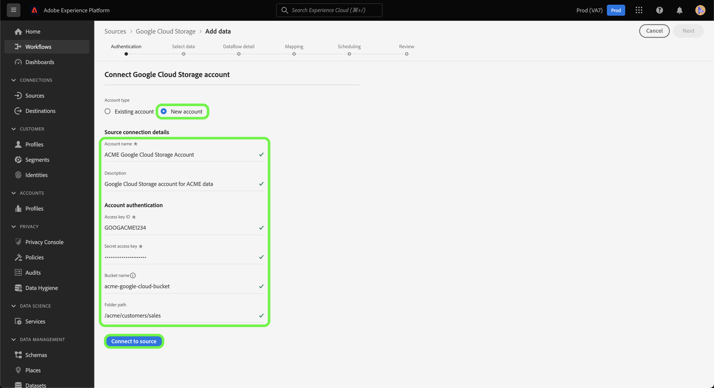

# Create a [!DNL Google Cloud Storage] source connection in the UI

This tutorial provides steps for creating a [!DNL Google Cloud Storage] source connection using the Adobe Experience Platform UI.

## Getting started

This tutorial requires a working understanding of the following components of Adobe Experience Platform:

* [[!DNL Experience Data Model (XDM)] System](../../../../../xdm/home.md): The standardized framework by which Experience Platform organizes customer experience data.
    * [Basics of schema composition](../../../../../xdm/schema/composition.md): Learn about the basic building blocks of XDM schemas, including key principles and best practices in schema composition.
    * [Schema Editor tutorial](../../../../../xdm/tutorials/create-schema-ui.md): Learn how to create custom schemas using the Schema Editor UI.
* [[!DNL Real-Time Customer Profile]](../../../../../profile/home.md): Provides a unified, real-time consumer profile based on aggregated data from multiple sources.

If you already have a valid [!DNL Google Cloud Storage] connection, you may skip the remainder of this document and proceed to the tutorial on [configuring a dataflow](../../dataflow/batch/cloud-storage.md).

### Supported file formats

[!DNL Experience Platform] supports the following file formats to be ingested from external storages:

*   Delimiter-separated values (DSV): Any single-character value can be used as a delimiter for DSV-formatted data files.
*   JavaScript Object Notation (JSON): JSON formatted data files must be XDM compliant.
*   Apache Parquet: Parquet formatted data files must be XDM compliant.

### Gather required credentials

In order to access your [!DNL Google Cloud Storage] data on Platform, you must provide the following values:

| Credential | Description |
| ---------- | ----------- |
| Access key ID | A 61-character, alphanumeric string used to authenticate your [!DNL Google Cloud Storage] account to Platform. |
| Secret access key | A 40-character, base-64-encoded string used to authenticate your [!DNL Google Cloud Storage] account to Platform. |
| Folder path | The path to the folder that you want to provide access to. |

For more information about these values, see the [Google Cloud Storage HMAC keys](https://cloud.google.com/storage/docs/authentication/hmackeys#overview) guide. For steps on how to generate your own access key ID and secret access key, refer to the [[!DNL Google Cloud Storage] overview](../../../../connectors/cloud-storage/google-cloud-storage.md).

Once you have gathered your required credentials, you can follow the steps below to link your [!DNL Google Cloud Storage] account to Platform.

## Connect your [!DNL Google Cloud Storage] account

In the Platform UI, select **[!UICONTROL Sources]** from the left navigation bar to access the [!UICONTROL Sources] workspace. The [!UICONTROL Catalog] screen displays a variety of sources with which you can create an account.

You can select the appropriate category from the catalog on the left-hand side of your screen. Alternatively, you can find the specific source you wish to work with using the search option.

Under the [!UICONTROL Cloud storage] category, select **[!UICONTROL Google Cloud Storage]** and then select **[!UICONTROL Add data]**.

The **[!UICONTROL Connect to Google Cloud Storage]** page appears. On this page, you can either use new credentials or existing credentials.

### Existing account

To connect an existing account, select the [!DNL Google Cloud Storage] account you want to connect with, then select **[!UICONTROL Next]** to proceed.

### New account

If you are using new credentials, select **[!UICONTROL New account]**. On the input form that appears, provide a name, an optional description, and your [!DNL Google Cloud Storage] credentials. During this step, you can also designate the sub folders that your account will have access to by defining the name of the path to the sub folder.

When finished, select **[!UICONTROL Connect to source]** and then allow some time for the new connection to establish.

## Next steps

By following this tutorial, you have established a connection to your [!DNL Google Cloud Storage] account. You can now continue on to the next tutorial and [configure a dataflow to bring data from your cloud storage into Platform](../../dataflow/batch/cloud-storage.md).
