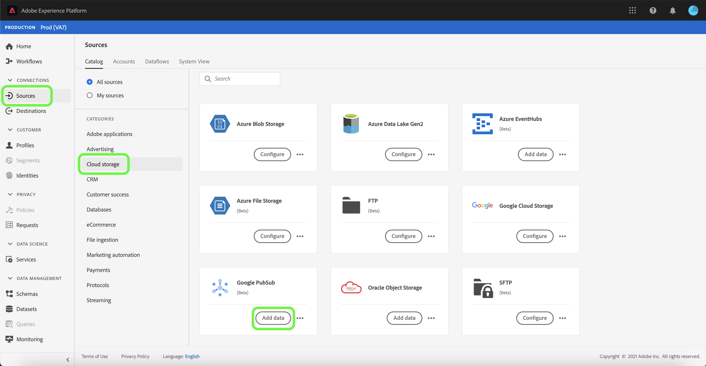
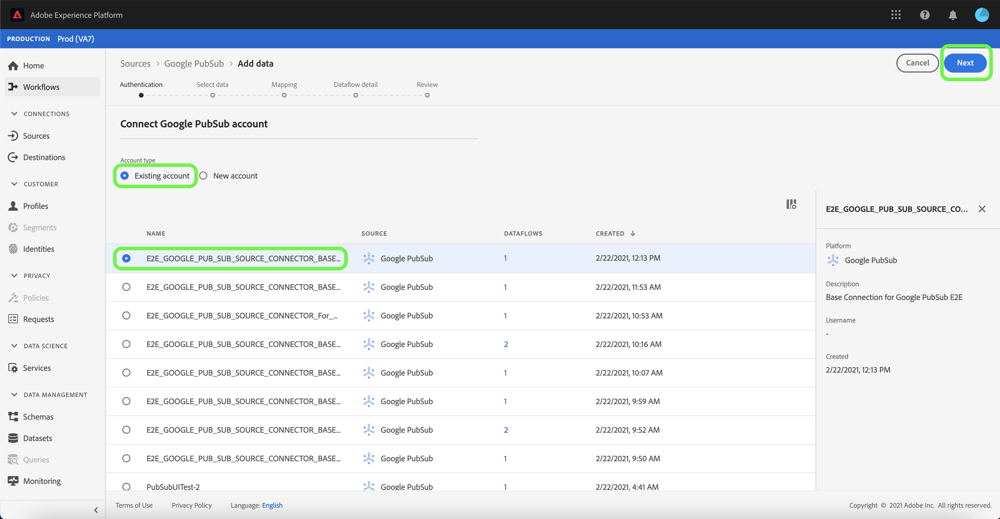
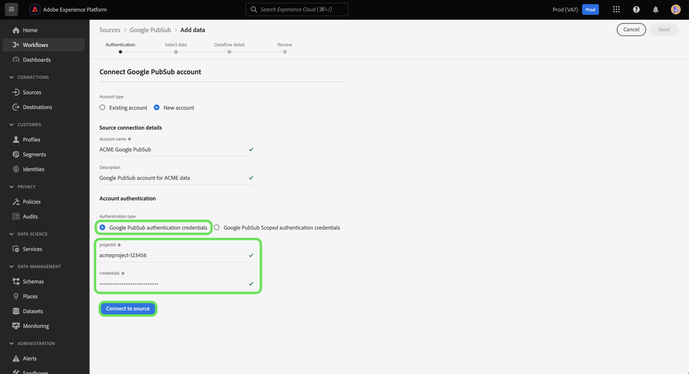
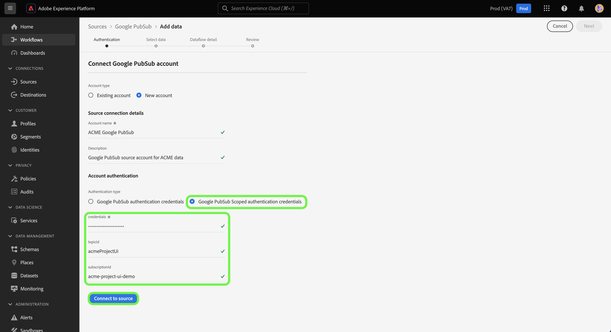

# Create a [!DNL Google PubSub] source connection in the UI

This tutorial provides steps for creating a [!DNL Google PubSub] (hereinafter referred to as "[!DNL PubSub]") using the Platform user interface.

## Getting started

This tutorial requires a working understanding of the following components of Adobe Experience Platform:

* [Sources](../../../../home.md): Experience Platform allows data to be ingested from various sources while providing you with the ability to structure, label, and enhance incoming data using Platform services.
* [Sandboxes](../../../../../sandboxes/home.md): Experience Platform provides virtual sandboxes which partition a single Platform instance into separate virtual environments to help develop and evolve digital experience applications.

If you already have a valid [!DNL PubSub] connection, you may skip the remainder of this document and proceed to the tutorial on [configuring a dataflow](../../dataflow/batch/cloud-storage.md).

### Gather required credentials

In order to connect [!DNL PubSub] to Platform, you must provide a valid value for the following credentials:

| Credential | Description |
| ---------- | ----------- |
| Project ID | The project ID required to authenticate [!DNL PubSub]. |
| Credentials | The credential or private key ID required to authenticate [!DNL PubSub]. |
| Topic name | The name for the [!DNL PubSub] resource that represents a feed of messages. You must specify a topic name if you want to provide access to a specific stream of data in your [!DNL Google PubSub] source. |
| Subscription name | The name of your [!DNL PubSub] subscription. In [!DNL PubSub], subscriptions allow you to receive messages, by subscribing to the topic in which messages have been published to. |

For more information about these values, see the following [PubSub authentication](https://cloud.google.com/pubsub/docs/authentication) document. If you are using service account-based authentication, see the following [PubSub guide](https://cloud.google.com/docs/authentication/production#create_service_account) for steps on how to generate your credentials.

>[!TIP]
>
>If you are using service account-based authentication, ensure that you have granted sufficient user access to your service account and that there are no extra white spaces in the JSON, when copying and pasting your credentials.

Once you have gathered your required credentials, you can follow the steps below to link your [!DNL PubSub] account to Platform.

## Connect your [!DNL PubSub] account

In the Platform UI, select **[!UICONTROL Sources]** from the left navigation to access the [!UICONTROL Sources] workspace. The [!UICONTROL Catalog] screen displays a variety of sources you can create an account with.

You can select the appropriate category from the catalog on the left-hand side of your screen. Alternatively, you can find the specific source you wish to work with using the search option.

Under the [!UICONTROL Cloud storage] category, select **[!UICONTROL Google PubSub]**, and then select **[!UICONTROL Add data]**.

The **[!UICONTROL Connect to Google PubSub]** page appears. On this page, you can either use new credentials or existing credentials.

### Existing account

To use an existing account, select the [!DNL PubSub] account you want to create a new dataflow with, then select **[!UICONTROL Next]** to proceed.

### New account

>[!TIP]
>
>When creating an account with restricted access, you must provide at least one of your topic name or subscription name. Authentication will fail if both values are missing.

If you are creating a new account, select **[!UICONTROL New account]**, and then provide a name and an optional description for your new [!DNL PubSub] account.

The [!DNL PubSub] source allows you to specify the type of access that you want to allow during authentication. You can set up your account to have either project-based authentication or topic and subscription-based authentication. Project-based authentication allows you to grant access to the root-level project in your account, while topic and subscription-based authentication allows you to restrict access to a particular [!DNL PubSub] topic and subscription.

>[!BEGINTABS]

>[!TAB Project-based authentication]

To create an account with access to your root [!DNL PubSub] project folder. Select **[!UICONTROL Google PubSub authentication credentials]** as your authentication type and provide your project ID and credentials. When finished, select **[!UICONTROL Connect to source]** and then allow some time for the new connection to establish.

>[!TAB Topic and subscription-based authentication]

To create an account with restricted access only to a particular [!DNL PubSub] topic and subscription, select **[!UICONTROL Google PubSub Scoped authentication credentials]** and then provide your credentials, topic name, and/or subscription name. When finished, select **[!UICONTROL Connect to source]** and then allow some time for the new connection to establish.

>[!ENDTABS]

>[!NOTE]
>
>Principal (roles) assigned to a pubsub project are inherited in all of the topics and subscriptions created inside a [!DNL PubSub] project. If you want to add a principal (role) to have access to a specific topic, then that principal (role) must also be added to the topic's corresponding subscription as well. For more information, read the [[!DNL PubSub] documentation on access control](https://cloud.google.com/pubsub/docs/access-control).

## Next steps

By following this tutorial, you have create a connection between your [!DNL PubSub] account and Platform. You can now continue on to the next tutorial and [configure a dataflow to bring streaming data from your cloud storage into Platform](../../dataflow/streaming/cloud-storage-streaming.md).
