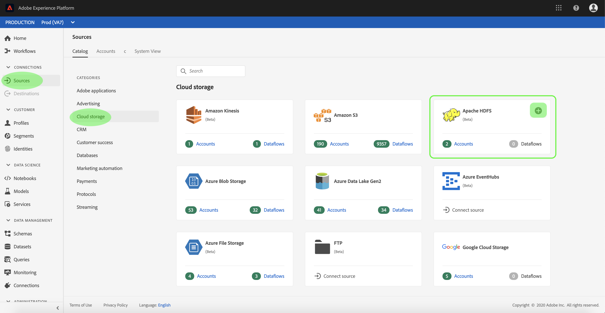
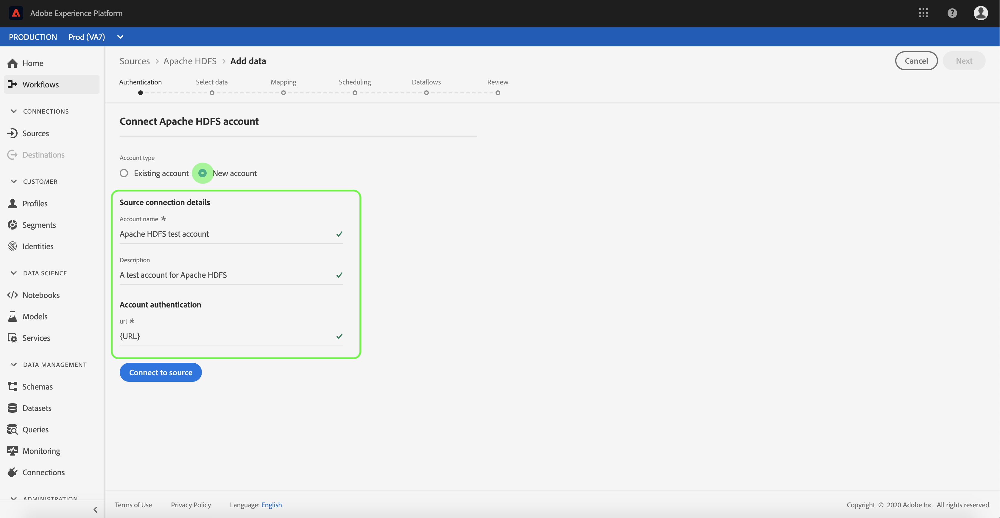
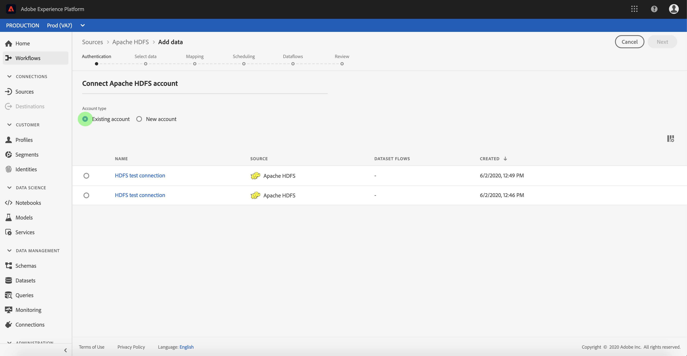

# Create an [!DNL Apache] HDFS source connection in the UI

>[!NOTE]
>
>The [!DNL Apache] HDFS connector is in beta. See the [Sources overview](../../../../home.md#terms-and-conditions) for more information on using beta-labelled connectors.

Source connectors in [!DNL Adobe Experience Platform] provide the ability to ingest externally sourced data on a scheduled basis. This tutorial provides steps for authenticating an [!DNL Apache Hadoop Distributed File System] (hereinafter referred to as "HDFS") source connector using the [!DNL Platform] user interface.

## Getting started

This tutorial requires a working understanding of the following components of [!DNL Platform]:

-   [[!DNL Experience Data Model (XDM)] System](../../../../../xdm/home.md): The standardized framework by which [!DNL Experience Platform] organizes customer experience data.
    -   [Basics of schema composition](../../../../../xdm/schema/composition.md): Learn about the basic building blocks of XDM schemas, including key principles and best practices in schema composition.
    -   [Schema Editor tutorial](../../../../../xdm/tutorials/create-schema-ui.md): Learn how to create custom schemas using the Schema Editor UI.
-   [[!DNL Real-Time Customer Profile]](../../../../../profile/home.md): Provides a unified, real-time consumer profile based on aggregated data from multiple sources.

If you already have a valid HDFS connection, you may skip the remainder of this document and proceed to the tutorial on [configuring a dataflow](../../dataflow/batch/cloud-storage.md).

### Gather required credentials

In order to authenticate your HDFS source connector, you must provide values for the following connection property:

| Credential | Description |
| ---------- | ----------- |
| `url` | The URL defines auth params required for connecting to HDFS anonymously. For more information on how to obtain this value, refer to the following document on [HTTPS authentication for HDFS](https://hadoop.apache.org/docs/r1.2.1/HttpAuthentication.html). |

## Connect your HDFS account

Once you have gathered your required credentials, you can follow the steps below to link your HDFS account to [!DNL Platform].

Log in to [Adobe Experience Platform](https://platform.adobe.com) and then select **[!UICONTROL Sources]** from the left navigation bar to access the **[!UICONTROL Sources]** workspace. The **[!UICONTROL Catalog]** screen displays a variety of sources for which you can create an account with.

You can select the appropriate category from the catalog on the left-hand side of your screen. Alternatively, you can find the specific source you wish to work with using the search option.

Under the **[!UICONTROL Cloud storage]** category, select **[!UICONTROL Apache HDFS]**. If this is your first time using this connector, select **[!UICONTROL Configure]**. Otherwise, select **[!UICONTROL Add data]** to create a new HDFS connector.

The **[!UICONTROL Connect to HDFS]** page appears. On this page, you can either use new credentials or existing credentials.

### New account

If you are using new credentials, select **[!UICONTROL New account]**. On the input form that appears, provide a name, an optional description, and your HDFS credentials. When finished, select **[!UICONTROL Connect to source]** and then allow some time for the new connection to establish.

### Existing account

To connect an existing account, select the HDFS account you want to connect with, then select **[!UICONTROL Next]** to proceed.

## Next steps

By following this tutorial, you have established a connection to your HDFS account. You can now continue on to the next tutorial and [configure a dataflow to bring data from your cloud storage into [!DNL Platform]](../../dataflow/batch/cloud-storage.md).
